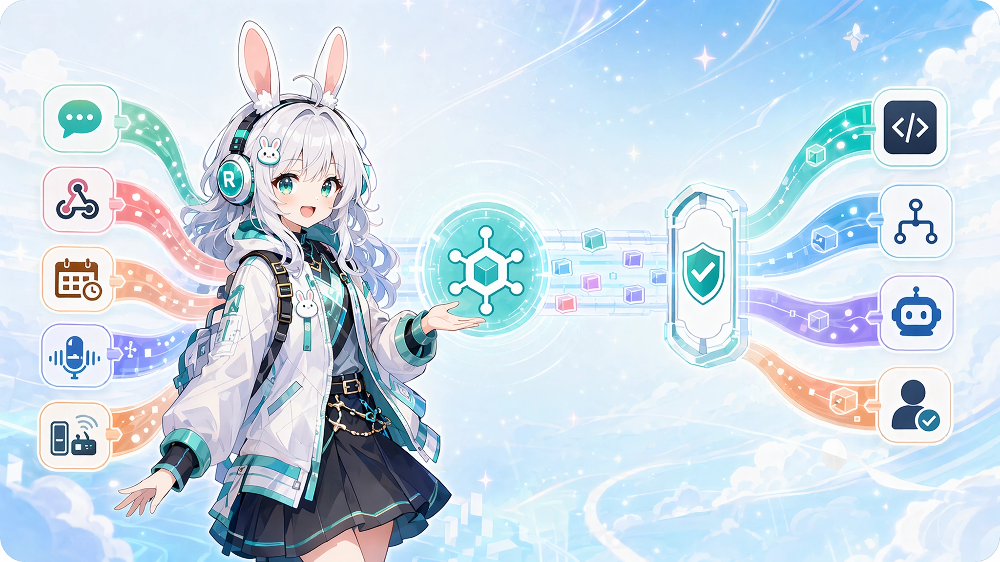
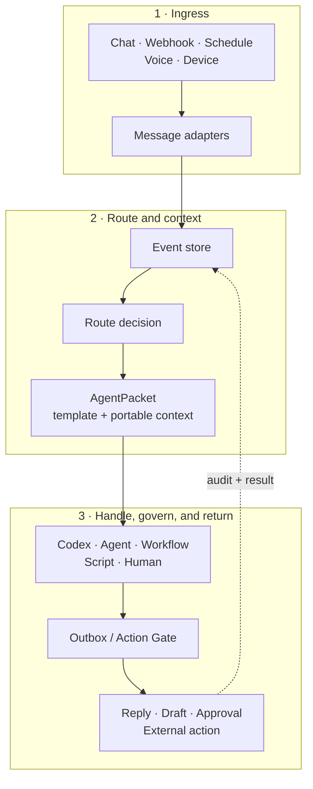

<!-- docs-language-switch -->
<div align="center">
English | <a href="./README_zh.md">简体中文</a>
</div>
<!-- /docs-language-switch -->

# RabiRoute



<h2 align="center">Let Agents connect everything around us.</h2>

<p align="center">Bring signals from chat, voice, devices, and time into Agents, so they can build continuous understanding, prepare proactively, and turn help into reality within safe boundaries.</p>

<p align="center">
  <a href="https://github.com/vb2250158/RabiRoute/commits/main"></a>
  <a href="https://github.com/vb2250158/RabiRoute/stargazers"></a>
  <a href="./LICENSE"></a>
  
  
  
</p>

RabiRoute is an **agent-neutral message gateway, policy router, and action gate**. It turns events from chat, webhooks, schedules, voice, and devices into structured work for the right agent, workflow, script, or human queue.

Handlers solve the task. RabiRoute decides **where it goes, which portable context travels with it, whether an outbound action is allowed, and where the result returns**.

[Highlights](#highlights) · [Quick start](#quick-start) · [How it works](#how-it-works) · [Current capabilities](#current-capabilities) · [Documentation](#documentation)

## Highlights

- 🔌 **Bring many signals into one routing layer.** Verified inputs include NapCat / OneBot, heartbeat, and the built-in role panel; other platforms and devices can use dedicated or experimental adapters.
- 🧭 **Route by policy, not hard-wired integrations.** Route profiles, personas, notification rules, schedules, keywords, regexes, and reply context decide which handler receives each event.
- 🧳 **Send context that can travel.** `AgentPacket` carries the event, persona, recent messages, plans, memory references, attachments, interface hints, and reply context.
- 🖥️ **Operate from a local control plane.** The Node.js Manager and RibiWebGUI manage routes, adapters, personas, runtime status, logs, diagnostics, and process lifecycle.
- 🛡️ **Keep outbound actions explicit.** Replies pass through route-specific Outbox policy instead of bypassing the gateway, with observable `sent`, `draft`, `blocked`, or `failed` results.
- 🔍 **Keep evidence you can inspect and replay.** JSONL records cover inbound events, packets, deliveries, heartbeats, adapter activity, replies, and delivery replay.

> RabiRoute is in active `0.1.x` development. Check the [capability and maturity matrix](docs/current-capabilities_en.md) before relying on an external platform or device path.

## Quick start

Requires Node.js 20 or newer and npm.

```bash
git clone https://github.com/vb2250158/RabiRoute.git
cd RabiRoute
npm install
npm run build
npm run start:manager
```

Open [http://127.0.0.1:8790/](http://127.0.0.1:8790/) to enter RibiWebGUI. On first run, the Manager initializes a sanitized local configuration from `examples/data/` when no runtime data exists.

For the shortest verified path:

1. Open **Quick setup** and choose Heartbeat as the input.
2. Select Codex, then bind the project directory and a Desktop task.
3. Save the route, open **Log diagnostics**, and trigger one message.

External adapters still require their own accounts and local configuration. Continue with [Getting started](docs/getting-started_en.md) when you are ready to connect NapCat, WeCom, RabiLink, or another source.

## How it works



Each route keeps ingress, policy, portable context, handler delivery, and outbound control separate. A handler can change without taking ownership of channel credentials or redefining gateway behavior.

## Current capabilities

| Area | Implemented capability |
| --- | --- |
| Message inputs | Verified: NapCat / OneBot, Heartbeat, and the built-in role panel. Experimental: Remote Agent, FenneNote, XiaoAI, RabiLink, generic Webhook, and WeCom. Manual trigger is a Manager action, not an adapter. |
| Routing | Route profiles, persona-owned rules, direct `@`, reply chains, private messages, keywords, regexes, schedules, and per-route templates |
| Context | Recent messages, persona files, plans, memory references, source reply context, attachment evidence, and handler interface hints |
| Handlers | Verified: Codex. Experimental: Copilot CLI and AstrBot. Manual handoff: Marvis. |
| Control plane | Node.js Manager and RibiWebGUI for route lifecycle, configuration, status, logs, personas, and diagnostics |
| Safety | Outbox policy, source binding, adapter policy, NapCat file allowlists, and fail-closed Codex Runtime approval; a universal approval center is not implemented |
| Observability | JSONL message history, adapter logs, handler packets, delivery records, heartbeat records, reply records, and delivery replay |

Each platform still owns its credentials and login state. Public examples use placeholders and sanitized paths; runtime `data/`, logs, tokens, recordings, and transcripts stay out of Git.

## Architecture and boundaries

| RabiRoute owns | The handler owns |
| --- | --- |
| Message ingress and normalization | Answering the question |
| Event and delivery records | Planning task execution |
| Route matching and handler selection | Calling tools and editing code |
| Context templates and `AgentPacket` construction | Private runtime state and deep memory |
| Session delivery policy | Domain-specific reasoning |
| Draft, approval, reply, and audit boundaries | Producing a result or action request |

Put another way: **RabiRoute does not own the Agent. It owns the context and the gates.**

RabiRoute is not a full Agent OS, a replacement chatbot framework, a workflow platform, or a wrapper around one model provider. New platforms belong in `src/adapters/`; handler integrations remain behind agent-adapter interfaces.

The code-backed boundary and maturity map lives in [Current capabilities and maturity](docs/current-capabilities_en.md).

[Architecture](docs/architecture_en.md) and [Code architecture](docs/code-architecture_en.md) describe the Desktop-owner runtime and module boundaries in more detail.

## Codex integration

Codex is RabiRoute's first fully verified handler, but it is not the product boundary.

- Real messages travel only through Desktop IPC to the selected Codex/ChatGPT Desktop task owner. RabiRoute does not run a second execution Runtime or a hidden fallback.
- The saved task ID is the stable identity. A stale SQLite title, Desktop rename, or completed goal does not invalidate it or create a duplicate. Name lookup/creation happens only when the ID is cleared or missing.
- If the target task is not loaded, RabiRoute opens `codex://threads/<id>` and retries briefly. Desktop absence, workspace mismatch, or owner load failure fails closed.
- Model, tools, sandbox, and approvals remain owned by the target Desktop task. The compatibility field `agentModel` does not override them.
- The project-pinned `codex app-server` is limited to short-lived metadata work such as creating and naming an empty task; it never receives a real routed prompt.
- Runtime permission and RabiRoute's business Action Gate remain separate security boundaries.

This separation lets the router evolve without becoming a Codex-specific shell, while still supporting maintainer workflows that need reliable thread delivery and observable handoffs.

## Configuration model

Runtime configuration separates message routes from persona behavior:

```text
data/route/<configName>/adapterConfig.json
data/roles/<RoleId>/persona.md
data/roles/<RoleId>/personaConfig.json
```

- `adapterConfig.json` defines inputs, handler adapters, working directories, pipeline presets, and persona binding.
- `persona.md` contains the persona or handler-facing role guidance.
- `personaConfig.json` contains notification rules, message templates, schedules, and recent-message limits.

Copyable public examples live in [examples/data](examples/data/). Reusable project skills, including persona creation and safe update workflows, live in [skills](skills/).

## Project status

RabiRoute is an early-stage project under active development. The current `0.1.x` line already runs the complete ingress-to-handler-to-reply path, while configuration schemas and advanced integrations may continue to evolve.

The Node.js manager and WebGUI are the cross-platform baseline. The Qt tray and Windows launcher are convenience layers, not a separate backend or a single-file distribution.

Breaking configuration changes and migration notes are recorded in the [version changelog](版本更新日志.md).

## Documentation

The status-aware documentation index is in [docs/README_en.md](docs/README_en.md).

| Goal | Guide |
| --- | --- |
| See what is actually implemented | [Current capabilities and maturity](docs/current-capabilities_en.md) |
| Browse current, experimental, planned, and historical docs | [Documentation index](docs/README_en.md) |
| Copy a Route/persona pack or inspect hardware integrations | [Examples and subprojects](examples/README_en.md) |
| Install and verify the first route | [Getting started](docs/getting-started_en.md) |
| Inspect the code ownership map | [Project function map](docs/project-function-map_en.md) |

## Development and contribution

```bash
npm run manager          # run the manager from TypeScript
npm run webgui:dev       # run the Vue/Vuetify frontend in development
npm run test             # run backend tests
npm run build            # type-check and build backend + WebGUI
npm run check:config     # detect malformed public/runtime JSON text
```

Before a larger change, read [Current capabilities and maturity](docs/current-capabilities_en.md), then inspect the relevant code and tests.

Issues and pull requests are welcome through the [GitHub repository](https://github.com/vb2250158/RabiRoute).

Please never commit real account identifiers, chat content, tokens, cookies, private paths, or runtime `data/`. The repository is maintained as a public, reproducible project.

## License

RabiRoute is licensed under the [MIT License](LICENSE).
