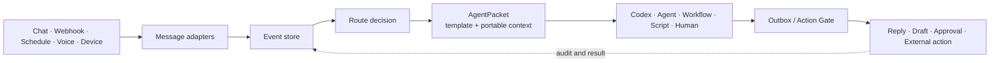

<!-- docs-language-switch -->
<div align="center">
English | <a href="./README_zh.md">简体中文</a>
</div>
<!-- /docs-language-switch -->

# RabiRoute


<p align="center">
  <a href="https://github.com/vb2250158/RabiRoute/commits/main"></a>
  <a href="https://github.com/vb2250158/RabiRoute/stargazers"></a>
  <a href="./LICENSE"></a>
  
  
  
</p>

RabiRoute is an **agent-neutral message gateway, policy router, and action gate**. It accepts events from chat platforms, webhooks, schedules, voice, and devices; records and classifies them; adds portable context; then hands them to the right agent, workflow, script, or human queue.

RabiRoute does not own the agent and does not try to become an Agent OS. The handler decides how to solve a task. RabiRoute decides **where the task goes, which context travels with it, whether an external action is allowed, and how the result returns**.

[Quick start](#quick-start) · [Current capabilities](#what-works-today) · [Architecture](#architecture-and-boundaries) · [Documentation](#documentation)

## Why RabiRoute

Most integrations connect one chat platform directly to one bot or agent. That works until the system has several entry points, several handlers, reusable personas, shared context, and actions that must not be sent automatically.

RabiRoute keeps that coordination layer independent:

- **One event model across channels.** Platform adapters normalize external messages before routing.
- **One policy boundary across handlers.** Route rules choose a handler without letting that handler define gateway behavior.
- **Portable context.** Personas, recent messages, plans, memory references, and reply context travel in an `AgentPacket`.
- **Explicit outbound control.** Replies and external actions pass through an Outbox / Action Gate instead of bypassing the router.
- **Replayable evidence.** JSONL event, packet, delivery, heartbeat, adapter, and replay-ledger records make failures inspectable.

## Why this matters to open-source maintainers

Maintainer work often starts outside the code host: community chats, support groups, webhook intake, release schedules, voice notes, and local operational alerts. Those events still need a reliable path into coding agents and human review.

RabiRoute provides that path without giving one agent ownership of every channel credential or permission:

```text
Community event -> route policy -> exact handler thread
                -> draft or action request -> approval -> source channel
```

This is useful when Codex or another handler should receive structured context, continue the correct task, and prepare a response while the gateway keeps external actions observable and reviewable.

## How it works



The core path is intentionally small:

```text
Message Adapter -> Event Store -> RouteDecision -> AgentPacket -> Handler -> Outbox / Reply
```

## What works today

| Area | Implemented capability |
| --- | --- |
| Message inputs | Verified: NapCat / OneBot, heartbeat schedules, and the built-in role panel. Experimental: Remote Agent, FenneNote, XiaoAI, RabiLink, generic Webhook, and WeCom. Manual trigger is a Manager action, not an adapter. |
| Routing | Route profiles, persona-bound notification rules, direct `@`, reply-chain routing, private messages, keywords, regex, schedules, and per-route templates |
| Context | Recent message windows, persona files, role plans and memories, source reply context, attachment evidence, and handler-facing interface hints |
| Handlers | Verified: Codex. Experimental: Copilot CLI and AstrBot. Stub/manual handoff: Marvis. |
| Control plane | A Node.js manager plus RibiWebGUI for gateway lifecycle, configuration, status, logs, personas, and diagnostics |
| Safety | Outbox results are `sent` / `draft` / `blocked` / `failed`, with source-message binding, adapter policies, NapCat file allowlists, and fail-closed Codex runtime approvals. A generic approval center is not implemented yet. |
| Observability | JSONL message history, adapter logs, handler packets, delivery records, heartbeat records, and replay ledgers |

Platform-specific credentials and login state remain with their platform. Public examples use placeholders and sanitized local paths; runtime `data/`, logs, tokens, recordings, and transcripts are intentionally excluded from Git.

## Quick start

### Requirements

- Node.js 20 or newer
- npm
- Optional: Codex, NapCat / OneBot, WeCom, or another external integration for an end-to-end route

### Install and run

```bash
git clone https://github.com/vb2250158/RabiRoute.git
cd RabiRoute
npm install
npm run build
npm run start:manager
```

Open [http://127.0.0.1:8790/](http://127.0.0.1:8790/) to enter RibiWebGUI.

On first start, the manager seeds a sanitized configuration from `examples/data/` when no runtime data exists. Only the primary route is enabled by default; external adapters still require their own local setup.

In RibiWebGUI:

1. Choose or create a route and persona.
2. Enable an input adapter such as heartbeat, webhook, NapCat, WeCom, or RabiLink.
3. Select a handler and verify the route with the status and log views.

Use the `中 / EN` menu in the top bar to switch the interface at runtime. The choice is a browser-local UI preference; it does not modify Route, persona, template, regex, path, log, or task data.

For the verified/experimental boundary, read [Current capabilities and maturity](docs/current-capabilities_en.md). The current setup guide is [Getting started](docs/getting-started_en.md).

## Architecture and boundaries

| RabiRoute owns | The handler owns |
| --- | --- |
| Message ingress and normalization | Answering the question |
| Event and delivery records | Planning task execution |
| Route matching and handler selection | Calling tools and editing code |
| Context templates and `AgentPacket` construction | Private runtime state and deep memory |
| Session delivery policy | Domain-specific reasoning |
| Draft, approval, reply, and audit boundaries | Producing a result or action request |

RabiRoute is not a full Agent OS, a replacement chatbot framework, a workflow platform, or a wrapper around one model provider. New platforms belong in `src/adapters/`; handler integrations remain behind agent-adapter interfaces.

The code-backed boundary and maturity map lives in [Current capabilities and maturity](docs/current-capabilities_en.md). [Architecture](docs/architecture_en.md) and [Code architecture](docs/code-architecture_en.md) describe the current Desktop-owner runtime and module boundaries in more detail.

## Codex integration

Codex is RabiRoute's first fully verified handler, but it is not the product boundary.

- Real messages travel only through Desktop IPC to the selected Codex/ChatGPT Desktop task owner. RabiRoute does not run a second execution Runtime or a hidden fallback.
- The saved opaque task ID is the stable identity. A stale SQLite title, a Desktop rename, or a completed goal does not invalidate the task or create a duplicate; name lookup/creation is used only after the ID is explicitly cleared or no longer exists.
- If the target task is not loaded, RabiRoute opens `codex://threads/<id>` and retries briefly. Desktop absence, workspace mismatch, or owner load failure fails closed.
- Model, tools, sandbox, and approvals remain owned by the target Desktop task. The compatibility field `agentModel` does not override them.
- The project-pinned `codex app-server` is limited to short-lived metadata work such as creating and naming an empty task; it never receives a real routed prompt.
- Runtime permission and RabiRoute's business Action Gate remain separate security boundaries.

This separation lets the router evolve without becoming a Codex-specific shell, while still supporting maintainer workflows that need reliable thread delivery and observable handoffs.

## Configuration model

Runtime configuration separates message routes from persona behavior:

```text
data/route/<configName>/adapterConfig.json
data/roles/<RoleId>/persona.md
data/roles/<RoleId>/personaConfig.json
```

- `adapterConfig.json` defines inputs, handler adapters, working directories, pipeline presets, and persona binding.
- `persona.md` contains the persona or handler-facing role guidance.
- `personaConfig.json` contains notification rules, message templates, schedules, and recent-message limits.

Copyable public examples live in [examples/data](examples/data/). Reusable project skills, including persona creation and safe update workflows, live in [skills](skills/).

## Project status

RabiRoute is an early-stage project under active development. The current `0.1.x` line already runs the complete ingress-to-handler-to-reply path, while configuration schemas and advanced integrations may continue to evolve.

The Node.js manager and WebGUI are the cross-platform baseline. The Qt tray and Windows launcher are convenience layers, not a separate backend or a single-file distribution.

Breaking configuration changes and migration notes are recorded in the [version changelog](版本更新日志.md).

## Documentation

The status-aware documentation index is in [docs/README_en.md](docs/README_en.md).

| Goal | Guide |
| --- | --- |
| See what is actually implemented | [Current capabilities and maturity](docs/current-capabilities_en.md) |
| Browse current, experimental, planned, and historical docs | [Documentation index](docs/README_en.md) |
| Copy a Route/persona pack or inspect hardware integrations | [Examples and subprojects](examples/README_en.md) |
| Install and verify the first route | [Getting started](docs/getting-started_en.md) |
| Inspect the code ownership map | [Project function map](docs/project-function-map_en.md) |

## Development and contribution

```bash
npm run manager          # run the manager from TypeScript
npm run webgui:dev       # run the Vue/Vuetify frontend in development
npm run test             # run backend tests
npm run build            # type-check and build backend + WebGUI
npm run check:config     # detect malformed public/runtime JSON text
```

Before a larger change, read [Current capabilities and maturity](docs/current-capabilities_en.md), then inspect the relevant code and tests. Issues and pull requests are welcome through the [GitHub repository](https://github.com/vb2250158/RabiRoute).

Please never commit real account identifiers, chat content, tokens, cookies, private paths, or runtime `data/`. The repository is maintained as a public, reproducible project.

## License

RabiRoute is licensed under the [MIT License](LICENSE).
