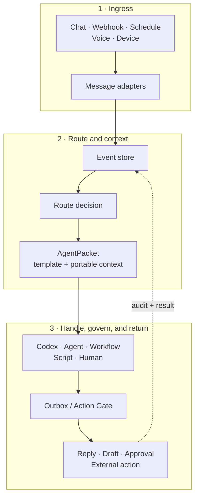

<!-- docs-language-switch -->
<div align="center">
English | <a href="./README_zh.md">简体中文</a>
</div>
<!-- /docs-language-switch -->

# RabiRoute


<h2 align="center">Let Agents connect everything around us.</h2>

<p align="center">Bring signals from chat, voice, devices, and time into Agents, so they can build continuous understanding, prepare proactively, and turn help into reality within safe boundaries.</p>

<p align="center">
  <a href="https://github.com/vb2250158/RabiRoute/commits/main"></a>
  <a href="https://github.com/vb2250158/RabiRoute/stargazers"></a>
  <a href="./LICENSE"></a>
  
  
  
</p>

RabiRoute is an **agent-neutral message gateway, policy router, and action gate**. It receives messages from chat, webhooks, schedules, voice, and devices, then sends each message to the right Agent or program according to your rules.

The Agent or program answers and performs the task. RabiRoute decides **who receives the message, which recent messages travel with it, whether an external reply is allowed, and where the result returns**.

[Use cases](#what-you-can-build) · [Quick start](#quick-start) · [How it works](#how-it-works) · [Capabilities](#what-works-today) · [Documentation](#learn-more)

## What you can build

- 💬 **Chat-to-Agent routes.** Send QQ, role-panel, or scheduled events to a selected handler. Codex is the first end-to-end verified handler.
- ⏱️ **Proactive routines.** Combine heartbeat schedules, persona rules, and project context to wake the right Desktop task for inspection, follow-up, or maintenance.
- 🧳 **Handoffs with recent messages.** Keep message history per persona, attach only what the current task needs, and follow that Route's sending rules for any reply.

The router stays independent from the handler. You can change the Agent, workflow, script, or human queue without giving it ownership of channel credentials or gateway policy.

## Quick start

### Windows installer

Download `RabiRoute-<version>-windows-x64-setup.exe` from [GitHub Releases](https://github.com/vb2250158/RabiRoute/releases/latest). It includes Node.js, Manager, RibiWebGUI, production dependencies, and the tray app.

The release also provides a portable ZIP and `SHA256SUMS.txt`. Windows packages are currently unsigned, so verify the checksum before accepting a SmartScreen unknown-publisher warning.

### Source installation

Requires Node.js 20 or newer and npm.

```bash
git clone https://github.com/vb2250158/RabiRoute.git
cd RabiRoute
npm install
npm run build
npm run start:manager
```

Open [http://127.0.0.1:8790/](http://127.0.0.1:8790/). If no runtime data exists, Manager creates a sanitized local configuration from `examples/data/`.

Create your first message route (Route):

1. Open **Quick setup** and choose Heartbeat as the message input.
2. Select Codex, then bind a project directory and a Desktop task.
3. Save the Route, open **Log diagnostics**, and run one manual trigger.

> Success means the trigger completes and the selected Codex/ChatGPT Desktop task receives a RabiRoute message. This is a real delivery, not a side-effect-free preview.

Continue with the [first Route guide](docs/user-guide/first-route_en.md). LAN access, external adapters, and remote speech each have separate setup and security steps.

## How it works


```mermaid
flowchart TB
    subgraph ingress ["1 · Ingress"]
        direction LR
        A["Chat · Webhook · Schedule<br/>Voice · Device"] --> B["Message adapters"]
    end

    subgraph routing ["2 · Route and context"]
        direction LR
        C["Event store"] --> D["Route decision"] --> E["AgentPacket<br/>template + portable context"]
    end

    subgraph delivery ["3 · Handle, govern, and return"]
        direction LR
        F["Codex · Agent · Workflow<br/>Script · Human"] --> G["Outbox / Action Gate"] --> H["Reply · Draft · Approval<br/>External action"]
    end

    B --> C
    E --> F
    H -. "audit + result" .-> C
```

Each Route separates ingress, policy, portable context, handler delivery, and outbound control. Events and delivery outcomes remain inspectable instead of disappearing inside one integration.

## What works today

| Area | Current capability |
| --- | --- |
| Verified inputs | NapCat / OneBot, Heartbeat, and the built-in role panel. Manual trigger is a Manager action, not an adapter. |
| Persona collaboration | An Agent can discover reachable personas and explicitly send a one-way message to another enabled Route. Delivery is idempotent and authenticated; a real two-persona Desktop acceptance run is still pending. |
| Routing | Route profiles, persona rules, direct mentions, reply chains, private messages, keywords, regexes, schedules, and per-Route templates. |
| Context | Persona-scoped bidirectional ledgers, bounded recent-message injection, plan/memory/skill references, reply context, and safe attachment metadata. |
| Verified handler | Codex through the selected Codex/ChatGPT Desktop task owner. |
| Control plane | Node.js Manager and RibiWebGUI for Routes, adapters, personas, runtime status, logs, diagnostics, and process lifecycle. |
| Safety and evidence | Route-owned Outbox policy plus JSONL records for events, packets, deliveries, replies, heartbeats, and replay evidence. |
| Experimental integrations | Remote Agent, RabiSpeech, RabiLink, XiaoAI, Webhook, WeCom, Feishu, personal Weixin, wearables, Copilot CLI, and AstrBot. |

RabiRoute is in active `0.1.x` development. External platforms and device paths need environment-specific acceptance; see the [capability and maturity matrix](docs/current-capabilities_en.md).

The project does **not** claim a universal approval center, a persistent Action Queue, side-effect-free Route previews, or production closure for every phone, glasses, and wearable path.

## Boundaries and safety

| RabiRoute owns | The handler owns |
| --- | --- |
| Message ingress and normalization | Answering the question |
| Event and delivery records | Planning and executing the task |
| Route matching and handler selection | Calling tools and editing code |
| Context templates and `AgentPacket` construction | Private runtime state and deep memory |
| Session delivery policy | Domain-specific reasoning |
| Draft, reply, and audit boundaries | Producing a result or action request |

Put another way: **RabiRoute does not own the Agent. It owns the context and the gates.**

RabiRoute is not a full Agent OS, a replacement chatbot framework, a workflow platform, or a wrapper around one model provider. New message platforms belong in `src/adapters/`; handler integrations stay behind agent-adapter interfaces.

- Platform credentials and login state remain with each platform.
- Desktop task approvals and RabiRoute business-action policy are separate security gates.
- Runtime `data/`, logs, tokens, recordings, transcripts, and private paths stay out of Git.
- Unsupported ownership, workspace, or permission states fail closed.

## Codex integration

Codex is the first fully verified handler, not the product boundary.

- Real messages travel only through Desktop IPC to the selected Codex/ChatGPT Desktop task owner.
- The saved task ID plus workspace is the stable identity; a rename or completed goal does not create a duplicate.
- If Desktop is absent, the task cannot load, or the workspace differs, delivery fails closed instead of starting a fallback Runtime.
- The target Desktop task owns its model, tools, sandbox, and approvals.
- The project-pinned `codex app-server` may create or name an empty task, but it never executes a routed prompt.

This keeps the router independent while preserving reliable task delivery and visible ownership.

## Configuration model

Runtime configuration keeps message routing separate from persona behavior:

```text
data/route/<configName>/adapterConfig.json
data/roles/<RoleId>/persona.md
data/roles/<RoleId>/personaConfig.json
```

- `adapterConfig.json` defines message inputs, handler adapters, working directories, pipeline presets, and persona binding.
- `persona.md` contains persona or handler-facing guidance.
- `personaConfig.json` contains persona automation rules, avatar metadata, speech keywords, and recent-message limits. An automation combines a message or schedule trigger with either Agent delivery or a local persona script.

Conversation evidence lives under `data/roles/<RoleId>/conversation/`. Public, copyable examples live under [`examples/data/`](examples/data/); local runtime data remains private.

Buildable clients live in [`apps/`](apps/), shared client contracts in [`packages/`](packages/), and reusable project guides in [`skills/`](skills/).

## Learn more

| Goal | Guide |
| --- | --- |
| Complete the first delivery | [RibiWebGUI User Guide](docs/user-guide/README_en.md) |
| Check what is really implemented | [Current capabilities and maturity](docs/current-capabilities_en.md) |
| Browse current, experimental, planned, and historical docs | [Documentation index](docs/README_en.md) |
| Understand product and code boundaries | [Architecture](docs/architecture_en.md) · [Code architecture](docs/code-architecture_en.md) |
| Find a feature's code owner | [Project function map](docs/project-function-map_en.md) |
| Configure LAN access safely | [RibiWebGUI interface and status](docs/user-guide/interface-and-status_en.md) |
| Build phone or glasses clients | [Client applications](apps/README_en.md) |
| Run local or remote TTS / ASR | [RabiSpeech](docs/rabispeech-plugin_en.md) · [Remote speech](docs/user-guide/speech-api_en.md) |
| Review configuration migrations | [Version changelog](版本更新日志_en.md) |

## Development and contribution

```bash
npm run manager          # run Manager from TypeScript
npm run webgui:dev       # run the Vue/Vuetify frontend
npm run test             # run backend and contract tests
npm run build            # build backend and WebGUI
npm run check:config     # validate public/runtime JSON text
```

Before a larger change, read [Current capabilities and maturity](docs/current-capabilities_en.md), then inspect the relevant code, tests, and documentation.

Issues and pull requests are welcome through the [GitHub repository](https://github.com/vb2250158/RabiRoute).

Never commit real account identifiers, chat content, tokens, cookies, private paths, or runtime `data/`. The repository is maintained as a public, reproducible project.

## License

RabiRoute is licensed under the [MIT License](LICENSE).
