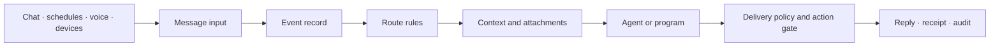

<!-- docs-language-switch -->
<div align="center">
English | <a href="./README_zh.md">简体中文</a>
</div>
<!-- /docs-language-switch -->

# RabiRoute


<h2 align="center">Let Agents connect everything around us.</h2>

<p align="center">Send chat, voice, scheduled, and device messages to the right Agent while keeping context, permissions, and delivery evidence explicit.</p>

<p align="center">
  <a href="https://github.com/vb2250158/RabiRoute/commits/main"></a>
  <a href="https://github.com/vb2250158/RabiRoute/stargazers"></a>
  <a href="./LICENSE"></a>
  
  
  
</p>

RabiRoute is an **agent-neutral message gateway, delivery-policy router, and action gate**. It receives QQ, webhook, scheduled, voice, desktop, and device messages, then uses a message Route to deliver each message to a selected Agent or program.

The Agent answers, writes code, calls tools, and performs the task. RabiRoute decides where the message came from, who receives it, which recent messages travel with it, whether an external reply is allowed, and where results and receipts are stored.

[Quick start](#quick-start) · [Current capabilities](#current-capabilities) · [Recent changes](#recent-changes) · [How it works](#how-it-works) · [Documentation](#documentation)

## What you can build

- **Route chat to an Agent.** QQ groups, direct messages, the persona panel, and other inputs can enter a fixed project and Desktop task through a Route.
- **Run scheduled Agent work.** Persona rules can trigger an Agent by interval, time window, daily time, or one-time schedule, or run an explicitly allowed local script.
- **Carry continuous context.** Each persona owns its message history and references to plans, memories, and skills; every Route can limit the recent messages included in a delivery.
- **Control external sends.** Agents reply to QQ, RabiLink, and other channels through one sending API. Targets, quoted messages, sender identity, and receipts are validated and recorded.
- **Send Windows text and images.** RabiRoute Desktop supports selected-text actions, system screenshots, annotations, copy, pinning, and delivery to an active persona.
- **Connect speech and mobile devices.** RabiSpeech, RabiLink phone and glasses clients, wearable inputs, and the remote Relay are implemented as experimental integrations.

## Quick start

### Windows installer

Download `RabiRoute-<version>-windows-x64-setup.exe` from [GitHub Releases](https://github.com/vb2250158/RabiRoute/releases/latest). The package includes RabiRoute Desktop, the local Manager, RibiWebGUI, Node.js, and production dependencies.

A portable ZIP and `SHA256SUMS.txt` are also published. Windows packages are currently unsigned, so verify the checksum before accepting a SmartScreen unknown-publisher warning.

### Run from source

Requires Node.js 20 or newer and npm.

```bash
git clone https://github.com/vb2250158/RabiRoute.git
cd RabiRoute
npm install
npm run build
npm run start:manager
```

Open [http://127.0.0.1:8790/](http://127.0.0.1:8790/). When no local runtime data exists, Manager creates a sanitized sample configuration from `examples/data/`.

### Complete the first Route

1. Open **Quick setup** and choose **Scheduled trigger**.
2. Choose **Codex Agent**, then bind a project directory and an existing Codex/ChatGPT Desktop task.
3. Save the Route and run one manual trigger from **Log diagnostics**.
4. Confirm that the trigger succeeds and the same Desktop task receives a RabiRoute message.

The manual trigger performs a real delivery. See [Complete the first Route](docs/user-guide/first-route_en.md) for the full procedure and failure checks.

## Current capabilities

The repository version is `0.2.1`. The table lists behavior backed by current code, configuration surfaces, and tests. Features that require accounts, external services, or physical devices still need acceptance in their target environment.

| Area | Status | What it provides |
| --- | --- | --- |
| Routing core | Verified | Receive messages, persist events, match rules, build Agent context, deliver to a handler, and record replies. |
| NapCat / OneBot | Verified | Receive QQ group and direct messages, preserve image and merged-forward evidence, and send replies through OneBot HTTP. |
| Schedules and persona automation | Verified | Trigger an Agent from messages or time rules; run persona-local scripts only after separate permission is enabled. |
| Codex Desktop | Verified | Deliver by full task ID and workspace; report success only after the target rollout records the `deliveryId`. Deleted or archived bindings can be replaced under controlled rules. |
| RibiWebGUI | Verified | Manage Routes, personas, message inputs, Agents, plans, memories, logs, diagnostics, themes, and desktop settings. |
| Plans, memories, and message processing | Verified | Page through plans and memories, submit plan feedback, assign message-processing work, and preserve state and receipts. |
| Windows desktop | Core path implemented | Start Manager and the desktop UI together; use selected-text actions, screenshots, and annotations. Some system interactions still need Windows device acceptance. |
| DSH | Experimental | Bind an explicit API address, workspace, and session as the primary or an auxiliary handler. |
| RabiSpeech / RabiLink / mobile and wearables | Experimental | Connect speech, phones, glasses, Relay, and health-data paths, with separate acceptance for each device and network environment. |
| LAN Rabi Agent | Experimental | Run a headless worker on another computer and deliver Manager tasks to a configured Codex Desktop owner on that machine. Real multi-computer acceptance remains pending. |

See [Current capabilities and maturity](docs/current-capabilities_en.md) for complete status, limits, and sources of truth.

## Recent changes

### 0.2.1: plan loading and local-runtime improvements

- Each plan now has its own directory for content, history, feedback, and attachments; archiving moves the complete directory.
- Plan and memory pages load visible content first and request later pages on demand, reducing startup delay and Manager disk work.
- Large RabiSpeech reads, performance aggregation, and persona-sync index recovery moved away from the Manager request path.
- Windows screenshots gained resizable selections, rectangles, arrows, editable text, colors, and undo.

### Unreleased: delivery, plugin, and WebGUI recovery

- Codex Desktop delivery now waits for a recorded `deliveryId`; an IPC acceptance without a target-task receipt is retried or reported as a failure.
- Visible Codex task names now come from the index shared with the Desktop sidebar, while task ID and workspace remain the delivery identity.
- Manager plugins are managed through versioned Profiles and Bundles. A revision change drains accepted requests, replaces the instance, and restores the last working revision if activation fails.
- Web Bundles use immutable revision URLs, keeping each page, script, stylesheet, and font on the same revision. The browser replaces only the changed module after catalog updates.
- RibiWebGUI displays its fixed shell before loading the plugin catalog and knowledge content. Expired message-board records discard bodies and attachments while keeping time-limited replay hashes.

See the [version changelog](版本更新日志_en.md) for individual changes and migration notes.

## How it works


```mermaid
flowchart LR
    A[Chat · schedules · voice · devices] --> B[Message input]
    B --> C[Event record]
    C --> D[Route rules]
    D --> E[Context and attachments]
    E --> F[Agent or program]
    F --> G[Delivery policy and action gate]
    G --> H[Reply · receipt · audit]
```

Each Route stores its message input, persona, handler, workspace, and sending rules separately. Message adapters do not build Agent instructions, and Agents do not receive channel credentials or direct ownership of routing state.

Manager loads 28 independent built-in packages through one Plugin Kernel. Built-in and out-of-tree packages share the same SDK, manifest, dependency graph, permission checks, generation switching, and Web module lifecycle. See [Plugin packages and hot replacement](docs/plugin-bundles_en.md).

## Agent and safety boundaries

- Real Codex messages travel only through Desktop IPC to the selected Codex/ChatGPT Desktop task owner.
- The target Desktop task owns its model, tools, sandbox, and approvals. RabiRoute does not perform its reasoning.
- The project-pinned `codex app-server` may create or name an empty task, but it does not execute Route messages.
- Delivery fails with recorded evidence when Desktop is unavailable, the task cannot load, the workspace differs, or the owner is ambiguous.
- Platform accounts, login state, and credentials remain owned by their platforms.
- Local `data/`, logs, recordings, transcripts, tokens, cookies, and private paths stay out of the public repository.

RabiRoute does not currently provide a general Action Queue, a unified approval center, or a side-effect-free Route preview. Production closure for phones, glasses, wearables, and multi-computer Agents remains experimental.

## Configuration and data

```text
data/route/<configName>/adapterConfig.json
data/roles/<RoleId>/persona.md
data/roles/<RoleId>/personaConfig.json
```

- `adapterConfig.json` stores message inputs, handlers, workspaces, Route rules, and persona bindings.
- `persona.md` stores persona guidance and handler-facing work requirements.
- `personaConfig.json` stores persona automation, avatar data, speech keywords, and recent-message limits.
- `data/roles/<RoleId>/conversation/` stores that persona's message history.
- [`examples/data/`](examples/data/) contains sanitized, copyable samples.

Buildable clients live under [`apps/`](apps/), shared SDKs under [`packages/`](packages/), and reusable Agent guides under [`skills/`](skills/).

## Documentation

### First use

- [Complete the first Route](docs/user-guide/first-route_en.md): complete a real Codex Desktop delivery.
- [RibiWebGUI user guide](docs/user-guide/README_en.md): use the interface, personas, Routes, Agents, and troubleshooting tools.
- [Interface and runtime status](docs/user-guide/interface-and-status_en.md): determine whether Manager, a Route, and message inputs are healthy.
- [Operations, logs, and troubleshooting](docs/user-guide/operations-and-troubleshooting_en.md): locate a failure by its visible symptom.

### Installation and integrations

- [Configuration](docs/configuration_en.md): review local files, directories, and main settings.
- [LAN Rabi Agent](docs/lan-rabi-agent-bootstrap_en.md): connect a headless Codex worker on another computer.
- [RabiSpeech](docs/rabispeech-plugin_en.md): configure local or remote TTS and ASR.
- [Client applications](apps/README_en.md): build Android, Rokid AIUI, browser bridge, and Rabi Agent clients.

### Development and maintenance

- [Current capabilities and maturity](docs/current-capabilities_en.md): check whether a feature is verified.
- [Documentation index](docs/README_en.md): browse current, experimental, design, and historical material.
- [Architecture](docs/architecture_en.md): understand product boundaries and data flow.
- [Project function map](docs/project-function-map_en.md): locate feature ownership, APIs, and code entry points.
- [Version changelog](版本更新日志_en.md): review changes and migration requirements.

## Development

```bash
npm run manager          # run Manager from TypeScript
npm run webgui:dev       # run the Vue/Vuetify frontend
npm run test             # run backend and contract tests
npm run build            # build Manager, independent plugin packages, and WebGUI
npm run check:config     # validate public and runtime JSON text
```

Before publishing changes, remove real account identifiers, chat content, tokens, cookies, local usernames, private paths, and runtime `data/`.

## License

RabiRoute is licensed under the [MIT License](LICENSE).
