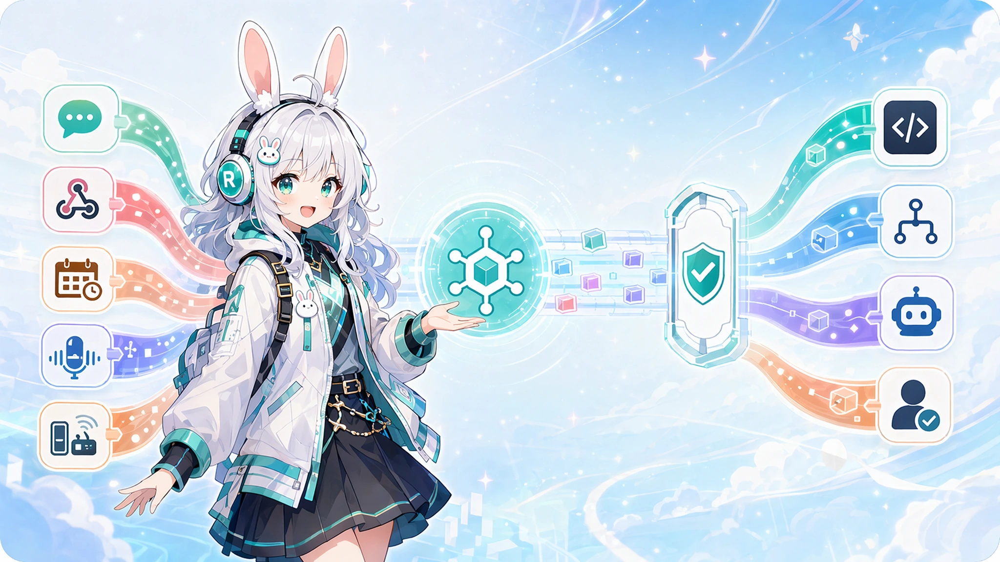
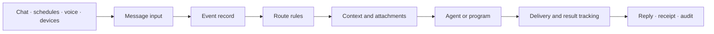

<!-- docs-language-switch -->
<div align="center">
English | <a href="./README_zh.md">简体中文</a>
</div>
<!-- /docs-language-switch -->

# RabiRoute



<h2 align="center">Let Agents connect everything around us.</h2>

<p align="center">Send chat, voice, scheduled, and device messages to the right Agent with shared context and clear delivery results.</p>

<p align="center">
  <a href="https://github.com/vb2250158/RabiRoute/commits/main"></a>
  <a href="https://github.com/vb2250158/RabiRoute/stargazers"></a>
  <a href="./LICENSE"></a>
  
  
  
</p>

RabiRoute is an **agent-neutral message gateway and delivery-policy router**. It receives QQ, webhook, scheduled, voice, desktop, and device messages, then uses a message Route to deliver each message to a selected Agent or program.

The Agent answers, writes code, calls tools, and performs the task. RabiRoute decides where the message came from, who receives it, which recent messages travel with it, whether an external reply is allowed, and where results and receipts are stored.

[Quick start](#quick-start) · [Current capabilities](#current-capabilities) · [Recent changes](#recent-changes) · [How it works](#how-it-works) · [Documentation](#documentation)

## What you can build

- **Query and control imported home devices.** Discover all Home Assistant entities and their current actions, including buttons, settings and structured Xiaomi device commands. Agents reuse connection authentication and receive durable action receipts. See the [device API](docs/home-device-agent-api_en.md).

Experimental vacuum cloud map files can be connected through Mi Home QR login in Xiaomi Setup. See the [map connection guide](docs/vacuum-cloud-map_en.md); version-2 map decoding is available, while live localization and coordinate navigation require separate acceptance.

- **Route chat to an Agent.** QQ groups, direct messages, the persona panel, and other inputs can enter a fixed project and Desktop task through a Route.
- **Run scheduled Agent work.** Persona rules can trigger an Agent by interval, time window, daily time, or one-time schedule, or run a configured local script.
- **Carry continuous context.** Each persona owns its message history and references to plans, memories, and skills; every Route can limit the recent messages included in a delivery.
- **Configure each persona's plan workflow.** Plan status keys, labels, descriptions, colors, order, views, approval behavior, and delayed archival come from that persona's configuration; Agents can evolve the catalog without a code release.
- **Control external sends.** Agents reply to QQ, RabiLink, and other channels through one sending API. Targets, quoted messages, sender identity, and receipts are validated and recorded.
- **Send Windows text and images.** RabiRoute Desktop supports selected-text actions, system screenshots, annotations, copy, pinning, and delivery to an active persona.
- **Connect speech and mobile devices.** RabiSpeech, RabiLink phone and glasses clients, wearable inputs, and the remote Relay are implemented as experimental integrations.

## Quick start

### Windows installer

Download `RabiRoute-<version>-windows-x64-setup.exe` from [GitHub Releases](https://github.com/vb2250158/RabiRoute/releases/latest). The package includes RabiRoute Host, the Desktop surface, the local Manager, RibiWebGUI, Node.js, and production dependencies. On Windows, Host is the only application-lifecycle owner: it creates one application generation and keeps Manager and Desktop in that same generation.

Use Setup for installation and upgrades; extract the portable ZIP only into a new empty directory. Windows packages are unsigned: verify `SHA256SUMS.txt` before installation. See [Windows installation and upgrades](docs/windows-launcher-and-packaging_en.md) for validation, data retention, and recovery.

### Run from source

For a full Windows source build, double-click `Start-RabiRoute-FromSource.bat`. It builds and starts Host, Manager, WebGUI, and the tray while retaining installed data. Requires an existing RabiRoute installation, Node.js/npm, and the .NET 9 SDK; see [source startup](docs/getting-started_en.md).

For Linux, use the new minimal Host with Node.js 20+, npm, and util-linux `flock`:

```bash
git clone https://github.com/vb2250158/RabiRoute.git
cd RabiRoute
bash Start-RabiRoute-FromSource.sh
npm run status:linux -- --json
```

The script runs `npm ci` and the full build, then starts Host in the background. Host owns Manager and prints its current loopback WebGUI URL; no fixed localhost port is part of the product contract. Use `npm run start:linux` after an existing build and `npm run stop:linux` to request shutdown. See [Linux Host](docs/linux-host_en.md) for foreground/read-only modes, logs, and lifecycle boundaries. It provides a browser interface; Windows tray, screenshots, and global hotkeys are not part of this Linux path. Real Relay, device, and endurance acceptance remains pending.

For backend-only development on other supported environments, see [source startup](docs/getting-started_en.md). An ordinary first start creates local device identity and sanitized sample configuration from `examples/data/` when runtime data is absent. RabiLink remains unconfigured until you explicitly save a verified Relay address and application token.

### Complete the first Route

1. Open **Quick setup** and choose **Scheduled trigger**.
2. Choose **Codex Agent**, then bind a project directory and an existing Codex/ChatGPT Desktop task.
3. Save the Route and run one manual trigger from **Log diagnostics**.
4. Confirm that the trigger succeeds and the same Desktop task receives a RabiRoute message.

The manual trigger performs a real delivery. See [Complete the first Route](docs/user-guide/first-route_en.md) for the full procedure and failure checks.

## Current capabilities

The repository version is `0.3.26`. The table lists behavior backed by current code, configuration surfaces, and tests. Features that require accounts, external services, or physical devices still need acceptance in their target environment.

| Area | Status | What it provides |
| --- | --- | --- |
| Routing core | Verified | Receive messages, persist events, match rules, build Agent context, deliver to a handler, and record replies. |
| NapCat / OneBot | Verified | Bind one NapCat to each Route, manage quick/password/QR login and security confirmation inside the Route card, receive QQ group/direct messages, preserve media evidence, and send replies through OneBot HTTP. |
| Schedules and persona automation | Verified | Trigger an Agent from messages or time rules; run configured persona-local scripts. |
| Codex Desktop | Verified | A full task ID selects the existing task, and each delivery supplies its workspace; report success only after the target rollout records the `deliveryId`. Deleted or archived bindings can be replaced under controlled rules. |
| RibiWebGUI | Verified | Manage Routes, personas, message inputs, Agents, plans, memories, logs, diagnostics, themes, and desktop settings. |
| Persona plan workflow | Verified | Use persona-configured status keys and presentation metadata as the single source for Manager, WebGUI, and Desktop; add, update, replace, or retire states through guarded APIs while preserving plan history. |
| Plans, memories, and message processing | Verified | Page through plans and memories, submit plan feedback, assign message-processing work, and preserve state and receipts. |
| Windows desktop | Core path implemented | Host owns one application generation containing Manager and the tray/task-window surface; use selected-text actions, screenshots, and annotations. Some system interactions still need Windows device acceptance. |
| DSH | Experimental | Bind an explicit API address, workspace, and session as the primary or an auxiliary handler. |
| WorkBuddy | Experimental | Deliver a message into a WorkBuddy task the user already owns, using that task's own model, tools and approvals. Delivery needs a one-time local gateway credential; without it, delivery fails closed. Discovery, binding, and lifecycle hooks are implemented; the desktop exposes no pairing handoff yet and cold start is unverified. |
| RabiSpeech / RabiLink / mobile and wearables | Experimental | Connect speech, phones, glasses, Relay, and health-data paths, with separate acceptance for each device and network environment. |
| Media workspace | Experimental | Save media canvas projects, combine image/video/audio/text cards, and optionally use local H3; model setup and GPU inference require separate acceptance. |
| LAN Rabi Agent | Experimental | Connect existing Codex/DSH tasks on another computer through an onboarding prompt; authenticated nodes can use the provided APIs and skills. Real two-machine and legacy-node migration acceptance remains pending. |

See [Current capabilities and maturity](docs/current-capabilities_en.md) for complete status, limits, and sources of truth.

## Recent changes

### 0.3.25: mobile calls and shared home-device controls

Mobile Agent calls reuse recording, transcription and playback with fixed computer/Route targets and late-reply isolation. Home-device APIs share discovery and original action receipts. Authenticated connections use provided services without duplicate permission switches. See [mobile calls](docs/mobile-voice-call_en.md), [home devices](docs/home-device-agent-api_en.md) and [connection access](docs/connection-access_en.md); physical acceptance remains separate.

### 0.3.24: connect a PC with one prompt

In the public RabiLink console, select an application and copy its onboarding prompt to a private Agent task on the target computer. An application-bound, single-use code valid for thirty minutes lets the Agent verify the download, preserve its independent identity, save private settings and connect through its original Host. The computer keeps its own long-term credential. See [PC onboarding](docs/rabilink-pc-pairing_en.md) for setup, recovery and verification.

### 0.3.23: one connection, default service access

Authenticated devices in the same RabiLink application can use services provided by the PC, including speech, personas, resources, management and knowledge reads/writes. Settings remove duplicate permission switches, MCP secrets and allowlists. Identity, application isolation and service readiness remain checked separately. See [connections](docs/rabilink-peer-tunnel_en.md) and [knowledge](docs/rabilink-knowledge-runtime_en.md).

### 0.3.21: separate PC identities

RabiLink configuration adds **Reset instance ID** to repair identities copied between PCs. Host backs up and resets the instance ID and connection key while preserving saved data, then restarts the application. A local ownership marker rejects future copies to another PC. See [instance identity](docs/user-guide/instance-identity_en.md) for legacy configurations, recovery and connection limits.

### 0.3.19 experimental implementation: remote persona references

Local Routes can select a persona owned by another PC and read its text, message rules and context budgets while keeping their existing message inputs and handling Agent. Version 0.3.19 adds this experimental implementation: both PCs reuse authentication for the same RabiLink application, automatically exchange and pin device public keys, then use LAN, P2P or Relay to access a restricted persona service without per-service manual grants. Since 0.3.22, authenticated devices in the same application can use provided services by default; source PCs need the new capability and pinned keys remain checked. See [remote persona references](docs/remote-persona-reference_en.md) for operation, failure behavior and the pending two-PC acceptance.

### 0.3.5: Remote Agent authorization, focused approvals and mobile recording

- Remote Agents use individual node credentials for APIs, public skills and file uploads. Existing nodes must follow the [migration guide](docs/lan-rabi-agent-bootstrap_en.md).
- Plans add a focused pending-feedback view, persist submitted approvals for later editing, and return to analysis only after confirmed delivery.
- Android 0.3.38-dev adds unified timeline playback, sound-event splitting, light/dark themes and saved computers. Physical multi-computer and all-day endurance acceptance remain pending.

### 0.3.4: WorkBuddy delivery and hooks, cold-role completion callbacks

- The WorkBuddy Agent endpoint can now deliver: a message goes through the bound task's own session-process local gateway with `source.conversation.id` pinned to the full session ID, so it enters that task's conversation area as a genuine user turn and same-id redelivery creates no new task. The gateway credential is read from a locally ignored file and delivery fails closed without it. WorkBuddy also supports lifecycle hooks on par with Codex and DSH.
- Capability declarations narrow to what each adapter has actually verified: WorkBuddy declares message processing and hooks, not plan assistants, memory consolidation or receipt recovery.
- A role that has never written a plan is now a legitimate cold state instead of aborting completion callbacks for every role. See the [version history](版本更新日志_en.md).

For earlier releases and migration notes, see the [version changelog](版本更新日志_en.md).

## How it works


```mermaid
flowchart LR
    A[Chat · schedules · voice · devices] --> B[Message input]
    B --> C[Event record]
    C --> D[Route rules]
    D --> E[Context and attachments]
    E --> F[Agent or program]
    F --> G[Delivery and result tracking]
    G --> H[Reply · receipt · audit]
```

Each Route stores its message input, persona, handler, workspace, and sending rules separately. Message adapters do not build Agent instructions, and Agents do not receive channel credentials or direct ownership of routing state.

Manager loads 31 built-in plugin instances in the default Profile through one Plugin Kernel. Built-in and out-of-tree packages share schema/profile v2, the same SDK, dependency graph, permission checks, generation switching, execution-mode boundary, and Web module lifecycle. See [Plugin packages and hot replacement](docs/plugin-bundles_en.md).

## Agent and safety boundaries

- Real Codex messages travel only through Desktop IPC to the selected Codex/ChatGPT Desktop task owner.
- The target Desktop task owns its model, tools, sandbox, and approvals. RabiRoute does not perform its reasoning.
- The project-pinned `codex app-server` may create or name an empty task, but it does not execute Route messages.
- Delivery fails with recorded evidence when Desktop is unavailable, the task cannot load, the execution workspace fails validation, or the owner is ambiguous.
- Platform accounts, login state, and credentials remain owned by their platforms.
- Local `data/`, logs, recordings, transcripts, tokens, cookies, and private paths stay out of the public repository.

RabiRoute does not currently provide a general Action Queue, a unified approval center, or a side-effect-free Route preview. Production closure for phones, glasses, wearables, and multi-computer Agents remains experimental.

## Configuration and data

```text
data/route/<configName>/adapterConfig.json
data/roles/<RoleId>/persona.md
data/roles/<RoleId>/personaConfig.json
```

- `adapterConfig.json` stores message inputs, handlers, workspaces, Route rules, and persona bindings.
- `persona.md` stores persona guidance and handler-facing work requirements.
- `personaConfig.json` stores persona automation, avatar data, speech keywords, and recent-message limits.
- `data/roles/<RoleId>/conversation/` stores that persona's message history.
- [`examples/data/`](examples/data/) contains sanitized, copyable samples.

Buildable clients live under [`apps/`](apps/), shared SDKs under [`packages/`](packages/), and reusable Agent guides under [`skills/`](skills/).

## Documentation

For experimental home device control and speaker announcements, see the [Agent API](docs/home-device-agent-api_en.md), including device discovery, explicit speech binding and receipt verification.

### First use

- [Complete the first Route](docs/user-guide/first-route_en.md): complete a real Codex Desktop delivery.
- [RibiWebGUI user guide](docs/user-guide/README_en.md): use the interface, personas, Routes, Agents, and troubleshooting tools.
- [Interface and runtime status](docs/user-guide/interface-and-status_en.md): determine whether Manager, a Route, and message inputs are healthy.
- [Operations, logs, and troubleshooting](docs/user-guide/operations-and-troubleshooting_en.md): locate a failure by its visible symptom.

### Installation and integrations

- [Configuration](docs/configuration_en.md): review local files, directories, and main settings.
- [LAN Rabi Agent](docs/lan-rabi-agent-bootstrap_en.md): connect Codex/DSH tasks on another computer and configure node permissions.
- [Remote persona references](docs/remote-persona-reference_en.md): 0.3.19 experimental implementation for using another PC's persona in a local Route.
- [RabiSpeech](docs/rabispeech-plugin_en.md): configure local or remote TTS and ASR.
- [Client applications](apps/README_en.md): build Android, Rokid AIUI, browser bridge, and Rabi Agent clients.

### Development and maintenance

- [Current capabilities and maturity](docs/current-capabilities_en.md): check whether a feature is verified.
- [Documentation index](docs/README_en.md): browse current, experimental, design, and historical material.
- [Architecture](docs/architecture_en.md): understand product boundaries and data flow.
- [Project function map](docs/project-function-map_en.md): locate feature ownership, APIs, and code entry points.
- [Version changelog](版本更新日志_en.md): review changes and migration requirements.

## Development

```bash
npm run manager          # run Manager from TypeScript
npm run webgui:dev       # run the Vue/Vuetify frontend
npm run test:webgui      # run frontend tests
npm run test             # run backend and contract tests
npm run build            # build Manager, independent plugin packages, and WebGUI
npm run check:config     # validate public and runtime JSON text
```

Before publishing changes, remove real account identifiers, chat content, tokens, cookies, local usernames, private paths, and runtime `data/`.

## License

RabiRoute is licensed under the [MIT License](LICENSE).
