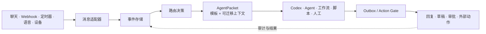

<!-- docs-language-switch -->
<div align="center">
<a href="./README.md">English</a> | 简体中文
</div>
<!-- /docs-language-switch -->

# RabiRoute


<p align="center">
  <a href="https://github.com/vb2250158/RabiRoute/commits/main"></a>
  <a href="https://github.com/vb2250158/RabiRoute/stargazers"></a>
  <a href="./LICENSE"></a>
  
  
  
</p>

RabiRoute 是一个与具体 Agent 解耦的**消息网关、策略路由器和动作安全门**。它接收来自聊天平台、Webhook、定时器、语音和设备的事件，完成记录、分类和上下文包装，再把任务交给合适的 Agent、工作流、脚本或人工队列。

RabiRoute 不拥有 Agent，也不试图成为 Agent OS。处理端决定一项任务具体怎么解决；RabiRoute 决定**任务该去哪里、随任务携带哪些上下文、是否允许执行外部动作，以及结果如何返回**。

[快速上手](#快速上手) · [当前能力](#当前能力) · [架构与边界](#架构与边界) · [文档](#文档)

## 为什么需要 RabiRoute

许多集成一开始只是把一个聊天平台直接连到一个机器人或 Agent。当系统逐渐拥有多个消息入口、多个处理端、可复用人格、共享上下文，以及不能默认自动发送的外部动作时，这种直连方式很快就会失去清晰边界。

RabiRoute 把这层协调能力独立出来：

- **跨渠道使用统一事件模型。** 平台适配器先把外部消息规范化，再交给路由层处理。
- **跨处理端使用统一策略边界。** 路由规则负责选择处理端，不允许某个处理端反向定义网关行为。
- **上下文可迁移。** 人格、最近消息、计划、记忆引用和回复上下文通过 `AgentPacket` 一起投递。
- **外发控制明确。** 回复和外部动作必须经过 Outbox / Action Gate，不绕开路由器直接执行。
- **证据可以回放。** JSONL 事件、数据包、投递、心跳、适配器和回放账本记录让故障具备可检查的证据链。

## 为什么这对开源维护者有价值

维护工作经常不是从代码托管平台开始，而是来自社区聊天、支持群、Webhook、发布日程、语音笔记或本地运行告警。这些事件仍然需要一条可靠路径进入编码 Agent 和人工复核。

RabiRoute 提供这条路径，同时避免让单个 Agent 掌握所有渠道凭据和外发权限：

```text
社区事件 -> 路由策略 -> 精确处理线程
         -> 草稿或动作请求 -> 审批 -> 原始渠道
```

当 Codex 或其他处理端需要获得结构化上下文、继续正确任务并准备回复时，RabiRoute 可以让外部动作继续保持可观测、可复核。

## 工作方式



核心链路刻意保持精简：

```text
消息适配器 -> 事件存储 -> RouteDecision -> AgentPacket -> 处理端 -> Outbox / 回复
```

## 当前能力

| 领域 | 已实现能力 |
| --- | --- |
| 消息入口 | 已验证：NapCat / OneBot、Heartbeat、内置角色面板。实验支持：Remote Agent、FenneNote、小爱、RabiLink、通用 Webhook、WeCom。Manual trigger 是 Manager 动作，不是 adapter。 |
| 路由 | Route profile、人格绑定通知规则、直接 `@`、回复链路、私聊、关键词、正则、定时规则和每路由独立模板 |
| 上下文 | 最近消息窗口、人格文件、角色计划和记忆、来源消息的回复上下文、附件证据，以及处理端接口提示 |
| 处理端 | 已验证：Codex。实验支持：Copilot CLI、AstrBot。人工接力：Marvis。 |
| 控制面 | Node.js manager 与 RibiWebGUI，负责 Gateway 生命周期、配置、状态、日志、人格和诊断 |
| 安全 | Outbox 返回 `sent` / `draft` / `blocked` / `failed`，并执行来源消息绑定、adapter policy、NapCat 文件白名单和 Codex Runtime fail-closed 审批；通用审批中心尚未实现。 |
| 可观测性 | JSONL 消息历史、适配器日志、处理端数据包、投递记录、心跳记录和回放账本 |

各平台的账号凭据和登录状态仍由平台自身管理。公开示例只使用占位值和脱敏后的本地路径；运行期 `data/`、日志、token、录音和转录文本不会进入 Git。

## 快速上手

### 环境要求

- Node.js 20 或更高版本
- npm
- 可选：如果要验证完整投递链路，需要准备 Codex、NapCat / OneBot、企业微信或其他外部集成

### 安装与运行

```bash
git clone https://github.com/vb2250158/RabiRoute.git
cd RabiRoute
npm install
npm run build
npm run start:manager
```

打开 [http://127.0.0.1:8790/](http://127.0.0.1:8790/) 进入 RibiWebGUI。

首次启动时，如果本地还没有运行数据，manager 会从 `examples/data/` 初始化一份脱敏配置。默认只启用主路由；外部适配器仍需完成各自的本地配置。

在 RibiWebGUI 中：

1. 选择或创建一个 route 和 persona。
2. 启用 heartbeat、Webhook、NapCat、企业微信或 RabiLink 等消息入口。
3. 选择处理端，并通过状态页和日志页验证路由链路。

顶栏的 `中 / EN` 菜单可以在运行时切换界面语言。这个选择只保存在当前浏览器，属于 UI 偏好，不会修改 route、人格、模板、正则、路径、日志或任务数据。

先阅读[当前能力与成熟度](docs/current-capabilities.md)确认已验证、实验和占位边界；包括 NapCat 和 Codex 在内的配置过程见[快速上手](docs/getting-started.md)。

## 架构与边界

| RabiRoute 负责 | 处理端负责 |
| --- | --- |
| 消息进入和规范化 | 回答具体问题 |
| 事件与投递记录 | 规划任务执行过程 |
| 路由匹配与处理端选择 | 调用工具和修改代码 |
| 上下文模板与 `AgentPacket` 构建 | 私有运行状态和深层记忆 |
| 会话投递策略 | 领域内推理 |
| 草稿、审批、回复和审计边界 | 产出结果或动作请求 |

RabiRoute 不是完整 Agent OS，不是聊天机器人框架的替代品，不是工作流平台，也不是某个模型提供商的外壳。新平台入口应放在 `src/adapters/`；处理端集成继续隐藏在 agent-adapter 接口之后。

当前代码边界和成熟度以[当前能力与成熟度](docs/current-capabilities.md)为准。[架构说明](docs/architecture.md)与[代码架构](docs/code-architecture.md)进一步说明当前 Desktop owner 主链和模块边界。

## Codex 集成

Codex 是 RabiRoute 第一条完整验证的处理端，但不是产品边界。

- 真实消息只通过 Desktop IPC 投给选定的 Codex/ChatGPT Desktop 任务 owner；RabiRoute 不启动第二个执行 Runtime，也没有隐藏 fallback。
- 已保存的不透明任务 ID 是稳定身份。SQLite 标题滞后、Desktop 改名或任务 goal 完成都不会让任务失效或重复创建；只有 ID 被明确清空或确实不存在时才按名称查找/创建。
- 目标任务未加载时，RabiRoute 会打开 `codex://threads/<id>` 并短暂重试；Desktop 缺席、工作目录冲突或 owner 无法加载时失败关闭。
- 模型、工具、沙箱和审批由目标 Desktop 任务拥有；兼容字段 `agentModel` 不覆盖这些设置。
- 项目锁定的 `codex app-server` 只用于创建、命名空任务等短生命周期元数据操作，不接收真实路由 prompt。
- Runtime 权限与 RabiRoute 的业务 Action Gate 是两道相互独立的安全边界。

这种分离方式让路由器不必变成 Codex 专用外壳，同时仍能支持需要可靠 thread 投递和可观测交接的维护流程。

## 配置模型

运行配置把消息路由与人格行为分开保存：

```text
data/route/<configName>/adapterConfig.json
data/roles/<RoleId>/persona.md
data/roles/<RoleId>/personaConfig.json
```

- `adapterConfig.json` 定义消息入口、处理端 adapter、工作目录、pipeline preset 和人格绑定。
- `persona.md` 保存人格或面向处理端的角色说明。
- `personaConfig.json` 保存通知规则、消息模板、定时器和最近消息数量限制。

可复制的公开配置位于 [examples/data](examples/data/)。人格创建和安全更新流程等可复用项目指南位于 [skills](skills/)。

## 项目状态

RabiRoute 仍是积极开发中的早期项目。当前 `0.1.x` 已经跑通从消息进入、处理端投递到回复回传的完整链路；配置 Schema 和高级集成仍可能继续演进。

Node.js manager 和 WebGUI 是跨平台基线。Qt 托盘与 Windows 启动器属于便利层，不是另一套后端，也不代表单文件分发形态。

破坏性配置变更与迁移说明记录在[版本更新日志](版本更新日志.md)中。

## 文档

带状态分类的完整索引见 [docs/README.md](docs/README.md)。

| 目标 | 文档 |
| --- | --- |
| 查看实际已实现内容 | [当前能力与成熟度](docs/current-capabilities.md) |
| 浏览现行、实验、设计和历史文档 | [文档索引](docs/README.md) |
| 复制 Route/人格示例或查看硬件集成 | [示例与子项目](examples/README.md) |
| 安装并验证第一条路由 | [快速上手](docs/getting-started.md) |
| 查找功能对应代码入口 | [项目功能地图](docs/project-function-map.md) |

## 开发与贡献

```bash
npm run manager          # 直接运行 TypeScript manager
npm run webgui:dev       # 以开发模式运行 Vue/Vuetify 前端
npm run test             # 运行后端测试
npm run build            # 类型检查并构建后端与 WebGUI
npm run check:config     # 检查公开/运行期 JSON 文本是否损坏
```

开始较大改动前，请先阅读[当前能力与成熟度](docs/current-capabilities.md)，再检查对应代码和测试。欢迎通过 [GitHub 仓库](https://github.com/vb2250158/RabiRoute)提交 issue 和 pull request。

请勿提交真实账号标识、聊天内容、token、Cookie、私有路径或运行期 `data/`。本仓库始终按公开、可复现项目维护。

## 许可证

RabiRoute 使用 [MIT 许可证](LICENSE)开源。
