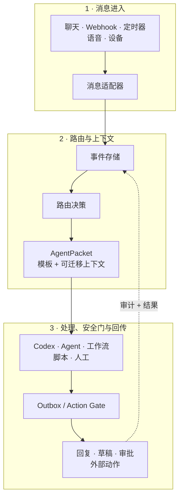

<!-- docs-language-switch -->
<div align="center">
<a href="./README.md">English</a> | 简体中文
</div>
<!-- /docs-language-switch -->

# RabiRoute


<h2 align="center">让 Agent 连接我们的一切。</h2>

<p align="center">让来自聊天、语音、设备和时间的信号汇入 Agent，在持续理解中主动准备，在安全边界内把帮助落到现实。</p>

<p align="center">
  <a href="https://github.com/vb2250158/RabiRoute/commits/main"></a>
  <a href="https://github.com/vb2250158/RabiRoute/stargazers"></a>
  <a href="./LICENSE"></a>
  
  
  
</p>

RabiRoute 是一个与具体 Agent 解耦的**消息网关、策略路由器和动作安全门**。它把来自聊天、Webhook、定时器、语音和设备的事件，变成可交给 Agent、工作流、脚本或人工队列的结构化任务。

处理端解决具体任务。RabiRoute 决定**任务去哪里、携带哪些可迁移上下文、是否允许外发，以及结果回到哪里**。

[核心亮点](#核心亮点) · [快速上手](#快速上手) · [工作方式](#工作方式) · [当前能力](#当前能力) · [文档](#文档)

## 核心亮点

- 🔌 **让多种信号进入同一套路由层。** 已验证入口包括 NapCat / OneBot、Heartbeat 和内置角色面板；其他平台、语音和设备可通过专用或实验适配器接入。
- 🧭 **按策略路由，而不是把平台和 Agent 写死。** Route profile、人格、通知规则、定时器、关键词、正则和回复上下文共同决定每个事件交给谁。
- 🧳 **让上下文跟着任务走。** `AgentPacket` 携带事件、人格、最近消息、计划、记忆引用、附件、接口提示和回复上下文。
- 🖥️ **用本地控制面管理整条链路。** Node.js Manager 与 RibiWebGUI 统一管理 route、适配器、人格、运行状态、日志、诊断和进程生命周期。
- 🛡️ **让外发动作保持明确。** 回复经过每条 route 的 Outbox policy，不绕过网关直接执行，并留下 `sent`、`draft`、`blocked` 或 `failed` 可观测结果。
- 🔍 **保留可检查、可回放的证据。** JSONL 记录覆盖进入事件、数据包、投递、心跳、适配器活动、回复和 delivery replay。

> RabiRoute 正处于活跃的 `0.1.x` 开发阶段。依赖外部平台或设备链路前，请先查看[当前能力与成熟度](docs/current-capabilities.md)。

## 快速上手

需要 Node.js 20 或更高版本，以及 npm。

```bash
git clone https://github.com/vb2250158/RabiRoute.git
cd RabiRoute
npm install
npm run build
npm run start:manager
```

打开 [http://127.0.0.1:8790/](http://127.0.0.1:8790/) 进入 RibiWebGUI。首次运行且本地没有运行数据时，Manager 会从 `examples/data/` 初始化一份脱敏配置。

本机语音实时页是 [http://127.0.0.1:8790/#/speech](http://127.0.0.1:8790/#/speech)，其中 provider、模型和运行设备来自当前电脑。随仓库提供的[基准报告](http://127.0.0.1:8790/reports/rabispeech-model-benchmark.html)只代表报告内标明的目标测试机。

最短验证路径：

1. 打开**快速配置**，选择 Heartbeat 作为消息入口。
2. 选择 Codex，并绑定项目目录与一个 Desktop 任务。
3. 保存 route，打开**日志诊断**，手动触发一条消息。

外部适配器仍需要各自的账号和本地配置。准备接入 NapCat、企业微信、RabiLink 或其他来源时，继续阅读[快速上手指南](docs/getting-started.md)。

## 工作方式



每条 route 都把消息进入、策略判断、可迁移上下文、处理端投递和外发控制分开。处理端可以替换，但不会因此接管渠道凭据或反向定义网关行为。

## 当前能力

| 领域 | 已实现能力 |
| --- | --- |
| 消息入口 | 已验证：NapCat / OneBot、Heartbeat 和内置角色面板。实验支持：Remote Agent、RabiSpeech 语音消息端、小爱、RabiLink、通用 Webhook 和 WeCom。FenneNote 已退役，仅保留旧配置读取兼容；Manual trigger 是 Manager 动作，不是 adapter。 |
| 路由 | Route profile、人格规则、直接 `@`、回复链路、私聊、关键词、正则、定时规则和每 route 独立模板 |
| 上下文 | 最近消息、人格文件、计划、记忆引用、来源回复上下文、附件证据和处理端接口提示 |
| 处理端 | 已验证：Codex。实验支持：Copilot CLI、AstrBot。人工接力：Marvis。 |
| 控制面 | Node.js Manager 与 RibiWebGUI，负责 route 生命周期、配置、状态、日志、人格和诊断 |
| 本机语音 | 实验支持：仅使用本地模型的 RabiSpeech TTS/ASR 直接 API、逐电脑实时能力页、RabiLink 中转和可重复的模型性能报告 |
| 安全 | Outbox policy、来源绑定、adapter policy、NapCat 文件白名单和 Codex Runtime fail-closed 审批；通用审批中心尚未实现 |
| 可观测性 | JSONL 消息历史、适配器日志、处理端数据包、投递记录、心跳记录、回复记录和 delivery replay |

各平台仍拥有自己的账号凭据和登录状态。公开示例只使用占位值和脱敏路径；运行期 `data/`、日志、token、录音和转录文本不会进入 Git。

## 架构与边界

| RabiRoute 负责 | 处理端负责 |
| --- | --- |
| 消息进入和规范化 | 回答具体问题 |
| 事件与投递记录 | 规划任务执行过程 |
| 路由匹配与处理端选择 | 调用工具和修改代码 |
| 上下文模板与 `AgentPacket` 构建 | 私有运行状态和深层记忆 |
| 会话投递策略 | 领域内推理 |
| 草稿、审批、回复和审计边界 | 产出结果或动作请求 |

换句话说：**RabiRoute 不拥有 Agent，但拥有上下文和门。**

RabiRoute 不是完整 Agent OS，不是聊天机器人框架的替代品，不是工作流平台，也不是某个模型提供商的外壳。新平台入口应放在 `src/adapters/`；处理端集成继续隐藏在 agent-adapter 接口之后。

当前代码边界和成熟度以[当前能力与成熟度](docs/current-capabilities.md)为准。

[架构说明](docs/architecture.md)与[代码架构](docs/code-architecture.md)进一步说明当前 Desktop owner 主链和模块边界。

## Codex 集成

Codex 是 RabiRoute 第一条完整验证的处理端，但不是产品边界。

- 真实消息只通过 Desktop IPC 投给选定的 Codex/ChatGPT Desktop 任务 owner；RabiRoute 不启动第二个执行 Runtime，也没有隐藏 fallback。
- 已保存的不透明任务 ID 是稳定身份。SQLite 标题滞后、Desktop 改名或任务 goal 完成都不会让任务失效或重复创建；只有 ID 被明确清空或确实不存在时才按名称查找/创建。
- 目标任务未加载时，RabiRoute 会打开 `codex://threads/<id>` 并短暂重试；Desktop 缺席、工作目录冲突或 owner 无法加载时失败关闭。
- 模型、工具、沙箱和审批由目标 Desktop 任务拥有；兼容字段 `agentModel` 不覆盖这些设置。
- 项目锁定的 `codex app-server` 只用于创建、命名空任务等短生命周期元数据操作，不接收真实路由 prompt。
- Runtime 权限与 RabiRoute 的业务 Action Gate 是两道相互独立的安全边界。

这种分离方式让路由器不必变成 Codex 专用外壳，同时仍能支持需要可靠 thread 投递和可观测交接的维护流程。

## 配置模型

运行配置把消息路由与人格行为分开保存：

```text
data/route/<configName>/adapterConfig.json
data/roles/<RoleId>/persona.md
data/roles/<RoleId>/personaConfig.json
```

- `adapterConfig.json` 定义消息入口、处理端 adapter、工作目录、pipeline preset 和人格绑定。
- `persona.md` 保存人格或面向处理端的角色说明。
- `personaConfig.json` 保存通知规则、消息模板、定时器和最近消息数量限制。

可复制的公开配置位于 [examples/data](examples/data/)。人格创建和安全更新流程等可复用项目指南位于 [skills](skills/)。

## 项目状态

RabiRoute 仍是积极开发中的早期项目。当前 `0.1.x` 已经跑通从消息进入、处理端投递到回复回传的完整链路；配置 Schema 和高级集成仍可能继续演进。

Node.js manager 和 WebGUI 是跨平台基线。Qt 托盘与 Windows 启动器属于便利层，不是另一套后端，也不代表单文件分发形态。

破坏性配置变更与迁移说明记录在[版本更新日志](版本更新日志.md)中。

## 文档

带状态分类的完整索引见 [docs/README.md](docs/README.md)。

| 目标 | 文档 |
| --- | --- |
| 使用 RibiWebGUI 并完成第一条投递 | [RibiWebGUI 使用手册](docs/user-guide/README.md) |
| 查看实际已实现内容 | [当前能力与成熟度](docs/current-capabilities.md) |
| 浏览现行、实验、设计和历史文档 | [文档索引](docs/README.md) |
| 复制 Route/人格示例或查看硬件集成 | [示例与子项目](examples/README.md) |
| 安装并验证第一条路由 | [快速上手](docs/getting-started.md) |
| 查找功能对应代码入口 | [项目功能地图](docs/project-function-map.md) |
| 运行或扩展本机 TTS / ASR | [RabiSpeech 本机 TTS / ASR 服务](docs/rabispeech-plugin.md) |

## 开发与贡献

```bash
npm run manager          # 直接运行 TypeScript manager
npm run webgui:dev       # 以开发模式运行 Vue/Vuetify 前端
npm run test             # 运行后端测试
npm run build            # 类型检查并构建后端与 WebGUI
npm run check:config     # 检查公开/运行期 JSON 文本是否损坏
```

开始较大改动前，请先阅读[当前能力与成熟度](docs/current-capabilities.md)，再检查对应代码和测试。

欢迎通过 [GitHub 仓库](https://github.com/vb2250158/RabiRoute)提交 issue 和 pull request。

请勿提交真实账号标识、聊天内容、token、Cookie、私有路径或运行期 `data/`。本仓库始终按公开、可复现项目维护。

## 许可证

RabiRoute 使用 [MIT 许可证](LICENSE)开源。
