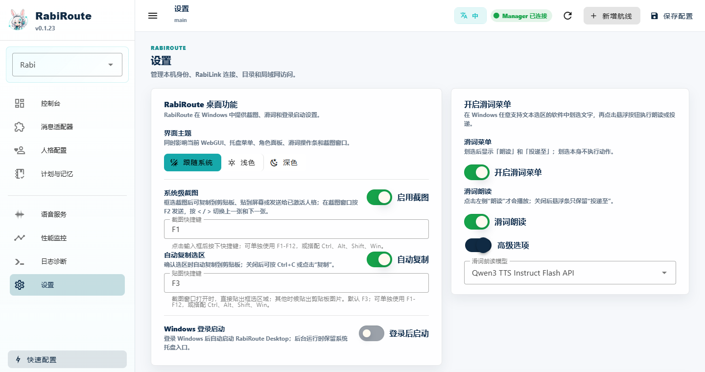
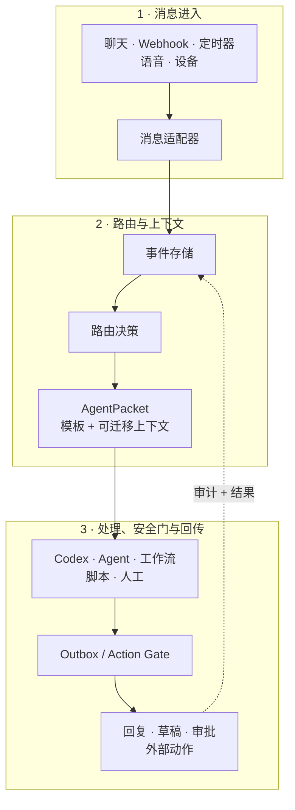

<!-- docs-language-switch -->
<div align="center">
<a href="./README.md">English</a> | 简体中文
</div>
<!-- /docs-language-switch -->

# RabiRoute


<h2 align="center">让 Agent 连接我们的一切。</h2>

<p align="center">让来自聊天、语音、设备和时间的信号汇入 Agent，在持续理解中主动准备，在安全边界内把帮助落到现实。</p>

<p align="center">
  <a href="https://github.com/vb2250158/RabiRoute/commits/main"></a>
  <a href="https://github.com/vb2250158/RabiRoute/stargazers"></a>
  <a href="./LICENSE"></a>
  
  
  
</p>

RabiRoute 是一个与具体 Agent 解耦的**消息网关、策略路由器和动作安全门**。它接收聊天、Webhook、定时器、语音和设备消息，按规则把消息交给正确的 Agent 或程序。

Agent 或程序负责真正回答和执行任务。RabiRoute 负责决定**消息交给谁、自动附带哪些最近消息、是否允许向外回复，以及结果回到哪里**。

[可以构建什么](#可以构建什么) · [快速上手](#快速上手) · [本次更新](#本次更新重点) · [工作方式](#工作方式) · [当前能力](#当前能力) · [深入了解](#深入了解)

## 可以构建什么

- 💬 **聊天到 Agent 的路由。** 把 QQ、角色面板或定时事件交给选定的处理端；Codex 是第一条完成端到端验证的处理端。
- ⏱️ **主动工作例程。** 组合 Heartbeat、人格规则和项目上下文，唤醒正确的 Desktop 任务执行巡检、跟进或维护。
- 🧳 **带最近消息的交接。** 按人格保存消息记录，只附带当前任务需要的内容，并按照这条 Route 的发送规则决定是否回传。
- 🖼️ **系统文本和截图。** 在其他软件中划选文字或框选截图后，再主动朗读或投递给正在运行的人格；划选本身不会朗读或发消息。

路由器始终与处理端解耦。你可以替换 Agent、工作流、脚本或人工队列，而不必把渠道凭据和网关策略一起交出去。

## 快速上手

### Windows 安装包

从 [GitHub Releases](https://github.com/vb2250158/RabiRoute/releases/latest) 下载 `RabiRoute-<版本>-windows-x64-setup.exe`。安装包包含 RabiRoute Desktop、Node.js、作为本机后端的 Manager、RibiWebGUI 和生产依赖。

发布页也提供便携 ZIP 和 `SHA256SUMS.txt`。当前 Windows 包尚未签名；遇到 SmartScreen“未知发布者”提示时，请先核对校验和。

### 源码安装

需要 Node.js 20 或更高版本，以及 npm。

```bash
git clone https://github.com/vb2250158/RabiRoute.git
cd RabiRoute
npm install
npm run build
npm run start:manager
```

打开 [http://127.0.0.1:8790/](http://127.0.0.1:8790/)。如果本机还没有运行数据，Manager 会从 `examples/data/` 创建脱敏的本地配置。

创建第一条消息路线（Route）：

1. 打开**快速配置**，选择 Heartbeat 作为消息入口。
2. 选择 Codex，并绑定项目目录与一个 Desktop 任务。
3. 保存 Route，打开**日志诊断**，执行一次手动触发。

> 成功标准：触发完成，并且选定的 Codex/ChatGPT Desktop 任务收到一条 RabiRoute 消息。这是真实投递，不是无副作用预览。

接下来阅读[第一条 Route 指南](docs/user-guide/first-route.md)。局域网访问、外部适配器和远端语音都有独立的配置与安全步骤。

## 本次更新重点

### 一个完整的 Windows 桌面运行态

Windows 正式入口改为 **RabiRoute Desktop**：`Start-RabiRoute-Desktop.bat` 和 `RabiRoute-Desktop.exe` 会把本机 Manager 与桌面界面作为同一运行态启动。轻量监督器只会在保存的意图仍是运行时补齐缺失组件；点击“退出 RabiRoute”会先保存明确停止，再关闭本机后端。

### 系统级文本与图片投递

“设置”页可以打开滑词菜单和系统级截图。在其他软件中用鼠标或键盘划选文字后，再点“朗读”或“投递至”；划选本身没有副作用。截图可以复制、贴到屏幕、输入说明，再带着文字投递给已启用人格。Windows 真机闭环仍待验收。



*截图使用本机脱敏样例，不包含账号、访问密钥、聊天内容或私有路径。*

### 更可靠的 Agent 工作链路

- **Codex 仍是已验证处理端。** 真实 prompt 只投给选定的 Codex/ChatGPT Desktop 任务 owner；Desktop 不可用、工作目录不一致或 owner 缺失时失败关闭。
- **DSH 是实验性的主人格处理端。** 它可以承担主人格和受管辅助会话，但真实 profile 的连续投递、重启读回和工具 owner 仍需实机证据。
- **每条投递保留实际来源。** 处理端能区分消息来自哪里与正文内容；人格之间的消息需要显式发送、带身份校验和重复投递保护，默认不会自动返回。
- **归档绑定会在下一次真实投递时换新。** 主人格、消息处理 Agent 和计划秘书会创建准确的新任务，不会投进归档记录或复用同名任务。

Windows 控件见 [界面与状态](docs/user-guide/interface-and-status.md)，能力成熟度见[当前能力与成熟度](docs/current-capabilities.md)，配置与恢复细节见[版本更新日志](版本更新日志.md)。

## 工作方式


```mermaid
flowchart TB
    subgraph ingress ["1 · 消息进入"]
        direction LR
        A["聊天 · Webhook · 定时器<br/>语音 · 设备"] --> B["消息适配器"]
    end

    subgraph routing ["2 · 路由与上下文"]
        direction LR
        C["事件存储"] --> D["路由决策"] --> E["AgentPacket<br/>模板 + 可迁移上下文"]
    end

    subgraph delivery ["3 · 处理、安全门与回传"]
        direction LR
        F["Codex · Agent · 工作流<br/>脚本 · 人工"] --> G["Outbox / Action Gate"] --> H["回复 · 草稿 · 审批<br/>外部动作"]
    end

    B --> C
    E --> F
    H -. "审计 + 结果" .-> C
```

每条 Route 都把消息进入、策略判断、可迁移上下文、处理端投递和外发控制分开。事件和投递结果会留下可检查的证据，不会消失在某个一体化集成里。

## 当前能力

| 领域 | 当前能力 |
| --- | --- |
| 已验证入口 | NapCat / OneBot、Heartbeat 和内置角色面板。Manual trigger 是 Manager 动作，不是 adapter。 |
| 人格协作 | Agent 可以查询当前可联系的人格，并显式向另一个已启用 Route 单向投递消息。接口包含身份校验和重复投递保护；真实双人格 Desktop 验收仍待完成。 |
| 路由 | Route profile、人格规则、直接 @、回复链、私聊、关键词、正则、定时规则和每 Route 独立模板。 |
| 上下文 | 人格级双向会话账本、最近消息额度、计划/记忆/技能引用、回复上下文和安全附件元数据。 |
| 已验证处理端 | 通过选定 Codex/ChatGPT Desktop 任务 owner 投递的 Codex。 |
| 实验性的主人格处理端 | DSH 可以承担主人格和受管辅助会话；真实 profile 的连续投递与重启验收仍待完成。 |
| Windows 桌面交互 | RabiRoute Desktop 提供滑词操作和系统级截图投递；Windows 真机闭环仍待验收。 |
| 控制面 | Node.js Manager、RibiWebGUI 与 RabiRoute Desktop，负责 Route、适配器、人格、语音、性能、日志、设置、诊断和进程生命周期。 |
| 安全与证据 | Route 自己的 Outbox policy，以及事件、数据包、投递、回复、Heartbeat 和 replay 的 JSONL 记录。 |
| 实验集成 | Remote Agent、RabiSpeech、RabiLink、小爱、Webhook、WeCom、飞书、个人微信、穿戴设备、Copilot CLI 和 AstrBot。 |

RabiRoute 正处于活跃的 `0.1.x` 开发阶段。外部平台与设备链路仍需对应环境验收；完整口径见[当前能力与成熟度](docs/current-capabilities.md)。

项目不会把通用审批中心、持久 Action Queue、无副作用 Route 预览，或全部手机、眼镜和穿戴设备生产闭环宣传为已完成能力。

## 边界与安全

| RabiRoute 负责 | 处理端负责 |
| --- | --- |
| 消息进入和规范化 | 回答具体问题 |
| 事件与投递记录 | 规划和执行任务 |
| 路由匹配与处理端选择 | 调用工具和修改代码 |
| 上下文模板与 `AgentPacket` 构建 | 私有运行状态和深层记忆 |
| 会话投递策略 | 领域内推理 |
| 草稿、回复和审计边界 | 产出结果或动作请求 |

换句话说：**RabiRoute 不拥有 Agent，但拥有上下文和门。**

RabiRoute 不是完整 Agent OS，不是聊天机器人框架的替代品，不是工作流平台，也不是某个模型提供商的外壳。新消息平台应进入 `src/adapters/`；处理端集成留在 agent-adapter 接口之后。

- 平台凭据和登录状态仍由各平台拥有。
- Desktop 任务审批与 RabiRoute 的业务动作策略是两道独立安全门。
- 运行期 `data/`、日志、token、录音、转录文本和私有路径不会进入 Git。
- owner、工作目录或权限状态不明确时失败关闭。

## Agent 集成

Codex 是第一条完整验证的处理端，但不是产品边界。

- 真实消息只通过 Desktop IPC 投给选定的 Codex/ChatGPT Desktop 任务 owner。
- 已保存的任务 ID 与 workspace 是稳定身份；改名或 goal 完成不会创建重复任务。
- Desktop 缺席、任务无法加载或工作目录不一致时，投递失败关闭，不启动备用 Runtime。
- 模型、工具、沙箱和审批由目标 Desktop 任务拥有。
- 项目锁定的 `codex app-server` 可以创建或命名空任务，但不执行真实路由 prompt。

这组边界让路由器保持独立，同时保留可靠投递和清晰的任务所有权。

DSH 使用明确的 API 地址、工作目录和会话绑定；会话、插件或 owner 不可用时不会改投 Codex。当前已有实现和自动化合同，但真实 DSH profile 的连续投递与重启读回尚未完成验收，不能当作已验证能力宣传。

## 配置模型

运行配置把消息路由与人格行为分开保存：

```text
data/route/<configName>/adapterConfig.json
data/roles/<RoleId>/persona.md
data/roles/<RoleId>/personaConfig.json
```

- `adapterConfig.json` 定义消息入口、处理端 adapter、工作目录、pipeline preset 和人格绑定。
- `persona.md` 保存人格或面向处理端的角色说明。
- `personaConfig.json` 保存人格自动化规则、头像信息、语音关键词和最近消息额度。每条自动化规则由“收到消息或到达时间”与“通知 Agent 或运行本机人格脚本”组成。

完整会话证据位于 `data/roles/<RoleId>/conversation/`。可公开复制的脱敏样板位于 [`examples/data/`](examples/data/)，本机运行数据保持私有。

可独立构建的客户端位于 [`apps/`](apps/)，共享端侧契约位于 [`packages/`](packages/)，可复用项目指南位于 [`skills/`](skills/)。

## 深入了解

| 目标 | 文档 |
| --- | --- |
| 完成第一条投递 | [RibiWebGUI 使用手册](docs/user-guide/README.md) |
| 核对真实已实现能力 | [当前能力与成熟度](docs/current-capabilities.md) |
| 浏览现行、实验、设计和历史文档 | [文档索引](docs/README.md) |
| 理解产品与代码边界 | [架构说明](docs/architecture.md) · [代码架构](docs/code-architecture.md) |
| 查找功能对应的代码 owner | [项目功能地图](docs/project-function-map.md) |
| 安全配置局域网访问 | [RibiWebGUI 界面与状态](docs/user-guide/interface-and-status.md) |
| 构建手机端或眼镜端 | [客户端应用](apps/README.md) |
| 运行本机或远端 TTS / ASR | [RabiSpeech](docs/rabispeech-plugin.md) · [远端语音](docs/user-guide/speech-api.md) |
| 查看配置迁移说明 | [版本更新日志](版本更新日志.md) |

## 开发与贡献

```bash
npm run manager          # 直接运行 TypeScript Manager
npm run webgui:dev       # 运行 Vue/Vuetify 前端
npm run test             # 运行后端与契约测试
npm run build            # 构建后端与 WebGUI
npm run check:config     # 检查公开/运行期 JSON 文本
```

开始较大改动前，请先阅读[当前能力与成熟度](docs/current-capabilities.md)，再检查相关代码、测试和文档。

欢迎通过 [GitHub 仓库](https://github.com/vb2250158/RabiRoute)提交 issue 和 pull request。

请勿提交真实账号标识、聊天内容、token、Cookie、私有路径或运行期 `data/`。本仓库始终按公开、可复现项目维护。

## 许可证

RabiRoute 使用 [MIT 许可证](LICENSE)开源。
