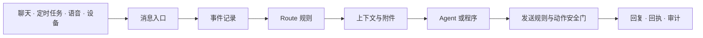

<!-- docs-language-switch -->
<div align="center">
<a href="./README.md">English</a> | 简体中文
</div>
<!-- /docs-language-switch -->

# RabiRoute


<h2 align="center">让 Agent 连接我们的一切。</h2>

<p align="center">把聊天、语音、定时任务和设备消息交给合适的 Agent，并保留清楚的上下文、权限边界和投递记录。</p>

<p align="center">
  <a href="https://github.com/vb2250158/RabiRoute/commits/main"></a>
  <a href="https://github.com/vb2250158/RabiRoute/stargazers"></a>
  <a href="./LICENSE"></a>
  
  
  
</p>

RabiRoute 是一个与具体 Agent 解耦的**消息网关、发送规则管理器和动作安全门**。它接收 QQ、Webhook、定时任务、语音、桌面操作和设备消息，再按消息路线（Route）把内容交给指定的 Agent 或程序。

Agent 负责回答、写代码、调用工具和执行任务。RabiRoute 负责消息从哪里来、交给谁、附带哪些最近消息、能否向外回复，以及结果和回执保存在哪里。

[快速上手](#快速上手) · [当前能力](#当前能力) · [近期变化](#近期变化) · [工作方式](#工作方式) · [文档](#文档入口)

## 适合做什么

- **把聊天交给 Agent。** QQ 群聊、私聊、角色面板和其他消息入口可以按 Route 进入固定项目和固定任务。
- **让 Agent 定时工作。** 人格规则可以按间隔、时间窗口、每天指定时间或单次时间触发 Agent，也可以运行明确授权的本机脚本。
- **保留连续上下文。** 每个人格拥有自己的消息记录、计划、记忆和技能引用；每条 Route 可以限制自动附带的最近消息。
- **按人格配置计划工作流。** 状态 key、名称、说明、颜色、顺序、所在视图、审批行为和延迟归档都来自人格配置；Agent 调整状态目录不需要发布新代码。
- **控制外部发送。** Agent 必须通过统一发送接口回复 QQ、RabiLink 等外部渠道；目标、引用消息、发送者身份和回执会被校验并记录。
- **从 Windows 桌面投递文字和图片。** RabiRoute Desktop 支持滑词操作、系统截图、标注、复制、贴图和投递给已启用人格。
- **连接语音和移动设备。** RabiSpeech、RabiLink 手机/眼镜、穿戴设备与远程 Relay 已有实现，但仍按实验集成验收。

## 快速上手

### Windows 安装包

从 [GitHub Releases](https://github.com/vb2250158/RabiRoute/releases/latest) 下载 `RabiRoute-<版本>-windows-x64-setup.exe`。安装包包含 RabiRoute Host、Desktop 表现层、本机 Manager、RibiWebGUI、Node.js 和生产依赖。在 Windows 上，Host 是唯一的应用生命周期 owner：它创建一代应用，并让 Manager 与 Desktop 始终属于同一代。

发布页同时提供便携 ZIP 和 `SHA256SUMS.txt`。便携 ZIP 使用 `RabiRouteHost.exe + current.json + versions/<releaseId>` 布局，只能解压到新的空目录，不能覆盖旧 RabiRoute 目录；升级既有安装必须运行 Setup。Setup 嵌入同一份便携 ZIP，先在安装盘暂存并逐清单校验哈希、大小、私有路径、reparse point 与 Host 自检，再按当前 application generation 执行 fenced quit；只有候选通过后才原子切换 `current.json` 与 bootstrap，失败会恢复上一指针和 bootstrap。经精确识别的旧生命周期入口会以 `.retired` 后缀移入安装器所有的非执行 quarantine；事务失败或断电恢复会把它们原位还原，foreign 和相似后缀文件不移动。`data/`、`logs/` 与 foreign 文件不参与覆盖或卸载。当前 Windows 包尚未签名，遇到 SmartScreen“未知发布者”提示时先核对校验和。

### 从源码运行

需要 Node.js 20 或更高版本，以及 npm。

```bash
git clone https://github.com/vb2250158/RabiRoute.git
cd RabiRoute
npm install
npm run build
npm run start:manager
```

Manager 启动后会打印真实的回环地址，端口由操作系统分配。从源码运行时打开这条输出中的地址；Windows 安装版由 Host 状态或托盘打开当前地址，产品合同不包含固定本机端口。首次启动且没有本机运行数据时，Manager 会从 `examples/data/` 创建脱敏示例配置。

### 跑通第一条 Route

1. 打开**快速配置**，选择“定时触发”。
2. 选择 **Codex Agent**，绑定项目目录和一个已经存在的 Codex/ChatGPT Desktop 任务。
3. 保存 Route，在**日志诊断**中执行一次手动触发。
4. 确认触发成功，并且同一个 Desktop 任务出现了 RabiRoute 消息。

这次手动触发会执行真实投递。完整步骤和失败检查见[跑通第一条 Route](docs/user-guide/first-route.md)。

## 当前能力

仓库当前版本为 `0.2.3`。下面只列代码、配置入口和测试能够支持的范围；需要账号、外部服务或真机的功能仍要在对应环境验收。

| 范围 | 当前状态 | 用户可以完成什么 |
| --- | --- | --- |
| 路由主链 | 已验证 | 接收消息、保存事件、匹配规则、生成 Agent 上下文、投递处理端并记录回传。 |
| NapCat / OneBot | 已验证 | 每个 Route 绑定一个 NapCat；在 Route 卡片内完成快速、密码、扫码登录与安全确认，接收 QQ 群聊和私聊、保存媒体证据，并通过 OneBot HTTP 发送回复。 |
| 定时任务与人格自动化 | 已验证 | 按消息或时间触发 Agent；在单独授权后运行人格目录中的本机脚本。 |
| Codex Desktop | 已验证 | 完整任务 ID 选择既有任务，每次投递单独指定项目目录；只有目标任务写入 `deliveryId` 回执后才报告成功。任务删除或归档后可受控换新。 |
| RibiWebGUI | 已验证 | 管理 Route、人格、消息端、Agent、计划、记忆、日志、诊断、主题和桌面设置。 |
| 计划、记忆与消息处理 | 已验证 | 分页查看计划和记忆，提交计划反馈，分配消息处理任务，并保存处理状态和回执。 |
| 人格计划工作流 | 已验证 | Manager、WebGUI 与 Desktop 共同使用人格配置中的状态 key 和显示资料；Agent 可通过受保护接口新增、修改、替换或退役状态，并保留计划历史。 |
| Windows 桌面 | 主链已实现 | Host 管理包含 Manager 和托盘/任务窗口表现层的同一代应用；提供滑词、截图和截图标注。部分系统交互仍需 Windows 实机复测。 |
| DSH | 实验支持 | 作为主人格或辅助处理端使用明确的 API、项目目录和会话绑定。 |
| RabiSpeech / RabiLink / 移动与穿戴设备 | 实验支持 | 接入语音、手机、眼镜、Relay 和健康数据链路；每条链路按设备与网络环境单独验收。 |
| 局域网 Rabi Agent | 实验支持 | 其他电脑运行无界面工作进程，连接 Manager，并把任务交给该电脑上指定的 Codex Desktop 任务。真实多电脑验收待完成。 |

完整状态、限制和事实源见[当前能力与成熟度](docs/current-capabilities.md)。

## 近期变化

### 0.2.3：Manager 状态耐久性与客户端恢复

- 计划、记忆、反馈和 Route 目录 mutation 统一使用 revision、稳定幂等键、generation fence、worker ownership 与可恢复回执，不再由 Manager 父进程直接写入。
- 计划启动迁移先发布完整 canonical package，再退休 legacy 文件；存储 lease 与 durable-delivery ownership 在长任务中持续续租，ownership 改变时失败关闭。
- RibiWebGUI、Windows 托盘、Android SDK、RabiLink AIUI 与小米家庭设置都携带明确 revision，并能在 Manager generation 或端点变化后恢复，而不会静默重放 mutation。
- 人格同步把 manifest 与 package 检查移出 Manager 请求路径，保留 canonical plan-package identity，并拒绝过期或冲突证据。
- Windows developer candidate、事务化安装/应用脚本、Host fencing 与 release manifest 统一遵守本机运行 ownership；源码与已安装状态继续分离。

### 0.2.2：Windows 单一生命周期与插件运行时 v2

- RabiRoute Host 成为唯一 Windows 应用 owner。Manager 与托盘作为同代子程序运行，端口由操作系统分配，并通过 Host 认证状态与 `/meta` identity 发现。
- Manager 插件升级为 schema/profile v2，明确 execution mode、ready dependency、generation replacement、process lease 与不可变 Web Bundle revision。
- Codex Desktop 投递增加 `deliveryId` 落盘确认、受控任务替换与侧栏索引名称；RibiWebGUI 增加首屏有界读取和可恢复目录加载。
- 桌宠、YeYu Gamer、穿戴设备、小米家庭、移动语音与局域网 Agent 均进入明确的插件、设备与验收边界。

逐项记录和迁移说明见[版本更新日志](版本更新日志.md)。

## 工作方式


```mermaid
flowchart LR
    A[聊天 · 定时任务 · 语音 · 设备] --> B[消息入口]
    B --> C[事件记录]
    C --> D[Route 规则]
    D --> E[上下文与附件]
    E --> F[Agent 或程序]
    F --> G[发送规则与动作安全门]
    G --> H[回复 · 回执 · 审计]
```

每条 Route 分开保存消息入口、人格、处理端、项目目录和发送规则。消息端不负责拼接 Agent 指令，Agent 也不能绕过 RabiRoute 直接取得渠道凭据或修改路由状态。

Manager 通过一个插件内核装载 29 个独立内置包。内置包和树外包统一使用 schema/profile v2、SDK、依赖图、权限检查、generation 切换、执行模式边界和 Web 模块生命周期。当前实现说明见[插件包与热替换](docs/plugin-bundles.md)。

## Agent 与安全边界

- Codex 的真实消息只通过 Desktop IPC 交给选定的 Codex/ChatGPT Desktop 任务 owner。
- 目标 Desktop 任务拥有自己的模型、工具、沙箱和审批；RabiRoute 不替它执行推理。
- 项目锁定的 `codex app-server` 只用于创建或命名空任务，不执行 Route 消息。
- Desktop 不可用、任务无法加载、项目目录不一致或 owner 不明确时，投递失败并保留错误记录。
- 平台账号、登录状态和凭据仍由对应平台拥有。
- 本机 `data/`、日志、录音、转录文本、token、Cookie 和私有路径不进入公开仓库。

RabiRoute 当前没有通用 Action Queue、统一审批中心或无副作用的 Route 预览界面。手机、眼镜、穿戴设备和多电脑 Agent 的生产闭环仍按实验功能管理。

## 配置和数据

```text
data/route/<configName>/adapterConfig.json
data/roles/<RoleId>/persona.md
data/roles/<RoleId>/personaConfig.json
```

- `adapterConfig.json` 保存消息入口、处理端、项目目录、Route 规则和人格绑定。
- `persona.md` 保存人格说明和面向处理端的工作要求。
- `personaConfig.json` 保存人格自动化、头像、语音关键词和最近消息额度。
- `data/roles/<RoleId>/conversation/` 保存该人格的消息记录。
- [`examples/data/`](examples/data/) 保存可公开复制的脱敏样板。

可独立构建的客户端位于 [`apps/`](apps/)，共享 SDK 位于 [`packages/`](packages/)，可复用 Agent 指南位于 [`skills/`](skills/)。

## 文档入口

### 第一次使用

- [跑通第一条 Route](docs/user-guide/first-route.md)：完成一次真实 Codex Desktop 投递。
- [RibiWebGUI 使用手册](docs/user-guide/README.md)：查看界面、人格、Route、Agent 和排障步骤。
- [界面与运行状态](docs/user-guide/interface-and-status.md)：判断 Manager、Route 和消息端是否正常。
- [运行、日志与排障](docs/user-guide/operations-and-troubleshooting.md)：按现象定位失败位置。

### 安装和接入

- [配置说明](docs/configuration.md)：查看本机配置、目录和主要参数。
- [局域网 Rabi Agent](docs/lan-rabi-agent-bootstrap.md)：接入其他电脑上的无界面 Codex 工作进程。
- [RabiSpeech](docs/rabispeech-plugin.md)：配置本机或远端 TTS / ASR。
- [客户端应用](apps/README.md)：构建 Android、Rokid AIUI、浏览器桥和 Rabi Agent。

### 开发和维护

- [当前能力与成熟度](docs/current-capabilities.md)：核对功能是否已验证。
- [文档索引](docs/README.md)：浏览现行、实验、设计和历史资料。
- [架构说明](docs/architecture.md)：理解产品边界和数据流。
- [项目功能手册](docs/project-function-map.md)：查找功能拥有者、API 和代码入口。
- [版本更新日志](版本更新日志.md)：查看版本变化和迁移要求。

## 开发

```bash
npm run manager          # 直接运行 TypeScript Manager
npm run webgui:dev       # 运行 Vue/Vuetify 前端
npm run test             # 运行后端与契约测试
npm run build            # 构建 Manager、独立插件包与 WebGUI
npm run check:config     # 检查公开和运行期 JSON 文本
```

提交公开内容前，删除真实账号标识、聊天内容、token、Cookie、本机用户名、私有路径和运行期 `data/`。

## 许可证

RabiRoute 使用 [MIT 许可证](LICENSE)开源。
