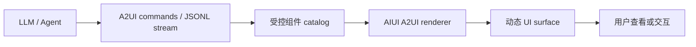

<!-- docs-language-switch -->
<div align="center">
<a href="./aiui-a2ui-notes_en.md">English</a> | 简体中文
</div>
<!-- /docs-language-switch -->

# AIUI A2UI 组件与 RabiLink 使用边界

本文记录 A2UI 的定位、当前文档接口差异，以及它在 RabiLink 中可以和不可以承担的职责。

## 1. A2UI 是什么

A2UI 是声明式、对 LLM 友好的 Generative UI 规范。模型不直接生成 HTML、WXML 或任意页面代码，而是输出结构化 commands；宿主根据预定义组件 catalog 和渲染器，把 commands 还原为卡片、列表、指标、图片或其他 UI 片段。

典型流程：



常见 command 阶段：

1. `surfaceUpdate`：声明需要渲染的组件结构。
2. `dataModelUpdate`：向组件注入数据。
3. `beginRendering`：通知宿主开始渲染。

A2UI 适合受控动态结果区，不等于允许模型生成任意应用页面。

## 2. 它不是什么

A2UI 不是：

- ASR 或 TTS 引擎。
- Agent 消息队列或网络协议。
- 已绑定灵珠智能体的完整 Agent Loop。
- RabiLink Relay、统一会话账本或主动消息通道。
- 绕过白名单工具和动作安全门的任意 UI 执行器。
- 用来替代 `AGENTS.md`、`app.json`、Page 生命周期或业务状态机的容器。

`<a2ui>` 能渲染 AI 描述的界面，不代表只写一个 `agent-id` 就能把 RabiLink 自动连接到 Codex 或当前灵珠智能体。

## 3. 当前两套接口描述

### 3.1 组件页的高层接口

当前组件概览示例为：

```xml
<a2ui
  agent-id="assistant"
  session-id="{{sessionId}}"
  bindmessage="handleMessage"
></a2ui>
```

它表达的产品语义是：组件面向语音、多轮对话、智能任务流、消息状态和智能操作入口。

### 3.2 `aiui-dev` Skill 的 commands 接口

当前项目安装的 `aiui-dev` Skill 给出的运行接口是：

```xml
<a2ui id="agent-view" commands="{{initialUIJson}}" class="agent-surface"></a2ui>
```

```javascript
const ctx = a2ui.createA2UIContext("agent-view");
ctx.write(JSON.stringify([
  { type: "createSurface", surfaceId: "main" }
]));
```

Skill 同时注明：

- `commands` 初始载荷只在组件实例第一次渲染时消费一次。
- 动态更新通过 A2UI runtime context 完成，不靠反复修改作者手写的子节点。
- 内部更新操作包括完整写入、stream open、stream chunk、stream close 和 clear。
- 组件本身没有公开 WXML 事件。

## 4. 文档差异结论

| 项目 | 组件概览 | 当前 `aiui-dev` Skill |
| --- | --- | --- |
| 初始输入 | `agent-id`、`session-id` | `commands` |
| 页面事件 | `bindmessage` | 无公开 WXML 事件 |
| 动态内容 | 面向消息流的高层描述 | A2UI runtime context 写入 command stream |
| Agent 连接语义 | 文档没有说明网络、模型或鉴权来源 | 只描述渲染 commands，不提供 Agent transport |

这表明不同文档层或运行时版本可能尚未统一。开发时不能混用两套接口，也不能在未验证目标眼镜运行时前，把任何一套描述当作已稳定的跨版本合同。

当前本地 `@yodaos-pkg/ink` 0.13/0.14 Web SDK 中也没有可直接检索到的公开 `createA2UIContext` 导出，因此浏览器 Ink fixture 不能单独证明真机 A2UI runtime 可用。

## 5. 适用场景

A2UI 适合：

- Agent 动态生成的卡片、列表、指标和状态区块。
- JSONL/流式 commands 渐进更新的结果区域。
- 同一份声明式描述在多个宿主跨平台渲染。
- 通过受控 catalog 允许模型组合局部界面。
- 不值得为每种结果单独开发 Page 的 in-context UI。

A2UI 不适合：

- RabiLink 的模式轨、时间、版本、电量和连接状态等确定性核心 HUD。
- 要求严格像素稳定和固定 FOV 的常驻页面框架。
- 任意第三方网页或 URL 嵌入。
- 没有受控 catalog 的开放式整页生成。
- 负责可靠消息持久化、cursor、重试和 TTS 队列。

## 6. RabiLink 当前决策

当前 v1.0.23 不在主页面引入 `<a2ui>`：

1. 核心 HUD 必须在 `448 x 150` 卡片和 `480 x 352` modal 间保持像素稳定。
2. RabiLink 已有明确的 Relay 上行、持续下行、持久 cursor、离线重试和 TTS 队列合同。
3. 配置助手需要严格白名单工具和真实 PC 结果，不能让生成式 UI 代替动作安全门。
4. 当前接口文档存在属性与事件差异，尚未完成目标真机版本验证。

可选的未来位置只有“动态结果区”：例如 Agent 返回结构化日程、指标、步骤列表或状态摘要时，RabiLink 可以在独立页面或受控区域渲染 A2UI surface。品牌、模式、连接状态和设备底栏仍由固定 WXML/WXSS 管理。

## 7. 接入前验证

在改变产品架构前，先制作独立 A2UI 探针包并验证：

- [ ] 目标 Craft 与真机分别支持哪套属性。
- [ ] `commands` 初始载荷是否渲染。
- [ ] runtime context 是否公开，如何获取。
- [ ] full write、stream open/chunk/close、clear 是否可用。
- [ ] `bindmessage` 是否真实触发，事件结构是什么。
- [ ] `_current` 卡片扩展 `_blank` 后 surface 是否完整重绘。
- [ ] 流式更新是否造成黑帧、局部残留或高频 `setData()`。
- [ ] catalog 未注册组件是否安全失败。
- [ ] 页面隐藏和卸载时 context 是否释放。
- [ ] A2UI 内容是否能在单绿色主题和 125% 字体压力下保持可读。

探针验证完成前，A2UI 只能列为实验能力，不能进入连接对话的关键路径。

## 8. 安全约束

- A2UI commands 不包含 token、密码、Cookie 或真实私聊内容。
- catalog 只暴露经过审核的展示组件和低风险动作。
- 写配置、删除、外发和设备控制继续经过 RabiRoute 动作安全门。
- 模型生成的标题、描述、链接和参数按不可信输入处理。
- command stream 设置大小、深度、组件数量和更新频率上限。
- 渲染失败时显示静态 `error-state`，不能让核心 HUD 消失。

## 9. 最终结论

`a2ui` 是“让 Agent 生成受控声明式 UI”的渲染能力，不是“调用原生灵珠 Agent”的捷径。RabiLink 可以将它作为未来动态结果展示层，但 ASR、TTS、Agent transport、主动消息、持久队列和配置安全门仍由现有 AIUI Page + RabiRoute 架构负责。
