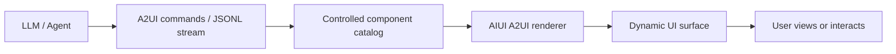

<!-- docs-language-switch -->
<div align="center">
English | <a href="./aiui-a2ui-notes.md">简体中文</a>
</div>
<!-- /docs-language-switch -->

# AIUI A2UI Components and RabiLink Usage Boundaries

This document records the role of A2UI, differences between its currently documented interfaces, and the responsibilities it may and may not assume in RabiLink.

## 1. What A2UI Is

A2UI is a declarative, LLM-friendly Generative UI specification. Instead of generating HTML, WXML, or arbitrary page code directly, a model emits structured commands. The host uses a predefined component catalog and renderer to turn those commands into cards, lists, metrics, images, or other UI fragments.

Typical flow:



Common command phases:

1. `surfaceUpdate`: declares the component structure to render.
2. `dataModelUpdate`: injects data into components.
3. `beginRendering`: tells the host to begin rendering.

A2UI is suitable for controlled dynamic result areas. It does not mean that a model may generate arbitrary application pages.

## 2. What It Is Not

A2UI is not:

- An ASR or TTS engine.
- An Agent message queue or network protocol.
- A complete Agent Loop bound to a Rokid Agent.
- The RabiLink Relay, unified session ledger, or proactive-message channel.
- An arbitrary UI executor that bypasses allowlisted tools and action safety gates.
- A container that replaces `AGENTS.md`, `app.json`, the Page lifecycle, or a business state machine.

The ability of `<a2ui>` to render an AI-described interface does not mean that adding an `agent-id` alone can automatically connect RabiLink to Codex or to the current Rokid Agent.

## 3. Two Currently Documented Interfaces

### 3.1 High-Level Interface on the Component Page

The current component overview uses this example:

```xml
<a2ui
  agent-id="assistant"
  session-id="{{sessionId}}"
  bindmessage="handleMessage"
></a2ui>
```

Its product-level semantics describe a component intended for voice, multi-turn conversation, intelligent task flows, message status, and intelligent action entry points.

### 3.2 Commands Interface in the `aiui-dev` Skill

The `aiui-dev` Skill currently installed in the project gives this runtime interface:

```xml
<a2ui id="agent-view" commands="{{initialUIJson}}" class="agent-surface"></a2ui>
```

```javascript
const ctx = a2ui.createA2UIContext("agent-view");
ctx.write(JSON.stringify([
  { type: "createSurface", surfaceId: "main" }
]));
```

The Skill also states that:

- The initial `commands` payload is consumed only once, when the component instance first renders.
- Dynamic updates are performed through an A2UI runtime context, not by repeatedly changing author-written child nodes.
- Internal update operations include full write, stream open, stream chunk, stream close, and clear.
- The component itself exposes no public WXML events.

## 4. Conclusion About the Documentation Differences

| Item | Component overview | Current `aiui-dev` Skill |
| --- | --- | --- |
| Initial input | `agent-id`, `session-id` | `commands` |
| Page event | `bindmessage` | No public WXML event |
| Dynamic content | High-level description oriented around message streams | Write a command stream through the A2UI runtime context |
| Agent connection semantics | Does not identify the network, model, or authentication source | Describes command rendering only; provides no Agent transport |

This indicates that the different documentation layers or runtime versions may not yet be aligned. Do not mix the two interfaces during development, and do not treat either description as a stable cross-version contract until it has been verified on the target glasses runtime.

The local `@yodaos-pkg/ink` 0.13/0.14 Web SDK also has no publicly searchable `createA2UIContext` export. A browser Ink fixture alone therefore cannot prove that the A2UI runtime is available on the physical device.

## 5. Suitable Use Cases

A2UI is suitable for:

- Cards, lists, metrics, and status blocks generated dynamically by an Agent.
- Result areas updated progressively through JSONL or streamed commands.
- Cross-platform rendering of the same declarative description in multiple hosts.
- Allowing a model to compose local interface fragments through a controlled catalog.
- In-context UI for result types that do not justify a dedicated Page implementation.

A2UI is not suitable for:

- Deterministic core HUD elements such as the RabiLink mode track, time, version, battery, and connection status.
- A persistent page frame that requires strict pixel stability and a fixed FOV.
- Embedding arbitrary third-party web pages or URLs.
- Open-ended full-page generation without a controlled catalog.
- Reliable message persistence, cursor management, retry handling, or the TTS queue.

## 6. Current RabiLink Decision

Version 1.0.23 does not introduce `<a2ui>` into the main page:

1. The core HUD must remain pixel-stable between the `448 x 150` card and the `480 x 352` modal.
2. RabiLink already has explicit contracts for Relay upload, continuous download, persistent cursors, offline retry, and the TTS queue.
3. The configuration assistant requires strict allowlisted tools and real results from the PC. Generative UI cannot replace the action safety gate.
4. The current interface documentation differs in its properties and events, and the target physical-device version has not yet been verified.

The only potential future placement is a dynamic result area. For example, when an Agent returns a structured schedule, metrics, a step list, or a status summary, RabiLink could render an A2UI surface on a separate page or in a controlled region. Branding, mode, connection status, and the device footer would remain under fixed WXML/WXSS control.

## 7. Verification Before Integration

Before changing the product architecture, build a standalone A2UI probe package and verify:

- [ ] Which property set is supported by the target Craft environment and physical device.
- [ ] Whether the initial `commands` payload renders.
- [ ] Whether the runtime context is public and how it is obtained.
- [ ] Whether full write, stream open/chunk/close, and clear work.
- [ ] Whether `bindmessage` actually fires and what the event structure is.
- [ ] Whether the surface redraws completely after a `_current` card expands into `_blank`.
- [ ] Whether streamed updates cause black frames, stale fragments, or high-frequency `setData()` calls.
- [ ] Whether an unregistered catalog component fails safely.
- [ ] Whether the context is released when the page is hidden or unloaded.
- [ ] Whether A2UI content remains readable with the monochrome-green theme and under 125% font stress.

Until this probe is complete, A2UI remains an experimental capability and must not enter the critical path of Connected Conversation.

## 8. Security Constraints

- A2UI commands must not contain tokens, passwords, cookies, or real private-chat content.
- The catalog exposes only reviewed display components and low-risk actions.
- Configuration writes, deletion, outbound delivery, and device control continue through the RabiRoute action safety gate.
- Model-generated titles, descriptions, links, and parameters are treated as untrusted input.
- The command stream has limits on size, depth, component count, and update frequency.
- A rendering failure displays a static `error-state`; it must not make the core HUD disappear.

## 9. Final Conclusion

`a2ui` is a rendering capability that lets an Agent generate controlled declarative UI. It is not a shortcut for invoking a native Rokid Agent. RabiLink may use it as a future dynamic result presentation layer, while ASR, TTS, Agent transport, proactive messages, persistent queues, and configuration safety gates remain the responsibility of the existing AIUI Page plus RabiRoute architecture.
