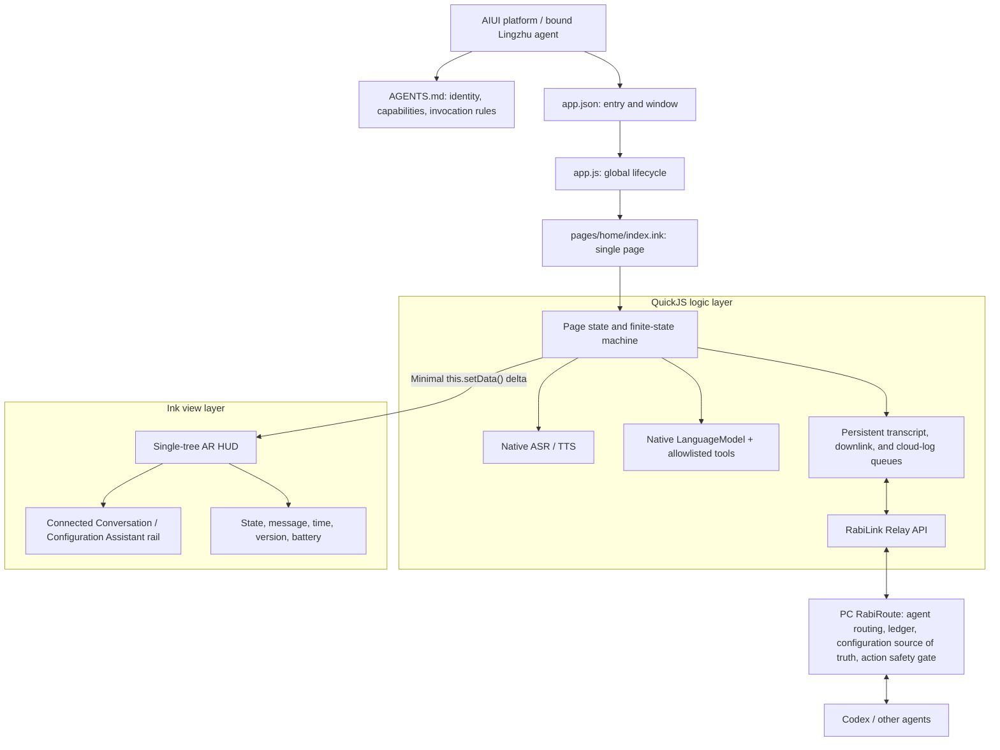
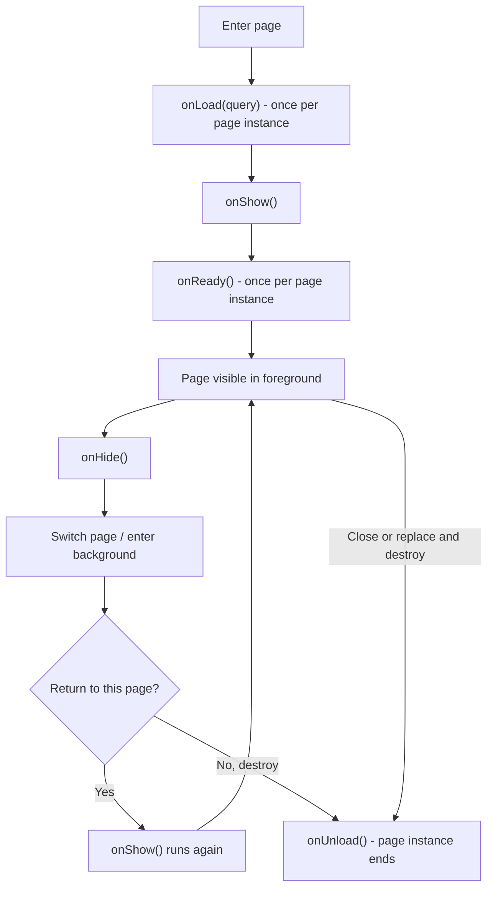
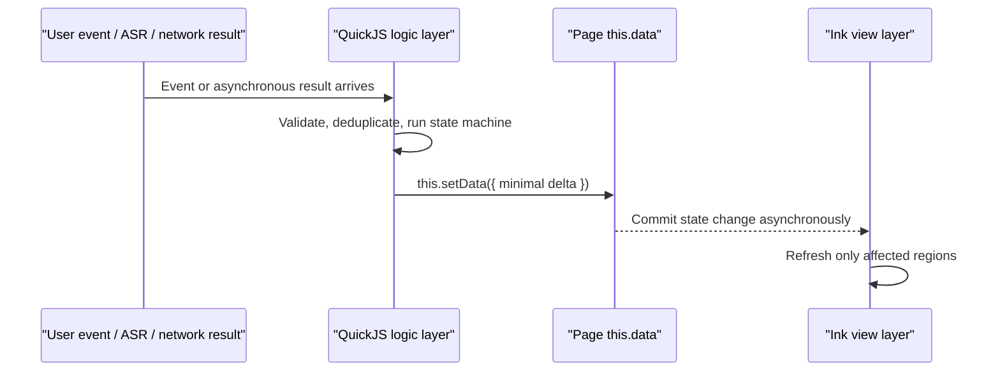
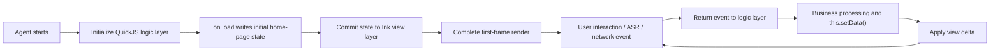

<!-- docs-language-switch -->
<div align="center">
English | <a href="./aiui-framework-and-logic-development.md">简体中文</a>
</div>
<!-- /docs-language-switch -->

# AIUI Framework and Logic Development Notes

This document records the framework model, lifecycle boundaries, state-update rules, debugging methods, and packaging flow that RabiLink AIUI development must follow. It constrains later implementation work: AIUI must not be reduced to an ordinary web page, and the native model inside a page must not be presented as the complete outer Lingzhu agent.

## 1. What AIUI Actually Is

AIUI is a complete agent-application runtime for AI and AR devices, not merely a UI renderer. A runnable AIUI agent consists of four cooperating parts:

| Part | Responsibility | RabiLink file |
| --- | --- | --- |
| Agent description | Defines identity, capabilities, system instructions, and how the platform invokes the agent | `AGENTS.md` |
| Application entry | Defines entry pages and global window configuration | `app.json`, `app.js` |
| Logic layer | Handles state, events, APIs, queues, and business rules in QuickJS | `<script setup>` in `pages/home/index.ink`, plus `utils/` |
| View layer | Renders state into the glasses interface through Ink | `<page>` and `<style>` in `pages/home/index.ink` |

`AGENTS.md` determines how the platform understands and invokes RabiLink. It does not automatically inject the outer agent's memory, variables, or plugins into the page. Likewise, a page-local `LanguageModel` is a native model session; it is not a recursive entry into the complete Agent Loop of the currently bound Lingzhu agent.

### 1.1 The `AGENTS.md` Contract

`AGENTS.md` is the AIUI agent's behavioral manifest and a shared description for machines and developers. Its standard sections include:

| Section | Required content |
| --- | --- |
| Meta Information | Name, version, description, and author or organization |
| System Prompts | Core duties, behavioral constraints, interaction language, and prohibited actions |
| Capabilities | The minimum APIs, devices, storage, and network access actually required |
| Configuration | Parameter names, sources, required status, accepted values, and security boundaries |
| Dependencies | Models, runtime, backend services, and outer-agent dependencies |

Authoring requirements:

1. Instructions must be concrete and verifiable; “help the user intelligently” is not sufficient.
2. Declare capabilities according to least privilege. Do not list unused file, network, device, or write access.
3. Every configuration item must identify its source. Credentials may only reference secure variables and must never appear in the Markdown body.
4. Update the version when user-visible capabilities or behavioral contracts change, and keep it aligned with the release version.
5. Dependency declarations support scheduling and developer understanding; they do not grant host permissions or bypass authentication.
6. The Markdown is read by both the platform and developers, so headings, lists, parameter names, and mode names must remain stable.

RabiLink's actual contract is [`AGENTS.md`](../AGENTS.md) at the AIUI project root. Its detailed invocation rules, message contract, and security boundaries are part of the system instructions and must not be replaced by a short product description.

## 2. RabiLink Target Architecture



Product boundaries:

- **Connected Conversation** owns native glasses ASR, record-first uplink, the continuous downlink queue, and native TTS.
- **Configuration Assistant** sends native ASR results to the page-local `LanguageModel`, which may call RabiRoute configuration APIs through allowlisted tools.
- RabiRoute remains the owner of the unified conversation ledger, configuration source of truth, agent routing, and the safety gate for external actions.
- Proactive intelligence is delivered through RabiRoute's continuous downlink queue. It does not require the glasses to create a user task first.

## 3. Application Registration and Global Lifecycle

AIUI extends the Open Agent Format with runnable application-level definitions. `AGENTS.md`, `app.json`, `app.js`, and `pages/` answer four different questions: “Who is the agent?”, “Where does it start?”, “How does the application run as a whole?”, and “How does a particular interface behave?”

### 3.1 `app.json`: Application Entry and Global Configuration

`app.json` is the declarative application manifest. It mainly defines:

- `pages`: paths of pages in the application; the first item is the default entry page.
- `window`: global background, navigation-bar title, and text style.
- Application extensions: only non-sensitive base values shared across pages.

RabiLink currently has one product page:

```json
{
  "pages": ["pages/home/index"],
  "window": {
    "navigationBarTitleText": "RabiLink AIUI",
    "backgroundTextStyle": "dark",
    "navigationBarBackgroundColor": "#000000",
    "navigationBarTextStyle": "white"
  },
  "rabiLink": {
    "relayBaseUrl": "https://your-relay.example.com",
    "token": ""
  }
}
```

`rabiLink` is this project's build extension. The staging step injects only the public Relay URL, while `token` must remain an empty string. A real token may only be referenced as `rabilinkToken` when the platform invokes the page. It must not be written into `app.json` as supposed “cross-page shared configuration.”

### 3.2 `app.js`: Application-Level Logic

The project root must contain `app.js`, or `app.ink` when an application-level SFC is used. RabiLink currently registers the application from `app.js` through `export default`. This file owns the application-wide lifecycle; it does not host page-specific ASR, polling, or HUD business logic.

Official minimal registration:

```javascript
export default {
  onLaunch(options) {
    // Agent initialization
  },
  onShow(options) {
    // Application becomes visible or returns to the foreground
  },
  onHide() {
    // Application enters the background
  },
  onError(error) {
    // Script error or API failure
  },
  globalData: {
    // Non-sensitive data shared across pages
  }
};
```

| Callback | Trigger | RabiLink rule |
| --- | --- | --- |
| `onLaunch(options)` | Once globally, after application initialization | Perform only lightweight initialization and safe logging; do not start expensive page work |
| `onShow(options)` | On application launch or return to foreground | Restore only application-level resources; each page restores its own ASR and polling |
| `onHide()` | When the application enters the background | Release global resources that should not remain active in the background |
| `onError(error)` | On script or API exceptions | Emit sanitized errors for Inspector/DevTools; never print tokens, raw ASR text, or agent replies |

`globalData` is reserved for genuinely cross-page, non-sensitive data. RabiLink currently has only one page, so most runtime state belongs on the page instance or in persistent queues isolated by token fingerprint, not in the global object.

An `.ink` SFC does not register a page with a module-level `export default`. It defines page logic in `<script setup>` and imports other modules through ESM `import`.

### 3.3 Responsibilities of the Four File Classes

| File | Concern | Must not own |
| --- | --- | --- |
| `AGENTS.md` | Identity, system instructions, capabilities, security boundaries | Page layout or runtime state |
| `app.json` | Page set, default entry, global window | Lifecycle business logic or credential storage |
| `app.js` | Global lifecycle and a very small amount of shared data | Single-page ASR, TTS, or network queues |
| `pages/` | Page state, events, APIs, and view | Changes to the global agent identity contract |

## 4. Page Registration and Lifecycle

A page is the layer that turns AIUI agent identity and capabilities into an actual interaction surface. It hosts page-level data, lifecycle callbacks, event handling, structure, and style.

### 4.1 Two Page Organization Models

| Model | Files | Best use |
| --- | --- | --- |
| Multi-file page | `index.js`, `index.wxml`, `index.wxss`, `index.json` | Configuration, logic, structure, and style maintained separately |
| `.ink` single-file page | Configuration, `<script setup>`, `<page>`, and `<style>` in one file | One page read and edited as a unit |

Both models use the same page `data`, lifecycle, and event semantics. RabiLink's sole maintained source of truth is `pages/home/index.ink`. During the build, it and the local ESM modules are compiled into self-contained `index.js`, `index.json`, `index.wxml`, and `index.wxss` files. This prevents source and generated files from becoming two competing sources of truth.

### 4.2 Two Page Hosting Surfaces

| Semantic target | Usage | Suitable content |
| --- | --- | --- |
| `_current` | Embedded in the current chat window or message stream | Result summaries, status updates, expandable cards |
| `_blank` | Independent window or modal | Complete flows, multi-step work, sustained immersive interaction |

`target` is not a field developers manually declare in the page schema. AIUI chooses the hosting surface from page configuration and invocation intent. An in-chat page may still be expandable into an independent window.

RabiLink is a complete flow combining sustained ASR, a downlink queue, TTS, and a configuration assistant, so its full experience prefers a `_blank` independent window. The platform may first create a `448 x 150` `_current` status card and resize the same InkView to a `480 x 352` modal after the user opens it. These are not two pages, and they must not mount two separate UI trees.

### 4.3 Page Object and Lifecycle

A traditional `.js` page exports a Page configuration object through `export default`. An `.ink` SFC defines equivalent data, callbacks, and methods directly in `<script setup>`.

Minimal traditional multi-file page:

```javascript
export default {
  data: {
    text: "This is page data.",
    user: {
      name: "Rokid"
    }
  },
  onLoad(options) {
    // Page loading
  },
  handleUpdate() {
    this.setData({
      text: "Updated Text",
      "user.name": "New Name"
    }, () => {
      console.log("Data updated");
    });
  },
  handleComplete() {
    this.finish();
  }
};
```

An `.ink` SFC omits that `export default` wrapper, but preserves the same semantics for `data`, lifecycle callbacks, methods, `this.setData()`, and `this.finish()`.

| Property | Type | Required | Description |
| --- | --- | --- | --- |
| `data` | Object | No | Initial data used for the first page render |
| `options` | Object | No | Page component options |
| `onLoad` | Function | No | Page-load callback |
| `onShow` | Function | No | Page-visible or foreground callback |
| `onKeyDown` | Function | No | Page-level key-down event; read the key from `event.code` |
| `onKeyUp` | Function | No | Page-level key-up event; read the key from `event.code` |
| `onVoiceWakeup` | Function | No | Page-level voice-wakeup event; read the keyword from `event.keyword`; the default may be `leqi` |
| `onReady` | Function | No | First-render-complete callback |
| `onHide` | Function | No | Page-hidden callback |
| `onUnload` | Function | No | Page-unload callback |
| Other fields | Any | No | Custom methods or page-instance properties, accessed through `this` in callbacks |

| Callback | Framework semantics | Current RabiLink responsibility |
| --- | --- | --- |
| `onLoad(query)` | Page loads, once per page instance | Parse invocation parameters, create adapters and lightweight first-frame state, and register deferred startup work |
| `onShow()` | Page is shown or returns to foreground | Restore device state, ASR, pending transcript synchronization, downlink polling, and pending speech |
| `onReady()` | First render completes, once per page instance | May signal first-frame completion, but cannot be the only startup entry |
| `onHide()` | Page enters background | Stop ASR, TTS, device polling, and timers; persistent queues must remain intact |
| `onUnload()` | Page is destroyed | Remove every timer and listener and dispose of model sessions and speech objects |

The official lifecycle order is fixed:



Invocation-count boundaries:

- `onLoad()` runs once per page instance and may read page-open parameters.
- `onShow()` runs on first display and every return to the foreground.
- `onReady()` runs once per page instance; its official meaning is that the first frame is ready.
- `onHide()` runs whenever the page leaves the foreground while its instance remains alive.
- `onUnload()` runs once when the page is actually destroyed; resources from the old instance must not be accessed afterward.

Expanding a `_current` card into a `_blank` modal may only resize the same InkView. It does not necessarily create a new Page and must not be assumed to rerun `onLoad()` or `onReady()`. RabiLink handles actual lifecycle events and surface resize as separate signals.

Some Craft/Ink preview paths have been observed not to fire `onReady()` reliably. This is a host-runtime deviation, not a change to the official contract above. The current startup code therefore combines “register a short deferred task in `onLoad()`” with “call the same idempotent entry from `onReady()`.” Relay or ASR startup is never attached exclusively to `onReady()`. In DevTools, inspect the `page:onLoad/onShow/onReady/onHide/onUnload` logs to verify the real order.

### 4.4 Page Events

RabiLink uses three classes of page-level input:

| Event | Current behavior |
| --- | --- |
| `onKeyDown(event)` | Records immediate key input only; does not suppress host defaults |
| `onKeyUp(event)` | Switches mode, requests immediate review, or retries failed speech; calls `preventDefault()` only after taking ownership |
| `onVoiceWakeup(event)` | Reclaims ASR ownership for the current mode while the page is in the foreground |

`onVoiceWakeup` means the host supplied a wake event. It does not mean every RabiLink utterance must begin with “Leqi.” On real glasses, Connected Conversation continues controlled ASR rounds while the page remains in the foreground. Only the Craft browser, which has no real device identity, requires the debug microphone to trigger an interaction wakeup first.

#### Default Host Key Behavior

| `event.code` | Common Rokid Glasses meaning | Host behavior when not intercepted | RabiLink mapping |
| --- | --- | --- | --- |
| `Backspace` | Back | Go back or request application close | Preserve the default in Connected Conversation; return to Connected Conversation from Configuration Assistant |
| `ArrowUp` | Up | Scroll the root view | Configuration Assistant takes ownership and switches to Connected Conversation |
| `ArrowDown` | Down | Scroll the root view | Connected Conversation takes ownership and switches to Configuration Assistant |
| `Enter` | Confirm | Enter navigation mode or activate a target | Connected Conversation requests immediate agent review |
| `GlobalHook` | Glasses-temple touch | Defined by the device host | Connected Conversation requests immediate agent review or retries TTS |

Some hosts may also report `ArrowLeft` and `ArrowRight`. RabiLink normalizes right to entering Configuration Assistant and left to returning to Connected Conversation.

`event.preventDefault()` is called only when the page actually takes ownership of an event. Otherwise, the host continues its default behavior after the callback. Whether interception is permitted and what the exact default is remain host implementation details. `onKeyDown` is best suited to immediate feedback; RabiLink does not seize back, scroll, or confirm behavior at key-down time.

### 4.5 Page Instance Methods and Data Constraints

#### `this.setData(data, callback?)`

- `data` accepts plain keys and path updates, such as `{ "user.name": "New Name" }`.
- `callback` runs after that data commit completes and is suitable for lightweight work that genuinely depends on the view commit.
- Do not chain callbacks into a long-running business queue. Network, ASR, TTS, and model state remain governed by explicit state machines.

#### `this.finish()`

`finish()` tells the system that the current page task is complete:

- A Cut agent actively returns focus and exits its current display state.
- A Scene agent usually uses it to end a specific interaction flow.

RabiLink is a continuously connected Scene page. It must not call `finish()` when switching between Connected Conversation and Configuration Assistant, because doing so would eject the user and discard the current HUD, ASR ownership, and downlink state. A normal mode change updates the same Page instance.

#### `data` Serialization

Initial page `data` is sent from the logic layer to the render layer as JSON. It may contain only JSON-serializable strings, numbers, booleans, objects, arrays, and `null`. Functions, timers, model objects, `SpeechRecognition` instances, `Set` values, promises, and host handles belong on the page instance (`this`), never in `data`.

## 5. Page Update Mechanism

The AIUI page-update loop is:



The page instance provides:

- `this.data`: reads current page state.
- `this.setData(data, callback)`: updates logic-layer state asynchronously and sends the delta to the view layer.
- `this.route`: currently documented as unsupported; business logic must not depend on it.

RabiLink must follow these `setData()` rules:

1. Combine one business event into one minimal delta update whenever possible.
2. Do not resubmit unchanged fields from high-frequency timers.
3. Network, ASR, TTS, and model callbacks must verify the current generation, mode, and page visibility before updating the UI.
4. A mode switch replays only the HUD fields it needs; it does not unmount the whole view tree.
5. Never fake a “refresh” by hiding the full frame. That causes visible flicker on the glasses.
6. `setData()` commits the view asynchronously. Heavy work that depends on completion of the first frame or mode frame must begin in a later phase, not immediately and synchronously after the call.

## 6. User Interface Development

AIUI uses WXML for view structure and WXSS for styles, rendered by the Ink/JSAR engine. An `.ink` SFC keeps logic, structure, and styles in one maintained file, while its structure still follows WXML/WXSS binding and event semantics.

### 6.1 WXML Structure

| Capability | Syntax | Rule |
| --- | --- | --- |
| Data binding | `{{title}}` | Bind only serializable page state; do not embed complex business computation in templates |
| List rendering | `ink:for="{{items}}"`, `ink:key="id"` | Use a stable unique key to avoid rebuilding a whole list on queue updates |
| Conditional rendering | `ink:if`, `ink:elif`, `ink:else` | Suitable for small conditional blocks; avoid repeatedly mounting large top-level condition trees in the glasses HUD |
| Event binding | `bindtap="handleTap"` | Send the event to the logic layer, then update the view with a minimal `setData()` delta |

Example:

```xml
<view class="statusList">
  <view class="statusRow" ink:for="{{items}}" ink:key="id" bindtap="handleItemClick">
    <text>{{index + 1}}. {{item.name}}</text>
    <text ink:if="{{item.status === 'active'}}" class="statusActive">Active</text>
  </view>
</view>
```

RabiLink's two modes are not two mutually exclusive page trees. The implementation retains one shared HUD and replaces only mode labels, state, and message fields. This avoids stale-tree residue, overlapping text, or black frames after Ink resize.

### 6.2 WXSS Styling

WXSS supports common class, ID, element, and pseudo-element selectors, plus `@import`, `style`, and `class`. General AIUI pages may use `rpx` for responsive layout; the framework defines the logical screen width as `480rpx`.

```css
.statusRow {
  display: flex;
  justify-content: space-between;
  padding: 12rpx 16rpx;
  border-radius: 8rpx;
}

.statusActive {
  color: #40ff5e;
  font-size: 24rpx;
}
```

RabiLink must reproduce Craft's resize from a `448 x 150` card to a `480 x 352` Interactive InkView precisely. Its main HUD therefore uses a stable 480-unit logical width, CSS variables, and dimensions verified by pixel regression. Do not mechanically replace every `px` with `rpx`. New pages may prefer `rpx`, but changes to the existing HUD must be verified in both card and immersive sizes.

The monochrome Rokid glasses interface must also follow these rules:

- Use a pure black background and one luminous green channel; establish hierarchy with opacity, borders, and type scale.
- Do not communicate state through red versus blue. State must also have a textual or structural distinction.
- Give text stable width and height. The longest state must not push aside the brand, mode rail, time, version, or battery.
- Avoid decorative animation, frequent shadow changes, and large-area repainting.
- Organize AR HUD information upward from the lower edge to reduce obstruction of the real-world view.

### 6.3 UI Runtime Mechanism



The goal is not merely to draw a page. Agent state, network state, and speech state must map to stable, explainable, local visual feedback.

See [AIUI Visual Design and Theme Tokens](aiui-visual-design-system_en.md) for the visual theme and complete token table.

See [AIUI Interaction Design and RabiLink Input Contract](aiui-interaction-design_en.md) for speech, temple-touch, key feedback, and the FOV safe area.

### 6.4 The `view` Container

`view` is AIUI's basic layout container, comparable to an HTML `div`. It can nest other components and supports Flexbox, backgrounds, borders, margins, padding, dimensions, and the standard box model.

```xml
<view class="container">
  <view class="item"><text>Item 1</text></view>
  <view class="item"><text>Item 2</text></view>
</view>
```

```css
.container {
  display: flex;
  flex-direction: column;
}

.item {
  padding: 8rpx 12rpx;
  border: 1rpx solid rgba(64, 255, 94, 0.6);
}
```

RabiLink uses its `view` containers as follows:

| Container | Responsibility |
| --- | --- |
| `pageScroll` / `page` | Fixed AIUI surface and global black background |
| `unifiedModeHud` | The single HUD root shared by card and immersive window |
| `compactHeader` | Brand and LIVE/TTS/AI state |
| `modeSwitch` | Two-segment mode rail and moving thumb |
| `compactStatusRow` | Current user text and runtime state |
| `compactConversation` | Agent reply or Configuration Assistant result |
| `compactDeviceFooter` | Time, mode hint, version, and battery |

Rules:

1. `view` owns structure and layout; visible copy belongs in `text` to avoid host differences in raw-text layout.
2. A fixed HUD should use shallow Flexbox. Do not create layers of empty containers for decoration.
3. Dimensions, flex tracks, and text regions need stable constraints so state changes cannot expand the root layout.
4. A tappable container uses `bindtap` and provides a stable hit area. Glasses-key behavior remains in page-level handlers.
5. The RabiLink home page does not use a scrolling root for mode switching, avoiding conflict between `ArrowUp/ArrowDown` default scrolling and mode gestures.
6. Card and immersive window must reuse the same root `view` tree, not maintain separate interfaces.

### 6.5 The `text` Component

`text` displays copy, much like an HTML `span` or `p`. It supports font size, color, weight, wrapping, and alignment.

```xml
<text class="title">Hello World</text>
```

```css
.title {
  color: #40ff5e;
  font-size: 28rpx;
  font-weight: 600;
  text-align: left;
}
```

Rules:

1. `view` owns structure, dimensions, and Flexbox layout; all visible copy belongs in `text`.
2. Bind dynamic copy with Mustache syntax, for example `<text>{{statusText}}</text>`. Values must be serializable.
3. For wrapped text, give the parent a stable width and reserve predictable height. Long messages must not displace the mode rail, time, version, or battery.
4. Live ASR and streaming replies update only the fields whose text changed; do not rebuild the full text container at high frequency.
5. On single-green glasses, convey hierarchy with type size, weight, opacity, and position instead of multicolor text.
6. Use short but complete critical statuses, such as “PC offline - saved,” instead of relying only on an icon or color.

Brand, mode, status, reply, time, and version all use `text` in the RabiLink HUD. Content that exceeds its fixed region must first be condensed into a HUD-sized summary. Long reading belongs on an independent page or scrolling view; it must not grow the persistent lower-edge HUD indefinitely.

### 6.6 The `scroll-view` Component

`scroll-view` provides horizontal or vertical scrolling when content exceeds the viewport. It supports touch, mouse dragging, the wheel, and automatic scrolling.

```xml
<scroll-view class="scrollContainer" scroll-y="true">
  <view class="item"><text>Item 1</text></view>
  <view class="item"><text>Item 2</text></view>
  <view class="item"><text>Item 3</text></view>
</scroll-view>
```

| Property | Type | Default | Description |
| --- | --- | --- | --- |
| `scroll-x` | Boolean | `false` | Enable horizontal scrolling |
| `scroll-y` | Boolean | `false` | Enable vertical scrolling |
| `scroll-top` | Number | - | Set vertical scroll position |
| `scroll-left` | Number | - | Set horizontal scroll position |
| `scroll-into-view` | String | - | Scroll to an element with the specified ID |
| `auto-scroll` | Boolean | `false` | Enable automatic scrolling |
| `scroll-speed` | Number | `25.0` | Automatic scroll speed |
| `scroll-direction` | String | `vertical` | Automatic direction: `vertical` or `horizontal` |

Boundaries:

- Long lists, log history, search results, and multi-step forms are suitable for `scroll-view`.
- Fixed status cards, mode rails, live captions, and device footers should not be placed in an auto-scrolling container.
- With directional-key navigation, the page must explicitly choose between host scrolling and interception in `onKeyUp`; both must not run.
- `auto-scroll` continuously moves the viewport and is unsuitable for an AR HUD the user needs to read steadily. Use it only for deliberately moving content.
- `scroll-into-view` depends on stable, unique element IDs. List updates must not reuse an ID.

RabiLink's current `pageScroll` is only a historical CSS class name; the element is an ordinary `view` and does not scroll. The home page intentionally remains a single-screen lower-edge HUD within `480 x 352` and avoids `scroll-view` because:

1. `ArrowUp` and `ArrowDown` already switch modes and cannot also scroll the root view.
2. In Ink 0.13, a complex scroll tree previously blocked the event loop and left stale pixels when a card reused and resized the same InkView.
3. Connected Conversation must keep mode, reply, time, version, and battery visible at all times.

If later work adds full log browsing or a long configuration form, create a page with an independent responsibility or an explicit full-screen browsing state, then use `scroll-view` only in its content region. Do not insert a scroll tree back into the persistent HUD.

### 6.7 The `error-state` Component

`error-state` presents an exception, empty result, or failure and tells the user what happened, whether recovery is possible, and what to do next.

```xml
<error-state
  title="Loading failed"
  description="Check the network and try again"
></error-state>
```

Suitable cases:

- Critical page data failed to load and the main content cannot continue.
- A successful query returned no results and needs an explicit empty state.
- A required capability is unavailable and blocks the current flow.
- An action failed and the user must retry, go back, or reconfigure.

Copy rules:

1. `title` states the outcome, such as “Connection failed,” rather than merely “Error.”
2. `description` gives a reason or next action, such as “PC Rabi is offline; speech is saved on the glasses.”
3. Do not display stack traces, HTTP bodies, tokens, internal device IDs, or developer jargon.
4. A recoverable state must say whether data was saved, preventing duplicate user actions.
5. When paired with an action component, prefer temple-touch or confirm-key semantics on glasses instead of several small buttons.

RabiLink boundaries:

| State | Full-page `error-state`? | Presentation |
| --- | --- | --- |
| PC temporarily offline; observation saved | No | Persistent HUD shows “PC offline - saved” and retries in the background |
| Short Relay network interruption | No | Persistent HUD shows “Network interrupted - saved” |
| One ASR round fails and will retry | No | HUD status row shows a countdown or recovery state |
| No token; waiting for agent binding | No | Incomplete configuration, not an application exception |
| A required runtime capability is permanently unavailable, blocking both modes | Yes | Clear title and reason plus a back or retry entry |
| Independent log page successfully queries but has no records | Yes | Empty-result state, not a fake loading error |

The RabiLink home page is a continuously connected HUD. Transient errors must not unmount the HUD or switch rapidly between an error component and the main page through `ink:if`. Doing so would reintroduce flicker, stale text, and lost mode state. A blocking error page is a stable, infrequent, explainable terminal state.

### 6.8 The `lottie-view` Component

`lottie-view` renders Lottie JSON animations exported by tools such as After Effects.

```xml
<lottie-view
  src="assets/animation.json"
  auto-play="true"
  loop="true"
  speed="1.0"
  width="200"
  height="200"
></lottie-view>
```

| Property | Type | Default | Description |
| --- | --- | --- | --- |
| `src` | String | `""` | Local path or URL for the Lottie JSON |
| `auto-play` | Boolean | `true` | Start automatically after load |
| `loop` | Boolean | `true` | Restart after playback completes |
| `speed` | Number | `1.0` | Playback-speed multiplier |
| `progress` | Number | - | Manually control progress from `0.0` to `1.0` |
| `width` | Number | - | Animation-region width |
| `height` | Number | - | Animation-region height |

The current `lottie-view` exposes no public load-complete, playback-complete, or error event to WXML/JS. Therefore:

- Never wait for “animation completed” before starting ASR, requesting Relay, changing mode, or finishing the page.
- When deterministic timing is required, business state remains controlled by Page lifecycle callbacks, promises, timers, and explicit callbacks.
- Prefer packaged local JSON so a remote-resource failure cannot become an unobservable page failure.
- Set stable width and height so resource loading cannot shift the HUD.
- Do not drive `progress` through high-frequency `setData()` calls; that merely moves animation cost into the logic layer and cross-layer communication.

RabiLink does not use Lottie in its persistent HUD:

1. A continuously looping animation consumes rendering time, CPU, and battery.
2. Large motion in an AR field of view distracts from the quiet lower-edge HUD.
3. A monochrome green device cannot preserve animation designs that depend on multicolor hierarchy.
4. Text, borders, a LIVE marker, and limited state transitions already communicate current product state.
5. Real-device flicker and partial-repaint defects have occurred before; unnecessary animation sources should not be added.

Consider Lottie only for an independent, short, non-critical brand transition or waiting page. Use fixed dimensions, `loop="false"`, low motion, and a business flow with its own timeout. If animation is unavailable, the user must still see a static state and continue.

### 6.9 The `canvas` Component

`canvas` provides a 2D drawing surface comparable to HTML5 Canvas for shapes, paths, text, and bitmaps drawn by script.

```xml
<canvas id="myCanvas" width="300" height="150"></canvas>
```

```javascript
const canvas = this.selectComponent("#myCanvas");
const ctx = canvas.getContext("2d");

ctx.fillStyle = "#40ff5e";
ctx.fillRect(10, 10, 150, 75);
```

| Property | Type | Default | Description |
| --- | --- | --- | --- |
| `width` | Number | `300` | Drawing-buffer width in pixels |
| `height` | Number | `150` | Drawing-buffer height in pixels |

Usage notes:

- Obtain the component with `this.selectComponent("#id")` and then call `getContext("2d")`.
- Drawing follows the standard Web Canvas 2D model; consult AIUI Canvas API documentation for the exact supported subset.
- `width` and `height` define the drawing buffer and must be verified together with display size and device-scaling strategy.
- Canvas content does not participate in Mustache binding. When page state changes, application code must clear and redraw the affected region.
- Drawing objects, contexts, and bitmap handles belong on the page instance, not in JSON-serialized `data`.
- Initialize drawing only after the component exists. Do not assume the view component has been created during `onLoad()`.

Suitable Canvas cases:

- Live curves, simple charts, and custom gauges.
- Geometries that cannot be composed from basic components.
- Bitmap composition or annotation layers requiring pixel-level control.
- Low-frequency, local, fixed-size custom drawing.

Unsuitable Canvas cases:

- Standard HUD elements such as ordinary text, state labels, mode switching, time, and battery.
- Interfaces requiring automatic layout, data binding, and stable hit areas.
- Simulating a component tree through frequent full-canvas repainting.
- Inventing a “live audio waveform” without a raw-audio sample API. An AIUI ASR result is not PCM or volume data.

#### RabiLink Boundary

The RabiLink HUD continues to use `view`, `text`, and WXSS rather than declaring a page-level `canvas`:

1. Basic components provide more stable text layout, local updates, and event regions.
2. Manual full-canvas redraw increases CPU, power, and flicker risk on a persistent page.
3. Card-to-modal resize requires reliable reflow, while Canvas would require application-managed scaling and clearing.
4. The current battery icon, clock, and mode rail can all be built from lightweight view components.

The Craft/Ink host itself renders the entire AIUI page into an outer Canvas. Project tests use `getImageData()` on that host Canvas for pixel acceptance. This is separate from declaring a `<canvas>` component inside the page and does not imply that the page uses Canvas APIs.

If a later feature adds a chart or sensor visualization, put Canvas in a fixed-size independent region, repaint only when data changes, and preserve numeric values and errors in ordinary `text`.

See [AIUI Canvas 2D API Quick Reference](aiui-canvas-2d-reference_en.md) for the complete property and method tables.

See [AIUI A2UI Components and RabiLink Boundaries](aiui-a2ui-notes_en.md) for declarative UI generation, API-version differences, and integration prerequisites.

See [AIUI Global Runtime APIs and RabiLink Boundaries](aiui-global-runtime-reference_en.md) for `window`, timers, Base64, Fetch, Response, and other globals.

## 7. Runtime Paths for the Two Modes

### Connected Conversation

```text
Final AIUI SpeechRecognition text
  -> local persistent transcript queue
  -> Relay observation
  -> unified PC RabiRoute conversation ledger
  -> Codex idle review or immediate temple-touch guidance
  -> Relay continuous downlink queue
  -> persistent pending-speech queue on glasses
  -> native AIUI TTS
```

When the PC is offline or the network is interrupted, transcripts remain in local glasses storage. The HUD must explicitly say that speech was saved and retry automatically. A failure that exists only in server logs while the user sees no response is not acceptable.

### Configuration Assistant

```text
Complete original AIUI SpeechRecognition utterance
  -> page-local native LanguageModel
  -> execute_configuration_action allowlisted tool
  -> Relay / WebGUI configuration API
  -> successful PC result
  -> HUD + native AIUI TTS
```

The model may select only an existing allowlisted action. Until the page receives a successful PC result, it must not claim that configuration is complete.

## 8. AIUI DevTools Debugging Conventions

Use AIUI DevTools first during development. Official documentation states that, when Inspector is enabled, `console.log/info/warn/error/debug` output is mirrored to Chrome DevTools or a compatible debugger. The Performance panel can inspect FPS, memory, and `setData` cost.

RabiLink currently focuses on these stage logs:

| Log | Meaning |
| --- | --- |
| `transcript-sync:start` | Begin uploading one local observation |
| `transcript-sync:stored` | Relay/PC accepted and stored that observation |
| `transcript-sync:failed` | PC offline or network failed; the local queue remains intact |
| `transcript-sync:retry` | A scheduled retry begins |

Check all of the following during debugging:

- Console: exceptions, lifecycle order, and queue state.
- Network: Relay status, latency, and failure reason.
- Storage: persistence of pending observations, cursor, pending speech, and cloud-log queue.
- Performance: high-frequency `setData()`, long tasks, black frames, and continuously growing memory.
- Real hardware: temple touch, ASR, TTS, Bluetooth proxying, battery, and power consumption must be validated on actual glasses.

Logs may contain only stage, anonymous ID, sequence number, count, mode, and sanitized error information. Tokens, passwords, complete ASR text, configuration utterances, and agent replies are prohibited.

## 9. AIX Packaging and Inspection

### Official `aix` CLI

When the official command has been installed from AIUI source containing `packages/aix-cli`:

```powershell
cargo install --path packages/aix-cli
aix pack <source-directory>
aix pack <source-directory> -o my-agent.aix
aix pack <source-directory> --optimize
aix pack <source-directory> -O --opt-level 3
aix list <AIX-file>
aix ls <AIX-file>
```

RabiLink must not package the development project root, including scripts and local modules, as the release artifact. Generate the single Craft staging directory first, then pass it to the official CLI:

```powershell
$env:RABILINK_AIUI_RELAY_URL = "https://your-relay.example.com"
npm run craft:staging
aix pack .\dist\craft-upload -o .\dist\rabilink-aiui.aix --optimize
aix list .\dist\rabilink-aiui.aix
Remove-Item Env:RABILINK_AIUI_RELAY_URL
```

A real token is never written to an environment variable, source file, staging directory, or AIX package. At runtime the page may only reference the agent memory variable `rabilinkToken`.

The project-root `.aixignore` must exclude at least:

```text
node_modules/
dist/
.git/
*.log
*.tmp
*.bak
*.local.*
*.secret.*
package-lock.json
```

### Current Project Compatibility Flow

As of 2026-07-16, this machine has Cargo but no `aix` executable, and the currently checked-out public AIUI source does not contain `packages/aix-cli`. Until official CLI source is available, the project continues to use:

```powershell
npm run package:aix
node .\scripts\Audit-RabiLinkAiuiAix.mjs --aix .\dist\rabilink-aiui.aix
```

This compatibility flow produces a deterministic AIX and uses the official `@yodaos-pkg/aix` reader to verify the file list, page schema, `VERSION`, and package contents. Once the official CLI is available, replace the packaging step but retain the current audit and privacy checks.

## 10. Current Conclusions

- AIUI is a complete agent-application framework, not an isolated page component and not the outer Lingzhu agent itself.
- RabiLink's two modes must switch within one page and one stable HUD tree.
- The page-local native model interprets configuration intent; Codex or another agent provides broader proactive intelligence through RabiRoute.
- Foreground AIUI may continue controlled transcription rounds, but a hidden or unloaded page must not pretend to be a system-level always-on recording service.
- Every asynchronous result must map to visible state. A server failure must not exist only in cloud logs.
- DevTools supports development diagnosis; final UI, performance, temple-touch, ASR, and TTS quality must be validated on real glasses.

## 11. Official Resources

- [AIUI Quick Start](https://js.rokid.com/AIUI/guide/quickstart?lang=zh-CN)
- [AIUI Developer Tools and Skills](https://github.com/jsar-project/AIUI)
- [AIUI Debugging](https://github.com/jsar-project/AIUI/blob/main/documentation/5-tools/debug.md)
- [AIUI Console API](https://github.com/jsar-project/AIUI/blob/main/documentation/3-api/console.md)
- [AIUI CLI](https://github.com/jsar-project/AIUI/blob/main/documentation/5-tools/cli.md)
