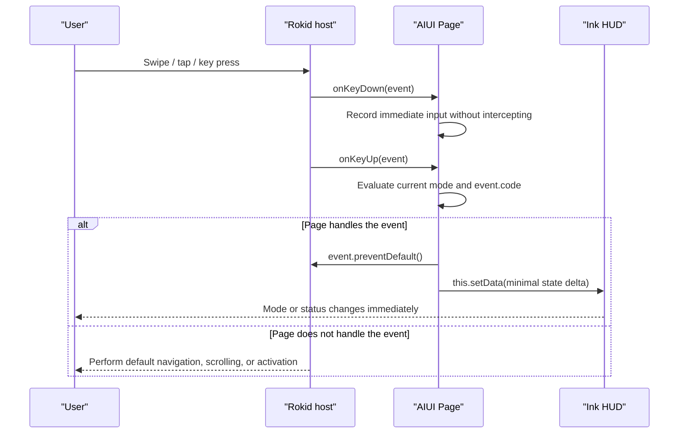
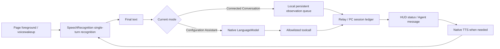

<!-- docs-language-switch -->

English | <a href="./aiui-interaction-design.md">简体中文</a>

<!-- /docs-language-switch -->

# AIUI Interaction Design and the RabiLink Input Contract

This document records principles for voice, temple touch, button, and spatial interactions on Rokid Glasses, and defines the input and feedback contract for RabiLink's two modes.

## 1. Design Principles

| Principle | Requirement |
| --- | --- |
| Voice first | Natural language is the primary Agent input; touch is limited to switching, confirmation, and recovery |
| Timely feedback | Every action intercepted by the Page must produce visible state; use TTS additionally for important results |
| Safe field of view | Keep core status in a comfortable FOV, arranged upward from the lower edge without blocking the center of the real-world view |
| Reversible operation | Mode switches and browsing actions can return immediately; high-risk configuration still requires confirmation through the RabiRoute safety gate |
| State continuity | Network failure, Page hiding, or TTS interruption must not silently lose observations or downstream messages |
| Host cooperation | Intercept only events actually handled by the Page; return all other navigation, scrolling, and closing behavior to the host |

## 2. Rokid Glasses Interaction Methods

### 2.1 Voice Input

Voice is RabiLink's primary input:

- `Connected Conversation`: final native ASR text enters the persistent observation queue and is then synchronized to the PC-side Rabi session ledger.
- `Configuration Assistant`: the complete native ASR utterance is passed to the in-Page `LanguageModel`, which selects a configuration action through allowlisted tools.
- `onVoiceWakeup`: used when the host wakes or restores recognition ownership for the current mode. It does not mean that every utterance requires a wake phrase.
- Agent replies and proactive messages enter the same persistent TTS queue. RabiLink releases ASR during TTS and restores it after playback.

RabiLink does not play a confirmation sound for every ASR segment, which would add noise and TTS feedback during continuous conversation. The HUD gives immediate feedback for recognition state, saved state, synchronization, and failed retries.

### 2.2 Temple Swipes

Swipes are suitable for mode switching, list scrolling, and parameter adjustment. Because the RabiLink main HUD has no scrolling list, directional input is dedicated to its two product modes:

| Current mode | Input | Result |
| --- | --- | --- |
| Connected Conversation | `ArrowDown` / `ArrowRight` | Switch to Configuration Assistant |
| Configuration Assistant | `ArrowUp` / `ArrowLeft` | Switch to Connected Conversation |
| Configuration Assistant | `Backspace` | Switch to Connected Conversation |

The switch occurs within the same Page and the same HUD tree. It does not call `finish()` and does not require the user to tap "Enter" again.

### 2.3 Clicks, Taps, and Temple Touch

| Input | Connected Conversation | Configuration Assistant |
| --- | --- | --- |
| `Enter` | Ask the Agent to review immediately; retry first if TTS is blocked | Reserved for the current configuration interaction or the host |
| `GlobalHook` | Same as a tap: request immediate review or retry speech | Reserved for the current configuration interaction or the host |
| Mode-track `bindtap` | Select a mode directly in Craft or another clickable host | Select a mode directly in Craft or another clickable host |

A tap is not a pause-recording button. It only sends a "review now" prompt to the current Codex task; ASR and the continuous downstream queue remain online.

### 2.4 Back Navigation

- `Backspace` in Connected Conversation is not intercepted, allowing the host to go back or close the application.
- `Backspace` in Configuration Assistant is handled by the Page and first returns to Connected Conversation.
- The Page enters `onUnload()` only when it is actually closed or destroyed by the system.

### 2.5 Head Tracking and Spatial Positioning

Head tracking is useful for following motion, spatial anchoring, and viewpoint adjustment in a 3D scene, but tracking stability must be balanced against comfortable observation of the real world.

RabiLink is currently a 2D screen-space HUD:

- It is fixed in the lower safe field of view and does not occupy the central observation area.
- It does not call 6DoF, spatial-anchor, or head-tracking APIs.
- It does not claim that the HUD is world-locked, head-locked, or spatially tracked.
- Before future spatial integration, drift, latency, motion sickness, and readability across postures must be verified on a physical device.

## 3. Input-to-Feedback Flow

### 3.1 Touch and Buttons

### 3.2 Voice

## 4. Feedback Design

### 4.1 Visual Feedback

Every action handled by the Page must update a field visible to the user:

| Action | Minimum feedback |
| --- | --- |
| Mode switch | Slider thumb, active-mode text, and status copy change together |
| Recognition starts | LIVE status and "Listening" |
| ASR completes | Show the last accepted text segment |
| Synchronizing | Show "Synchronizing record" |
| PC offline | Show "PC offline - saved" and explain automatic retry |
| Review requested | Show "Notifying Agent to review the record" |
| Agent downstream message | Show text immediately, then enqueue TTS |
| Configuration execution | Show the real understanding, execution, success, or failure phase |

Status copy must come from the actual state machine. Do not show success before waiting for the API result.

### 4.2 Audio Feedback

- Agent results and important configuration results may use TTS.
- Do not speak every mode swipe, ordinary key press, or ASR segment; that would interrupt the user and create feedback.
- Release ASR before TTS starts and restore it after completion or a watchdog timeout.
- If TTS fails, retain the message and show a visible retry state.

### 4.3 Failure Feedback

- Keep short-lived failures in the persistent HUD instead of replacing the entire Page with an error tree.
- State whether the content has already been saved on the glasses.
- During automatic retries, show the current waiting state without flashing or playing sound for every attempt.
- Use `error-state` only for blocking failures.

## 5. FOV Safe Area

RabiLink shares an 87px-high HUD between the `480 x 352` modal and the `448 x 150` card:

- It is absolutely positioned at the lower edge of the surface with `bottom: 16px`.
- HUD content is `424px` wide, fitting the safe width of the narrower card.
- Information grows upward from the bottom and does not cover the central field of view.
- Branding, mode, status, reply, time, version, and battery remain on fixed tracks.
- Long text is truncated or wrapped inside a controlled region and must not displace adjacent status fields.

A safe area is not defined only by whether pixels cross a boundary. Physical-device checks must also cover:

- Green-text contrast in bright and dark surroundings.
- Readability while the user walks or turns their head.
- Binocular fusion, reading distance, and FOV comfort.
- Overlap under 125% font stress.
- Whether animation, flashing, or frequent state changes interfere with real-world observation.

## 6. Interaction Checklist

- [ ] Voice is the primary input and the number of touch operations stays minimal.
- [ ] Every intercepted action has immediate visible feedback.
- [ ] `preventDefault()` is used only after `onKeyUp` confirms that the Page handles the event.
- [ ] Backspace in Connected Conversation returns control to the host correctly.
- [ ] Backspace in Configuration Assistant returns to Connected Conversation without closing the entire application.
- [ ] A mode switch does not call `finish()` or rebuild the Page.
- [ ] Messages are saved first and clearly reported when the PC or network is offline.
- [ ] TTS and ASR do not compete for the microphone concurrently.
- [ ] The HUD is in a comfortable FOV and does not obscure the primary view.
- [ ] Unimplemented head-tracking and spatial capabilities are not documented as supported.
- [ ] Swipe directions, taps, GlobalHook, and host default behavior are verified on a physical device.
