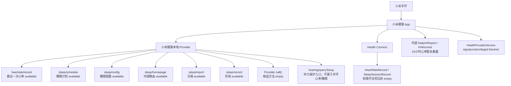

# RabiLink Android 应用

<!-- docs-language-switch -->
<div align="center">
<a href="./README_en.md">English</a> | 简体中文
</div>
<!-- /docs-language-switch -->

> 状态：实验应用。这里是 RabiLink 手机伴侣与内嵌眼镜前端的正式 Android 工程，同时保留小米健康、Rokid 和 ADB 高级诊断能力；部分硬件链路仍需真机验收。

这是 RabiLink 的 Android 端产品工程。用户只安装手机 APK；工程会同时构建随手机分发、由 CXR 工作流安装到眼镜的前端 APK。硬件探针保留在应用的高级诊断入口中，不再用 `examples/` 身份承载产品代码。

当前手机 APK 包名为：

```text
com.rabi.link
```

## 当前产品主线（2026-07-20）

本工程现在同时构建一个手机伴侣和一个眼镜前端：

```text
眼镜 com.rabi.link.glass
  <-> 只传音频/媒体和状态
手机 com.rabi.link
  <-> 保存 Relay、目标 PC、cursor 与眼镜设置
RabiLink Relay
  <-> Rabi PC 眼镜消息端完成 ASR、TTS、Agent 和动作门
```

- 眼镜默认入口是 `GlassAudioClientActivity`；`glass-app/` 是眼镜应用模块，眼镜主链只负责音频、媒体、状态与 HUD，不在本地运行 ASR/TTS。
- 手机日常首页是会话列表，点一个启用了 RabiLink 消息端的人格进入聊天，返回后可继续选择其他人格；设置、健康和眼镜能力保持独立入口。
- 手机后端将眼镜 PCM 送到 Rabi PC ASR，把 observation 写入消息端；下行文本由 Rabi PC TTS 合成后以 PCM 发回眼镜。
- 眼镜 HUD 使用“连接 / 聆听 / 上传 / 播报 / 暂停 / 异常”状态角标；Rabi 播报期间暂停采集，并按收到的 PCM 长度延迟恢复，避免把下行语音重新录回上行。
- 照片已接入消息附件上行；Relay/worker 支持视频文件附件，但真眼镜视频回调尚待接线，不代表实时视频已完成。
- `RabiConversationService` 持有消息 cursor、通知和手机/眼镜 I/O；发送目标在入队时固定，切换会话不会把排队消息改投给别人。手机录音由独立 `RabiPhoneAudioCapture` 管理 WakeLock、卡死检测、受控重启和运行指标，文字/语音/控制/媒体均使用磁盘可靠队列。眼镜物理投递/播放回执仍待真机闭环。
- AIUI 暂停新增功能，旧 ASR/TTS 探针只保留为历史调试入口。

眼镜端构建产物仍由手机 APK 的 CXR 工作流安装，用户只需安装一个手机 APK。

手机侧 24 小时录音验收可运行：

```powershell
.\scripts\Test-RabiMobileAudioSoak.ps1 -Serial <adb-serial> -DurationHours 24
```

该测试验证前台服务、最近采集时间、PCM 字节增长和自动恢复次数。当前实现是持续采集、VAD 分段、可靠补传，不直播一条完整的 24 小时原始录音；VAD 语段和 Agent TTS 按 PC RabiSpeech 的统一契约逐文件缓存 24 小时，并写入带安全相对路径和到期时间的按日 JSONL 记录。

手机首页现在还提供“智能手表 / 手环”配置页：可选择 Health Connect 或“小米运动健康（PC ADB Companion）”，并设置稳定设备 ID、同步周期、心率高低阈值、告警冷却和睡眠状态告警。已取得的小米认证秘钥使用 Android Keystore AES-GCM 加密，仅保存在手机。当前小米真机主线由登录后常驻的 PC Companion 按手机配置读取 Provider；结构化样本经 Relay 或可信本机 Manager 进入 RabiRoute 健康时间线，不写入普通聊天账本。完整说明见 [`../../docs/rabilink-wearable-health.md`](../../docs/rabilink-wearable-health.md)。

### 首次使用与失败引导

- 首页会自动扫描同一局域网里的 Rabi PC；只发现一台在线 worker 时，完成 RabiLink 登录后会自动选中，不要求用户理解 worker、route 或 cursor。
- 安装包、配对信息或以后接入的二维码带有连接参数时，App 会直接填入。RabiLink 服务器地址和移动端登录码无法安全自动取得时，页面会说明受限原因以及应从 Rabi PC 的哪个入口复制。
- 页面顶部只汇总当前状态；某个输入失败时，失败原因、应填内容、获取位置和修复动作会紧贴在对应输入框下方，不再让用户去独立的“为什么”区域对号入座，也不再只依赖短暂 Toast。
- 常用输入、选择器和按钮使用统一的 Rabi 移动端组件尺寸；设备 ID、轮询窗口、模型与阈值等工程参数默认收进“高级设置”。
- 健康页优先推荐 Health Connect，设备 ID 和来源名称可自动生成。“保存并启用”会先检查 RabiLink、系统 Health Connect 能力或小米密钥；条件不足时只保存草稿，不会误报同步成功。
- Rokid 页面默认只显示六步连接向导：自动环境检查、手机权限、Rokid 安全授权、连接、安装眼镜端和启动。SDK 状态矩阵与运行日志默认收起；授权、安装等无法静默代办的步骤会在页面内解释系统限制。
- 测试中心、RabiRoute SDK、小米 BLE/云、Provider 边界和 OAuth 页面统一使用 Rabi 视觉组件。它们被明确标为高级诊断，原始日志默认收起，普通用户不需要通过这些页面完成首次配置。

### 日常聊天与导航

- 首页只列出带 `rabilink` 消息端的 Route。智能手表/手环健康 Route 不会再被误当成聊天人格；未启用的 RabiLink Route 会给出原因和修复入口。
- 会话行显示头像、名称、最后消息、时间和未读数；点击进入独立聊天详情，系统返回和页内“返回”都回到原会话列表位置。
- 每个会话独立保存草稿和已读位置。打开一个人格不会清除其他人格的未读；旧版无 Route 消息只迁移到一个确定会话。
- 普通聊天不再放“人格下拉”和“配置助手模式”。知道字段时在设置/远程 WebGUI 的对应位置修改，不知道字段名时从设置进入独立配置助手。
- 通知按会话聚合并携带 `routeProfileId`，冷启动或热启动都直达正确聊天；返回后仍可选其他人格。
- 附件、输入框和发送按钮统一为 52dp 操作高度。文字与媒体展示等待发送、正在发送、已交给 Rabi PC 或具体失败，不把入队误报成送达。

模块化重构说明见 [`docs/rabi-link-probe-merge-plan.md`](./docs/rabi-link-probe-merge-plan.md)。

## 当前可用性结论

小米链路目前不能按“已完全打通”处理。已能稳定作为证据探针使用的是 BLE/公开 GATT 检测、Health Connect 空结果验证、小米 Provider 权限边界验证，以及小米健康本地 Provider 的最近一次心率读取尝试；历史/全天心率列表仍没有稳定的普通 APK 后台 API。前台滑动图表和 logcat 路线只能作为诊断证据，不是最终产品 API。

历史 AIUI 会把眼镜网络包通过蓝牙透明代理到手机 App；该路径现已暂停产品开发。当前原生 App 主线由手机明确充当眼镜后端，但手机仍不接管 Agent、统一账本或 PC 配置真源。

Android `RabiRouteSdk` 已提供便携设备首版契约：`publishPortableObservation` 把手机、手表或其他设备的记录优先输入写入 Relay，`getPortableMessages` 按 `deviceId` / `deviceKind` 和独立 cursor 读取广播或定向消息。当前 APK 仍是手机伴侣与接口探针，不会偷偷启动麦克风，也尚未实现 Wear OS Data Layer 常驻转发。完整边界见 `../../docs/rabilink-phone-edge-hub.md`。

Rokid ASR/TTS 的最新资料结论见 `docs/rokid-asr-tts-communication-research.md`。当前判断是：Rokid Glasses 普通第三方 APK 不能假设可直接调用系统 ASR/TTS；OpenVoice/RokidAiSdk 有 ASR/TTS 协议但需要语音接入产品凭证；更可行的 RabiLink 路线是用 CXR-M/CXR-L 做眼镜 IO 和显示，把 ASR/TTS 放到手机、电脑或云端，再把文本和结果推回眼镜。

## 单手机 APK 原则

Rabi Link 只让用户安装一个手机 APK，正式手机包名只有 `com.rabi.link`。小米、Rokid 和后续设备都作为 APK 内部模块接入；日常首页负责会话列表与聊天，设置页负责连接 Rabi PC、持续会话、健康消息端、眼镜入口和远程配置，高级接口测试集中在独立诊断中心，各模块把结果写成统一 `ProbeResult`。

`modules/rokid/`、`modules/xiaomi/` 只是源码目录和 Java package 边界，不是第二个手机应用包名。Rokid 的 Glass3 / CustomApp 验证存在一个内置眼镜端测试 APK，包名为 `com.rabi.link.glass`；它是随手机 APK 打包、运行时交给 Rokid SDK 安装到眼镜侧的测试负载，不是用户需要单独安装的第二个手机 APK。

## 当前模块结构

- `bridge/`：单 APK 内部桥接模型，包含 `DeviceModule`、`Capability`、`ProbeResult`、`BridgeEvent`、`RabiLinkStorage` 和模块注册表。
- `modules/xiaomi/`：小米手环 / 小米运动健康能力模块，包含独立 `XiaomiProbeActivity` 测试页、BLE 探针、Health Connect、小米云、小米 Provider 和相关 Android 组件；BLE 扫描生命周期和 GATT 连接由 `XiaomiBleProbeController` 归口，BLE 扫描结果缓存和设备列表映射由 `XiaomiBleScanResults` 承接，GATT 服务枚举、公开特征读取队列和心率通知订阅由 `XiaomiBleGattProbe` 承接，BLE 标准服务/特征 UUID 由 `XiaomiBleProfiles` 管理，广播、设备名/地址、心率字节和特征值格式化由 `XiaomiBleFormatter` 承接；Health Connect 前台授权、设置入口、复制结果和页面日志由 `HealthConnectActivity` 承接，前台最近 24 小时心率结果行渲染由 `HealthConnectForegroundHeartRateProbe` 归口，前台/后台共用心率读取和样本归一化由 `HealthConnectHeartRateReader` 归口，后台广播入口由 `HealthConnectReadReceiver` 承接，后台读心率/睡眠/步数由 `HealthConnectBackgroundProbe` 归口，Health Connect 时间/时长格式化和心率样本模型由 `HealthConnectFormat` 归口，后台心率 JSON 落盘由 `HealthConnectResultStore` 承接；小米云 prefs key、intent extra、文件名和 MIME 类型统一由 `MiHealthCloudContract` 管理，OAuth 页面按钮、授权回调和服务启动由 `MiHealthOAuthActivity` 编排，OAuth 表单控件和输入规范化由 `MiHealthOAuthForm` 承接，授权 URL 和回调参数解析由 `MiHealthOAuthAuthorizationUrlBuilder` / `MiHealthOAuthCallbackParser` 承接，OAuth 配置、token 保存、状态文本和云拉取 Service Intent 由 `MiHealthOAuthSettingsStore` 归口，云拉取请求参数由 `MiHealthCloudProbeRequest` 解释，最近一次结果和 raw 证据目录由 `MiHealthCloudArtifacts` 归口，云拉取 Intent/defaults 由 `MiHealthCloudProbeIntents` 构造，云拉取通知由 `MiHealthCloudNotificationPresenter` 生成，SDK/HTTP 超时由 `MiHealthCloudCallRunner` 统一执行，小米云 SDK 的 data source / dataset 分页由 `MiHealthCloudSdkPageRunner` 执行，raw HTTP 请求取证由 `MiHealthCloudRawHttpRecorder` 承接，raw 响应文件清理/落盘由 `MiHealthCloudRawHttpFiles` 归口，raw 响应 JSON 摘要由 `MiHealthCloudRawHttpSummary` 归口，本次探针的 source/page/error/point 缓冲和 SDK DataPoint 归一化由 `MiHealthCloudResultAccumulator` 管理，云结果 JSON/Markdown/log/自动 ZIP 落盘由 `MiHealthCloudResultStore` 承接，云结果 Markdown 报告结构由 `MiHealthCloudMarkdownReportRenderer` 渲染，Markdown 摘要统计由 `MiHealthCloudMarkdownStatsRenderer` 计算，Markdown 点位值/转义/时间展示由 `MiHealthCloudMarkdownFormat` 归口，ZIP 证据包由 `MiHealthCloudZipExporter` 写出，时间格式化由 `MiHealthCloudTimeFormatter` 统一处理，最近结果的查看、复制、分享和保存流程由 `MiHealthCloudResultActions` 编排，JSON 摘要解析由 `MiHealthCloudJsonSummaryAppender` 承接，下载目录写入由 `MiHealthCloudDownloadExporter` 承接，系统分享 Intent 由 `MiHealthCloudShareSender` 承接。
- `modules/rokid/`：Rokid 眼镜手机侧探针，已接入 CXR-L `client-l:1.1.0`，提供授权、连接、CustomView、音频流、拍照、设备信息和亮度/音量测试入口，并包含只读状态同步服务。

Rokid 模块职责表：

| 文件 | 职责 |
| --- | --- |
| `RokidGlassModule` | 暴露 Rokid 模块和能力列表。 |
| `RokidProbeActivity` | 动作回调、Android 授权回跳和结果记录编排。 |
| `RokidProbeUi` | 页面布局和按钮列表。 |
| `RokidAuthorizationFlow` | Rokid 授权请求和回调解析。 |
| `RokidCxrController` | CXR-L 调用门面：连接、CustomView、音频、拍照和设备控制。 |
| `RokidCxrCallbacks` | 安装 CXR-L link、CustomView、audio、image 回调。 |
| `RokidCxrLinkState` | 保存 CXRLink 和眼镜蓝牙连接状态。 |
| `RokidDeviceStatusSyncService` | 用户显式开启的 `connectedDevice` 前台服务；只绑定设备状态回调，定时把电量和充电状态上报给 Relay，不创建 CXR session 或 Custom View。 |
| `RokidAudioCapture` | PCM 音频缓冲和字节统计。 |
| `RokidAudioStore` | 音频 WAV 证据保存。 |
| `RokidPhotoStore` | JPEG 证据保存。 |
| `RokidProbeDefaults` | 探针默认参数：音频通道、拍照尺寸、JPEG 质量、亮度/音量和 Hello 文案。 |
| `RokidProbeEnvironment` | 环境诊断。 |
| `RokidProbeText` | CustomView payload、token 和设备信息文本格式化。 |
| `RokidProbeReport` | 页面报告和统一结果日志。 |
| `RokidReportClipboard` | 日志复制。 |

首页是普通用户入口；设备接口测试集中在“高级诊断中心”。各模块的具体探针保留在独立页面，避免厂商术语和原始日志干扰首次连接、健康配置与眼镜连接主流程。

Rokid SDK 要求 Android 12+，因此当前 APK 的 `minSdk` 已提升到 `31`。

## 测试内容

- BLE 广播：设备名、信号强度、服务 UUID、厂商广播数据。
- 标准设备信息服务 `0x180A`。
- 标准电量服务 `0x180F`。
- 小米运动健康本地 Provider 的最近一次真实心率。
- Android Health Connect 后台读取心率、睡眠、步数。
- 小米健康云官方 SDK 列表探针：有合作方 `app_id` 和 OAuth `access_token` 时，按 `DataSource -> DataSet` 分页拉取心率样本列表。
- Rokid CXR-L 手机侧 SDK 探针：检测 Rokid AI App、请求授权、建立 CustomView 会话、读取设备信息、设置亮度/音量、打开/更新/关闭 CustomView、启动/停止音频流、拍照并保存 JPEG。
- RabiLink AIUI 状态同步：手机 RabiLink 成功连接 Relay 后保存 URL 与应用 token，启动低优先级 `connectedDevice` 前台服务，每分钟读取一次真实 `GlassInfo` 并上报电量与充电状态。
- 便携设备消息契约：通过 Android SDK 一次性提交 record-first observation，并按设备 ID/类别和独立 cursor 拉取广播或定向下行；不在测试 APK 中伪装成无限后台服务。

## Rokid 眼镜测试流程

1. 安装 `Rabi Link 设备探针`。
2. 手机安装 Rokid AI App 大陆版 1.9.0+ 或 Hi Rokid，并完成眼镜配对。
3. 打开首页的 `Rokid 眼镜接口测试` 卡片，进入 `Rokid 眼镜模块`。
4. 点 `检查 Rokid 环境`，确认 CXR-L SDK 类可加载、配套 App 可见、相机/录音权限状态正常。
5. 点 `请求 Android 权限`，授予录音和相机权限。
6. 点 `请求 Rokid 授权`，完成 Rokid AI App 授权回跳。
7. 点 `连接 CustomView 会话`，等待 `onCXRLConnected=true` 和 `onGlassBtConnected=true`。
8. 逐项测试设备信息、亮度/音量、CustomView、音频流和拍照。

拍照结果会写入：

```text
Download/RabiLinkProbe/rokid/
```

音频流停止后，如果 SDK 回调返回了 PCM 字节，也会在同一目录生成 16 kHz、mono、16-bit PCM WAV。

普通第三方 APK 读取 `com.mi.health.provider.main` 会被小米健康权限拒绝；开发期可通过 `adb shell content query` 以 `com.android.shell` 权限读取。

## APK 内云端拉取心率列表的待验证路线

该路线是 `mi-health-cloud`，需要合作方 `app_id` 和 OAuth `access_token`。它不同于 `mi-health-logcat` 前台日志诊断路线；后者已能采集图表聚合数据，但不是普通 APK 后台 API。

已接入小米健康云官方 SDK：`app/libs/android-fit-20150719.jar`。

APK 新增 OAuth Activity：

```text
com.rabi.link/.modules.xiaomi.MiHealthOAuthActivity
```

它负责打开小米账号授权页，接收 `rabi-link://oauth/xiaomi#access_token=...` 回调，把 token 保存到 APK 私有 `SharedPreferences`，然后自动触发心率列表拉取。

APK 主界面也有三个按钮：

- `小米云授权`：打开 OAuth Activity。
- `拉取心率列表`：使用已保存 token 触发云端心率列表拉取；完成后会自动保存 ZIP 到下载目录。
- `全类型深扫`：使用已保存 token 扫描 SDK 暴露的所有官方 data type，默认最近 168 小时、按 24 小时分片、每页 1000 条、最多 50 页；用于排查心率是否挂在非默认类型或其它数据源下，完成后会自动保存 ZIP 到下载目录。
- `查看云结果`：显示最近一次云端列表探针保存到 APK 内部的结果摘要。
- `复制云MD`：把最近一次拉取到的完整 Markdown 心率列表复制到剪贴板。
- `分享云MD` / `分享云JSON`：通过系统分享面板发出完整结果，不依赖 ADB。
- `分享云ZIP`：通过系统分享面板发出最近一次自动保存或手动保存的 ZIP。
- `保存云文件`：Android 10+ 会写入 `Download/RabiLinkProbe/`，生成完整 Markdown、JSON，以及 `raw/` 下的原始 HTTP 响应文件。
- `保存云ZIP`：把 Markdown、JSON、raw HTTP 响应打包成一个 `mi-health-cloud-*.zip`，方便一次性分享。

OAuth 页面可以直接设置：

- `access_token`：可以通过授权回调自动保存，也可以手动粘贴后点 `保存当前 token`
- `data_types`，默认同时探测 `com.xiaomi.micloud.fit.heart_rate.bpm` 和 `com.xiaomi.micloud.fit.heart_rate.summary`
- `data_types=__all_sdk__`：探测 SDK 暴露的所有官方数据类型，用来排查数据是否挂在别的类型下面
- 最近多少小时，默认 `24`
- 分片小时，默认 `0` 不分片；填 `24` 表示按天切片拉取，每片内部继续分页
- 每页条数，默认 `500`
- 最大页数，默认 `20`

每次云拉取成功后，APK 会在私有目录保存两份完整结果：

```text
/data/data/com.rabi.link/files/mi-health-heart-rate-last.json
/data/data/com.rabi.link/files/mi-health-heart-rate-last.md
/data/data/com.rabi.link/files/mi-health-cloud-raw/*.json
```

结果摘要会同时显示总样本数、去重后样本数和疑似重复样本数。去重键基于 `dataType/sourceId/startTimeNanos/endTimeNanos/value`，用于排查分片边界或多路径拉取造成的重复。

即使 token 缺失、scope 不对、没有数据源或样本数为 0，APK 也会生成诊断 JSON/Markdown，里面包含：

- `status`
- 每个 `dataType` 的 `getDataSourceByType` 响应码、成功状态和数据源数量
- 等效 SDK endpoint：`/fitness/v1/users/me/dataSources`、`/fitness/v1/users/me/dataSources/{sourceId}/datasets/{startNs-endNs}`
- 每页 `limit/pageToken/nextPageToken` 是否存在、该页样本数、DataSet 顶层 key
- 原始 HTTP 探针：`dataSources` 和每页 `datasets` 都会记录 HTTP 状态码、响应长度、JSON 顶层 key、最多 2000 字符响应预览；URL 中 token/clientId 会脱敏
- `getDataSet` 分页错误
- 已成功返回的完整 `points`

手机独立测试流程：

1. 安装最新 `app-debug.apk`。
2. 打开 `Rabi Link 设备探针`。
3. 看首页标题下方的 `构建时间`，确认安装的是最新 APK。
4. 点 `小米云授权`，填入小米开放平台 AppID、scope、data_types、小时数。
5. 如果 OAuth 回调不方便，也可以手动粘贴 `access_token`，点 `保存当前 token`。
6. 授权或保存 token 成功后点 `拉取心率列表`；如果仍然只有一条，点 `全类型深扫`。
7. 点 `查看云结果` 确认总样本数和自动保存的 ZIP 地址。
8. 下载目录里会出现 `Download/RabiLinkProbe/mi-health-cloud-*.zip`；也可以点 `分享云ZIP` 直接发出证据包，或手动点 `保存云ZIP`、`保存云文件`、`分享云MD` / `分享云JSON`。

如果只想排查心率，`data_types` 保持默认即可：

```text
com.xiaomi.micloud.fit.heart_rate.bpm,com.xiaomi.micloud.fit.heart_rate.summary
```

如果怀疑心率挂在别的 SDK 类型下面，填：

```text
__all_sdk__
```

启动授权页：

```powershell
adb -s <adb-serial> shell am start -n com.rabi.link/.modules.xiaomi.MiHealthOAuthActivity `
  --es app_id "<小米开放平台 AppID>" `
  --es redirect_uri "rabi-link://oauth/xiaomi" `
  --es scope "<小米健康云 scope，可留空>"
```

注意：`redirect_uri` 必须和小米开放平台后台配置一致。没有健康云权限的 AppID 即使能完成小米账号登录，也无法读取心率数据。

APK 主拉取入口是前台服务：

```text
com.rabi.link/.modules.xiaomi.MiHealthCloudProbeService
```

这是测试 APK 的显式调试入口，允许 ADB 用 `am start-foreground-service` 直接触发；正式产品化时应收紧导出面或改为应用内入口。
全类型深扫运行时会启动前台服务通知，并在拉取期间持有最多 30 分钟的 partial WakeLock，防止息屏后长分页任务被系统打断；任务结束会释放，并发送“拉取完成”通知。

它会调用：

```text
FitSDK.setToken(appId, accessToken)
FitSDK.getDataSourceByType("com.xiaomi.micloud.fit.heart_rate.bpm")
FitSDK.getDataSet(dataSourceId, startTimeNs, endTimeNs, limit, pageToken)
```

触发命令：

```powershell
adb -s <adb-serial> logcat -c
adb -s <adb-serial> shell am start-foreground-service -n com.rabi.link/.modules.xiaomi.MiHealthCloudProbeService `
  --es app_id "<小米开放平台 AppID>" `
  --es access_token "<小米 OAuth access_token>" `
  --ei limit 500 `
  --ei max_pages 20 `
  --el request_timeout_seconds 30 `
  --el hours 24
adb -s <adb-serial> logcat -d -s RabiMiHealthCloud:I AndroidRuntime:E
```

授权完成后，也可以不传 `access_token`，服务会读取 APK 已保存的 token：

```powershell
adb -s <adb-serial> shell am start-foreground-service -n com.rabi.link/.modules.xiaomi.MiHealthCloudProbeService
```

安装、触发拉取并把 JSON/Markdown 拉回电脑：

```powershell
cd <repo>\apps\rabilink-android
.\scripts\Collect-MiHealthCloudHeartRate.ps1 `
  -Serial <adb-serial> `
  -InstallApk `
  -DataTypes "com.xiaomi.micloud.fit.heart_rate.bpm,com.xiaomi.micloud.fit.heart_rate.summary" `
  -Hours 24 `
  -SliceHours 0 `
  -Limit 500 `
  -MaxPages 20
```

ADB 全类型深扫：

```powershell
.\scripts\Collect-MiHealthCloudHeartRate.ps1 `
  -Serial <adb-serial> `
  -InstallApk `
  -AllSdkDataTypes
```

输出目录默认是：

```text
apps\rabilink-android\out\mi-health-cloud\
```

脚本会同时导出：

- `mi-health-heart-rate-*.json`
- `mi-health-heart-rate-*.md`
- `mi-health-cloud-log-*.txt`
- `raw-*`：APK 内保存的原始 HTTP 响应
- `mi-health-cloud-*.zip`：包含上述结果的证据包

可选参数：

- `data_type`：默认 `com.xiaomi.micloud.fit.heart_rate.bpm`
- `data_types`：逗号分隔的多数据类型；当前默认 `com.xiaomi.micloud.fit.heart_rate.bpm,com.xiaomi.micloud.fit.heart_rate.summary`
- `data_types=__all_sdk__`：扫描 SDK 内所有官方 data type 的数据源和样本
- `data_url`：默认 `https://data.micloud.xiaomi.net`
- `hours`：默认最近 24 小时
- `slice_hours`：默认 0 不分片；例如 `24` 表示按天分片拉取，适合排查单次大窗口被云端限制的情况
- `limit`：默认每页 500
- `max_pages`：默认最多 20 页
- `request_timeout_seconds`：默认单次 SDK 请求最多等 30 秒

当前自检结果：Receiver 可以后台触发；未传 `app_id/access_token` 时会停止并提示缺授权。该路线不能复用小米健康私有登录态，必须拿到小米健康云 OAuth 授权。

官方文档依据：

- 小米健康云当前只对小米生态链企业及合作伙伴正式开放。
- Android SDK 使用流程是：先用小米账号 OAuth 获取 token，再用 `appId + OAuth token` 初始化 SDK。
- `getDataSet(dataSourceId, startTime, endTime, limit, pageToken)` 会返回指定时间范围内的 DataPoint；超过 `limit` 时返回 `nextPageToken`，下一页继续传入该 token。

## 构建

```powershell
cd <repo>\apps\rabilink-android
$env:JAVA_HOME = (Resolve-Path .\out\tools\jdk-17.0.15+6).Path
$env:PATH = "$env:JAVA_HOME\bin;$env:PATH"
.\out\tools\gradle-8.6\bin\gradle.bat :app:assembleDebug
```

APK 输出：

```text
app\build\outputs\apk\debug\app-debug.apk
```

当前构建工具链为 AGP `8.4.2`、Kotlin `1.9.0`、Gradle `8.6`。这套工具链已经可以把 Rokid `phone.sdk.rfmlite` 及其 `rfmlite/rfmvad` assets、`librfmlite.so` 等 native 资源打进 APK；不要再用旧的 Gradle 7.5.1 构建本 example。

导出带版本号、时间戳和 SHA256 的测试 APK：

```powershell
cd <repo>\apps\rabilink-android
.\scripts\Export-RabiLinkProbeApk.ps1 -Build
```

导出的 APK 会放在：

```text
out\apk\RabiLinkProbe-v<versionName>+<versionCode>-<yyyyMMdd-HHmmss>-debug.apk
```

## ADB 读取真实心率

手机连接电脑并允许 USB 调试后执行：

```powershell
cd <repo>\apps\rabilink-android
.\scripts\Read-MiHealthProvider.ps1 -Serial <adb-serial> -OutputJson .\mi-health-latest-heart-rate.json
```

当前已实测可读：

```text
content://com.mi.health.provider.main/heartrate/recent
projection: hrm:timestamp
```

示例结果：

```json
{
  "source": "com.mi.health.provider.main/heartrate/recent",
  "heartRateBpm": 82,
  "timestampMillis": 1783059840000,
  "localTime": "2026-07-03 14:24:00 +08:00"
}
```

## 归一化 API

`scripts/MiHealthProbe.psm1` 是当前统一入口。上层不要直接散写 `adb shell content query`，而是调用这里的函数，并按 `available` / `empty` / `blocked` 判断。

```powershell
cd <repo>\apps\rabilink-android
Import-Module .\scripts\MiHealthProbe.psm1 -Force

# 构建并推送 app_process Provider 桥；查询 sleep/report、sleep/record 时需要。
Initialize-MiHealthProviderBridge -Serial <adb-serial>

# 查看当前手机上心率/睡眠 Provider 覆盖情况。
Get-MiHealthDataCoverage -Serial <adb-serial> | ConvertTo-Json -Depth 10

# 上层集成优先用摘要；默认跳过慢扫描和 Health Connect 可选后台读。
Get-MiHealthSummary -Serial <adb-serial> -SkipHealthConnect | ConvertTo-Json -Depth 8

# Node / RabiRoute 侧可直接调用这个包装器，输出同样的摘要 JSON。
node .\scripts\read-mi-health-summary.mjs --serial <adb-serial>

# 查看摘要 JSON Schema 路径。
node .\scripts\read-mi-health-summary.mjs --schema

# TypeScript 消费示例。
npx tsx .\scripts\read-mi-health-summary-typed-example.ts <adb-serial>

# 整理小米云导出的 JSON；如果同目录有 raw\，会自动扫描 raw HTTP 响应里的 dataPoint。
.\scripts\Convert-MiHealthCloudJsonToMarkdown.ps1 -InputJson .\out\mi-health-cloud\mi-health-heart-rate.json

# 整理 APK 导出的 ZIP；会自动解压、寻找主 JSON 和 raw\。
.\scripts\Convert-MiHealthCloudJsonToMarkdown.ps1 -InputZip .\out\mi-health-cloud\mi-health-cloud.zip

# raw 目录不在 JSON 同级时，显式指定。
.\scripts\Convert-MiHealthCloudJsonToMarkdown.ps1 `
  -InputJson .\out\mi-health-cloud\mi-health-heart-rate.json `
  -RawDir .\out\mi-health-cloud\raw

# 需要完整摘要时，再显式打开慢扫描。
Get-MiHealthSummary -Serial <adb-serial> -IncludeSleepHistorySearch -IncludeProviderCategoryScan | ConvertTo-Json -Depth 8

# 扫描常见 Provider 分类。当前可枚举 heartrate、sleep、hearing。
Test-MiHealthProviderCategories -Serial <adb-serial> | ConvertTo-Json -Depth 8

# 一键跑 Provider 发现：分类、心率路径、睡眠路径、服务权限。
Get-MiHealthProviderDiscovery -Serial <adb-serial> | ConvertTo-Json -Depth 10

# 慢探测：额外扫描 Provider call 方法。
Get-MiHealthProviderDiscovery -Serial <adb-serial> -IncludeProviderCall | ConvertTo-Json -Depth 10

# 读取一个组合快照。
Get-MiHealthSnapshot -Serial <adb-serial> | ConvertTo-Json -Depth 12

# 读取心率全部已封装入口：最新、24小时、单次、异常事件。
Get-MiHealthHeartRateAll -Serial <adb-serial> | ConvertTo-Json -Depth 10

# 读取睡眠全部已封装入口：能力、计划、配置、首页、最近多天日报/阶段。
Get-MiHealthSleepAll -Serial <adb-serial> -Days 3 | ConvertTo-Json -Depth 12

# 扫描睡眠 Provider 候选路径。
Test-MiHealthSleepProviderPaths -Serial <adb-serial> | ConvertTo-Json -Depth 8

# 读取最近 3 天睡眠入口，包括 report 和 stages 的逐日状态。
Get-MiHealthSleepRecentDays -Serial <adb-serial> -Days 3 | ConvertTo-Json -Depth 10

# 向前扫描睡眠日报/阶段，避免只看当天误判。
Search-MiHealthSleepData -Serial <adb-serial> -DaysBack 14 | ConvertTo-Json -Depth 8

# 单独触发 Health Connect 后台读取，不打开手机前台界面。
Invoke-HealthConnectProbe -Serial <adb-serial> | ConvertTo-Json -Depth 8

# 用更长窗口触发 Health Connect 后台读取。
Invoke-HealthConnectProbe -Serial <adb-serial> -HeartRateHours 168 -SleepHours 168 -StepsHours 168 | ConvertTo-Json -Depth 8

# 批量探测 Provider call() 方法。当前候选方法全部返回 null。
Test-MiHealthProviderCallMethods -Serial <adb-serial> | ConvertTo-Json -Depth 8

# 日常验收：检查核心 API、最近心率、睡眠计划/配置，默认不跑慢项。
.\scripts\Test-MiHealthProbe.ps1 -Serial <adb-serial> | ConvertTo-Json -Depth 8

# 完整验收：额外触发 Health Connect、睡眠历史扫描、分类扫描和 APK 构建。
.\scripts\Test-MiHealthProbe.ps1 `
  -Serial <adb-serial> `
  -IncludeHealthConnect `
  -IncludeSleepHistorySearch `
  -IncludeProviderCategoryScan `
  -BuildApk |
  ConvertTo-Json -Depth 8
```

### 当前实测覆盖

小米心率路线仍是未完全跑通状态：当前只有 `heartrate/recent` 可以作为最近一次心率探针；完整历史心率还没有稳定后台接口。前台心率页 `DailyHrReport` / logcat 脚本能采集图表聚合数据，但它依赖小米健康页面和日志 side effect，只能作为诊断证据，不能算普通 APK 可直接调用的后台 API。

| 数据 | API | 状态 | 说明 |
| --- | --- | --- | --- |
| 快速摘要 | `Get-MiHealthSummary` | `composite` | 上层集成推荐入口；默认不带 raw，慢扫描需显式开启。 |
| Node 摘要包装 | `scripts/read-mi-health-summary.mjs` | `composite` | RabiRoute/Node 侧调用 PowerShell API 的桥接脚本，输出摘要 JSON。 |
| 摘要契约 | `schemas/mi-health-summary.schema.json` | `schema` | `Get-MiHealthSummary` / Node 包装器输出的 JSON Schema。 |
| TypeScript 类型 | `types/mi-health-summary.d.ts` | `type` | `MiHealthSummary` 及状态枚举，供上层集成时引用。 |
| 日常验收 | `scripts/Test-MiHealthProbe.ps1` | `ok` | 检查核心 API、最近心率、睡眠计划/配置和已知权限边界。 |
| 心率全量聚合 | `Get-MiHealthHeartRateAll` | `partial` | 聚合 latest、last24Hours、singleMeasurements、abnormalEvents；除 latest 外当前多为 blocked，不能视作完整历史已可用。 |
| 最近一次心率 | `Get-MiHealthLatestHeartRate` | `available` | Provider 路径是 `heartrate/recent`，字段是 `hrm`、`timestamp`。 |
| 最近 24 小时心率曲线 | `Get-MiHealthHeartRate24Hours` | `blocked` | 小米健康内部有 `DailyHrReport.hrRecords` 线索，但当前 Provider 只枚举出 `heartrate/recent`。 |
| 前台心率页 logcat 采集 | `Collect-MiHealthHeartRateFromLogcat.ps1` / `Collect-MiHealthHeartRateBySwipe.ps1` | `diagnostic` | 可解析 `DailyHrReport.hrRecords` 图表聚合数据；依赖前台页面和 logcat，不是后台 API。 |
| 单次手动心率 | `Get-MiHealthSingleHeartRateMeasurements` | `blocked` | 内部模型疑似 `DailyHrReport.singleHrRecords`，未确认外部路径。 |
| 异常心率 | `Get-MiHealthAbnormalHeartRateEvents` | `blocked` | 内部模型疑似 `abnormalHrRecords` / `abnormalHrHighRecords` / `abnormalHrLowRecords` / `abnormalFibRecords`。 |
| Health Connect 心率 | `Invoke-HealthConnectProbe` | `empty` | 权限齐全，`HeartRateRecord` 最近 24 小时记录和样本数均为 0。 |
| 睡眠全量聚合 | `Get-MiHealthSleepAll` | `composite` | 聚合 capabilities、schedule、config、homepage、recentDays。 |
| 睡眠路径候选 | `Test-MiHealthSleepProviderPaths` | `composite` | 已扫 `sleep/day/history/stage/summary/trace/quality/stat` 等候选路径，除官方枚举路径外都为空。 |
| 睡眠计划 | `Get-MiHealthSleepSchedule` | `available` | Provider 路径是 `sleep/schedule`。 |
| 睡眠配置 | `Get-MiHealthSleepConfig` | `available` | Provider 路径是 `sleep/config`，当前可见 `trace_enable`。 |
| 睡眠首页 Intent | `Get-MiHealthSleepHomepage` | `available` | Provider 路径是 `sleep/homepage`，返回小米健康内部路由 Intent。 |
| 睡眠日报 | `Get-MiHealthSleepReport` | `available` | 真机已返回 `sleep_time`、`wake_time`、`duration`、`stage_list` 等字段，可归一化为睡眠会话。 |
| 睡眠阶段 | `Get-MiHealthSleepStages` | `available` | 正确 selection 是 `date_time >= ? and date_time <= ?`；真机当日已返回阶段记录。 |
| 一天睡眠聚合 | `Get-MiHealthSleepDay` | `composite` | 聚合 schedule、config、homepage、report、stages，保留每项独立状态。 |
| 最近多天睡眠聚合 | `Get-MiHealthSleepRecentDays` | `composite` | 逐日聚合 `Get-MiHealthSleepDay`；当日 report/stages 已验证可用，各日仍保留独立状态。 |
| 睡眠历史扫描 | `Search-MiHealthSleepData` | `conditional` | 会向前逐日扫描 `sleep/report` 和 `sleep/record`；当前真机至少能命中当日睡眠数据。 |
| Health Connect 睡眠 | `Invoke-HealthConnectProbe` | `empty` | 权限齐全；7 天窗口内心率、睡眠、步数记录仍为 0。 |
| Provider 分类扫描 | `Test-MiHealthProviderCategories` | `composite` | 当前可枚举 `heartrate`、`sleep`、`hearing`；`step/spo2/stress/energy/...` 等常见分类未注册。 |
| Provider 一键发现 | `Get-MiHealthProviderDiscovery` | `composite` | 默认聚合分类扫描、心率候选、睡眠候选、HealthProviderService；`-IncludeProviderCall` 才跑慢探测。 |
| Provider call 方法 | `Test-MiHealthProviderCallMethods` | `empty` | `content://.../path#method` 形状可调用，但心率/睡眠候选方法当前均返回 `Result: null`。 |
| HealthProviderService | `Get-MiHealthHealthProviderServiceCapabilities` | `blocked` | 服务存在，action 是 `com.mi.health.action.HEALTH_PROVIDER`，权限是 `signature|privileged|preinstalled`。 |

### 反编译证据

- `heartrate/recent` 最终调用小米健康内部 `IHeartRateRepository.getReportList("", "days", ...)` 读取 `DailyHrReport`。
- `heartrate/recent` 的字段映射函数只处理 `hrm` 和 `timestamp`，分别来自 `DailyHrReport.latestHrRecord.hr` 与 `DailyHrReport.latestHrRecord.time * 1000`。
- `DailyHrReport` 内部还能看到 `hrRecords`、`stepHrRecords`、`singleHrRecords`、`abnormalHrRecords`、`abnormalHrHighRecords`、`abnormalHrLowRecords`、`abnormalFibRecords`，但当前 Provider 没有暴露这些列表。
- `sleep/record` 的默认字段是 `begin_time`、`end_time`、`stage`，并强制要求 selection 含 `date_time` 且 `selectionArgs` 正好 2 个。
- `sleep/record` 不接受 `date_time between ? and ?`；实测可执行形状是 `date_time >= ? and date_time <= ?`，当日已返回阶段记录。
- `sleep/report` 字段包括 `sleep_time`、`wake_time`、`duration`、`waking_times`、`stage_list`、`waking_duration`、`evaluation`，真机当日已返回完整日报；`stage_list` 还能解析出带起止时间的阶段项。
- `sleep/config` 的 `trace_enable` 不能单独用来判断 report 是否存在；即使该值为 0，当前真机仍能返回睡眠日报和阶段。
- `Search-MiHealthSleepData` 会保留逐日状态；历史窗口是否有数据取决于小米健康本机实际留存，不能再用旧设备上的空结果概括所有日期。
- `Invoke-HealthConnectProbe -HeartRateHours 168 -SleepHours 168 -StepsHours 168` 已验证 7 天窗口内 Health Connect 仍没有小米健康写入记录。
- `Test-MiHealthProviderCategories` 已验证当前 Provider 可枚举分类是 `heartrate`、`sleep`、`hearing`；其中 `hearing` 属于听力保护/耳机噪声入口，不作为手环心率/睡眠主数据源。
- `DataContentProvider.call()` 的方法参数不是普通方法名，而是 `content://com.mi.health.provider.main/<path>#<method>`；当前对 `heartrate/recent`、`heartrate`、`sleep/report`、`sleep/record` 的 `get/query/read/recent/report/record/records/history/list/daily/day` 候选方法实测都返回 `Result: null`。
- `com.mi.health_provider.HealthProviderService` 存在，但需要 `com.mi.health.permission.health_provider`，保护级别是 `signature|privileged|preinstalled`，不能作为普通第三方 APK 的稳定通道。



## APK 测试步骤

1. 把 `app-debug.apk` 安装到 Android 手机。
2. 授予蓝牙权限。
3. 点击“扫描”。
4. 在列表中选择小米手环。
5. 查看日志里显示了哪些可读服务和特征。

实时心率广播路线已经放弃：它要求在手环设置里主动开启心率广播，不适合当前需求。

## 如何判断结果

- 如果出现“未发现心率服务”，说明手环当前没有暴露标准 BLE 心率服务。
- 如果 Provider 脚本输出 `heartRateBpm`，说明手机侧能通过小米健康本地数据读取最近一次真实心率。
- 如果设备信息或电量读取失败，说明这些数据可能被手环隐藏，或需要配对/授权。
- 一天的心率历史通常不是通过 BLE 广播读取。当前实测 Health Connect 为空，小米健康私有 Provider 对普通 APK 有权限墙，开发期先使用 ADB 数据桥。
