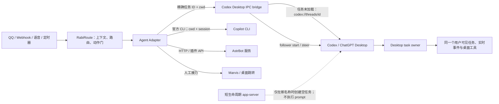

# Agent 端接入：历史问题、正确边界与验证手册

这份文档总结 RabiRoute 接入 Codex、Copilot CLI、Marvis、AstrBot 和远程 Agent 时出现过的典型问题，并给出统一设计规则。重点不是某个端口或某段脚本，而是把 **Agent 所有权、会话身份、工具能力和 RabiRoute 路由职责** 分开。

## 先给结论

RabiRoute 的边界仍然是：

> RabiRoute 不拥有 Agent，但拥有上下文和门。

正确接入遵守四条硬规则：

1. 桌面 Agent、CLI、服务端 Agent 都必须能在 RabiRoute 未启动时独立启动、退出和升级。
2. 当产品要求消息实时出现在桌面任务并使用桌面工具时，桌面任务 owner 必须是唯一执行者；RabiRoute 只投递，不另启执行 Runtime。
3. 会话以 Agent 返回的不可变 ID 为身份，以名称和最后会话时间供用户识别；名称不是绑定键。
4. 工具是否可用由当前 Agent 运行时实际注册的能力决定，不能靠提示词让一个未注册工具出现。

不要通过用户级环境变量、注册表或桌面启动参数，把桌面 Agent 强制改造成依赖 RabiRoute 的客户端。Codex Desktop IPC 是当前版本明确验证的集成合同，但它必须 fail closed、带版本回归测试，不能附带第二条备用投递路径。

## 概念不要混用

| 概念 | 含义 | 例子 |
| --- | --- | --- |
| Agent | 真正理解和执行任务的产品或服务 | Codex、Copilot CLI、AstrBot |
| 宿主 | 用户看见并操作的界面 | Codex/ChatGPT Desktop、终端、AstrBot Dashboard |
| Runtime | Agent 的执行进程或服务 | `codex app-server`、Copilot CLI 进程、AstrBot 服务 |
| Transport | RabiRoute 与 Agent owner 通讯的通道 | Desktop IPC、stdio JSONL、HTTP、Webhook、插件 API |
| Adapter | 把 RabiRoute 消息翻译成 Agent 官方协议的边界层 | `src/agentAdapters/*` |
| Session | Agent 自己拥有的会话/线程 | Codex thread、Copilot session、bot channel |
| Tool | 当前 Runtime 向这一轮任务注册的可调用能力 | Codex 桌面任务工具、项目工具、插件工具 |

“同一个 Agent 产品”不代表“同一个 Runtime”。要同时满足实时可见和桌面工具，真实轮次必须由 Desktop 当前任务 owner 启动；共享同一个 thread ID 不够。

## 历史提交说明了什么

### `4a4fa5c`：依赖桌面私有 IPC 的线程投递

这一阶段通过 Windows 管道 `\\.\pipe\codex-ipc` 和桌面客户端状态尝试投递，包含 `thread-follower-start-turn`、`thread-follower-steer-turn` 等动作，同时扫描本地 session index 和 transcript。

它解决了“向已打开的桌面任务续投”的一部分需求，但暴露出几个结构性问题：

- 找到会话记录，不等于存在一个已经加载该会话、可以接收私有 IPC 的桌面客户端。
- 桌面客户端未加载目标任务时会得到类似 `no-client-found` 的错误。
- IPC 和 Desktop 状态会随客户端版本变化，需要版本探测和回归测试。
- 名称查找遇到重名、改名、归档或旧记录时容易选错任务。
- 当时没有先用 `codex://threads/<id>` 让 Desktop 加载目标任务，也没有把“绝不回退到其他 Runtime”写成硬约束。

经验：问题不在 Desktop IPC 本身，而在缺少 owner 唤醒、精确 ID、工作目录校验和失败关闭。当前方案补齐这四项，并把 Desktop owner 设为实际消息的唯一真源。

### `d6b56fc`：回到项目固定的 app-server stdio

这一阶段改为由 Codex adapter 按需启动项目固定版本的：

```text
codex app-server --listen stdio://
```

Adapter 完成 `initialize` / `initialized`，再通过官方线程和轮次协议列出、读取、恢复会话并执行 `turn/start` 或 `turn/steer`。桌面端保持可选、独立。

这个方向修复了 Desktop 被 RabiRoute 拖死的问题，但只是中间修正：

- RabiRoute 只管理自己启动的隔离子进程。
- Codex/ChatGPT Desktop 不依赖 RabiRoute 的启动顺序。
- 会话由 app-server 协议验证，不只看本地 transcript。
- 审批请求由 adapter fail-closed 处理，不在未知状态下默认放行。

最终没有采用它作为正式投递链路。隔离 app-server 与 Desktop 是两个 Runtime：它们可以访问同一套持久化任务，所以稍后可能“看见”同一记录，但 Desktop 不会即时收到该轮事件，后台轮次也没有 Desktop 注入的工具。这正是本次需求不能接受的差异。

### `d4dd964`：共享 Runtime 导致所有权倒置

这一阶段为了让多个客户端共用一个端口，新增了用户级：

```text
CODEX_APP_SERVER_WS_URL=ws://127.0.0.1:4510
```

同时让 RabiRoute Manager 负责启动和关闭 4510 上的 WebSocket Runtime。结果是桌面端启动时被永久指向 RabiRoute 管理的端口；只要 Manager 没启动，就会直接报：

```text
connect ECONNREFUSED 127.0.0.1:4510
```

这不是普通的“连接失败”，而是 **所有权倒置**：可选的路由器变成了 Agent 桌面应用的启动依赖。相关测试只证明“服务已启动时两个 WebSocket 客户端能连接”，没有覆盖 Manager 缺席、冷启动、独立退出和残留环境变量，因此给出了错误的安全感。

经验：不能为了共享一个端口而反转生命周期依赖。正确的“一个 Runtime”不是让 RabiRoute 拥有 4510，而是让 Desktop 始终拥有实际轮次，RabiRoute 只作为客户端投递。

## 为什么会改来改去

这些提交并不是简单地“前一次代码写坏了”。更准确的原因是：每次都在修一个局部症状，但没有先冻结最终用户要看到的行为，因此局部正确不断覆盖整体正确。

| 阶段 | 当时优化的局部指标 | 被遗漏的用户合同 | 后果 |
| --- | --- | --- | --- |
| `075966d` 至 `4a4fa5c` | IPC 能向已加载任务 start/steer；超时和 active turn 能继续处理 | 目标 owner 未加载时必须先加载且不能换执行者 | 不断增加名称匹配、超时启发式、拉起应用和 fallback |
| `1a8d786` | `no-client-found` 后消息仍能被某个 app-server 接收 | 消息必须立即进入原 Desktop 任务，并使用 Desktop 工具 | “可靠投递”变成了第二 Runtime 后台执行 |
| `d6b56fc` | Desktop 与 RabiRoute 可以独立启动；stdio 协议和审批可控 | Desktop 必须实时显示并拥有实际轮次 | 修复生命周期，却失去实时事件和 Desktop 工具 |
| `d4dd964` | 两个 WebSocket client 能读同一 thread 和通知 | RabiRoute 缺席时 Desktop 仍必须冷启动 | 用用户级环境变量把 Desktop 永久绑定到 4510，形成所有权倒置 |
| 当前方案 | Desktop owner 接受真实消息；精确 ID/cwd；失败关闭 | 同一套用户合同 | 消息、状态、工具和生命周期重新由同一个 owner 对齐 |

共同根因有八个：

1. **验收目标漂移**：先追求“能投递”，再追求“能看到”，最后才明确“必须由 Desktop owner 执行并保留工具”。这些不是同一指标。
2. **把持久化会话等同于运行中任务**：同一个 thread ID 只能说明记录可能共享，不能证明 webview owner、active turn、实时事件和工具注册共享。
3. **可用性偏见**：遇到 `no-client-found` 时优先增加 fallback，而不是把它视为“正确 owner 尚未加载”的身份错误。
4. **测试层级错误**：单元测试证明了 fallback 会触发，共享 Runtime 测试证明了两个普通 client 能通信，却没有证明真实 Desktop UI 可见、工具存在和 Manager 缺席冷启动。
5. **副作用没有进入架构审查**：写用户级环境变量被当成配置便利，没有被视为改变外部产品生命周期的高风险安装动作。
6. **产品形态混淆**：本机交互式 Desktop 和远端无人值守 bridge 对 Runtime owner 的要求不同，却一度被强行统一到同一端口。
7. **改动面过大**：Runtime、Manager、WebGUI、文档、Remote Agent 和打包同时变化，使大量通过的测试只能证明新实现内部一致，不能证明产品合同正确。
8. **创建提交点和 resolver 分裂**：配置页在 `blur` 时创建，Manager 与 Gateway 又各写一套 ID/名称解析；Desktop 索引稍有延迟，同一个名称就会被重复创建，保存后的新 ID也可能没有成为下一次投递的真源。

以后不要从错误文本直接推导补丁。先写“用户可观察合同、owner/lifecycle 表、唯一真实消息路径和禁止替代”，再做一个最小纵向烟测。若烟测不能同时证明 UI 可见、owner 正确、工具来源正确和双向冷启动，就保持实验状态，不继续铺 UI 或打包。

## 常见故障及根因

### 1. Agent 工具甚至桌面端都打不开

症状：桌面应用启动立即 `ECONNREFUSED`，或必须先启动 RabiRoute。

根因：RabiRoute 写入了用户级环境变量、注册表或启动配置，使桌面应用强制连接一个由 RabiRoute 拥有的端口。

正确处理：

- 删除这种全局依赖和持久化配置。
- 清除用户级 `CODEX_APP_SERVER_WS_URL`；Desktop 恢复自行拥有的默认 Runtime。
- RabiRoute 只连接 Desktop IPC；Desktop 不在线时显示“未就绪”，不能启动备用 Runtime。
- 测试时必须先关闭 RabiRoute，再验证 Agent 能否冷启动。
- 安装器若确实要修改系统配置，必须显式告知、可回滚，并且不是普通 adapter 配置动作。

### 2. “列表里有会话”，投递却找不到

可能原因不是一个：

- 列表来自私有索引或缓存，Runtime 已无法恢复该 ID。
- 会话属于另一个 `cwd` / workspace。
- 会话已归档、迁移、删除或当前权限不可见。
- 配置只保存了名称，重名后匹配到零个或多个结果。
- 桌面私有 IPC 要求目标任务已被某个客户端加载。
- 扫描和投递使用了不同 Runtime、用户目录、版本或认证上下文。

正确处理是把“配置解析”和“实际投递”分开。配置解析可以自动修复失效绑定，但不能模糊选择：

1. 下拉项显示“会话名称 + 最后会话时间”，内部 value 保存完整 opaque ID。
2. 同时保存规范化后的项目目录，用来发现配置错位，但不要把目录或名称拼成伪 ID。
3. 投递前从 Desktop 状态按精确 ID 读取并校验 `cwd`。
4. ID 不是合法任务 ID或已失效时，清除它并按“名称 + 规范化 cwd”自动解析：唯一匹配重新绑定，零匹配创建，多个同名要求用户选择。
5. 精确 ID 仍存在但 cwd 冲突时停止，不能改走同名任务；这是配置错位，不是“找不到”。
6. 名称匹配出多个结果时必须让用户选择，不能取“第一个”或“最新一个”。
7. 扫描接口必须能访问全部任务；可以分页或搜索，但不能用固定前 100 条冒充完整列表。Windows 映射盘、UNC 和 `\\?\UNC` 必须先规范化再比较。

### 3. 失焦或重复保存后不断创建同名会话

症状：只是点开下拉、输入名称、离开输入框或连续保存，就在 Desktop 侧出现多个同名任务。

根因通常是四项叠加：

- `blur`、扫描或状态刷新错误地传入了 `createIfMissing: true`。
- Manager 配置页和 Gateway 真实投递维护了两套 resolver。
- create 已返回，但 Desktop 只读索引还没出现新任务，立即重试再次判定为零匹配。
- 新任务 ID 只存在于一次 HTTP 返回或内存状态，没有在保存成功前写回 route 配置。

正确处理：

1. 输入和 `blur` 只做 lookup-only；零匹配显示 `pending-new`，不能创建。
2. 点击保存才允许 `createIfMissing: true`，并在报告保存成功前持久化完整 ID、标题和 workspace。
3. 配置保存和真实投递调用同一个 resolver 状态机。
4. 以 `agentProfile + normalizedWorkspace + requestedName` 做 single-flight；索引延迟期间立即重试复用最近创建结果。
5. 连续保存和连续投递测试都必须断言 create 次数仍为 1。

### 4. 后台任务没有桌面端工具，也不能实时刷新

症状：桌面 Codex 中可调用 `codex_app__*`，RabiRoute 投递到独立 app-server 后却提示工具不存在；Desktop 任务也不会即时出现该条消息或运行状态。

根因：工具和实时事件属于当前任务 owner，不是会话文本的一部分。另一个 app-server 恢复相同 thread ID，只共享持久化记录，不会变成 Desktop owner。

正确处理：

- 实际 prompt 只通过 Desktop IPC 交给 Desktop owner。
- 目标任务未加载时先打开 `codex://threads/<id>`，等待 owner 接管后再 start/steer。
- Desktop 未加载成功就失败；不要把消息交给独立 app-server。
- 工具仍缺失时，说明该工具没有注册到目标 Desktop 任务；提示词不能注册工具。

### 5. 多个 app-server 导致任务看起来不联通

对于“必须在 Desktop 实时可见”的 Codex adapter，多个执行 Runtime 就是错误架构。它会产生三种不同步：持久化记录稍后可见但实时事件不通、工具注册不通、active turn 状态不通。

正确做法是：Desktop 只拥有自己的 Runtime；RabiRoute 只连接 Desktop IPC；Codex CLI 仍是独立产品入口，不参与这一条 route 的实际消息执行。多个 gateway 还必须串行投递并避免重复消费同一事件。

### 6. 把扫描结果当成已经验证可用

检测到可执行文件、读取到本地 session 文件或打开了网页，只说明“发现了候选”，不代表能恢复会话、重复投递、读取结果或处理权限请求。

能力等级必须诚实：

- `verified`：真实完成扫描、绑定、同会话重复投递、结果/状态确认和失败诊断。
- `experimental`：协议存在但端到端链路尚未全部验证。
- `stub`：只能打开外部页面、复制提示词或人工接力。

## 正确架构



生命周期规则：

| 对象 | 谁启动/停止 | RabiRoute 能做什么 | 禁止做什么 |
| --- | --- | --- | --- |
| Codex/ChatGPT Desktop | Desktop 自己 | 连接 IPC、读取任务候选、用 deeplink 加载目标 | 改用户环境让它依赖 RabiRoute；Desktop 缺席时备用执行 |
| Codex Desktop bridge | RabiRoute gateway | 向精确任务 owner start/steer | 自己执行 prompt、模糊切换同名任务 |
| 任务元数据 bootstrap | Codex adapter | 仅在用户输入新名称时创建空任务，并在首条消息后恢复用户名称 | 携带真实 prompt、执行 turn、成为 fallback |
| Copilot CLI | Copilot adapter | 用官方 CLI 启动当前投递进程 | 把私有 session 文件当官方 resume 成功 |
| AstrBot | AstrBot/运维服务 | 健康检查、认证、插件 API 投递 | 未经授权接管服务生命周期或写秘密配置 |
| 远程 Agent bridge | 目标设备的 bridge | 在目标设备使用固定版本官方接口 | 让一台设备依赖另一台桌面私有 IPC |
| Marvis 等跳转端 | 外部应用自己 | 打开应用、复制/交接提示 | 宣称已完成可靠会话注入和回传 |

## 每种 Agent 端的正确做法

### Codex

- Desktop 状态数据库只读地提供全部未归档任务候选；下拉显示名称和最后时间，内部保存完整 opaque ID。
- 配置绑定统一走一个 resolver：有效 ID → 精确绑定；无效/失效 ID → 名称 + 规范化 cwd；唯一匹配 → 自动绑定；零匹配 → 创建空任务；多个同名 → 返回候选。
- 投递前按最终 ID 读取任务并校验规范化 `cwd`；目录冲突、重名未消歧或 owner 无法加载都停止。
- 通过 Desktop IPC 先 steer；确认没有活动轮次时再 start。
- `no-client-found` 时只用 deeplink 加载目标任务并重试，绝不转给独立 app-server。
- 实际 prompt 由 Desktop owner 执行，因此沿用该任务的模型、工具、沙箱和审批。
- 用户输入新名称时允许短生命周期 app-server 创建空任务并维护名称；它不得接收真实 prompt 或执行 turn，完成元数据操作后立即退出。
- Desktop IPC 属于版本敏感合同；Desktop 升级后必须先跑探测和可见性烟测，失败时保持 fail closed。

### Copilot CLI

- 可执行文件和私有 session-state 只能用于发现候选。
- 必须用官方 CLI 的 `cwd` / `--resume` 实际验证所选 session。
- Windows 下验证长 prompt、编码、退出码、认证失效和同 session 重复投递。
- 没完成真实 resume 和重复投递前保持 `experimental`。

### AstrBot

- 把它视为外部服务：检查 endpoint、认证、插件版本和插件健康。
- 若官方 API 有 bot、channel、workspace、session，分别建模，不强行套 Codex thread。
- 若没有会话 API，明确显示“使用默认管线，无可选会话”。
- 密码/token 不写进日志、示例或可提交配置。

### Marvis 与其他桌面跳转端

- 只有打开应用、URL 或复制 prompt 时，按人工接力 adapter 处理。
- UI 明确标记 `stub` 或 `experimental`，不展示假的会话下拉。
- 获得公开注入和回传 API 后，才升级为可靠 Agent adapter。

### 远程 Agent

- 每台目标设备的 bridge 使用该设备上固定版本的公开 Runtime 接口。
- 远程消息保留 device、workspace、session ID 和幂等键，防止跨设备串会话或重复投递。
- 远程设备离线时返回可诊断状态，不回退到另一台机器的同名会话。

## 会话绑定算法

解析并保存配置时：

```text
显示：name + updatedAt
保存：agentType + endpoint/runtimeProfile + fullSessionId + normalizedProjectPath

有效 fullSessionId -> 精确读取并校验 cwd
无效/失效 fullSessionId -> 按 name + normalizedProjectPath 查询
唯一匹配 -> 保存该 ID
零匹配 -> 创建空任务并保存新 ID
多个同名 -> 返回候选，等待用户按时间选择
```

投递时：

```text
1. 从 Desktop 状态按 fullSessionId 读取任务
2. 校验任务 cwd 与配置项目目录
3. 连接 Desktop IPC，尝试交给目标任务 owner
4. 若没有 owner，deeplink 打开该任务并有限重试
5. 若有 active turn，则 follower steer；否则 follower start
6. 写入成功状态、实际 session ID 和时间
7. Desktop 缺席、最终 ID 不存在或 cwd 冲突时停止；没有执行 fallback
```

新建时：

- 下拉选择永远绑定 ID。
- 用户直接输入名称且无匹配项，resolver 自动创建空任务。
- 存在一个精确名称匹配时自动绑定，并在界面显示其时间和项目。
- 存在多个匹配时必须让用户选，不自动创建也不自动取最新。

## 工具和能力合同

Adapter 需要分别报告：

- `transportCapabilities`：Desktop IPC 是否就绪、能否加载目标任务、start、steer。
- `turnCapabilities`：目标 Desktop 任务实际注册的工具、审批和文件权限。
- `hostCapabilities`：Desktop 是否运行并能拥有目标任务；对 Codex 主链是健康条件，不是装饰信息。

不要用一个 `connected: true` 掩盖三者差异。IPC 管道可连接仍不代表目标任务 webview 已成为 owner；必须以该 owner 接受 start/steer 为投递成功。

## 上线前必须覆盖的测试矩阵

| 场景 | 预期结果 |
| --- | --- |
| RabiRoute 未启动，单独冷启动 Agent/Desktop | 正常启动 |
| Agent/Desktop 未启动，RabiRoute 启动 | Manager 正常；Codex adapter 显示 Desktop 未就绪，不启动备用 Runtime |
| 分别关闭/重启 RabiRoute 和 Agent | 互不拖死；状态可恢复 |
| 用户环境残留旧 endpoint | 不被普通 adapter 继承；给出清理提示 |
| 会话重名 | UI 以时间/项目区分，内部按 ID |
| 会话 ID 不是 UUID、过期、归档、删除 | 按名称 + 规范化 cwd 自动解析；唯一匹配重绑，零匹配创建，多匹配要求选择 |
| 会话总数超过 100 | 分页/搜索仍能访问全部任务；WebGUI 不固定截断 |
| cwd 不一致 | 拒绝投递并显示两边路径 |
| 同一会话连续投递两次 | 不创建意外新会话 |
| 已有 active turn | 使用 steer 或明确排队，不并发 start |
| Desktop 任务应有的工具缺失 | 确认实际轮次由 Desktop owner 执行；仍缺失则报告任务能力缺失 |
| 登录过期、服务离线、权限请求 | 可行动错误；审批 fail-closed |
| 两个 gateway 同时运行 | 有租约/幂等或明确禁止，不能重复消费 |
| Manager 在连接中途退出 | 不破坏 Desktop；关闭自己的 IPC 客户端和未完成的空任务 bootstrap |

测试不能只覆盖“服务已经启动时能连接”。冷启动、依赖缺席、残留配置和独立退出才是发现所有权错误的关键。

## 实施检查清单

设计前：

- [ ] 写清 Agent、宿主、Runtime、Transport、Session 和 Tool 分别由谁拥有。
- [ ] 找到 owner 的真实 API/IPC/CLI；本地状态只作只读候选发现，不直接写。
- [ ] 明确该 Agent 是否真的有项目、会话和回传概念。
- [ ] 确认不会写用户级环境变量、注册表或外部应用启动配置。

实现时：

- [ ] scan 返回 `maturity`、真实 transport 模式、host 是否必需和 warnings。
- [ ] 会话 value 使用完整 ID；名称和最后时间只用于显示。
- [ ] 投递前验证 ID、cwd、Desktop owner 和 active turn。
- [ ] 工具能力来自当前 Runtime 探测，不来自 prompt 假设。
- [ ] 错误分类为未安装、未登录、未启动、会话失效、目录冲突、工具缺失、权限拒绝。
- [ ] 外部动作和审批保持 fail-closed。

完成时：

- [ ] 完成同一会话两次真实投递。
- [ ] 完成 RabiRoute 缺席和 Agent 缺席的双向冷启动测试。
- [ ] 完成重名、失效 ID、错误 cwd、工具缺失和认证过期测试。
- [ ] 文档、WebGUI、状态 API 与实际 maturity 一致。
- [ ] `git diff` 证明没有意外修改用户全局配置或私有数据。

## 相关实现与文档

- `src/agentAdapters/`：各 Agent adapter 与 Manager 扫描入口。
- `src/codexDesktopBridge.ts`：Desktop 任务发现、IPC、deeplink 唤醒与 fail-closed 投递。
- `src/codexAppServerClient.ts`：仅用于新名称创建空任务的 bootstrap 客户端。
- `src/agentThreads.ts`：正式的 Agent thread 桥接 API。
- `docs/rabi-agent-interfaces.md`：RabiRoute 暴露给 Agent 的接口和工具边界。
- `docs/code-architecture.md`：模块所有权和 Codex runtime 边界。
- `docs/troubleshooting.md`：用户侧故障恢复。
- `skills/create-rabiroute-agent-adapter/SKILL.md`：新增或改造 Agent 端时必须执行的工作流。
