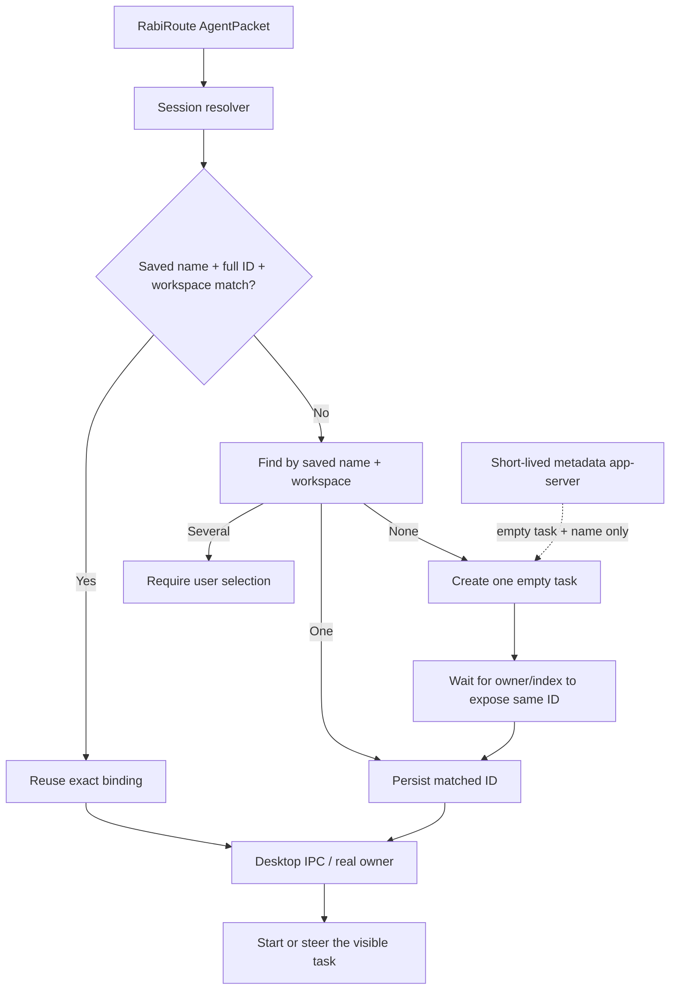

<!-- docs-language-switch -->

English | <a href="./agent-adapter-integration-lessons.md">简体中文</a>

<!-- /docs-language-switch -->

# Agent Adapter Integration Lessons

This guide distills recurring failures from the Codex, Copilot CLI, Marvis, AstrBot, and Remote Agent integrations. The durable lesson is not about one port or one script. It is about separating handler ownership, session identity, tool capability, and RabiRoute's routing responsibility.

## Conclusions first

> RabiRoute does not own the Agent. It owns the context and the gates.

Four rules follow:

1. Desktop applications, CLIs, and services must retain independent startup, shutdown, and upgrade lifecycles unless their product contract explicitly says otherwise.
2. If the requirement is “visible in this Desktop task with this task's tools,” that Desktop task owner must execute the real turn. RabiRoute must not start a second executor.
3. Persist the visible name, immutable ID, and workspace together. Validate the name-ID pair before delivery so either side can rename safely without sending to a stale target.
4. Tools exist only when the actual owner/runtime registers them. Prompt wording cannot create a missing tool.

Codex Desktop IPC is a verified, version-sensitive contract. It must fail closed, wake/load the exact owner, validate full ID plus workspace, and have no alternate execution path.

## Vocabulary

| Term | Meaning | Example |
| --- | --- | --- |
| Agent/handler | Product that understands and performs work | Codex, Copilot CLI, AstrBot |
| Host | User-facing application | Codex/ChatGPT Desktop, terminal, Dashboard |
| Runtime | Turn-execution process or service | Desktop task owner, CLI process, bot service |
| Transport | Channel to the owner | Desktop IPC, stdio, HTTP, WebSocket, plugin API |
| Adapter | RabiRoute protocol boundary | `src/agentAdapters/*` |
| Session/task | Handler-owned conversation identity | Codex task, Copilot session, bot channel |
| Tool | Capability registered for that actual turn | Desktop task tools, project tools, plugins |

The same product can have several Runtimes. The same persisted task ID can be opened by a different process without inheriting the Desktop owner's live tools or UI events.

## What the historical designs taught us

### Early Desktop IPC heuristics

The first IPC attempt could start or steer a task that Desktop had already loaded, but it guessed too much from names, local indexes, and timeouts. When the target owner was not loaded, the code tried to compensate with window focus and fallback behavior.

Lesson: IPC itself was not the core failure. The missing pieces were exact owner loading, immutable ID binding, workspace validation, and fail-closed behavior.

### Independent project-pinned stdio app-server

The next design avoided Desktop internals by launching an app-server from the project. It could use official thread/turn protocol and was easier to test in isolation.

It still failed the user contract: the real turn was owned by a different Runtime. Desktop did not receive the same live events or tool registry, even when the persistent thread ID matched.

Lesson: protocol correctness does not prove owner correctness.

### Shared port 4510 Runtime

The shared-Runtime design made the Manager own a WebSocket app-server and configured Desktop and CLI as clients. This inverted lifecycle ownership: Desktop cold start failed when the optional RabiRoute Manager was absent.

Lesson: “one Runtime” must not mean that the router owns the Agent application's startup dependency. The real owner remains the Desktop task. RabiRoute is a client of Desktop IPC for delivery.

## Why the design kept changing

Common root causes:

1. Acceptance drift: “a prompt ran,” “the message is visible,” and “the visible task owner executed it with its tools” were treated as the same goal.
2. Identity drift: display names and recent timestamps replaced immutable IDs.
3. Availability bias: a fallback was added instead of treating `no-client-found` as “the intended owner is not loaded.”
4. Test-layer error: mocks proved local code paths, not real Desktop visibility, tool ownership, or independent cold start.
5. Lifecycle inversion: environment variables and shared ports made the Agent host depend on RabiRoute.
6. Reactive UI scans: expanding, typing, blurring, saving, and polling repeatedly triggered expensive discovery.
7. Stale-build confusion: tests passed against source while an installed or already-running build still used retired logic.
8. Capability inflation: successful discovery was reported as verified same-session delivery.

## Frequent failures and their causes

### Desktop or tools fail to start

Check for user/machine environment variables, registry values, startup arguments, or port ownership that redirect the Agent host. RabiRoute must not install such a dependency.

### A session appears in the list but delivery cannot find it

The list may come from stale metadata, a partial page, or another workspace. Resolve the complete ID against the actual owner and validate normalized cwd before delivery.

### Duplicate same-name sessions appear after save or first delivery

Typical causes are name-as-identity, delayed indexing treated as absence, concurrent create calls, or creation from several UI paths. Use one resolver, one idempotency scope, and a bounded wait for the same newly created ID.

### A rename still delivers to the old task

An ID alone is not enough when the saved visible name and the owner record diverge. Treat the old pair as stale, resolve by saved name plus workspace, and rebind one match or create once when none exists. Never continue delivering to an ID whose current name no longer matches the configured target.

### The settings page becomes slow or scans continuously

Separate discovery from form reactivity. Scan once on page entry and again only on explicit refresh. Instrument request counts in tests.

### Tests/build pass but installed behavior is old

Verify the running process path, `dist/` timestamps, installed bundle contents, and stale processes. Remove retired scripts and UI options so old and new paths cannot coexist invisibly.

### Background turns lack Desktop tools or do not update the UI

Tools and live events belong to the current owner, not the persisted transcript. Restoring a thread ID in another app-server does not make it the Desktop owner.

### A scan result is mistaken for verified support

Installation, authentication, and endpoint checks are prerequisites. Verification requires repeated real delivery to the intended owner with visible state and correct tools/results.

## Correct architecture

The metadata bootstrap must never receive the real prompt. Model, tools, sandbox, approvals, and live status remain owned by the target Desktop task.

## Correct approach by handler type

### Codex Desktop

- Read Desktop task state without taking ownership.
- Persist visible name, full task ID, and workspace as one binding.
- Re-resolve when the owner name and saved name no longer match.
- Deeplink an unloaded task, retry for a bounded period, then fail closed.
- Deliver real prompts only through Desktop IPC.
- Use app-server only to create/name an empty task when the user requests a new name.

### Copilot CLI

- Treat the CLI process/session as the owner.
- Use its real session contract and report that it is not a VS Code panel injection.
- Verify repeated same-session delivery before raising maturity.

### AstrBot

- Separate Dashboard authentication, project/session discovery, plugin deployment, and ChatUI delivery.
- A successful login or scan is not proof of repeated conversational delivery.

### Marvis and manual desktop handoff

- Be explicit that opening the application, writing a prompt file, and copying to the clipboard is a manual relay.
- Do not fabricate session listing or background injection.

### Remote Agent

- The remote bridge owns its unattended Runtime on that device.
- Restrict workspaces and file paths, authenticate the bridge, and return results to the local RabiRoute role.
- Do not use the remote bridge as a fallback for the control machine's Desktop owner.

## Session binding algorithm

1. Normalize workspace.
2. If a saved ID is syntactically valid, read it from the owner.
3. Reuse it only when the owner record's visible name equals the saved name and the workspace matches.
4. If it belongs to another workspace, stop with a conflict.
5. If it is absent, invalid, or paired with another name, find by saved name plus workspace.
6. Rebind one match; return candidates for several matches.
7. Create exactly once when there is no match and creation is authorized.
8. Wait for the same new ID to become owner-visible.
9. Persist the binding before subsequent delivery.
10. Deliver through the real owner; if unavailable, fail without fallback.

## Tool and capability contract

- A tool is available only if the actual owner registers it for that task/turn.
- The adapter may report capabilities; it must not synthesize them in the prompt.
- Session text/history is not the tool registry.
- Handler sandbox/approval and RabiRoute Outbox authorization are separate layers.
- Missing owner tools are a capability or version problem, not a reason to execute elsewhere silently.

## Release test matrix

- Independent cold start and shutdown.
- Valid ID reuse, workspace mismatch, unique rebind, no-match creation, ambiguity.
- Agent-side and Rabi-side rename rebinding.
- Delayed index and concurrent single-flight creation.
- Full pagination and bounded scan count.
- Start/steer behavior in the real owner.
- Owner unavailable with no fallback.
- Correct visible task count and message appearance.
- Correct tools/model/permissions from the same owner.
- Upgrade/stale-build checks and secret redaction.

## Implementation checklist

- Write the unique-owner and no-fallback contract before code.
- Use one resolver for settings save, initialization, and normal delivery.
- Keep discovery read-only and user-triggered after the initial page scan.
- Persist complete IDs and workspaces; never ask users to edit UUIDs.
- Separate process health, binding, owner readiness, active turn, and result status.
- Remove retired transports, scripts, environment hooks, and UI labels.
- Update Chinese and English docs together after behavior is proven.

See [Standard Agent Adapter Requirements](agent-adapter-standard-requirements_en.md) and the Codex-specific [Desktop Acceptance Contract](codex-desktop-agent-acceptance_en.md).
