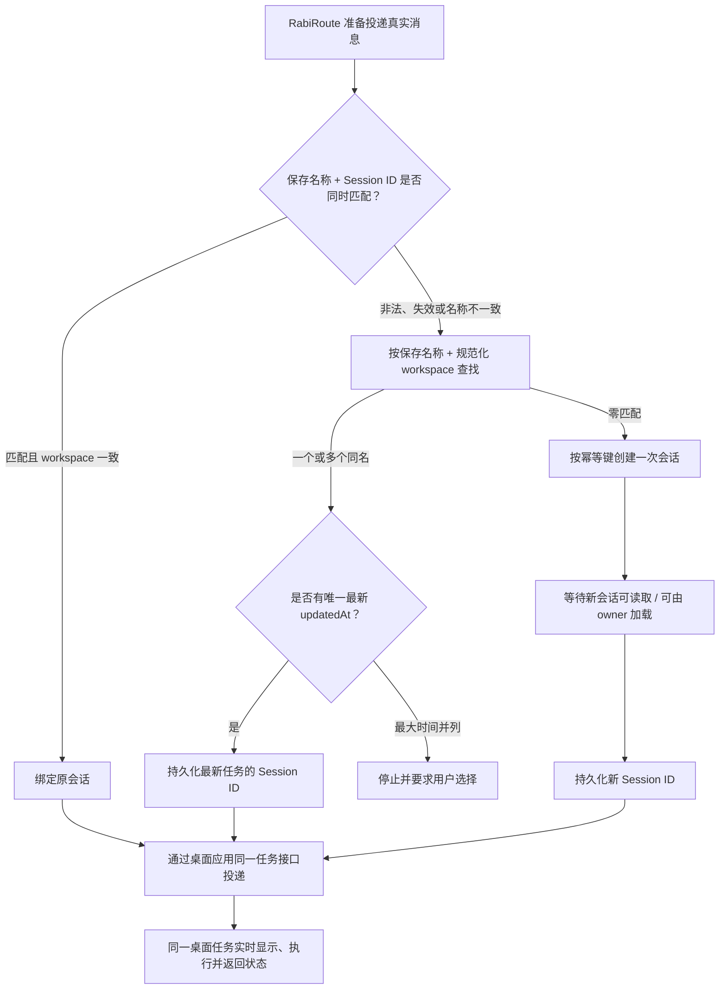
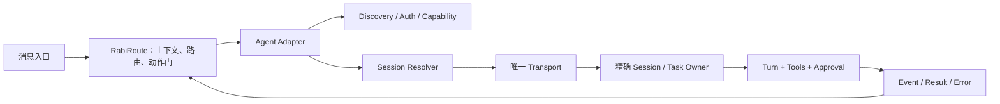

<!-- docs-language-switch -->
<div align="center">
<a href="./agent-adapter-standard-requirements_en.md">English</a> | 简体中文
</div>
<!-- /docs-language-switch -->

# 标准 Agent 端接入需求

本文定义 RabiRoute 接入一个 Agent 端时，应尽可能达到的产品、架构、接口、可靠性、UI、安全和验收要求。它既适用于 Codex/ChatGPT Desktop 这类桌面 owner，也适用于 CLI、后台 Runtime、远程 Agent、机器人服务和只能人工跳转的外部应用。

这不是要求所有 Agent 强行实现同一种能力。不同产品可以没有项目、会话、工具、流式结果或取消能力，但 adapter 必须如实声明，UI 必须按真实能力显示，未验证的能力不能假装可用。

## 一句话标准

一个合格的 Agent 端应该做到：

> 用户不需要理解内部端口、进程和 UUID，就能发现 Agent、选择或自动绑定正确会话、可靠投递消息、看到真实状态和结果；失败时知道失败在哪一层，并且不会静默换 Runtime、换会话、重复创建或扩大权限。

## P0：RabiRoute Agent 端最小主合同

无论 Agent 端还有多少高级能力，首先必须满足以下六条：

1. **存在会话时，直接投递到 Rabi 配置所绑定的会话。** 先用内部完整 Session ID 读取 owner 记录；只有保存的“可见名称 + Session ID”同时匹配且 workspace 一致才是有效绑定，随后直接续投同一任务，不新建。
2. **不存在会话时，先按 Manager 保存名称查找，只创建一次再投递。** ID 非法/失效时先按“RabiPC Manager 保存名称 + 规范化 workspace”查找；存在一个或多个候选时按 `updatedAt` 降序绑定唯一最新任务，最新时间并列才让用户选择；零匹配才幂等创建，持久化新 ID 后再投递。用户也可显式点击“自动初始化会话”，由同一事务创建/绑定后投递包含角色文件、记忆、计划和必读项的人格初始化消息。
3. **与 Agent 桌面应用使用同一套任务接口合同，保证统一可见。** 真实消息必须进入桌面应用实际使用的 task/session owner、实时事件流和工具上下文。共享数据库、共享标题或恢复同一个 Session ID 的第二个 Runtime，都不等于桌面统一可见。
4. **Rabi 设置页保存时必须完成目标切换。** 选择已有会话后保存，应校验并持久化名称、完整 ID 和 workspace；输入不存在的名称后保存，应幂等创建一次并持久化新配对。保存成功后，下一条消息直接使用该配对。
5. **Agent 端或 Rabi 端改名后必须安全重绑。** 保存名称与 ID 指向任务的当前名称不一致时，旧 ID 视为陈旧绑定；按保存名称 + workspace 重新查找，一个或多个候选按 `updatedAt` 选择唯一最新者，零匹配只创建一次，最新时间并列等待用户选择，不能继续投到旧 ID。
6. **会话扫描必须按需触发且次数可证明。** 进入设置界面时自动扫描一次；之后只有用户点击扫描/刷新按钮才向 RabiPC Manager 请求项目和会话列表。展开面板、输入、`blur`、保存、健康轮询和空闲计时不得持续扫描。

如果目标 Agent 没有提供能进入桌面任务 owner 的正式接口、受支持桥接协议或经过真实验证的兼容接口，adapter 必须标为 `experimental`，并明确写出“不能保证桌面实时可见”，不能用后台 Runtime 假装满足第 3 条。

标准主流程：



这里的“自动创建”只属于一次真实投递或用户保存配置的提交事务，不属于扫描、刷新、输入、失焦和重启。Rabi 设置页点击保存时必须复用上图同一个 resolver，先解析或创建，再把完整 ID、标题和 workspace 一起保存。创建与投递应被视为一个可恢复流程：创建成功但投递失败时保留并复用已经创建的 ID，后续只重试投递，不能再次创建同名会话。项目/会话扫描与 resolver lookup 是两件事：扫描只在进入设置界面时自动一次或用户显式点击按钮时发生；lookup 可以在保存前按目标名称检查，但不能变成持续全量扫描。

## 1. 用户可观察合同

接入前先写清以下问题。任何一项说不清，都不应直接进入正式实现：

| 问题 | 必须明确的事实 |
| --- | --- |
| 消息出现在哪里 | Desktop 任务、CLI 输出、WebChat、群聊、文件还是后台任务列表 |
| 谁执行真实消息 | 精确到 task/session owner 或服务实例，不能只写“某个 Agent” |
| 用户何时看见 | 立即、轮询后、任务完成后，还是只能查看日志 |
| 结果从哪里回来 | 同一会话、callback、事件流、轮询 API、stdout 或人工复制 |
| 模型和工具归谁 | 目标任务、Agent 服务、RabiRoute 配置还是外部平台 |
| Agent 缺席时怎样 | 明确失败、排队、等待恢复，还是允许创建任务 |
| RabiRoute 缺席时怎样 | 外部 Agent 是否仍能独立启动、退出和升级 |
| 新建和续投如何区分 | 什么动作只查找，什么动作允许创建，什么动作必须复用 |
| 哪些替代被禁止 | 备用 Runtime、模糊换会话、自动放宽权限、写用户全局配置等 |

验收必须观察真实目标端。数据库有记录、mock 返回成功、普通协议客户端收到通知，都不能替代“正确 owner 实际接收并执行”。

## 2. 统一概念

| 概念 | 含义 | 例子 |
| --- | --- | --- |
| Provider | 提供账号、模型或云服务的厂商 | OpenAI、GitHub、腾讯 |
| Agent | 理解和执行任务的产品或服务 | Codex、Copilot CLI、AstrBot |
| Host | 用户看见和操作的宿主 | Desktop、终端、Dashboard、WebChat |
| Runtime | 实际执行 turn 的进程或服务 | Desktop 管理 Runtime、CLI 进程、远端服务 |
| Transport | Adapter 与 owner 通讯的通道 | IPC、stdio、HTTP、WebSocket、插件 API |
| Workspace | Agent 工作的项目或目录范围 | cwd、project、repository、bot workspace |
| Session / Task | 可持续续接的会话身份 | thread、conversation、channel、task |
| Turn | 会话中的一次用户输入和 Agent 执行 | start、steer、resume、cancel |
| Tool | 当前执行 owner 注册的能力 | 文件、Shell、MCP、浏览器、业务插件 |
| Adapter | 把 RabiRoute 事件翻译为 Agent 协议的边界层 | `codex`、`copilotCli` 等 |

这些概念不能互相代替：

```text
同一 Agent 名称 ≠ 同一 Runtime
同一 Session ID ≠ 同一实时任务 owner
记录可读 ≠ 目标 UI 已接收
Transport 已连接 ≠ 指定任务可执行
恢复同一会话 ≠ 自动拥有另一 Runtime 的工具
```

## 3. 标准架构边界



职责必须分开：

| 模块 | 负责 | 不负责 |
| --- | --- | --- |
| Discovery | 安装、版本、服务、项目、会话候选发现 | 创建会话、执行真实消息 |
| Capability | 声明真实支持的能力和限制 | 根据 UI 需要伪造能力 |
| Session Resolver | 精确绑定、查找、消歧、受控创建 | 执行 turn、模糊选择同名会话 |
| Transport | 与唯一 owner 通讯、超时、重连 | 偷换 Runtime 或 fallback |
| Turn Driver | start、steer、resume、cancel、状态 | 保存 UI 草稿或修改外部系统 |
| Result Adapter | 解析流式事件、最终结果和错误 | 猜测未返回的成功状态 |
| WebGUI | 展示、选择、提交用户意图 | 成为会话事实真源、自己拼 ID |
| RabiRoute | 上下文、路由、外部动作安全门 | 替代外部 Agent 思考和拥有 Runtime |

## 4. 能力等级

### `stub`

- 只能打开网页/应用、复制 prompt 或人工接力。
- 不能声称支持会话绑定、自动投递、结果回传或后台运行。
- UI 必须写明“人工接力”。

### `experimental`

- 已找到协议或实现部分主链。
- 真实登录、会话复用、结果、错误、权限或端到端烟测尚未完整验证。
- 可以提供测试入口，但不能作为默认稳定方案。

### `verified`

- 真实环境完成发现、认证、绑定、两次同会话投递、状态、结果和失败诊断。
- 完成 Agent 缺席与 RabiRoute 缺席的双向冷启动验证。
- 没有隐藏 fallback、重复创建和权限扩大。
- 文档、UI、状态 API 与实际能力一致。

能力等级必须基于证据，不基于代码量、测试数量或“理论上支持”。

## 5. 标准能力清单

### 5.1 发现与环境

Agent 端应尽可能提供：

- 自动发现安装位置、版本、运行状态和可执行入口。
- 区分“已安装”“服务运行”“Transport 可连接”“目标会话可用”。
- 检查必要插件、扩展、模型、Runtime 或系统依赖。
- 列出可用 workspace/project；没有项目概念时明确声明。
- 列出会话总数、分页信息、来源和最后更新时间。
- 提供刷新、打开应用、打开登录页、安装/更新插件、健康检查等动作。
- 扫描失败时返回部分结果和 warning，而不是整个接口空白。

扫描、刷新和健康检查必须只读，不能创建会话、启动 turn、修改配置或发送消息。项目/会话扫描只允许页面进入一次和用户显式点击刷新触发；禁止定时器、展开面板、输入、`blur`、保存或普通状态轮询反复调用全量扫描。

### 5.2 认证与授权

- 明确认证类型：本机登录态、API key、token、cookie、device code、用户名密码或无需认证。
- 能检测登录状态时自动检测；不能检测时不要显示“已登录”。
- 登录过期返回可行动错误和重新登录入口。
- secret 不进入日志、示例、URL、前端持久缓存或可提交配置。
- 认证成功不等于获得所有工具和外部动作权限。

### 5.3 Workspace / Project

- 使用 Agent 自己的 workspace/project 身份；不要强行把所有 Agent 都建模为文件目录。
- 文件目录需要规范化盘符、大小写、符号链接、UNC、映射盘和 extended path。
- 保存原始展示值，同时使用规范化 key 做比较。
- 选择已有会话时，以会话实际 workspace 为准并回填 UI。
- 精确会话存在但 workspace 冲突时明确拒绝，不能偷偷切到同名会话。

### 5.4 会话发现与展示

- 会话 ID 由 Agent 生成，是系统内部身份，不让用户或 AI 手填。
- UI 显示名称、最后时间、项目/来源和必要状态，不显示 UUID。
- 会话很多时提供分页、搜索、虚拟列表或增量加载；不能固定显示前 20/100 条却称为“全部”。
- 同名会话必须用最后时间、项目或来源区分。
- 已归档、已删除、无权限和暂不可恢复应有不同状态。
- 本地索引或数据库只能作为候选来源时，必须标明；最终绑定要由真实 owner 验证。

### 5.5 会话解析与受控创建

标准 resolver 顺序：

```text
1. 有有效 Session ID：精确读取，并校验 owner 当前名称是否等于保存名称
2. 名称 + ID 匹配：继续校验 workspace，成功才算精确绑定
3. ID 非法、失效或名称不一致：按 savedName + normalizedWorkspace 查询
4. 一个或多个匹配：按 updatedAt 降序自动绑定并持久化唯一最新任务的名称 + ID
5. 最大 updatedAt 并列或都无有效时间：返回 candidates，等待用户选择
6. 零匹配：保持 pending-new；只有明确提交点才允许创建
```

允许创建的明确提交点：

- 用户在配置页输入新名称后点击“保存/应用”。
- 第一条真实消息准备投递，route 明确配置了 `createIfMissing`。
- 用户显式点击“新建会话”。
- 用户显式点击“自动初始化会话”；必须先保存名称 + ID，再向同一 owner 投递人格初始化消息。

禁止创建的触发点：

- 页面加载、下拉展开、输入中、失焦 `blur`。
- 扫描、刷新、健康检查、状态轮询。
- Manager、Gateway、Desktop 或插件重启。
- 读取配置、配置 normalize、错误重试。
- 仅仅因为列表暂时没刷新或 owner 暂时不可见。

创建必须幂等：

- 幂等键至少包含 `agentProfile + normalizedWorkspace + requestedName`。
- 并发请求必须 single-flight，只能有一个实际 create。
- create 返回后、发现索引尚未刷新期间，立即重试必须返回同一个新 ID。
- 新 ID 必须在向调用方报告“绑定成功”前持久化。
- 创建超时但结果未知时先按幂等键重查，不能直接再创建。
- 相同输入事件重放不能创建新会话或重复 turn。

### 5.6 消息投递

- 一个 adapter 只能有一条真实消息执行路径。
- 投递必须指向精确 session/task owner，而不是“任意可用实例”。
- 支持的动作需明确声明：`start`、`steer`、`resume`、`queue`、`cancel`、`retry`。
- active turn 时使用 Agent 支持的 steer/queue；不能并发 start 制造竞态。
- 大消息、附件、编码、换行和 Windows 命令行长度需要真实验证。
- 每次投递都有稳定 `deliveryId` / idempotency key。
- 超时必须区分“未接收”“已接收但未完成”“结果未知”。
- 结果未知不能直接重复投递；先查询原 delivery/turn 状态。

### 5.7 状态、事件与结果

至少区分：

```text
discovered
unavailable
auth-required
ready
resolving-session
creating-session
bound
queued
running
busy
completed
failed
cancelled
result-unknown
```

状态应包含：

- `agentType`、版本、transport、host/owner。
- 实际 workspace、session ID、会话名称。
- delivery/turn ID、开始时间、最后事件时间、完成时间。
- 是否由正确 owner 接收。
- 错误类别、可行动说明和建议动作。
- 流式事件序号或 generation，防止旧状态覆盖新状态。

不能用一个 `connected: true` 同时表示服务在线、认证通过、会话可用、owner 已加载和消息已执行。

### 5.8 工具、模型、权限与审批

- 工具能力来自执行该 turn 的 Runtime/owner 实际注册结果。
- 会话记录、提示词和另一个客户端不能证明工具存在。
- 模型、sandbox、文件/网络权限和 approval 的最终解释权必须明确。
- 未知审批、超时和连接中断默认 fail closed。
- Agent 执行权限与 RabiRoute 外部动作权限分离。
- 不得因为主路径失败而自动切换到权限更大的 Runtime。

### 5.9 错误与诊断

错误至少分类为：

| 类别 | 示例 |
| --- | --- |
| discovery | 未安装、版本不兼容、插件缺失 |
| auth | 未登录、token 过期、权限不足 |
| transport | 连接拒绝、协议不兼容、超时 |
| workspace | 目录不存在、越界、路径别名冲突 |
| session | 不存在、归档、重名、ID 非法、owner 未加载 |
| turn | busy、steer 不支持、取消失败、结果未知 |
| tool | 工具未注册、模型不支持、审批拒绝 |
| result | 回传格式错误、callback 丢失、事件乱序 |
| policy | 外部动作被安全门阻止 |

每个错误必须回答：

1. 哪一层失败。
2. 真实消息是否已经被 owner 接收。
3. 是否可能产生了会话或 turn。
4. 用户现在能做什么。
5. 系统是否会自动重试，以及是否保证幂等。

日志必须带 route、adapter、workspace/session/delivery 的受控标识，但不得打印 token、cookie、私聊全文和敏感绝对路径。

### 5.10 生命周期

- 外部 Agent 必须能在 RabiRoute 未启动时独立冷启动、退出和升级。
- RabiRoute Manager 必须能在 Agent 缺席时启动，并显示可行动状态。
- 普通 adapter 不修改用户级环境变量、注册表、外部应用启动参数或全局 endpoint。
- RabiRoute 不擅自启动/停止外部 Desktop 或服务，除非用户明确操作且 adapter 合同允许。
- Manager 退出要关闭自己的连接和临时子进程，不能拖死 Agent。
- 临时 bootstrap 只能做声明过的元数据动作，不能演变成第二执行 Runtime。

### 5.11 安全、隐私与外部动作

- 工作目录、文件附件和返回文件必须限制在允许根目录。
- 路径校验要防止 symlink/junction 越界。
- 单文件、单任务和总传输量要有限制。
- 网络、Shell、设备和高权限能力默认最小化。
- QQ、Webhook、文档、设备和发布动作继续经过 RabiRoute Action Gate。
- 不把用户消息、转写、参考音频、secret 或运行日志打进公开包。
- 远端 Agent 需要设备身份、双向认证、协议版本、任务归属和重放保护。

### 5.12 版本、兼容与升级

- Adapter 报告自身版本、Agent 版本和协议版本。
- 私有 IPC、内部数据库或非公开 API 必须标为版本敏感。
- 升级前后运行同一套合同测试，不能只做编译测试。
- 旧字段只在配置读取边界做一次性迁移；运行时只接受规范模型。
- 前端和 Manager 应暴露构建标识，检测“新前端 + 旧后端”混合部署。
- 不保留无人知晓的旧入口、旧 fallback 或双实现。

## 6. 推荐能力模型

```ts
type AgentAdapterCapabilities = {
  discovery: {
    install: boolean;
    version: boolean;
    health: boolean;
    auth: boolean;
  };
  workspace: {
    supported: boolean;
    list: boolean;
    validate: boolean;
  };
  session: {
    supported: boolean;
    list: boolean;
    search: boolean;
    read: boolean;
    create: boolean;
    resume: boolean;
    archive: boolean;
  };
  turn: {
    start: boolean;
    steer: boolean;
    queue: boolean;
    cancel: boolean;
    streamEvents: boolean;
    readResult: boolean;
  };
  tools: {
    inspect: boolean;
    approval: boolean;
  };
  transport: {
    protocol: string;
    owner: string;
    versionSensitive: boolean;
  };
};
```

能力模型用于决定 UI 和验收，不应该由 UI 反向决定后端“必须假装支持什么”。

## 7. 推荐接口语义

不同 Agent 的真实协议可以不同，但 adapter 对 Manager 至少应提供等价语义：

```text
scan()                         只读发现环境和能力
listWorkspaces(cursor/query)   分页列项目
listSessions(cursor/query)     分页列会话
readSession(id)                精确读取
resolveSession(input)          查找/消歧；默认不创建
createSession(input, key)      显式且幂等创建
send(sessionId, delivery)      精确投递
getTurnStatus(turnId)          查询真实状态
cancelTurn(turnId)             能力支持时取消
readResult(turnId)             读取最终结果
health()                       只读健康检查
```

`resolveSession` 与 `createSession` 应分开。即使为了兼容提供 `createIfMissing`，默认也必须是 `false`，并且只有保存/应用或真实投递提交点可以传 `true`。

## 8. WebGUI 标准

进入 Agent 设置界面时自动执行一次只读扫描；添加 Agent 后可以自动展开参数面板，但复用现有扫描结果。面板至少展示：

- Agent 类型、maturity、版本和真实 transport。
- Host/Runtime 是否必需、当前是否运行。
- 安装、登录、插件、endpoint 和健康状态。
- workspace/project 选择。
- 会话名称 + 最后时间；内部隐藏 ID。
- 当前绑定状态、最后成功、最后错误和消息是否被正确 owner 接收。
- 刷新、登录、安装/更新、打开应用、重新绑定等明确动作。

交互规则：

- 页面进入自动扫描一次；后续只有用户点击扫描/刷新按钮才再次扫描，其他 UI 事件和计时器不得触发。
- 输入新会话名时只标记 `pending-new`，不在输入和 blur 时创建。
- 保存前先 lookup-only；一个或多个匹配按 `updatedAt` 绑定唯一最新者，最大时间并列才要求选择。
- 零匹配且用户点击保存/应用时才创建。
- 创建中禁用重复提交并显示明确状态。
- 创建成功后先持久化 ID，再显示“已绑定”。
- 创建失败不能静默吞掉，也不能在下一次轮询继续创建。
- 自动初始化必须复用保存 resolver 和正式人格/AgentPacket 投递链；首投失败保留新 ID，只重试投递，不创建第二个会话。

## 9. 必须覆盖的测试矩阵

### 基础能力

- [ ] 未安装、未登录、服务离线、版本不兼容。
- [ ] 能列出全部 workspace 和全部会话；超过 100 条仍可访问。
- [ ] 同名同 workspace 会话按 `updatedAt` 绑定唯一最新者；最大时间并列时以时间/项目区分并要求选择，内部始终绑定完整 ID。
- [ ] ID、名称、workspace 和 owner 的唯一真源一致。
- [ ] 名称 + ID 成对校验；Agent 端和 Rabi 端分别改名时都能安全重绑或只创建一次。
- [ ] 扫描请求只在页面进入一次和显式点击刷新时增长，展开、输入、blur、保存和空闲等待不增长。

### 会话创建与幂等

- [ ] 扫描、刷新、blur、状态轮询和重启不会创建会话。
- [ ] 输入已有名称只绑定，不创建。
- [ ] 输入不存在名称，在保存/应用时只创建一次。
- [ ] 两个并发 create 请求只产生一个会话并返回同一 ID。
- [ ] create 已返回但列表尚未刷新时，立即重试仍返回同一 ID。
- [ ] create 超时且结果未知时先重查，不盲目再创建。
- [ ] Manager/Gateway 重启后使用已持久化 ID，不再次创建。

### 投递与结果

- [ ] 同一会话连续投递两次，不创建新会话。
- [ ] active turn 使用 steer/queue 或明确 busy，不并发 start。
- [ ] 重复 deliveryId 不产生重复 turn。
- [ ] 目标端真实显示消息、状态和结果。
- [ ] 结果未知与明确失败可以区分。

### Owner、工具与权限

- [ ] 真实消息由声明的唯一 owner 执行。
- [ ] 目标 owner 未加载时可行动失败，无执行 fallback。
- [ ] 工具来自实际 turn owner；缺失时不靠 prompt 假装存在。
- [ ] cwd 冲突、审批拒绝和越权路径 fail closed。
- [ ] RabiRoute 与 Agent 可以分别冷启动和退出。

### 部署与升级

- [ ] 前后端构建标识一致。
- [ ] 安装保留本机私有 route，不覆盖 token 和日志。
- [ ] 旧配置迁移后只走规范入口。
- [ ] 新版本真实环境烟测通过后才标 `verified`。

## 10. 新 Agent 接入文档模板

每个 Agent adapter 至少记录：

1. 产品形态：Desktop owner、独立 Runtime、CLI、服务、远程 bridge 或人工接力。
2. 用户可观察合同。
3. Host、Runtime、Transport、Session、Turn、Tool 的 owner 表。
4. 唯一真实消息路径。
5. 能力声明和 maturity。
6. 安装、认证、项目和会话发现方式。
7. 会话 resolver、创建提交点和幂等键。
8. start/steer/queue/cancel/result 合同。
9. 错误分类与诊断入口。
10. 安全、隐私、权限和外部动作边界。
11. 真实烟测证据和未完成能力。
12. 升级、回滚和版本敏感点。

## 11. 红线

以下任一项存在时，不应标记为标准可用 Agent 端：

- 用户或 AI 需要手填 UUID、内部端口或私有数据库字段。
- 页面加载、扫描、刷新、blur 或重启会创建会话。
- 同一名称因并发或索引延迟重复创建。
- 只能看到前 N 条会话却没有分页/搜索。
- 未按精确名称、workspace 和 `updatedAt` 合同验证，就静默切换会话、另一 Runtime 或另一设备。
- 真实消息可能由两条路径执行。
- 会话可读但目标 UI、工具和实时状态不属于同一个 owner。
- 失败时自动扩大 sandbox、网络或系统权限。
- Adapter 修改用户级环境变量，使外部 Agent 依赖 RabiRoute 启动。
- `connected: true` 掩盖认证、会话、owner、turn 和结果的真实状态。
- mock、构建或数据库记录被当成真实端到端成功。

## 12. 与现有文档的关系

- 本文定义“标准 Agent 端应该达到什么”。
- [Agent 端接入：历史问题、正确边界与验证手册](agent-adapter-integration-lessons.md) 解释为什么形成这些标准。
- [Agent 需要关注的 Rabi 接口](rabi-agent-interfaces.md) 定义 RabiRoute 暴露给 Agent 的具体接口。
- [代码架构](code-architecture.md) 说明实现应放在哪一层。
- [配置与接入](configuration.md) 说明用户如何配置现有 adapter。
- `skills/create-rabiroute-agent-adapter/SKILL.md` 把本文转换成新增/改造 Agent 端时的执行工作流。
