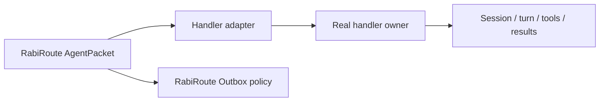

<!-- docs-language-switch -->
<div align="center">
English | <a href="./agent-adapter-standard-requirements.md">简体中文</a>
</div>
<!-- /docs-language-switch -->

# Standard Agent Adapter Requirements

This document defines the product, architecture, interface, reliability, UI, security, and acceptance expectations for a RabiRoute handler adapter. It applies to Desktop owners, CLIs, background services, remote bridges, bot platforms, and manual handoff applications.

Not every handler has projects, persistent sessions, tools, streaming, or cancellation. The adapter must declare what it actually supports, and the UI must not present an unverified capability as available.

## One-sentence standard

> A user should be able to discover the handler, bind the correct project/session, deliver a message reliably, and understand real status and results without learning ports, processes, or UUIDs. Failure must identify the broken layer and must not silently change Runtime, session, owner, or permissions.

## P0 contract

Every adapter must satisfy these rules before advanced features matter:

1. Reuse the bound session only when the saved visible name and immutable ID still point to the same unarchived owner record in the configured workspace. If the saved ID points to an archived task, block creation and require an explicit restore or reselection instead of treating it as absent.
2. When the ID is missing, invalid, or no longer paired with the saved name, search by the Manager-saved name plus normalized workspace. Rebind the unique most recently updated match when one or more candidates exist, create once only when there is no match, and ask the user only when the maximum update time is tied or unusable.
3. Deliver to the real owner that provides the user-visible task and tool context. Sharing a database, title, or session ID with a second Runtime is not unified ownership.
4. Saving settings completes the binding transaction and persists visible name, full session ID, and workspace together.
5. Handle renames as safe rebinding. If either the Agent owner or Rabi changes the visible name, the stale name-ID pair must be resolved again by the same latest-match rule instead of silently delivering to the old ID.
6. Scan once when the settings surface opens, then only on explicit refresh. Input, blur, save, health polling, and timers must not create an uncontrolled scan loop.

If a handler cannot reach the product's real owner through an official or verified bridge, mark it `experimental` and say that user-visible session delivery is not guaranteed.

## User-observable contract

The user must be able to answer:

- Is the handler installed and authenticated?
- Which project/workspace and session are bound?
- Is that binding verified or inferred?
- Was the last message accepted by the real owner?
- Is the owner idle, active, unavailable, or ambiguous?
- Which layer failed: discovery, authentication, project, session, transport, owner, turn, result, or output policy?
- What is the safest next action?

Status must come from the actual handler/owner whenever possible, not from a locally fabricated “connected” flag.

## Shared vocabulary

| Term | Meaning |
| --- | --- |
| Handler/Agent | Product or service that understands and performs the task |
| Host | User-facing application or interface |
| Runtime | Process/service that executes turns |
| Owner | The component that owns the real task, events, tools, model, and permissions |
| Transport | Channel used to communicate with that owner |
| Adapter | RabiRoute boundary that translates packets into the handler protocol |
| Workspace/Project | Safety and context scope for a session |
| Session/Task/Thread | Handler-owned conversation identity |
| Turn | One execution inside a session |
| Tool/Capability | Function registered by the actual owner/runtime |

Do not use “same product” as evidence of “same Runtime,” and do not use “same session ID” as evidence of “same owner.”

## Architecture boundaries



- RabiRoute owns routing context and external-output gates.
- The handler owner owns task execution, tools, model, sandbox, and internal approvals.
- The adapter translates and reports; it does not become a second owner.
- Handler runtime approval does not authorize QQ, documents, devices, or other RabiRoute external outputs.

## Maturity levels

### `stub`

Manual handoff only: open an application, copy a prompt, or generate a file. Do not claim persistent-session injection or reliable result tracking.

### `experimental`

Some discovery/delivery code exists, but real owner continuity, repeated same-session delivery, external compatibility, or recovery is not fully accepted.

### `verified`

The adapter has real owner-level delivery, configuration/diagnostics, automated contract tests, and environment-specific acceptance evidence. “The process started” or “the API returned 200” is not enough.

## Capability checklist

### Discovery and environment

- Detect installation/version and the exact executable/service being used.
- Distinguish “not installed,” “not running,” “not authenticated,” and “unsupported version.”
- Do not mutate user-level environment, registry, or host startup arguments just to make the integration work.

### Authentication and authorization

- Report credential presence without printing secrets.
- Keep authentication ownership with the handler product.
- Separate handler permissions from RabiRoute external-action policy.

### Workspace/project

- List or validate workspaces where the handler supports them.
- Normalize paths and reject workspace mismatch.
- Do not silently switch to another project because it has a similar name.

### Session discovery and display

- Use full IDs internally, but validate them together with the saved visible name and workspace.
- Show a human-readable name and last activity in the UI.
- Support complete listing or reliable pagination.
- For same-name sessions in one workspace, sort by parseable `updatedAt` and bind the unique maximum; do not depend on database return order. Preserve ambiguity only when the maximum time is tied or all candidate times are unusable.

### Session resolution and controlled creation

- Read the saved ID first and verify that the owner record still has the saved visible name.
- Fall back to name plus workspace when the ID is absent, invalid, or paired with a different name.
- When one or more exact name/workspace matches exist, bind the unique latest `updatedAt`; create only when the match count is zero. A tied or unusable maximum requires explicit selection.
- Create idempotently and serialize concurrent first deliveries.
- Treat delayed indexing as “wait for the same session,” not “create again.”
- Persist the new ID before sending later messages.

### Delivery

- Deliver to the real owner and expose whether the message was started, steered, queued, or rejected.
- Serialize messages where concurrent delivery would corrupt session order.
- Fail closed when the intended owner is unavailable.
- Do not add a hidden fallback Runtime or permission expansion.

### Status, events, and results

- Report binding, owner readiness, active turn, last accepted delivery, and last error separately.
- Prefer owner events over polling; use bounded polling where events are unavailable.
- Do not report a message as delivered merely because it was written to a local file or queue.

### Tools, model, sandbox, and approvals

- Treat these as owner capabilities.
- Do not promise a tool because its name appears in a prompt.
- Do not let route configuration silently override the model or sandbox of an already-owned Desktop task.
- Show unavailable capability explicitly.

### Diagnostics

Errors should identify the layer and include a safe remediation. Never print tokens, cookies, passwords, raw IPC payloads containing secrets, or private conversation content.

### Lifecycle and upgrades

- Handler and RabiRoute must start, stop, and upgrade independently unless the product explicitly defines otherwise.
- Version-sensitive private bridges require detection, regression tests, and fail-closed behavior.
- Remove retired scripts, UI entries, environment variables, and fallbacks rather than leaving hidden dual implementations.

## Recommended capability model

```json
{
  "maturity": "verified",
  "discovery": { "installed": true, "version": "..." },
  "authentication": { "ready": true },
  "workspace": { "supported": true, "selected": "..." },
  "sessions": {
    "list": true,
    "read": true,
    "resolve": true,
    "create": true,
    "rename": true,
    "pagination": true
  },
  "delivery": {
    "owner": "desktop-task",
    "start": true,
    "steer": true,
    "stream": true,
    "cancel": false,
    "fallback": false
  },
  "capabilities": {
    "modelOwnedByTarget": true,
    "toolsOwnedByTarget": true,
    "sandboxOwnedByTarget": true,
    "approvalsOwnedByTarget": true
  }
}
```

Unsupported fields should be false or absent—not simulated.

## Recommended Manager API semantics

- `scan`: explicit discovery with maturity, requirements, warnings, and endpoints.
- `list`: paginated session/project listing.
- `read`: read exact immutable ID.
- `resolve`: validate name + ID + workspace first; then name plus workspace; optional idempotent create.
- `create`: controlled creation with a returned immutable ID.
- `send`: deliver through the real owner.
- `status`: owner/binding/turn/result state, not just process existence.

Mutating APIs must be explicit. Health scans remain read-only.

## WebGUI requirements

- Show maturity next to the handler name.
- Separate install/auth, workspace, session binding, owner readiness, and last delivery.
- Display names for people; retain full IDs internally.
- Make “scan,” “select,” “save binding,” “initialize,” and “send test message” distinct actions.
- Warn before a real test that can create a session or start a turn.
- Do not claim “connected” when only configuration exists.

## Required test matrix

At minimum, cover:

- installation/authentication states;
- valid name-ID binding reuse and workspace mismatch;
- unique/latest same-name rebind, tied-latest ambiguity, and zero-match creation;
- delayed indexing and concurrent single-flight creation;
- Agent-side and Rabi-side rename rebinding;
- complete pagination beyond 100 sessions;
- bounded scan count;
- owner unavailable with no fallback;
- start versus steer behavior;
- status and error transitions;
- independent cold start and shutdown;
- secret redaction and repository hygiene;
- real owner-level acceptance in the target product.

## New-adapter documentation template

Every public integration guide should state:

1. Product boundary and maturity.
2. Real owner and transport.
3. Supported discovery/auth/workspace/session operations.
4. Delivery and result behavior.
5. Tool/model/sandbox/approval ownership.
6. Failure and no-fallback rules.
7. Configuration and public-safe examples.
8. Acceptance matrix and remaining environment checks.

## Red lines

- Do not replace the intended owner with a convenient background Runtime.
- Do not use display names as immutable identity.
- Do not create duplicates after temporary read/index failure.
- Do not scan continuously from UI reactivity or health polling.
- Do not report `verified` from a scan-only or process-only test.
- Do not leak credentials or runtime data.
- Do not let a handler adapter redefine RabiRoute's router or Outbox boundary.

For the Codex-specific release gate, see [Codex Desktop Integration and Acceptance Contract](codex-desktop-agent-acceptance_en.md). For historical failures and design lessons, see [Agent Adapter Integration Lessons](agent-adapter-integration-lessons_en.md).
