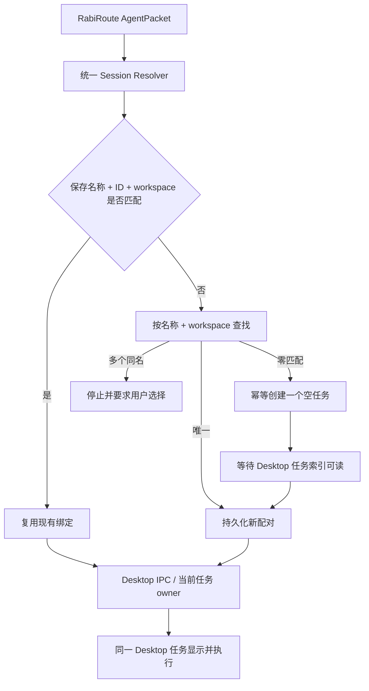

# Codex Desktop Agent 接入与验收合同

本文是 RabiRoute 接入 Codex/ChatGPT Desktop 的交付门禁。目标不是“后台能跑 Codex”，而是：Rabi 投递的消息进入用户正在使用的 Desktop 任务，由该任务的 owner 执行，并在同一任务中实时可见。

## 不可妥协的用户合同

1. 已绑定任务存在时，直接投递到 Rabi 保存的任务，不创建新任务。
2. 已绑定任务不存在、ID 失效或名称与 ID 不再配对时，按 `保存名称 + 规范化 workspace` 查找：唯一匹配则重绑，零匹配才幂等创建一次，多个同名必须让用户选择。
3. 真实消息只能交给 Desktop 当前任务 owner；不得启动备用 Runtime、不得恢复同一个 ID 后在另一个 Runtime 中执行。
4. 设置页选择或输入名称并保存时，必须完成解析/创建，并把可见名称、完整任务 ID、workspace 作为一个配对持久化。
5. Desktop 改名或 Rabi 修改保存名称后，原名称与 ID 配对立即失效，必须重新执行第 2 条，不得继续投向旧 ID。
6. 项目和任务全量扫描只允许在进入设置页时自动执行一次，之后仅由用户点击“扫描/刷新”触发。展开、输入、失焦、保存、健康轮询、定时器和 Manager 重启均不得触发扫描。
7. “自动初始化会话”必须先保存并确认绑定，再通过正式角色消息链向同一 Desktop 任务投递人格、路径、计划、记忆和必读上下文。初始化投递失败时保留已创建 ID，只重试投递，不得再次创建任务。

## 4510 启动安全门

`127.0.0.1:4510` 属于 Codex/ChatGPT Desktop 自身生命周期。RabiRoute 不拥有这个端口，也不得让 Desktop 依赖 RabiRoute 才能启动。

以下行为一律禁止：

- 写入进程、用户或机器级 `CODEX_APP_SERVER_WS_URL`。
- 把 Desktop 固定指向 RabiRoute Manager、Gateway、托盘或其他代理端口。
- 为了投递而关闭、重启或接管 Codex/ChatGPT Desktop。
- 在 4510 上启动 RabiRoute listener，或把 4510 当作安装包健康检查前提。
- Desktop owner 暂时不可用时静默启动第二个 Runtime 继续执行。

必须验证两个独立冷启动：RabiRoute 未运行时 Desktop 仍可启动；Desktop 未运行时 RabiRoute Manager 仍可启动，并明确显示 Desktop 未就绪。任何一方退出都不能拖死另一方。

## 正确链路



新建任务与首条消息必须分开理解：允许短生命周期 bootstrap 只创建空任务元数据，但创建后必须等待 Desktop 索引识别同一个 ID；首条及后续真实消息仍由 Desktop owner 接收。等待期间不能因“暂时查不到”再次创建。

## 身份与状态规则

- 用户界面显示 `任务名称 + 最后会话时间`，不要求用户查看或输入 UUID。
- 内部身份是 `可见名称 + 完整任务 ID` 配对，workspace 是安全边界和消歧条件。
- 最后时间仅用于展示；不能用“最新任务”替代精确绑定。
- 列表必须支持全部任务或可靠分页，不能只展示前 20/100 条却声称是全部。
- 同名且同 workspace 的多个任务不得自动取第一个或最新一个。
- 创建成功、首投失败属于“已创建、待重试投递”，不是“不存在会话”。

## 自动初始化事务

按钮执行顺序固定为：

```text
保存设置
  -> 统一 resolver 校验、重绑或幂等创建
  -> 持久化名称 + 完整 ID + workspace
  -> 角色面板生成正式 AgentPacket
  -> Desktop owner 接收初始化消息
  -> Desktop 同一任务可见
```

保存失败时不得投递；初始化投递失败时不得回滚已创建任务，也不得再次 create。后续重试必须使用已经持久化的同一个 ID。

## 最低验收矩阵

| 场景 | 预期结果 |
| --- | --- |
| 有效名称 + ID | 直接投递；任务数不变 |
| ID 非法或已删除，名称唯一存在 | 自动重绑；任务数不变 |
| 名称不存在 | 创建一个、保存 ID、投递到该任务 |
| 创建后 Desktop 索引延迟 | 有限等待同一 ID；不创建第二个 |
| 并发两次首次投递 | single-flight；只创建一个任务 |
| Desktop 改名 | 旧配对失效；按保存名称查找/创建 |
| Rabi 改名并保存 | 按新名称查找/创建；旧任务不再接收 |
| 多个同名任务 | 停止并展示候选，不猜测 |
| 初始化消息首次失败 | 保留已创建 ID；只重试消息 |
| 超过 100 个任务 | 仍可找到和选择全部任务 |
| 设置页闲置、输入、失焦、保存 | 扫描请求数不增长 |
| Desktop 未运行 | 明确失败；不启动备用 Runtime |
| RabiRoute 未运行 | Desktop 独立正常启动 |
| 残留 endpoint 环境变量 | Rabi 子进程忽略；安装器不写入 |
| 4510 检查 | 端口 owner 仍为 Desktop/Codex，不是 RabiRoute |

代码测试和 mock 只能证明 resolver 与错误路径；正式交付还必须观察 Desktop 目标任务：消息真实出现、任务数符合预期、工具来自同一任务 owner。

## Agent 开发者交付顺序

1. 先写清用户看到消息的位置、唯一 owner、会话身份和禁止 fallback。
2. 先做独立生命周期与 4510 安全测试，再做会话 UI。
3. 共用一个 resolver 给设置保存、真实投递和自动初始化，禁止各写一套查找逻辑。
4. 用测试锁定名称 + ID 重绑、single-flight、索引延迟、全量列表和扫描次数。
5. 完成 Desktop 实机投递后才能标记 `verified`；仅扫描成功或后台 Runtime 成功都不算。

配套实现规范见[标准 Agent 端接入需求](agent-adapter-standard-requirements.md)，历史失误与原因见[Agent 端接入：历史问题、正确边界与验证手册](agent-adapter-integration-lessons.md)。
