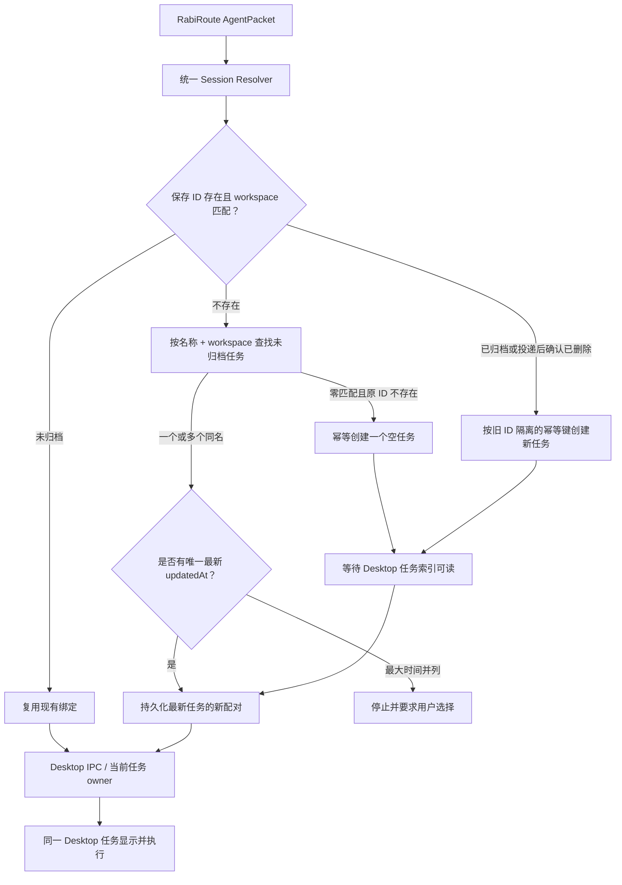

<!-- docs-language-switch -->
<div align="center">
<a href="./codex-desktop-agent-acceptance_en.md">English</a> | 简体中文
</div>
<!-- /docs-language-switch -->

# Codex Desktop Agent 接入与验收合同

本文是 RabiRoute 接入 Codex/ChatGPT Desktop 的交付门禁。目标不是“后台能跑 Codex”，而是：Rabi 投递的消息进入用户正在使用的 Desktop 任务，由该任务的 owner 执行，并在同一任务中实时可见。

## 不可妥协的用户合同

1. 已绑定 ID 存在、workspace 一致且任务未归档时，直接投递到该任务，不创建新任务；Desktop 标题或 SQLite `title` 变化不影响绑定。保存 ID 指向已归档任务时，不再定位或复用其它同名任务；真实投递或保存提交点幂等创建新任务，更新绑定后投递到新任务。
2. 计划的审批、执行引导和 QA 失败续投必须复用同一计划。绑定任务归档，或 Desktop 已重试唤醒但精确 ID 已无法从本地状态读取时，按保存标题创建替代任务，成功投递后只更新该计划原有 `taskBinding` 并返回警告；不得复用同名有效任务或创建重复计划。
3. 已绑定 ID 为空、非法或确实不存在时，按 `保存名称 + 规范化 workspace` 查找：一个或多个候选按 `updatedAt` 降序重绑唯一最新任务，零匹配才幂等创建一次；最大时间并列时让用户选择。
4. 真实消息只能交给 Desktop 当前任务 owner；不得启动备用 Runtime、不得恢复同一个 ID 后在另一个 Runtime 中执行。
5. 设置页选择或输入名称并保存时，必须完成解析/创建，并把可见名称、完整任务 ID、workspace 作为一个配对持久化。
6. Desktop 改名或内部标题自动变成首条 prompt 时仍续投完整 ID；用户在 Rabi 明确输入新名称时，前端先清空旧 ID，再执行第 3 条完成目标切换。
7. 项目和任务全量扫描只允许在进入设置页时自动执行一次，之后仅由用户点击“扫描/刷新”触发。展开、输入、失焦、保存、健康轮询、定时器和 Manager 重启均不得触发扫描。
8. “自动初始化会话”必须先保存并确认绑定，再通过正式角色消息链向同一 Desktop 任务投递人格、路径、计划、记忆和必读上下文。初始化投递失败时保留已创建 ID，只重试投递，不得再次创建任务。

## 4510 启动安全门

`127.0.0.1:4510` 属于 Codex/ChatGPT Desktop 自身生命周期。RabiRoute 不拥有这个端口，也不得让 Desktop 依赖 RabiRoute 才能启动。

以下行为一律禁止：

- 写入进程、用户或机器级 `CODEX_APP_SERVER_WS_URL`。
- 把 Desktop 固定指向 RabiRoute Manager、Gateway、托盘或其他代理端口。
- 为了投递而关闭、重启或接管 Codex/ChatGPT Desktop。
- 在 4510 上启动 RabiRoute listener，或把 4510 当作安装包健康检查前提。
- Desktop owner 暂时不可用时静默启动第二个 Runtime 继续执行。

必须验证两个独立冷启动：RabiRoute 未运行时 Desktop 仍可启动；Desktop 未运行时 RabiRoute Manager 仍可启动，并明确显示 Desktop 未就绪。任何一方退出都不能拖死另一方。

## 正确链路


```mermaid
flowchart TD
    R["RabiRoute AgentPacket"] --> S["统一 Session Resolver"]
    S --> V{"保存 ID 存在且 workspace 匹配？"}
    V -->|"未归档"| B["复用现有绑定"]
    V -->|"已归档或投递后确认已删除"| C2["按旧 ID 隔离的幂等键创建新任务"]
    V -->|"不存在"| L["按名称 + workspace 查找未归档任务"]
    L -->|"一个或多个同名"| N{"是否有唯一最新 updatedAt？"}
    L -->|"零匹配且原 ID 不存在"| C["幂等创建一个空任务"]
    N -->|"是"| P["持久化最新任务的新配对"]
    N -->|"最大时间并列"| A["停止并要求用户选择"]
    C --> W["等待 Desktop 任务索引可读"]
    C2 --> W
    W --> P
    B --> D["Desktop IPC / 当前任务 owner"]
    P --> D
    D --> T["同一 Desktop 任务显示并执行"]
```

新建任务与首条消息必须分开理解：允许短生命周期 bootstrap 只创建空任务元数据，但创建后必须等待 Desktop 索引识别同一个 ID；首条及后续真实消息仍由 Desktop owner 接收。等待期间不能因“暂时查不到”再次创建。

创建事务还必须在 Manager 运行期保存持久 reservation。`thread/start` 前先记录 `reserved/creating`，取得 ID 后立即记录 `thread_created`，再进入命名和初始 turn；HTTP 回执丢失、命名失败或 Manager 重启后，只要无法证明 `thread/start` 尚未执行，就保持 `uncertain` 并禁止自动再次创建。`state_db` 回读负责补充证据，不能替代 reservation 成为幂等真源。

## 身份与状态规则

- 用户界面显示 `任务名称 + 最后会话时间`，不要求用户查看或输入 UUID。
- 内部身份是 `完整任务 ID + workspace`；可见名称用于显示、无 ID 时查找和用户显式切换目标。
- Codex 的用户可见名称以 Desktop 左侧聊天栏为准：全量扫描使用 app-server `thread/list` 的 `thread.name`，按 ID 读取使用同一侧边栏会话索引；两者都通过 `codexDesktopBridge.ts` 的统一任务读取模型对外提供。SQLite `threads.title` 可能是首条 prompt，只能补充 owner 状态，不能成为任务名、下拉名称或同名查找依据。
- 最后时间仅用于展示；不能用“最新任务”替代精确绑定。
- 列表必须支持全部任务或可靠分页，不能只展示前 20/100 条却声称是全部。
- 同名且同 workspace 的多个任务必须按可解析的 `updatedAt` 自动取唯一最新者，不能依赖数据库返回顺序；最大时间并列或都无有效时间时才要求选择。
- 创建成功、首投失败属于“已创建、待重试投递”，不是“不存在会话”。
- 投递状态必须区分：内部过渡态 `accepted` 只表示 RabiRoute 已开始走 Desktop 主链；每次真实 Desktop 投递都附带 UUID `deliveryId`，只有该编号已写入目标任务 rollout 才能记为 `delivered`。`start/steer` 的 IPC 成功但 rollout 没有编号时，`steer` 必须改走一次 `start`；仍无编号则记为 `failed`。不得把 Route 受理、IPC 成功或仅选中任务冒充 Desktop 已接收。
- 已匹配的普通消息端事件应直接投递：先尝试 `steer` 当前活跃 turn，只在 turn 已结束/不存在时 `start`。Heartbeat 可由专用忙碌跳过开关例外；语音可由专用热/关键词策略例外。
- 任务是否仍在运行不能只看 Desktop IPC 内存集合。Manager 按时间合并连接内活跃标记与 rollout 最近生命周期事件：较新的完成/中止/失败事件覆盖旧活跃标记，新一轮 IPC 活跃时间晚于旧 terminal 时仍保持运行；连接断开立即清空该连接的活跃标记。

### 语音消息端的公开 HTTP 终态

`POST /api/speech/messages` 不对外暴露仅表示排队的 `202 accepted`。Manager 在 HTTP 请求内等待 Gateway 子任务确认 Desktop owner 终态，但不等 Agent 回答：

- `200 / delivered`：Desktop owner 已接受 `start` 或 `steer`。
- `200 / recorded`：语音关键词模式未命中，转写已记录但未唤醒 Agent。
- `4xx/5xx`：Route 校验、Desktop owner 加载、IPC 或投递超时失败。

这个合同只证明目标 owner 收到了消息，不证明 Agent 已经生成回答、Outbox 已回传或 TTS 已播放。

闲置任务开启新 turn 时，Desktop IPC 的 `thread-follower-start-turn` 必须使用协议版本 `2`；`thread-follower-steer-turn` 保持版本 `1`。版本不匹配会让已加载的 owner 被路由器误判为 `no-client-found`。

## 自动初始化事务

按钮执行顺序固定为：

```text
保存设置
  -> 统一 resolver 校验、重绑或幂等创建
  -> 持久化名称 + 完整 ID + workspace
  -> 角色面板生成正式 AgentPacket
  -> Desktop owner 接收初始化消息
  -> Desktop 同一任务可见
```

保存失败时不得投递；初始化投递失败时不得回滚已创建任务，也不得再次 create。后续重试必须使用已经持久化的同一个 ID。

## 最低验收矩阵

| 场景 | 预期结果 |
| --- | --- |
| 有效 ID + workspace，数据库标题已变化 | 直接投递原 ID；任务数不变 |
| UI 名称与 SQLite `title` 不同 | 按 app-server `thread.name` 找到并显示原任务；不创建 |
| 保存 ID 指向已归档任务，另有同名有效任务 | 新建任务并更新绑定；不复用同名任务 |
| 保存 ID 指向已归档任务且没有同名有效任务 | 新建任务、更新绑定并投递 |
| ID 非法或已删除，名称唯一存在 | 自动重绑；任务数不变 |
| 已绑定 ID 在投递后确认已删除 | 创建替代任务、更新原计划 `taskBinding`、投递并返回警告 |
| IPC 返回成功但目标 rollout 没有本次 `deliveryId` | 闲置任务从 `steer` 回退到 `start`；仍无编号则失败，不标记已投递 |
| 名称不存在 | 创建一个、保存 ID、投递到该任务 |
| 创建后 Desktop 索引延迟 | 有限等待同一 ID；不创建第二个 |
| 并发两次首次投递 | single-flight；只创建一个任务 |
| Desktop 改名 | 完整 ID + workspace 继续绑定原任务；后续显示采用左侧聊天栏新名称；任务数不变 |
| Rabi 改名并保存 | 按新名称查找/创建；旧任务不再接收 |
| 多个同名任务 | 绑定 `updatedAt` 唯一最新者；最大时间并列才展示候选 |
| 初始化消息首次失败 | 保留已创建 ID；只重试消息 |
| 超过 100 个任务 | 仍可找到和选择全部任务 |
| 设置页闲置、输入、失焦、保存 | 扫描请求数不增长 |
| Desktop 系统链接只切到项目，没有加载目标任务 owner | 每次投递只请求打开一次；继续有限等待后明确失败，要求用户在 Desktop 左侧打开目标任务或回到 RabiRoute 重选；不得反复抢占窗口焦点 |
| Desktop 未运行 | 明确失败；不启动备用 Runtime |
| RabiRoute 未运行 | Desktop 独立正常启动 |
| 残留 endpoint 环境变量 | Rabi 子进程忽略；安装器不写入 |
| 4510 检查 | 端口 owner 仍为 Desktop/Codex，不是 RabiRoute |

代码测试和 mock 只能证明 resolver 与错误路径；正式交付还必须观察 Desktop 目标任务：消息真实出现、任务数符合预期、工具来自同一任务 owner。

## Agent 开发者交付顺序

1. 先写清用户看到消息的位置、唯一 owner、会话身份和禁止 fallback。
2. 先做独立生命周期与 4510 安全测试，再做会话 UI。
3. 共用一个 resolver 给设置保存、真实投递和自动初始化，禁止各写一套查找逻辑。
4. 用测试锁定 ID + workspace 稳定续投、标题改写、归档或投递后确认删除时新建与绑定更新、Rabi 显式改绑、single-flight、索引延迟、全量列表和扫描次数。
5. 完成 Desktop 实机投递后才能标记 `verified`；仅扫描成功或后台 Runtime 成功都不算。

配套实现规范见[标准 Agent 端接入需求](agent-adapter-standard-requirements.md)，历史失误与原因见[Agent 端接入：历史问题、正确边界与验证手册](agent-adapter-integration-lessons.md)。
