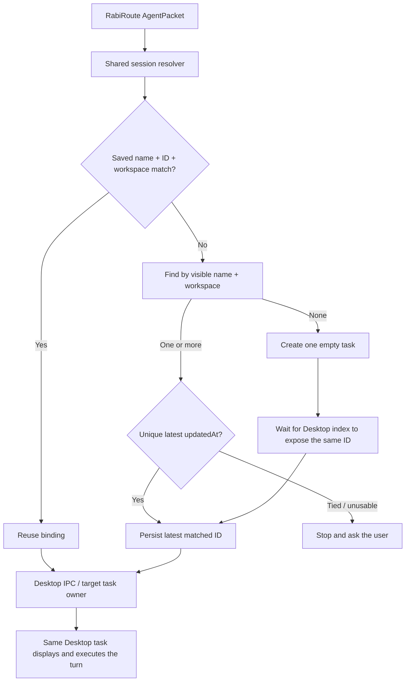

<!-- docs-language-switch -->
<div align="center">
English | <a href="./codex-desktop-agent-acceptance.md">简体中文</a>
</div>
<!-- /docs-language-switch -->

# Codex Desktop Integration and Acceptance Contract

This is the release gate for the Codex/ChatGPT Desktop adapter. Success does not mean that “Codex ran somewhere in the background.” It means that the routed message entered the Desktop task selected by the user, was executed by that task's owner, and became visible in the same task.

## Non-negotiable product contract

1. Deliver to the saved task only when the saved visible name, full task ID, and workspace identify the same unarchived Desktop owner record. An archived saved binding must return an actionable restore/reselect error and must never create a replacement task.
2. If the ID is empty, invalid, or no longer paired with the saved name, search by the saved visible name plus normalized workspace. When one or more candidates match, bind the unique most recently updated task; create once only when there is no match. Ask the user only when the maximum update time is tied or unusable.
3. A Desktop-side or Rabi-side rename invalidates the old name-ID pair and must trigger the same safe rebinding flow; it must never keep delivering to a stale target.
4. Real prompts go only to the current Desktop task owner. RabiRoute must not resume the same ID in another Runtime or silently switch execution paths.
5. Saving settings persists the visible name, complete task ID, and workspace as one binding. Selecting another task or typing a new name resolves and persists a new pair before later delivery.
6. Automatic scanning runs once when the settings page opens. Later scans happen only after the user clicks scan/refresh—not on expand, input, blur, save, health polling, timers, or Manager restart.
7. Automatic role initialization first saves and confirms the binding, then sends a normal role-panel `AgentPacket` to the same Desktop owner. If delivery fails after task creation, keep the ID and retry delivery; do not create again.

## Port 4510 safety gate

`127.0.0.1:4510` belongs to the Codex/ChatGPT Desktop lifecycle. RabiRoute does not own it and must not make Desktop depend on RabiRoute startup.

Forbidden behavior:

- Writing `CODEX_APP_SERVER_WS_URL` at process, user, or machine scope.
- Pointing Desktop at a RabiRoute Manager, gateway, tray process, or proxy port.
- Closing, restarting, or taking ownership of Desktop to make delivery work.
- Starting a RabiRoute listener on port 4510 or treating the port as an installer prerequisite.
- Starting a second execution Runtime when the Desktop owner is temporarily unavailable.

Required cold-start checks:

- Desktop starts normally while RabiRoute is stopped.
- RabiRoute Manager starts normally while Desktop is stopped and clearly reports that Desktop delivery is unavailable.
- Either application can exit without hanging or killing the other.

## Correct path



Creating a task and delivering its first prompt are separate operations. A short-lived project-pinned app-server may create and name an empty persistent task. It must not execute the prompt. The first and subsequent real prompts still go through Desktop IPC to the Desktop owner.

## Identity and state rules

- The UI shows task name and last activity; users do not type UUIDs.
- Internally, the binding is visible name plus complete task ID, with workspace as the safety boundary.
- Last activity is display/sorting data, not identity.
- Listing must support all tasks or reliable pagination. A first-page-only list must not claim to be complete.
- For same-name tasks in one workspace, sort by parseable `updatedAt` and bind the unique maximum; never use database return order. Require selection only when the maximum time is tied or all candidate times are unusable.
- “Task created, initial delivery failed” is a recoverable delivery state, not a missing task.

## Automatic initialization transaction

```text
Save settings
  -> resolve, rebind, or idempotently create
  -> persist name + full ID + workspace
  -> role panel builds a normal AgentPacket
  -> Desktop owner receives initialization
  -> message is visible in the same task
```

Do not deliver after a failed save. Do not roll back a successfully created task after an initialization failure. Retry with the persisted ID.

## Minimum acceptance matrix

| Scenario | Expected result |
| --- | --- |
| Valid name + ID + workspace | Direct delivery; task count unchanged |
| Saved ID points to an archived task | Block and require restore/reselection; task count unchanged |
| Deleted/invalid ID, unique name match | Rebind; task count unchanged |
| No name match | Create one task, persist ID, deliver to it |
| Desktop index is briefly delayed | Wait for the same ID; do not create a duplicate |
| Two concurrent first deliveries | Single-flight creation; one task only |
| Desktop renames the bound task | Old pair becomes stale; resolve the saved name and do not use the old target |
| User types a new name and saves | Resolve/create the new target and stop using the old task |
| Several same-name tasks with one latest update | Bind the unique latest task; task count unchanged |
| Same-name tasks tied for latest or without usable times | Return candidates and require selection; do not create |
| Initial delivery fails after creation | Keep ID; retry the message only |
| More than 100 tasks | All tasks remain discoverable through pagination/full scan |
| Settings page sits idle or receives input/blur/save | Scan request count does not grow |
| Desktop is stopped | Clear failure; no alternate Runtime |
| RabiRoute is stopped | Desktop cold-start remains normal |
| Residual endpoint environment variable | RabiRoute child processes ignore it; installer does not write it |
| Port 4510 inspection | Owner remains Desktop/Codex, not RabiRoute |

Mocks and unit tests prove resolver and failure behavior only. Release acceptance must also observe the real Desktop task: the message appears there, task count is correct, and the tools/model/permissions come from that same task owner.

## Delivery order for implementers

1. Define the user-visible destination, unique owner, session identity, and forbidden fallbacks.
2. Test independent lifecycle and port-4510 safety before polishing the session UI.
3. Reuse one resolver for settings save, normal delivery, and automatic initialization.
4. Lock name-ID pair validation, rename rebinding, single-flight creation, delayed indexing, full listing, and scan counts with tests.
5. Mark Codex `verified` only after a real Desktop task receives and executes the prompt visibly.

See [Standard Agent Adapter Requirements](agent-adapter-standard-requirements_en.md) for the general contract and [Agent Adapter Integration Lessons](agent-adapter-integration-lessons_en.md) for the failed designs and their root causes.
