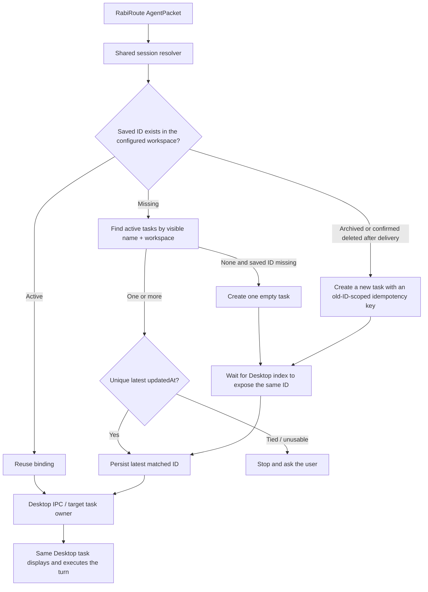

<!-- docs-language-switch -->
<div align="center">
English | <a href="./codex-desktop-agent-acceptance.md">简体中文</a>
</div>
<!-- /docs-language-switch -->

# Codex Desktop Integration and Acceptance Contract

This is the release gate for the Codex/ChatGPT Desktop adapter. Success does not mean that “Codex ran somewhere in the background.” It means that the routed message entered the Desktop task selected by the user, was executed by that task's owner, and became visible in the same task.

## Non-negotiable product contract

1. Deliver to the saved task when the full task ID exists in the configured workspace and the owner record is not archived. A mutable Desktop/SQLite title does not invalidate that identity. When the saved ID is archived, do not locate or reuse another same-name task. At a real delivery or save commit point, idempotently create a new task, persist the replacement binding, and deliver there.
2. Approval, execution guidance, and QA-failure continuation for a plan must reuse that same plan. When its bound task is archived, or Desktop wake-and-retry has completed and the exact ID can no longer be read from local state, create a replacement using the saved title and, after delivery succeeds, update only that plan's existing `taskBinding` and return a warning; do not reuse an active same-name task or create a duplicate plan.
3. If the ID is empty, invalid, or actually missing, search by the saved visible name plus normalized workspace. When one or more candidates match, bind the unique most recently updated task; create once only when there is no match. Ask the user only when the maximum update time is tied or unusable.
4. A Desktop-side rename or automatic title-metadata rewrite keeps the same ID target. Explicitly typing a new Rabi name clears the old ID before lookup/create and persists the selected replacement target.
5. Real prompts go only to the current Desktop task owner. RabiRoute must not resume the same ID in another Runtime or silently switch execution paths.
6. Saving settings persists the visible name, complete task ID, and workspace as one binding. Selecting another task or typing a new name resolves and persists a new pair before later delivery.
7. Automatic scanning runs once when the settings page opens. Later scans happen only after the user clicks scan/refresh—not on expand, input, blur, save, health polling, timers, or Manager restart.
8. Automatic role initialization first saves and confirms the binding, then sends a normal role-panel `AgentPacket` to the same Desktop owner. If delivery fails after task creation, keep the ID and retry delivery; do not create again.

## Port 4510 safety gate

`127.0.0.1:4510` belongs to the Codex/ChatGPT Desktop lifecycle. RabiRoute does not own it and must not make Desktop depend on RabiRoute startup.

Forbidden behavior:

- Writing `CODEX_APP_SERVER_WS_URL` at process, user, or machine scope.
- Pointing Desktop at a RabiRoute Manager, gateway, tray process, or proxy port.
- Closing, restarting, or taking ownership of Desktop to make delivery work.
- Starting a RabiRoute listener on port 4510 or treating the port as an installer prerequisite.
- Starting a second execution Runtime when the Desktop owner is temporarily unavailable.

Required cold-start checks:

- Desktop starts normally while RabiRoute is stopped.
- RabiRoute Manager starts normally while Desktop is stopped and clearly reports that Desktop delivery is unavailable.
- Either application can exit without hanging or killing the other.

## Correct path


```mermaid
flowchart TD
    P["RabiRoute AgentPacket"] --> R["Shared session resolver"]
    R --> I{"Saved ID exists in the configured workspace?"}
    I -->|"Active"| B["Reuse binding"]
    I -->|"Archived or confirmed deleted after delivery"| C2["Create a new task with an old-ID-scoped idempotency key"]
    I -->|"Missing"| N["Find active tasks by visible name + workspace"]
    N -->|"One or more"| L{"Unique latest updatedAt?"}
    L -->|"Yes"| S["Persist latest matched ID"]
    L -->|"Tied / unusable"| A["Stop and ask the user"]
    N -->|"None and saved ID missing"| C["Create one empty task"]
    C --> W["Wait for Desktop index to expose the same ID"]
    C2 --> W
    W --> S
    B --> D["Desktop IPC / target task owner"]
    S --> D
    D --> V["Same Desktop task displays and executes the turn"]
```

Creating a task and delivering its first prompt are separate operations. A short-lived project-pinned app-server may create and name an empty persistent task. It must not execute the prompt. The first and subsequent real prompts still go through Desktop IPC to the Desktop owner.

The creation transaction must also persist a runtime Manager reservation. It records `reserved/creating` before `thread/start`, records `thread_created` as soon as the ID is known, and only then advances through naming and the initial turn. After a lost HTTP response, naming failure, or Manager restart, any outcome that cannot prove `thread/start` was never called remains `uncertain` and must not create automatically again. `state_db` readback supplies evidence; it is not the idempotency source of truth.

## Identity and state rules

- The UI shows task name and last activity; users do not type UUIDs.
- Internally, identity is the complete task ID plus workspace. The visible name is display and no-ID lookup metadata.
- For Codex, the user-visible name comes from the Desktop left sidebar: full scans use app-server `thread/list` `thread.name`, while exact-ID reads use the same sidebar session index. Both are exposed through the single task read model in `codexDesktopBridge.ts`. SQLite `threads.title` may contain the first prompt and can supplement owner state only; it must not become the task name or drive dropdown labels and same-name lookup.
- Last activity is display/sorting data, not identity.
- Listing must support all tasks or reliable pagination. A first-page-only list must not claim to be complete.
- For same-name tasks in one workspace, sort by parseable `updatedAt` and bind the unique maximum; never use database return order. Require selection only when the maximum time is tied or all candidate times are unusable.
- “Task created, initial delivery failed” is a recoverable delivery state, not a missing task.
- Delivery state is explicit: internal transitional `accepted` means only that RabiRoute entered the Desktop path. Every real Desktop delivery carries a UUID `deliveryId`, and it is `delivered` only after that marker appears in the target task rollout. If `start/steer` IPC succeeds without the marker, retry `steer` once as `start`; if the marker is still absent, mark the delivery `failed`. Route acceptance, IPC success, or merely selecting the task must never impersonate Desktop receipt.
- A matched ordinary endpoint event is delivered directly: first attempt `steer` against the active turn, then `start` only when that turn is inactive or absent. Heartbeat may use its dedicated busy-skip exception, while speech may use its dedicated hot/keyword exception.
- Manager must not decide task activity from the Desktop IPC memory set alone. It timestamp-merges the connection-scoped active marker with the latest rollout lifecycle event: a newer completion, abort, or failure supersedes an older active marker; a genuinely newer IPC start remains active until rollout catches up; disconnect clears that connection's markers immediately.

### Public HTTP terminal state for speech

`POST /api/speech/messages` does not expose a queue-only `202 accepted` result. Manager waits within the HTTP request for the gateway child process to confirm the Desktop-owner terminal state, while still not waiting for the Agent answer:

- `200 / delivered`: the Desktop owner accepted `start` or `steer`.
- `200 / recorded`: speech keyword mode did not match; the transcript was recorded without waking the Agent.
- `4xx/5xx`: Route validation, owner loading, IPC, or delivery-timeout failure.

This contract proves that the target owner received the message. It does not prove that the Agent has answered, Outbox has returned a reply, or TTS has finished playback.

When an idle task starts a new turn, Desktop IPC must send `thread-follower-start-turn` with protocol version `2`; `thread-follower-steer-turn` remains version `1`. A version mismatch makes the router report `no-client-found` even when the owner is loaded.

## Automatic initialization transaction

```text
Save settings
  -> resolve, rebind, or idempotently create
  -> persist name + full ID + workspace
  -> role panel builds a normal AgentPacket
  -> Desktop owner receives initialization
  -> message is visible in the same task
```

Do not deliver after a failed save. Do not roll back a successfully created task after an initialization failure. Retry with the persisted ID.

## Minimum acceptance matrix

| Scenario | Expected result |
| --- | --- |
| Valid ID + workspace after SQLite title mutation | Direct delivery to the same ID; task count unchanged |
| UI name differs from SQLite `title` | Find and display the original task by app-server `thread.name`; do not create |
| Saved ID points to an archived task and an active same-name task exists | Create a new task and persist its ID; do not reuse the same-name task |
| Saved ID points to an archived task with no active same-name task | Create a new task, persist the replacement binding, and deliver there |
| Bound ID confirmed deleted after delivery | Create a replacement, update the original plan `taskBinding`, deliver, and return a warning |
| IPC succeeds but the target rollout lacks this `deliveryId` | Fall back from idle-task `steer` to `start`; fail rather than report delivery if the marker remains absent |
| Deleted/invalid ID, unique name match | Rebind; task count unchanged |
| No name match | Create one task, persist ID, deliver to it |
| Desktop index is briefly delayed | Wait for the same ID; do not create a duplicate |
| Two concurrent first deliveries | Single-flight creation; one task only |
| Desktop renames the bound task or rewrites title metadata | Continue the same ID; task count unchanged |
| User types a new name and saves | Resolve/create the new target and stop using the old task |
| Several same-name tasks with one latest update | Bind the unique latest task; task count unchanged |
| Same-name tasks tied for latest or without usable times | Return candidates and require selection; do not create |
| Initial delivery fails after creation | Keep ID; retry the message only |
| More than 100 tasks | All tasks remain discoverable through pagination/full scan |
| Settings page sits idle or receives input/blur/save | Scan request count does not grow |
| The Desktop system link selects only the project and does not load the target task owner | Request one open per delivery, wait for a bounded period, then fail with instructions to open the exact task in Desktop or reselect it in RabiRoute; do not repeatedly steal window focus |
| Desktop is stopped | Clear failure; no alternate Runtime |
| RabiRoute is stopped | Desktop cold-start remains normal |
| Residual endpoint environment variable | RabiRoute child processes ignore it; installer does not write it |
| Port 4510 inspection | Owner remains Desktop/Codex, not RabiRoute |

Mocks and unit tests prove resolver and failure behavior only. Release acceptance must also observe the real Desktop task: the message appears there, task count is correct, and the tools/model/permissions come from that same task owner.

## Delivery order for implementers

1. Define the user-visible destination, unique owner, session identity, and forbidden fallbacks.
2. Test independent lifecycle and port-4510 safety before polishing the session UI.
3. Reuse one resolver for settings save, normal delivery, and automatic initialization.
4. Lock stable ID/workspace reuse, title-mutation continuity, replacement and persistence after archival or confirmed deletion after delivery, explicit Rabi-side switching, single-flight creation, delayed indexing, full listing, and scan counts with tests.
5. Mark Codex `verified` only after a real Desktop task receives and executes the prompt visibly.

See [Standard Agent Adapter Requirements](agent-adapter-standard-requirements_en.md) for the general contract and [Agent Adapter Integration Lessons](agent-adapter-integration-lessons_en.md) for the failed designs and their root causes.
