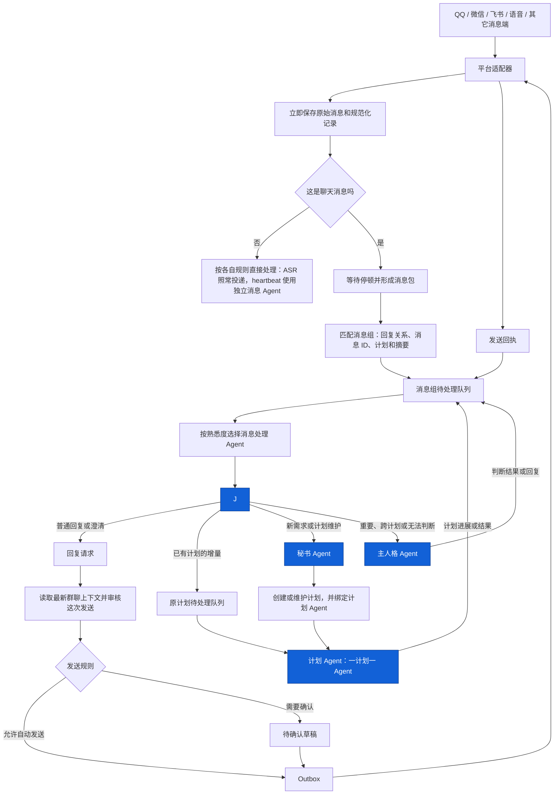
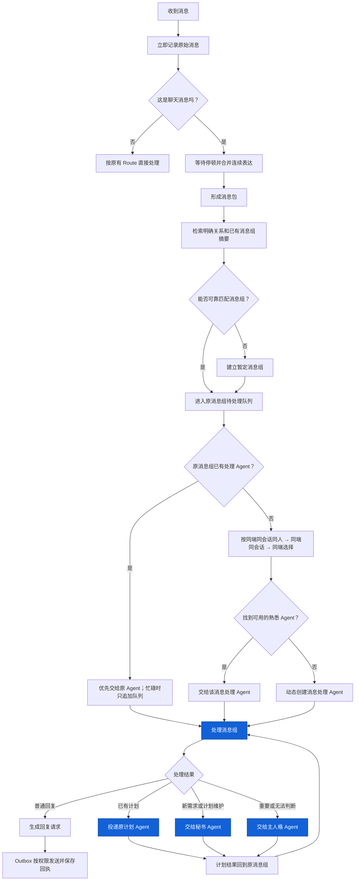

<!-- docs-language-switch -->

<a href="./group-message-batching-and-triage-plan_en.md">English</a> | 简体中文

<!-- /docs-language-switch -->

> [打开 HTML 架构预览](./group-message-batching-and-triage-plan.html) — 蓝色组件表示 Agent，页面可直接打印或导出 PDF。

# 对话消息收集、消息组与四类 Agent 协作设计

> 状态：运行基础链路已接入。消息会立即记录并按停顿合并到可恢复队列，Codex 消息处理 Agent 会按熟悉度复用或动态创建，并独立使用 `gpt-5.6-luna` / `medium`。四类 Agent 的委托与结果回传合同已经注入消息处理任务；真实群聊、私聊历史重放和四类 Agent 端到端联调仍待完成。

本文面向 RabiRoute 维护者和接入开发者。目标是在保留现有主人格 Agent、秘书 Agent 和“一计划一 Agent”的基础上，新增专职消息处理 Agent。它负责持续理解群聊、私聊、语音转写和其他自然语言消息，避免主人格与秘书被逐条消息占满。

本文把系统暂时判断为同一段连续讨论的一组消息称为“消息组”。消息组不是平台群聊，也不是计划；它是用于合并连续表达、恢复上下文、限制同组并发和关联计划的运行状态。

## 用户能看到的结果

启用消息处理 Agent 模式后：

- 每条原始消息仍会立即记录，不会因为等待合并而丢失。
- 同一个人连续发送的半句话、图片、文件和补充说明会尽量形成一个消息包。
- 聊天消息默认形成消息组，不需要逐个消息端开启；ASR、心跳和结构化事件不等待聊天片段合并。
- 当前只有 Codex 卡片显示“消息处理 Agent 模式”；开启后，该 Codex 处理端才会进入消息处理调度池。其他处理端不会显示或保存这个 Codex 专属设置。
- 消息处理 Agent 会优先复用自己熟悉的消息端、群或会话和说话人。
- 同一消息组已有消息处理 Agent 忙碌时，新消息只进入该组待处理队列，不启动第二个 Agent 争抢同一上下文。
- 同一群里的不同消息组仍可由不同消息处理 Agent 并行处理，不会因为一个长任务阻塞整个群。
- 主人格 Agent、秘书 Agent和计划 Agent继续保留，各自只处理自己的职责。
- Agent 只生成回复请求；实际发送、去重、重试和回执仍由 RabiRoute Outbox 与平台适配器负责。消息处理需求在发送前还要由 Manager 提供最新双向消息并核对上下文版本、已有回复、发送会话和精确正文；群里出现新消息或其它 Agent 已回复时，旧审核不能继续发送。
- 消息处理 Agent 可以参与普通群讨论、提出建议和补充风险，但不需要机械回复每一句；直接 @、直接回复、私聊和计划进展通知由 Manager 建立必须处理的发送需求。

## 四种 Agent 类型

系统保留并使用四种 Agent：

| Agent 类型 | 主要职责 | 不负责 |
| --- | --- | --- |
| 主人格 Agent | 保持长期人格、处理重要对话、跨计划判断、冲突和无法自动确定的事项 | 持续读取所有消息、推进每个计划 |
| 消息处理 Agent | 处理消息组、补充上下文、判断是否回复、关联计划、把事项交给秘书或计划 Agent | 创建和持续维护计划、执行具体业务、直接调用平台发送接口 |
| 秘书 Agent | 创建和维护计划、查重、安排计划 Agent、跟踪计划生命周期和需要上报的进展 | 持续监听所有聊天、替代计划 Agent执行业务 |
| 计划 Agent | 一计划一 Agent，调查、实现、验证并返回计划结果 | 管理其它计划、承担全局消息分诊 |

四种 Agent 都可以继承同一人格包里的身份、权限和必要技能，但拥有不同的任务说明和上下文范围。保留主人格不等于让所有消息都先经过主人格；消息处理 Agent可以直接处理日常对话，只有重要、跨计划或无法可靠判断的内容才升级给主人格。

## 当前事实与设计边界

当前 RabiRoute 已经具备以下基础：

- 平台适配器保存原始消息，并把规范化消息交给统一转发链路。
- 人格级统一双向消息记录按人格、逻辑消息端和会话保存入站与出站内容。
- `recentMessageLimits` 控制普通消息端自动附带多少条最近消息。
- QQ 已区分普通群消息、明确 @、直接回复和间接回复。
- Outbox 负责外部发送、回执和防重复边界。
- 每个计划通过 `taskBinding.sessionId + workspace` 绑定独立计划 Agent。
- 现有秘书 Agent和主人格 Agent继续保留，不因新增消息处理 Agent而删除。
- WebGUI 已把入口规则与 Codex 消息处理资格分开；Codex 消息处理 Agent 默认使用 `gpt-5.6-luna`、`medium`，不会改写主人格、秘书或计划 Agent 的模型。“消息处理 Agent 模式”“计划协助会话”和“Hook 管理”属于可声明的托管任务能力，当前只由 Codex 声明；自带 Agent 编排的平台不继承这些设置。

当前已接入对话片段延迟合并、可恢复消息包、消息组待处理队列和 Codex 消息处理 Agent亲和调度。明确回复旧消息时优先回到保存了该原始消息编号的 Agent；没有明确回复时按同消息端、同会话和同说话人的熟悉度选择。原 Agent正在处理相关内容时，新 Agent会先收到原任务 ID和内容预览，判断是转回原 Agent还是独立处理。当前仍缺真实消息历史重放、非 Codex消息处理端，以及秘书、计划 Agent和主人格的完整运行联调证据。

本设计不会创建第二份聊天或计划真源。原始消息、统一双向消息记录和现有计划文件仍是事实来源；消息包、消息组关系、Agent熟悉度和处理游标都是可检查、可修复的运行状态。

## 架构图

蓝色节点是四种 Agent。消息收集、消息组索引、待处理队列、熟悉度排序、发送权限、Outbox 和回执都是 RabiRoute 的程序职责，不新增 Agent 类型。

## 完整处理流程

## 聊天消息默认使用消息组

消息组机制位于平台规范化之后、Agent 投递之前。系统根据消息类型自动决定是否等待，不给每个消息端增加开关：聊天消息先记录，再合并连续表达、匹配消息组并交给消息处理 Agent；ASR 和结构化事件按原有规则直接处理。

具体消息端提供的线索不同：

| 消息类型 | 主要线索 | 处理方式 |
| --- | --- | --- |
| 群聊 | 群/会话 ID、说话人、回复链、@、引用和附件 | 自动形成消息组 |
| 私聊 | 私聊会话、对方、回复关系和最近消息组 | 自动形成消息组 |
| ASR / 语音转写 | 已由语音端完成切句 | 照常直接投递，不额外等待 |
| 邮件 | 邮件线程、主题、发件人与收件人 | 后续按线程直接归组 |
| Webhook、命令、审批、健康告警和结构化事件 | 请求 ID、工单 ID、计划 ID 等明确关系 | 直接处理 |
| heartbeat | 定时计划 ID | 消息处理 Agent 模式开启时立即投给独立消息 Agent，不读取聊天历史 |

是否等待由消息类型决定。命令、审批、按钮操作、ASR、心跳、健康告警和结构化系统事件都绕过聊天等待窗口。Codex 消息处理 Agent 模式开启时，heartbeat 立即形成一个独立消息组并投给消息处理 Agent；它不读取聊天最近历史，也不因主人格任务忙碌而跳过。

heartbeat 消息处理 Agent 自己执行增量遗漏检查：读取巡检游标后的群消息和小段重叠范围，与计划摘要、问题映射、业务任务绑定和上次发送回执对比。它不把定时巡检任务先转给主人格，也不修改计划；具体遗漏交秘书或原计划 Agent。自上次群汇报后出现真实状态变化时，它整理可直接发送的简短进展；只有该进展、具体待决定事项或跨计划冲突才交给主人格执行受限群发送。无变化时不唤醒主人格、不重复发群。

## 像 ASR 切句一样形成消息包

消息收集采用三个动作：

1. 每条消息立即记录。
2. 收到可合并的新片段时，延后当前消息包的完成时间。
3. 达到安静时间或最长等待时间后，形成消息包并进入消息组匹配。

建议默认值是实测起点，不是当前已实现事实：

| 场景 | 普通等待 | 未说完等待 | 最长等待 |
| --- | ---: | ---: | ---: |
| 私聊、明确 @、明确回复 | 3 秒 | 8 秒 | 15 秒 |
| 普通群聊自然语言 | 6 秒 | 12 秒 | 20 秒 |
| 命令和结构化事件 | 0 秒 | 0 秒 | 0 秒 |

每条平台消息继续保留独立 `messageId`、发送时间、发送人、结构化消息段和附件。消息包只引用这些原始消息，不能把它们永久改写成一条不可追溯的新消息。

这些时间只决定一句连续表达何时形成消息包，不决定消息组能够关联多久。间隔半小时、一天或更久的消息仍然可以通过回复链、原始消息 ID、计划关系或消息组摘要重新关联。时间只影响候选排序，不能直接排除旧消息组。

## 先匹配消息组，再选择熟悉的消息处理 Agent

系统要分别回答两个问题：

1. 这批消息是否属于已有消息组？
2. 应该交给哪个消息处理 Agent？

不能因为同一个人在同一个群里发言，就直接把所有内容合并到旧消息组。消息组匹配先看明确回复、引用、原始消息 ID、计划 ID 和已有消息组关系，再结合当前会话的活跃、等待和历史消息组摘要。语义相似、相同参与者和时间接近只能提高候选排序。

消息组确定后，消息处理 Agent按以下熟悉度选择：

1. 如果当前群消息引用了 Agent 发出的平台消息，RabiRoute 按消息端、平台消息 ID 和 Route 查询发送记录；记录中的完整 Agent 会话 ID 如果正好属于当前消息处理 Agent 池，该任务增加 `6000` 分。
2. 原来处理过这个消息组的 Agent 增加 `5000` 分。
3. 同一消息端 + 同一群或会话 + 同一说话人的 Agent 增加 `3000` 分；同一消息端 + 同一群或会话增加 `2000` 分；只命中同一消息端增加 `1000` 分。
4. 各项分数相加后排序，不把引用记录当成不可覆盖的固定路由。没有匹配会话、旧发送记录缺少发送者、查询失败或对应任务未启用时，只是不增加引用权重，继续使用其它分数。
5. 没有熟悉度匹配时，优先复用 Codex 当前明确为 `idle`、最久未使用的消息处理 Agent。
6. `notLoaded` 表示已有任务尚未加载，RabiRoute 会复用该任务并让 Desktop 正常打开，不把它当成新建理由。
7. 只有 Desktop 当前在线，而且所有已登记任务都明确为 `active` 或正在被本轮分配占用时，才动态创建新的消息处理 Agent。Desktop 离线、状态不可读取或 owner 尚未就绪时，消息组留在可恢复队列中等待，不能继续扩容。

发送记录中的 Agent 类型和会话 ID 由调用方声明并由 RabiRoute 保存，适合审计和调度参考，不是会话身份认证。每次引用查询和最终是否选中对应会话都会写入不含聊天正文的运行日志。

上述匹配只在已开启“消息处理 Agent 模式”、当前可用且有权接收该 Route 消息的 Codex 处理端中进行。动态创建时也使用启用了该模式的消息 Agent 模板，不会把主人格、秘书或某个计划 Agent临时改成消息处理 Agent。

这只是选择 Agent的优先顺序，不是永久绑定：

- 原消息组的 Agent空闲时，优先继续处理，减少重复理解。
- 原消息组的 Agent忙碌时，同组新消息直接补充到原任务，不启动第二个 Agent。
- 只是同群或同消息端，但属于另一个消息组时，先使用其他空闲 Agent；只有全部已有 Agent 都不可用时才动态创建，不能因为“没处理过这个群”就跳过空闲任务。
- 任务选择、占用和新建在同一个串行分配区间内完成；状态文件按完整任务 ID 去重，避免并发消息创建同一编号或重复登记同一任务。
- Codex 或 Desktop 退出时，RabiRoute保留原任务 ID、消息组和未投递内容，但不保存或猜测旧的繁忙状态；Desktop 恢复后优先继续原任务。只有任务明确不存在或已归档时，才进入受控接管流程并记录原因。

## 最近上下文与长期接续

消息处理 Agent默认收到有范围的上下文包：

1. 当前消息包及其全部原始消息 ID、发送者和附件。
2. 被回复的消息和可追溯回复链。
3. 当前消息前五分钟内最接近的讨论片段，优先用于解释“动态显示的”“不是这个”“具体内容是啥”等纠正、短句和追问。
4. 当前会话最近一段双向消息，数量继续由 `recentMessageLimits` 控制。
5. 当前消息组短摘要、参与者、未解决问题和处理游标。
6. 已关联计划的标题、状态、最近进展和等待事项。
7. 上一次实际发送的回复及其 Outbox 回执。

默认不读取完整群聊、全部计划或完整 Agent历史。证据不足时，消息处理 Agent可以按原始消息 ID、消息组 ID 或计划 ID继续查询更早记录。组成当前消息包的原始消息必须从“最近消息”部分排除，避免重复输入。

NapCat 图片在消息进入时立即下载到运行目录，并记录 `ready` 或 `unavailable`。`ready` 图片同时作为 Desktop `localImage` 输入投递，引用链中已保存的图片也会一并带入。每个新需求保留完整的原消息 ID、引用链 ID 和附件 ID。准备单条回复时，Agent 提交本次 `sourceMessageId`、明确回复链和正文实际引用附件的 `sourceEvidenceReview`；只有这个子集里的附件不可读才阻止发送。关闭整个聚合需求时仍要覆盖全部证据。

消息处理 Agent 最终引用 QQ 消息发送时还要提交 `params.replyImageDescriptions`。数组按被引用消息中的图片顺序排列，每张图片都写明实际内容和它想表达的意思；这项说明会再次在发送边界按来源记录核对，不能仅依赖 Agent 自报的 `sourceEvidenceReview`。发送成功后，说明追加到图片旁的同名 `.md`，因此后续任务可以追溯哪次发送、哪个 Agent 会话对图片作出了什么理解。

每个消息组只维护覆盖更新的短工作状态，不追加成第二份聊天流水。短状态记录讨论目标、已确认结论、未解决问题、关联计划、最后回复和处理游标。

## 消息处理 Agent怎样决定下一步

### 项目关键信息不能静默关闭

### 每条群消息都要处理计划和记忆召回

Manager 在登记消息需求时，会使用当前角色已有计划和记忆的标题、ID、关键词生成候选关联，并把候选项保存在需求的 `knowledgeMatches` 中。召回是资料检索，不是业务判断：命中不代表一定相关，没有命中也不代表消息没有价值。

消息处理 Agent 必须通过需求 GET 接口读取完整候选项，打开每个候选计划或记忆，并通过 `POST /api/message-processing/requirements/{requirementId}/knowledge-callback` 逐项回调：

- `unchanged`：已经核对，计划或记忆无需变化；仍要说明是否需要群内回复或讨论。
- `updated`：先调用原计划或原记忆的 PATCH 接口，再回调记录 ID 和核对证据。
- `created`：确有新事项或新知识时，先创建计划或记忆，再回调新记录。
- `not_relevant`：说明关键词为什么误命中。
- `deferred`：已经转交或仍缺材料；这不是最终回调，Manager 会继续跟踪。
- 更新或新建计划、记忆时，记录必须包含本组原消息 ID；Manager 会实际读取目标记录核验。
- 回复或参与讨论时，仍需取得 Outbox 的真实发送回执。
- 需要秘书、原计划任务或主人格继续处理时先 `handoff`，不能把转交写成已经完成。

Manager 从消息投递时开始计算一小时。仍有命中项没有最终回调时，会把原消息 ID、摘要和缺失的计划/记忆清单再次投给原消息处理 Agent；提醒后继续按一小时计算，直到全部回调。这个计时器只检查回调是否存在，不替 Agent 判断应该更新什么。

消息处理看板会逐项显示召回的计划和记忆、Agent 已回调的处理结果、尚未回调的项目以及下一次提醒时间。这样可以直接区分“Manager 没有召回”“Agent 判断不相关”“Agent 明确确认无变化”和“Agent 尚未处理”，不能再用一个笼统的“已投递”状态代替完整处理结果。

如果 Manager 没有召回任何计划或记忆，Agent 仍要从消息、附件和回复链提取对象、功能名、页面名、人物、版本和动作，用至少两组同义关键词主动查询。仍无关联时，再判断回复、讨论、新建计划、新建记忆或有证据地保持安静。

因此，“普通群消息”“不是关键事实”“无需新建计划”都不能直接推导出“不处理”。一条普通消息可能需要简短确认、参与讨论、成为既有计划的新反馈，或修订一条可复用记忆。

上线或公测日期、版本范围、批准/否决、负责人变更、取消/延期和发布版本可能构成项目事实，但是否成立、属于内部目标还是正式决定，必须由消息处理 Agent 阅读原消息、附件和回复链后判断。Manager 不使用关键词或正则表达式推断消息含义。

每个新消息需求在关闭或准备回复前，都要由 Agent 提交 `projectFactAssessment`：核对过的消息 ID、是否检查回复链、判断证据、判断时间，以及 `none` 或 `critical` 结论。判断为 `critical` 时还要提交事实类型和原文证据。Manager 只检查这些字段是否完整、是否覆盖本组全部原消息 ID，并保存 Agent 的判断。

命中后，消息处理 Agent必须先核对原消息与回复链，再完成以下任一动作：

- 交给原计划秘书，把事实写入对应计划及绑定记忆；
- 确认已有同一事实记录，给出记录 ID和核对证据；
- 证明是规则误报，写明原文与排除理由。

Agent 判断为项目事实后，记录结果写入 `criticalFactDisposition`。`recorded` / `duplicate` 必须包含记录 ID、核对证据和核对时间；`recorded` 还要写记录类型。Manager 会核对目标计划、记忆或文档确实存在，并包含本组原消息 ID。没有完成上述记录时只能 `handoff`，不能用 `no_reply` 或准备回复直接结束。是否需要在群里发言仍由上下文决定，但“不发言”不再等于“不记录”。

Heartbeat Agent 还要检查没有 `projectFactAssessment` 的需求，以及已经判断为 `critical` 但没有 `criticalFactDisposition` 的需求。语义复核仍由 Agent 完成；Manager 只提供缺失清单和超时状态。主人格回答排期、范围、负责人或审批状态前，先查群内最新决定和已登记事实，再用计划、会议材料与公开公告区分“内部目标”“正式决定”和“公开定档”。

同一条平台消息即使因为网关重放、超时恢复或消息组重新生成而得到不同的内部消息组 ID，也只能保留一个消息处理 requirement。身份由消息端、会话和原始 messageId 共同确定；已有 requirement 正在处理或已经结束时，不再向消息处理 Agent重复投递。后续消息已经改变或补全原消息时，用 `superseded_by_followup` 写明后续消息 ID 后关闭旧项。

消息处理 Agent输出结构化决定和简短依据：

| 判断结果 | 后续动作 |
| --- | --- |
| 无需处理 | 更新消息组游标，不回复 |
| 普通聊天或简单确认 | 生成回复请求 |
| 需要澄清 | 回复一个具体问题，并保持消息组暂定状态 |
| 已有计划补充 | 投递原 `taskBinding` 对应的计划 Agent |
| 新需求或需要建立、调整计划 | 交给秘书 Agent查重并维护计划 |
| 重要对话、跨计划冲突或证据不足 | 交给主人格 Agent |
| 高风险外部动作 | 进入现有审批和发送规则 |

消息处理 Agent不直接创建计划，不取代秘书 Agent，也不执行计划中的调查、编码、配置修改和验收。

## 秘书、计划 Agent与主人格怎样返回结果

- 秘书 Agent创建或更新计划后，把计划 ID、绑定关系和下一步返回原消息组。
- 计划 Agent执行后，把进展、结论、待确认事项和可对外说明的内容返回原消息组。
- 主人格 Agent完成重要判断后，把判断结果或建议回复返回原消息组。
- 消息处理 Agent结合原始聊天对象、最近消息和发送权限，决定是否立即通知、等待更多进展或形成待确认草稿。

这些 Agent 的 Codex 最终输出都属于内部任务记录，不会自动显示给群成员、私聊对象或主人格。需要外部用户看到的内容必须通过明确发送接口提交精确渠道和目标参数，并取得该平台回执；需要主人格决定或代为发送时，必须通过带真实来源任务 ID 的 Manager 线程桥投递给主人格。语音合成成功不能证明 QQ 已发送，只有目标平台回执或 Manager 接受回执能够证明结果已经进入正确出口。

成功回执本身只更新消息组状态，不必再次唤醒 Agent。发送失败、出现新消息、计划结果需要对外说明或判断发生变化时，才重新进入消息组待处理队列。

## 准确性不能换取速度

快速处理依靠消息合并、熟悉度复用和有界上下文，不能依靠忽略证据。提交计划关联、创建计划建议或高影响回复前：

- 有明确回复链、消息组 ID、计划 ID 或来源消息关系时，可以直接关联并保存证据。
- 只有语义相似、相同参与者或时间接近时，继续扩大消息组和计划查询范围。
- 仍然不确定时，保持暂定消息组并追问，不修改已有计划，也不把“没搜到”解释成新需求。
- 准备合并两个已有消息组、改变计划归属或自动发送高影响回复时，可以再启动同类型消息处理 Agent做独立复核；这不是第五种 Agent。
- 已经发送的回复、已经产生的计划动作和发送回执必须保留，不能通过重新分组隐藏。

验收时同时统计等待时间、Agent启动次数、输入 tokens、正确归组率、计划关联准确率、重复计划数和错误自动回复数。吞吐量提升不能抵消准确率下降。

## 谁写回复，谁实际发送

1. 是否需要回复：消息处理 Agent、计划 Agent或主人格 Agent根据各自负责的内容判断。
2. 回复内容：日常聊天和澄清由消息处理 Agent生成；计划结论由计划 Agent提供；重要对话由主人格 Agent处理。
3. 实际发送：统一交给 RabiRoute Outbox。Outbox检查权限、保存草稿、去重、重试并记录平台回执。

Agent提交回复请求或在 Codex 最终输出中写好正文，都不等于消息已经发出。只有平台发送回执能够证明外部消息成功；Agent 之间的交接则必须取得 Manager 接受回执。

## WebGUI 配置

启用消息处理 Agent 后，Route 配置页同时显示消息处理看板。它与消息组、转交和 Outbox 使用同一份 Manager 状态，不根据日志另行猜测。每项都会显示当前步骤、处理任务、是否繁忙、是否转交、为什么暂不回复、是否有真实发送回执、发送失败原因和已超时多久。

看板分三类关注对象：

- **必须处理**：直接 @、直接回复、私聊，以及已关联计划的进展通知。不能用泛化的“Agent 判断无需回复”关闭，只能在重复消息、对方已得到回答、撤回、来源无效等可解释情况关闭。
- **Agent 判断**：普通群讨论。Agent 可以回复问题、参与方案讨论、指出风险或提出建议；如果确实不适合插话，应通过接口提交原因，而不是安静结束任务。
- **异常**：处理任务已经空闲却没有提交结果、转交后长期没有返回、已经写出回复但没有 Outbox `sent` 回执、发送失败或超时。异常保持在看板中，供 heartbeat 或人工继续处理。

计划通知不靠 heartbeat 定时扫描。消息处理 Agent 向秘书或计划 Agent 转交时必须带上消息处理需求 ID 与 `planId`；Manager 保存来源群/私聊、原消息上下文和原消息处理任务。之后统一计划写入函数发现状态、当前步骤、下一步、等待事项或步骤进度变化时，直接生成新的通知需求并投给原消息处理任务。优先由它结合原讨论上下文组织自然回复，再交给 Outbox 发送。

第一版把入口规则和 Agent资格分开配置：

| 卡片位置 | 设置 | 默认设计 |
| --- | --- | --- |
| Route → 聊天消息端卡片 | 连续消息等待 | 聊天消息自动使用消息组；只配置等待参数，不提供关闭开关 |
| Agent 卡片 | 消息处理 Agent 模式 | 专职消息 Agent模板默认开启；主人格、秘书和计划 Agent默认关闭 |
| Codex Agent 卡片 | 消息处理模型与推理强度 | `gpt-5.6-luna` / `medium`；只用于消息处理 Agent 的新轮次 |
| Agent 卡片 | 可处理的 Route / 消息端范围 | 默认跟随现有 Agent 权限，不因开启模式自动扩大权限 |
| 人格配置 | 最近上下文数量 | 继续使用当前人格的 `recentMessageLimits` |
| Agent 编排 | 熟悉度复用 | 默认开启，顺序固定为原消息组、同端同会话同人、同端同会话、同端 |
| Agent 编排 | 同组并发 | 固定为 1，不能在 WebGUI 调成并发消费 |
| 回传与安全 | 自动发送类别 | 继续受现有 Route 输出与审批规则约束 |

Agent 卡片关闭“消息处理 Agent 模式”时，新聊天消息改投当前 Route 的主人格。已关联消息组后续产生的计划进展通知、计划/记忆回调提醒和 Agent 间待回复也迁移给主人格，不再唤醒旧消息处理任务。旧任务、已完成记录和审计关系保留；主人格不是 Codex 或缺少完整任务绑定时失败关闭，不会静默选择其它任务。重新开启后，消息处理任务恢复参与熟悉度匹配。这个开关不改变 Agent 人格、计划绑定或已有会话数据。

运行状态至少显示：正在收集的消息包、等待处理的消息组、最老等待时间、运行中的消息处理 Agent、每个 Agent最近熟悉的消息端/会话/说话人、消息组接管记录、最近失败和 Outbox 发送状态。

## 实施状态与后续顺序

### 第一阶段：自动消息分类和消息包预览（已实现）

- 在平台消息规范化之后增加通用消息收集模块。
- 原始消息和统一双向记录继续立即写入。
- 聊天消息端提供等待参数，不提供消息组开关；ASR 和结构化事件自动绕过等待。
- 生成可检查、可恢复的消息包，并在消息处理模式开启时改变真实 Agent投递。
- 用 QQ 群聊和私聊历史记录重放验证合并结果，并验证 ASR 保持直接投递。

### 第二阶段：消息组状态和上下文（基础链路已实现）

- 保存消息组 ID、短摘要、回复关系、处理游标和待处理队列。
- 支持半小时或更久后的消息重新检索历史消息组。
- 排除当前消息包与最近上下文中的重复消息。
- 验证 Gateway 或 Manager重启后不重复生成消息包。

### 第三阶段：新增消息处理 Agent和熟悉度调度（Codex 已实现）

- 新增消息处理 Agent类型，主人格、秘书和计划 Agent保持不变。
- 在 Codex 卡片加入“消息处理 Agent 模式”，并只从已开启的 Codex 处理端中选择或创建处理者。
- 实现原消息组、同端同会话同人、同端同会话、同端的优先匹配。
- 同组使用单处理租约；不同消息组允许并行。
- 失败时保留未提交消息，并根据短摘要和游标由同类型 Agent恢复。

### 第四阶段：接入四类 Agent协作（回传合同已实现，端到端联调待完成）

- 已有计划增量投给原计划 Agent。
- 新需求和计划维护交给秘书 Agent。
- 重要、跨计划和不确定事项交给主人格 Agent。
- 三类 Agent的结果都返回原消息组，再由消息处理 Agent决定回复。
- 所有外发继续通过 Outbox。

### 第五阶段：扩展到其它消息端并调优

- 在 QQ 验收后复用到微信、飞书和其它文字聊天端；ASR 保持直接投递。
- heartbeat 只检查未完成批次、断线游标和异常积压，不扫描完整聊天记录。
- 根据准确率、等待时间和重复回复调整默认值。

## 验收场景

至少覆盖：

1. 同一人发送半句话、图片和后半句话，只产生一个消息包。
2. 每条原始消息和 `messageId` 都能独立追溯。
3. 群聊和私聊不需要开关，默认进入消息组并可使用各自等待参数。
4. ASR、命令、审批、心跳和结构化事件不进入聊天等待窗口。
5. 半小时后的明确回复仍能关联原消息组。
6. 同一个群中的两个独立讨论进入两个消息组并行处理。
7. 原消息组的消息处理 Agent空闲时优先继续处理。
8. 原 Agent忙碌时，同组消息只追加队列，不启动第二个 Agent。
9. 只是同群但属于新消息组时，可以动态创建另一个消息处理 Agent。
10. 没有原 Agent时，依次按同端同会话同人、同端同会话和同端匹配。
11. 所有熟悉度条件都未命中时，能够动态创建消息处理 Agent。
12. Agent 卡片关闭消息处理模式后，新消息和未完成后续改投当前 Route 的主人格，不再自动打开旧消息处理任务；旧任务和审计记录不会丢失。
13. 没有回复关系的“可以”不能自动写入某个计划。
14. 已有计划补充保持原 `taskBinding`，不创建第二个计划 Agent。
15. 新需求交给秘书 Agent查重和建计划，消息处理 Agent不直接创建。
16. 重要或跨计划判断能够交给主人格 Agent。
17. 计划 Agent、秘书或主人格的结果返回原消息组。
18. Outbox发送失败时保留失败状态，重试不产生重复消息。
19. Agent失效后可以依据短摘要和游标恢复，不要求读取完整聊天记录。
20. 吞吐量提高时，归组和计划关联准确率不下降。

## 已确认的设计选择

- 保留主人格 Agent。
- 保留现有秘书 Agent。
- 保留一计划一计划 Agent。
- 新增独立的消息处理 Agent，共四种 Agent类型。
- 文字聊天消息自动使用消息组，不提供逐消息端开关；ASR 和结构化事件保持直接处理。
- Agent 卡片提供“消息处理 Agent 模式”；熟悉度匹配和动态创建只使用已开启该模式的 Agent或模板。
- Agent选择优先顺序为：原消息组，其次同消息端同群/会话同说话人，再其次同消息端同群/会话，最后同消息端；都未命中时动态创建。
- 同一消息组同时只允许一个消息处理 Agent；不同消息组可以并行。
- 消息组关联没有固定时间截止，半小时或更久后的消息仍可恢复原关系。
- 真实发送继续由 Outbox 和平台适配器完成。

消息收集、可恢复队列、Codex 动态创建、熟悉度复用、明确回复恢复和 Luna 模型投递已有自动化测试。历史重放、真实群聊/私聊试运行、Outbox 实际平台回执和四类 Agent联调仍是验收项，不能仅凭单元测试视为完成。
