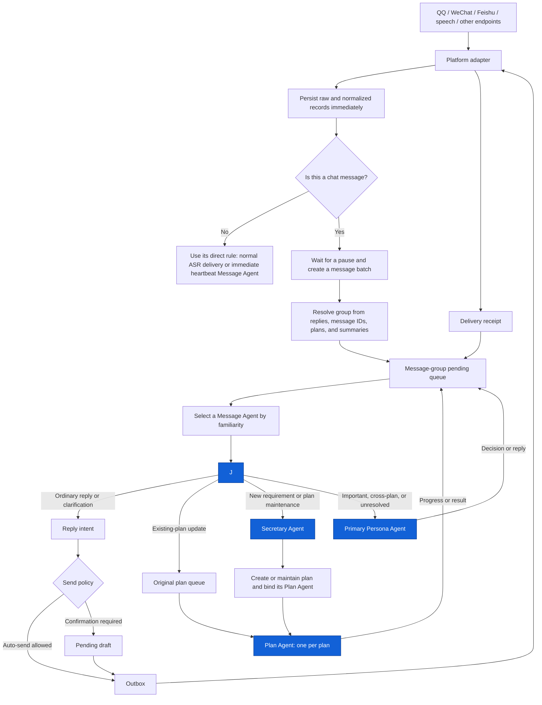
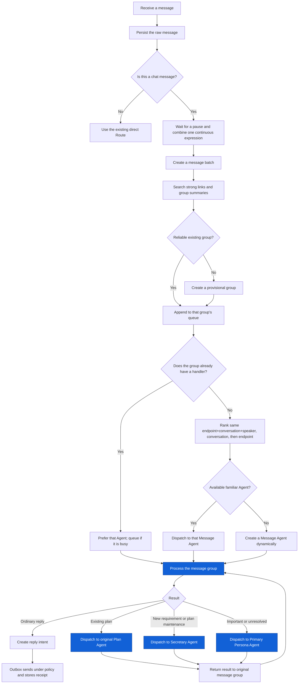

<!-- docs-language-switch -->

English | <a href="./group-message-batching-and-triage-plan.md">简体中文</a>

<!-- /docs-language-switch -->

> [Open the HTML architecture preview](./group-message-batching-and-triage-plan.html) — blue components are Agents; the page can be printed or exported as PDF.

# Conversational Message Collection, Message Groups, and Four-Agent Collaboration

> Status: The runtime foundation is connected. Messages are recorded immediately, settled into a recoverable queue, and dispatched to reused or dynamically created Codex Message Agents using independent `gpt-5.6-luna` / `medium` turns. The four-Agent handoff and result-return contract is injected into Message Agent tasks. Live group/DM replay and end-to-end four-Agent acceptance remain incomplete.

This document is for RabiRoute maintainers and integration developers. It adds a dedicated Message Agent while retaining the existing Primary Persona Agent, Secretary Agent, and one-Agent-per-plan model. The Message Agent continuously handles group chat, direct messages, speech transcripts, and other natural-language traffic so the Primary Persona and Secretary do not become occupied by every individual message.

A **message group** is a set of messages provisionally treated as one continuous discussion. It is neither a platform group chat nor a plan. It is runtime state for batching a continuous expression, recovering context, limiting same-group concurrency, and linking messages to plans.

## User-visible outcome

With Message Agent mode enabled:

- Every raw message is recorded immediately.
- Split sentences, images, files, and follow-up captions from one sender can form one message batch.
- Chat messages form message groups automatically without per-endpoint switches. ASR, heartbeat, and structured events do not wait for chat-fragment batching.
- Only the Codex card currently shows **Message Agent mode**. Enabling it makes that Codex handler eligible for the Message Agent scheduling pool; other handlers neither display nor retain this Codex-specific setting.
- A Message Agent is preferentially reused for endpoints, conversations, and speakers it has handled before.
- If the Agent for a message group is busy, new batches enter that group's queue instead of starting a second Agent on the same context.
- Different message groups in one conversation may still run in parallel.
- The Primary Persona, Secretary, and Plan Agents remain available with separate responsibilities.
- Agents create reply intents; RabiRoute Outbox and the platform adapter still own delivery, deduplication, retries, and receipts.

## Four Agent types

| Agent type | Main responsibility | Does not own |
| --- | --- | --- |
| Primary Persona Agent | Stable persona, important conversations, cross-plan decisions, conflicts, and unresolved escalations | Reading all traffic continuously or advancing every plan |
| Message Agent | Process message groups, assemble context, decide whether to reply, link plans, and hand work to the Secretary or a Plan Agent | Creating and maintaining plans, executing business work, or calling platform send APIs directly |
| Secretary Agent | Create and maintain plans, deduplicate requirements, assign Plan Agents, track plan lifecycle, and surface progress | Listening to all chat continuously or replacing Plan Agents |
| Plan Agent | One Agent per plan; investigate, implement, verify, and return results | Global message triage or management of unrelated plans |

All four may inherit the same persona package's identity, permissions, and selected skills, but each receives a different task contract and bounded context. Retaining the Primary Persona does not mean every message must pass through it. Message Agents handle ordinary conversation directly and escalate only important, cross-plan, or genuinely uncertain matters.

## Current foundations and boundaries

RabiRoute already provides:

- Platform adapters that record raw traffic and pass normalized messages into the shared forwarding path.
- A persona-scoped bidirectional ledger grouped by logical endpoint and conversation.
- `recentMessageLimits` for bounded context on ordinary endpoints.
- QQ route kinds for ordinary group messages, explicit mentions, direct replies, and indirect replies.
- Outbox delivery, receipt, and deduplication boundaries.
- One Plan Agent binding per plan through `taskBinding.sessionId + workspace`.
- Existing Primary Persona and Secretary Agents, which remain in place.
- WebGUI separates endpoint behavior from Codex Message Agent eligibility. Codex Message Agents default to `gpt-5.6-luna` with `medium` reasoning without changing the model used by Primary Persona, Secretary, or Plan Agents. **Message Agent mode**, **Plan assistant tasks**, and **Hook management** are opt-in managed-task capabilities currently declared only by Codex; platforms with their own Agent orchestration do not inherit them.

RabiRoute now connects delayed conversational batching, recoverable batches, a pending queue, and Codex Message Agent affinity scheduling. An explicit reply to an older source message prefers the Agent that retained that source ID. Otherwise selection falls back through endpoint, conversation, and speaker familiarity. If a familiar Agent is active, a new Agent receives its task ID and current preview before deciding whether to transfer the continuation or process it independently. Live-history replay, non-Codex Message Agent runtimes, and complete Secretary/Plan/Primary integration evidence remain incomplete.

This design creates no second chat or plan source of truth. Raw events, the bidirectional ledger, and existing plan files remain authoritative. Batches, group relationships, Agent familiarity, and processing cursors are inspectable and repairable runtime state.

## Architecture

The four blue nodes are the four Agent types. Collection, indexes, queues, affinity ranking, send permission, Outbox, and receipts remain deterministic RabiRoute responsibilities.

## End-to-end flow

## Chat messages use message groups automatically

The mechanism sits after platform normalization and before Agent dispatch. The system decides by message type instead of exposing a switch on every endpoint. Chat messages are recorded, batched as one continuous expression, resolved to a group, and sent to a Message Agent. ASR and structured events keep their direct behavior.

| Message type | Primary evidence | Behavior |
| --- | --- | --- |
| Group chat | Conversation ID, speaker, reply ancestry, mentions, quotes, attachments | Automatic message group |
| Direct message | Direct conversation, peer, replies, recent groups | Automatic message group |
| ASR / voice transcript | Already segmented by the speech endpoint | Direct delivery without extra waiting |
| Email | Thread, subject, sender, recipients | Future direct thread grouping |
| Webhook, command, approval, health alert, structured event | Request, ticket, or plan IDs | Direct processing |
| Heartbeat | Schedule ID | Immediate independent Message Agent when that mode is enabled, with no recent chat history |

Message type decides whether settling applies. Commands, approvals, button actions, ASR, heartbeat, health alerts, and structured events bypass the chat settling window. With Codex Message Agent mode enabled, heartbeat immediately forms an independent message group for a Message Agent; it receives no recent chat history and is not skipped because the Primary task is busy.

The heartbeat Message Agent performs the incremental omission scan itself. It reads messages after the audit cursor plus a small overlap and compares them with plan summaries, issue mappings, business-task bindings, and the last delivery receipt. It does not forward the scheduled heartbeat task to the Primary Persona and does not mutate plans; concrete omissions go to the Secretary or original Plan Agent. When real state changed since the last group report, it prepares a short send-ready progress update. Only that update, a concrete decision request, or a cross-plan conflict reaches the Primary Persona for restricted group delivery. No change means no Primary wake-up and no repeated group post.

## ASR-style message batching

1. Persist every message immediately.
2. Extend the current batch deadline when a mergeable fragment arrives.
3. Emit the batch after the quiet period or maximum wait.

Proposed starting defaults:

| Scenario | Normal wait | Incomplete wait | Maximum wait |
| --- | ---: | ---: | ---: |
| Direct messages, explicit mentions, explicit replies | 3 seconds | 8 seconds | 15 seconds |
| Ordinary natural-language group chat | 6 seconds | 12 seconds | 20 seconds |
| Commands and structured events | 0 seconds | 0 seconds | 0 seconds |

Every platform event retains its own message ID, timestamp, sender, structured segments, and attachments. A batch references those events and never rewrites them irreversibly.

These waits decide when one continuous expression becomes a batch. They do not impose a group lifetime. A related message after thirty minutes, a day, or longer may still recover the original group through reply ancestry, source-message IDs, plan links, or group summaries. Time affects ranking and never excludes an older group by itself.

## Resolve the group, then choose a familiar Message Agent

The system answers two separate questions:

1. Does this batch belong to an existing message group?
2. Which Message Agent should handle it?

The same person speaking in the same group is not sufficient to merge unrelated subjects. Group resolution checks replies, quotes, source IDs, plan IDs, and existing group relationships first, then active, waiting, and historical group summaries. Semantic similarity, shared participants, and close timestamps only improve ranking.

After group resolution, select a Message Agent in this order:

1. The Agent that previously handled this message group.
2. Same endpoint + same group/conversation + same speaker.
3. Same endpoint + same group/conversation.
4. Same endpoint.
5. When no affinity matches, reuse the currently idle least-recently-used Message Agent.
6. Dynamically create a Message Agent only when every registered Message Agent is active, reserved for another allocation, or cannot be read safely.

Candidates must be Codex handlers with **Message Agent mode** enabled, be available, and have permission for the Route. Dynamic creation uses a Codex Message Agent template with that mode enabled; it never converts the Primary Persona, Secretary, or a Plan Agent into a Message Agent.

Affinity is a preference, not a permanent binding:

- Prefer the prior group Agent when it is idle.
- If it is busy, send same-group continuation directly to the original task and do not start another Agent on that group.
- A different group uses another idle Agent first. Dynamic creation happens only when all existing Agents are unavailable; unfamiliarity with a group is not a reason to skip an idle task.
- Selection, reservation, and creation run in one serialized allocation section. Persisted workers are deduplicated by complete task ID so concurrent batches cannot create the same index or register one task repeatedly.
- If an Agent is unavailable for recovery, another Message Agent receives the group's short summary and cursor, and RabiRoute records the takeover reason.

## Bounded context and long-range continuation

A Message Agent normally receives:

1. The current batch with original IDs, senders, and attachments.
2. The replied-to message and available reply ancestry.
3. Bounded recent bidirectional traffic controlled by `recentMessageLimits`.
4. The group summary, participants, unresolved questions, and processing cursor.
5. Related-plan title, status, latest progress, and waits.
6. The last reply actually sent and its Outbox receipt.

Full chat logs, all plans, and full Agent histories are not default input. When evidence is insufficient, the Agent queries older records by message, group, or plan ID. Messages already present in the current batch are excluded from recent history to prevent duplication.

Each message group maintains one replaced short working state: objective, confirmed conclusions, unresolved questions, linked plans, last reply, and cursor. It does not become a second transcript.

## Message Agent decisions

| Result | Next action |
| --- | --- |
| No action | Advance the group cursor without replying |
| Ordinary conversation or acknowledgement | Create a reply intent |
| Clarification needed | Ask one concrete question and keep the group provisional |
| Existing-plan update | Dispatch to the Plan Agent behind the original `taskBinding` |
| New requirement or plan maintenance | Ask the Secretary Agent to deduplicate and maintain the plan |
| Important conversation, cross-plan conflict, or insufficient evidence | Escalate to the Primary Persona Agent |
| High-risk external action | Use existing approval and send policy |

The Message Agent does not create plans directly, replace the Secretary, or execute a plan's investigation, code, configuration changes, or acceptance work.

## Returning results to the message group

- The Secretary returns the plan ID, binding, and next action after creating or updating a plan.
- A Plan Agent returns progress, conclusions, pending decisions, and content suitable for external explanation.
- The Primary Persona returns its decision or proposed reply for important matters.
- The Message Agent combines that result with the original audience, latest conversation, and send permission to choose immediate notification, continued waiting, or a pending draft.

Codex final text in these Agent tasks is internal task output. It is not automatically visible to a group member, private-chat peer, or the Primary Persona. User-visible content must enter the current endpoint reply API and Outbox. When the Primary Persona must decide or send on behalf of the Message Agent, the result must be delivered through the Manager thread bridge with the sender's verified task ID. An Outbox platform receipt or Manager acceptance receipt is required to prove that the result entered the correct exit.

A successful delivery receipt updates group state without automatically waking another Agent. Failures, new messages, plan results that require an external update, or changed decisions re-enter the group queue.

## Accuracy is not traded for speed

Efficiency comes from batching, affinity reuse, and bounded context, not from ignoring necessary evidence:

- Strong reply, group, plan, and source links allow direct association with saved evidence.
- Semantic similarity, shared participants, or close time alone require broader group and plan search.
- If uncertainty remains, keep the group provisional and ask; do not mutate a plan or interpret “not found” as a new requirement.
- Merging existing groups, changing plan ownership, or auto-sending a high-impact reply may use an independent review run of the same Message Agent type. This is not a fifth Agent type.
- Sent replies, plan actions, and delivery receipts remain auditable after regrouping.

Acceptance measures latency, Agent starts, input tokens, correct grouping, plan-link accuracy, duplicate plans, and incorrect automatic replies. Higher throughput cannot compensate for lower accuracy.

## Reply ownership and actual delivery

1. Whether to reply: decided by the Message Agent, Plan Agent, or Primary Persona within its responsibility.
2. Reply content: ordinary conversation and clarification from the Message Agent; plan conclusions from the Plan Agent; important dialogue from the Primary Persona.
3. Actual delivery: always through RabiRoute Outbox for permission checks, drafts, deduplication, retries, and platform receipts.

A reply intent or polished Codex final text is not proof of delivery. Only the platform receipt proves an external send; Agent-to-Agent handoff requires a Manager acceptance receipt.

## WebGUI configuration

Entry policy and Agent eligibility are configured separately:

| Card/location | Setting | Proposed default |
| --- | --- | --- |
| Route → chat endpoint card | Continuous-message wait | Chat messages use groups automatically; configure timing only, with no off switch |
| Agent card | Message Agent mode | On for dedicated Message Agent templates; off for Primary Persona, Secretary, and Plan Agents |
| Codex Agent card | Message Agent model and reasoning | `gpt-5.6-luna` / `medium`; only for new Message Agent turns |
| Agent card | Allowed Routes/endpoints | Follow existing Agent permissions; enabling the mode does not expand authority |
| Persona configuration | Recent context count | Reuse `recentMessageLimits` |
| Agent orchestration | Familiarity reuse | On; prior group, endpoint+conversation+speaker, endpoint+conversation, endpoint |
| Agent orchestration | Same-group concurrency | Fixed at one |
| Delivery and safety | Auto-send categories | Continue using existing Route output and approval policy |

Disabling Message Agent mode stops new group assignments. Existing work must finish or be explicitly migrated; it cannot be discarded. Re-enabling makes the Agent eligible again. The switch changes scheduling eligibility only and does not modify persona identity, plan bindings, or existing session data.

Runtime status should show collecting batches, pending groups, oldest wait, running Message Agents, each Agent's recent endpoint/conversation/speaker familiarity, takeover records, recent failures, and Outbox state.

## Implementation status and remaining phases

### Phase 1: automatic message classification and batch preview (implemented)

- Add the shared collector after platform normalization.
- Continue writing raw and bidirectional records immediately.
- Expose wait values for chat endpoints without a message-group switch; ASR and structured events bypass settling automatically.
- Produce inspectable, recoverable batches and change real Agent dispatch when Message Agent mode is enabled.
- Replay QQ group chat and direct-message histories, and verify that ASR remains direct.

### Phase 2: message-group state and context (runtime foundation implemented)

- Persist group IDs, short summaries, reply links, cursors, and pending queues.
- Recover related groups after thirty minutes or longer.
- Remove current-batch duplicates from recent context.
- Verify restart does not emit batches twice.

### Phase 3: Message Agents and affinity scheduling (implemented for Codex)

- Add the Message Agent type without changing the other three types.
- Add Message Agent mode to the Codex card and select or create only enabled Codex handlers.
- Implement the exact affinity order.
- Use one handler lease per group while allowing different groups to run concurrently.
- Recover through short state and cursors after Agent failure.

### Phase 4: four-Agent collaboration (return contract implemented; end-to-end acceptance pending)

- Existing-plan updates go to the original Plan Agent.
- New requirements and plan maintenance go to the Secretary.
- Important, cross-plan, and uncertain matters go to the Primary Persona.
- Results return to the original message group for reply decisions.
- All external sends continue through Outbox.

### Phase 5: expand and tune

- Reuse the mechanism for WeChat, Feishu, and other text-chat endpoints after QQ acceptance; keep ASR direct.
- Heartbeat checks unfinished batches, broken cursors, and abnormal backlog rather than scanning full chat logs.
- Tune defaults from accuracy, latency, and duplicate-reply evidence.

## Acceptance scenarios

At minimum:

1. A split sentence, image, and continuation form one batch while every source message stays traceable.
2. Group chat and direct messages enter message groups automatically and may use their own wait values.
3. ASR, commands, approvals, heartbeat, and structured events bypass chat settling.
4. A direct reply after thirty minutes still restores its original group.
5. Two discussions in one chat become two groups and run concurrently.
6. The prior group Agent is preferred when idle.
7. Same-group arrivals queue while its Agent is busy.
8. A different group in the same chat may create another Message Agent.
9. Affinity falls back through endpoint+conversation+speaker, endpoint+conversation, then endpoint.
10. No affinity match dynamically creates a Message Agent.
11. Disabling Message Agent mode blocks new assignments without losing existing work.
12. An unanchored “okay” does not mutate a plan.
13. Existing-plan updates retain the original `taskBinding`.
14. New requirements go to the Secretary for deduplication and plan creation.
15. Important or cross-plan decisions reach the Primary Persona.
16. Results from the Secretary, Plan Agent, and Primary Persona return to the original group.
17. Outbox failures remain visible and retries do not duplicate messages.
18. Agent failure recovers from short state and cursors without a full-log read.
19. Grouping and plan-link accuracy do not decline as throughput improves.

## Confirmed design choices

- Retain the Primary Persona Agent.
- Retain the existing Secretary Agent.
- Retain one Plan Agent per plan.
- Add a separate Message Agent, for four Agent types in total.
- Apply message groups automatically to chat messages across endpoints; do not expose a per-endpoint off switch.
- Add Message Agent mode to the Codex card; affinity selection and dynamic creation use only enabled Codex handlers or templates.
- Prefer the prior message-group Agent, then endpoint+conversation+speaker, endpoint+conversation, and endpoint; create dynamically when none matches.
- Allow one Message Agent per group at a time and parallelism across different groups.
- Set no hard age cutoff for group association.
- Keep actual delivery in Outbox and platform adapters.

Automated tests now cover collection, recovery, Codex dynamic creation, affinity reuse, explicit-reply recovery, and Luna delivery. Historical replay, live group/DM acceptance, real platform Outbox receipts, and end-to-end four-Agent integration remain acceptance work and are not proven by the unit tests alone.
