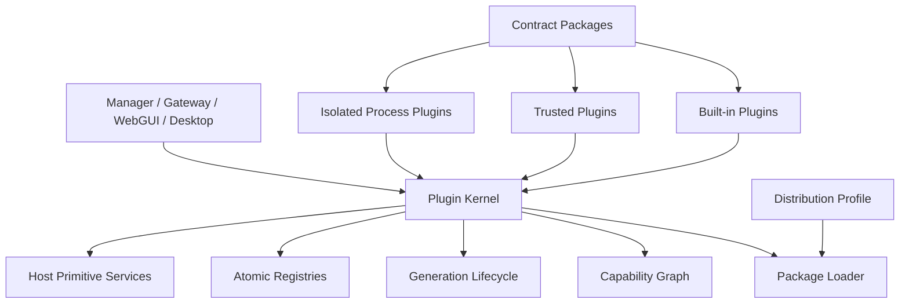
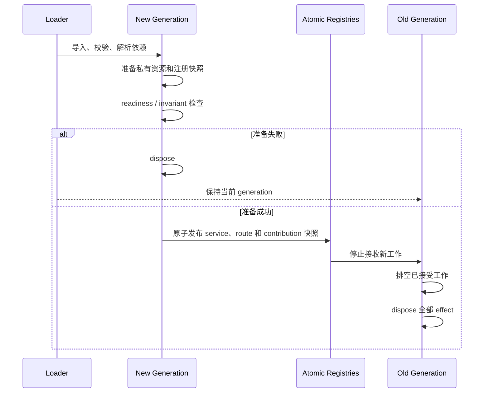

<a href="./manager-plugin-implementation-hot-swap_en.md">English</a> | 简体中文

# RabiRoute 插件平台目标架构

> 状态：已实施。本文描述当前正式架构和持续门禁。
>
> 主要读者：RabiRoute 维护者、插件作者和接入开发者。

## 当前实施状态

- 正式发行 Profile 为 `plugins/profiles/desktop.json`，包含 28 个独立 Manager 插件包。
- 7 个插件独立提供 Web Bundle：`core`、`desktop`、`diagnostics`、`message-adapter-control`、`performance`、`persona` 和 `speech`。
- 内置插件和树外插件共用 `@rabiroute/plugin-sdk`、严格 Manifest、能力图、权限检查、revision 隔离、generation 切换和 effect scope。
- Manager、Catalog、Web module 和 Profile 只读取新插件平台。旧 Bundle、Loader、Profile/Patch、Reconciler、Catalog、进程插件宿主和迁移入口已删除。
- WebGUI 宿主不保存业务页面 ID；页面、导航、命令和状态卡全部来自插件 contribution。
- 插件构建先写入临时目录，再替换各版本目录；`packages` 和 `profiles` 监听根目录保持不变，旧包会在同一次构建中删除。
- Gateway 等宿主持有的长生命周期资源使用 generation 交接租约。新 generation 取得租约后，旧 generation 才释放；只有最后一个租约释放时才停止资源。

## 与 DSH/Cordis 的取舍

| 维度 | DSH/Cordis | RabiRoute 当前实现 |
|---|---|---|
| 组合单位 | Bundle、Patch 和插件树组合 Profile | 独立插件包加一个发行 Profile |
| 依赖 | 插件声明注入关系，配置树驱动重建 | Manifest 声明 `provides/requires/optional`，能力图决定激活顺序和受影响范围 |
| 生命周期 | `ctx.effect` 管理可撤销资源 | effect scope 管理路由、监听器、定时器、连接和注册项 |
| 热更新 | Cordis 重建插件树并恢复 effect | SHA-256 revision 创建候选 generation，准备成功后原子发布，失败时保留上一 revision |
| 配置 | Bundle/Patch 合并形成配置真源 | Profile 只选择实例、配置和权限，不承载业务规则或迁移逻辑 |
| 宿主边界 | 面向 Agent harness 的单一插件树 | Manager、Gateway、WebGUI、Desktop 共用合同，但分别加载自己的 entry |
| 外部副作用 | 可撤销资源适合 effect | 消息外发、审批和远端写入由 Outbox、幂等命令或补偿处理，不伪装成可撤销 effect |

保留了 DSH/Cordis 的可撤销 effect、声明式依赖、配置真源、稳定实例 ID 和失败回滚。没有沿用 Bundle/Patch 叠加和旧配置兼容，因为它们会重新形成多入口和迁移分支。

## 2026-08-27 实时验收

| 阶段 | generation | 插件 revision | 结果 |
|---|---|---|---|
| 基线 | `40b15b48-aa08-4878-aaa0-18af7f53e5ba` | - | 26 个插件，7 个 Web module |
| 安装并启用 | `e2870d32-821d-4ee1-8713-422d1333c06c` | `a64b7d11160ef89fdac84c7f2c8333f8c087bb233ea78d0aec94ffc7773a9f72` | Catalog 27，Web module 8，路由返回 `marker=one` |
| 有效更新 | `4fb5de14-084f-46c0-93ee-93ea4431345a` | `e045d8ead90bbf91f873e9383a5fa4d6d5e47548843603c3ff9d245b9d517f46` | 新 revision 生效 |
| 失败候选 | `113b8439-ee35-4c7d-a22a-8a4c38a0a0ba` | 继续使用上一 revision | Catalog 报 `update_failed_using_previous_revision`，旧路由继续响应 |
| 恢复更新 | `04383a16-71d8-41c7-8e71-76e64d7b2de6` | `fea00581bf11f5bd17cd59711f9a309ce39f685ec98fcaee8ddfb0c2cd452b43` | 错误消失，新 revision 生效 |
| 停用与卸载 | `a207ba57-52e6-4391-bfaf-fd4c92e2a861` | - | Catalog 回到 26，Web module 回到 7，插件路由返回 404，diagnostics 为空 |

全程 Manager PID 为 `62272`，Gateway PID 为 `68948`。安装、更新、失败回滚、恢复、停用和卸载均未替换进程。

Gateway runtime 插件再次从 generation `272df510-7524-441c-8542-a77ecfc6e171` 自动切换到 `da3e7fff-282e-4103-8902-23390594a468`。Manager PID 保持 `72544`，Gateway PID 保持 `90724`，`/api/gateways` 返回 200，reconciliation diagnostics 为空。

## 需要确认的决定

1. 删除 `rabi.manager.base` 单体 Bundle 和 `managerBasePluginActivation` 宿主激活表，每项产品能力成为独立插件包。
2. Manager、Gateway、WebGUI 和 Desktop 使用同一套插件清单、能力合同、权限和生命周期。
3. 正式运行时不读取旧 Profile、旧配置键、旧 schema，也不保留旧路由、旧 Bundle、旧服务版本、备用实现或永久兼容层。
4. 新增消息来源、Agent、路由策略、上下文来源、外发端、页面或桌面能力时，只安装插件并修改 Profile，不修改宿主源码或中央联合类型。

## 目标

- 常规插件代码变化不重启 Manager 或 Gateway；
- 内置插件和树外插件使用同一 SDK、合同和加载器；
- 插件卸载或替换后，路由、监听器、定时器、连接、进程和注册项全部消失；
- 每项业务事实只有一个拥有者；
- 正式路径只有一个实现和一个入口；
- 破坏性合同变化发布新主版本，不在运行时长期兼容旧合同；
- 插件失败只影响自身及真实依赖它的插件。

## 不采用的做法

- 不继续在 `controlPlaneRoutes.ts` 增加插件专用分支；
- 不用一个基础 Bundle 容纳全部内置能力；
- 不让 Bundle 只声明 definition，再调用宿主中的真实实现；
- 不向插件提供全局 Manager 对象；
- 不用中央枚举和 `switch` 列出所有消息端、Agent、页面和命令；
- 不允许插件导入其他插件实现；
- 不发布新旧运行时混合工作的正式版本；
- 不创建 `Legacy`、`V2`、`Old`、`Backup` 或 `archive/` 代码副本。

## 总体结构



系统只有五层：

1. **应用宿主**：启动进程、选择 Profile、处理进程级关闭。
2. **插件内核**：发现、校验、依赖、权限、generation、切换、回滚和诊断。
3. **宿主原语服务**：HTTP、事件、存储、凭据、任务、网络、进程和审计。
4. **合同包**：能力接口、事件、schema、错误码和合同测试。
5. **插件包**：产品行为、业务编排、表现贡献和资源生命周期。

## 最小插件内核

目标目录：

```text
src/plugin-kernel/
  packageLoader.ts
  manifest.ts
  capabilityGraph.ts
  generationRuntime.ts
  lifecycleTransaction.ts
  serviceRegistry.ts
  contributionRegistry.ts
  permissionGate.ts
  diagnostics.ts
```

内核只认识：

- 插件 ID、version、revision、来源和 host entry；
- `provides`、`requires`、`optional`；
- permissions 和 config schema；
- generation 与生命周期状态；
- service、event 和 contribution 注册；
- 安装、启用、停用、切换、回滚和卸载。

内核不得导入 Route、Persona、Codex、NapCat、RabiLink、Speech 或任何具体插件。CI 检查 `src/plugin-kernel/` 不得导入 `plugins/` 和产品业务模块。

## 独立插件包

现有内置能力拆成独立包，不再由 `rabi.manager.base` 集中声明：

```text
plugins/
  contracts/
    route/
    persona/
    agent-tasks/
    agent-delivery/
    route-policy/
    context-provider/
    outbox-transport/
    ui/
  builtin/
    manager-core/
    route-core/
    persona/
    agent-task-store/
    agent-delivery/
    codex-agent-adapter/
    message-agent-pool/
    diagnostics/
    ...
  profiles/
    desktop.json
    gateway.json
    minimal.json
```

每个插件包独立拥有：

```text
plugin-package/
  package.json
  rabi.plugin.json
  src/
    manager.ts
    gateway.ts
    web.ts
    desktop.ts
    config.ts
    invariant.ts
  tests/
  README.md
  README_en.md
```

不存在某个 host entry 时不生成对应文件。构建产物只进入 `dist/plugins/`，源码目录不保存第二份正式实现。

## 插件清单

```json
{
  "schemaVersion": 1,
  "id": "io.rabiroute.agent.codex",
  "version": "1.0.0",
  "entries": {
    "manager": "./manager.mjs",
    "web": "./web.mjs"
  },
  "provides": ["agent.adapter.codex@1"],
  "requires": ["agent.tasks.query@1", "agent.delivery@1"],
  "optional": ["ui.notifications@1"],
  "permissions": ["desktop.ipc.codex", "storage.namespace:agent-codex"],
  "configSchema": "./config.schema.json",
  "stateSchemaVersion": 1
}
```

规则：

- 插件 ID 永久稳定；
- entry、能力、权限和 schema 全部来自清单；
- 运行时不根据文件名、类名或中央枚举推断能力；
- Profile 选择 version，包内容哈希生成 revision；
- 插件启动后不能改变清单；
- 未声明的依赖和权限不可访问。

## 合同包

合同包只包含 TypeScript 类型、JSON Schema、capability key、事件、错误码、夹具和合同测试，不包含业务实现、持久状态、进程单例或默认 Provider。

```text
@rabiroute/contracts-agent-tasks
@rabiroute/contracts-agent-delivery
@rabiroute/contracts-route-policy
@rabiroute/contracts-context-provider
@rabiroute/contracts-outbox-transport
@rabiroute/contracts-ui-contributions
```

Provider 注册能力，Consumer 只依赖合同包和 capability key。替换 Provider 不需要修改宿主或重编译无关 Consumer。

## 统一插件 SDK

`@rabiroute/plugin-sdk` 是所有 host 的唯一插件编程入口：

```ts
export interface PluginContext {
  readonly identity: PluginIdentity;
  readonly config: unknown;
  readonly generation: string;
  services: ServiceResolver;
  effects: EffectScope;
  events: ScopedEventBus;
  contributions: ContributionRegistrar;
  storage: ScopedStorage;
  permissions: GrantedPermissions;
}
```

SDK 提供 manifest/config 校验、能力注册与解析、effect/disposer、实例作用域事件、隔离存储、贡献点、日志、诊断、测试 Harness 和开发期热替换模拟器。

插件只依赖 SDK 和所需合同包，不依赖 Manager、Gateway、WebGUI 或 Desktop 源码。

## 能力图

- 一个 scope 内，同一非集合能力只允许一个 Provider；
- 集合能力允许多个 Provider，排序和冲突规则由合同定义；
- 缺少 `requires` 时进入 `waiting_dependency`；
- Provider revision 变化时，只准备真实依赖它的 Consumer；
- 循环依赖在导入前拒绝；
- 可选依赖出现或消失时，使用依赖变更事务；
- Profile 只选择插件和配置，不包含业务规则或启动顺序。

新增树外 Agent adapter 时，只安装插件并加入 Profile。Manager、Gateway、WebGUI、Desktop 和共享联合类型不修改。

## 宿主原语

宿主只提供必须由进程控制的通用原语：

| 能力 | 职责 |
|---|---|
| `host.http.routes@1` | 注册实例路由、拒绝冲突、原子切换 generation |
| `host.http.requests@1` | 接收、排空、超时和取消请求 |
| `host.events@1` | 发布和订阅已声明事件 |
| `host.storage@1` | 命名空间存储和事务 |
| `host.secrets@1` | 按权限读取命名凭据 |
| `host.jobs@1` | 可取消任务、定时器和关闭等待 |
| `host.process@1` | 监督本实例子进程 |
| `host.network@1` | 按权限建立受限连接 |
| `host.audit@1` | 记录插件、操作、对象和结果 |

Route、Persona、Agent task、投递和 Outbox 是产品能力，由独立 Provider 插件拥有，不属于宿主原语。

## 业务事实所有权

| 事实 | 唯一拥有者 | 使用方式 |
|---|---|---|
| Route 定义和运行状态 | Route Provider | `route.query@1`、`route.commands@1` |
| Persona 配置和正文 | Persona Provider | query 和受控 command |
| Agent 任务身份和绑定 | Agent Task Provider | 稳定 ID query 和 binding command |
| 投递和回执 | Agent Delivery Provider | 幂等 delivery command |
| 外发请求和审批 | Outbox Provider | append-only command 和 query |
| 消息记录 | Message Record Provider | append/query，不暴露文件路径 |
| 插件配置 | Plugin Kernel | Profile 与 schema 校验后的 config |
| 插件私有状态 | 对应插件 | `host.storage@1` 隔离命名空间 |

UI、Desktop 和消息端不能复制这些规则或直接写对应文件。

## 正式扩展点

- `message.source@1`：QQ、飞书、Webhook、语音、设备和计划触发；
- `route.policy@1`：目标选择、上下文预算和外发规则；
- `context.provider@1`：近期消息、人格、计划、记忆和项目上下文；
- `agent.adapter@1`：Codex、DSH 和其他处理端；
- `delivery.target@1`：投递、回执和失败恢复；
- `outbox.transport@1`：平台外发；
- `observation.sink@1`：日志、指标和审计；
- `ui.page@1`、`ui.widget@1`、`ui.command@1`：WebGUI；
- `desktop.command@1`、`desktop.settings@1`：桌面能力；
- `storage.provider@1`：可替换持久实现。

每个扩展点必须有独立合同包、至少一个独立 Provider、Consumer 合同测试和卸载测试。

## 多宿主模型

一个插件包可以包含多个 entry，但每个 entry 独立加载：

- Manager entry：控制面和业务编排；
- Gateway entry：消息输入和常驻连接；
- Web entry：页面、组件和命令；
- Desktop entry：桌面生命周期和本机交互；
- isolated entry：通过版本化 RPC 在独立进程运行。

entry 通过公开 API、事件或持久事实协作，不共享可变内存。Web 和 Desktop 不导入 Manager 实现。

## 信任与权限

| 类型 | 来源 | 执行方式 |
|---|---|---|
| `builtin` | 官方发行包 | 进程内，完整合同测试 |
| `trusted` | 用户明确安装和授权 | 进程内，权限受限 |
| `isolated` | 未知代码或高风险依赖 | 独立进程，RPC 和资源限额 |
| `declarative` | 清单和表现数据 | 不执行代码 |

安装记录来源、版本、哈希、权限和启用 Profile。新增权限需要重新授权。已安装不等于可以访问全部宿主能力。

## Generation 原子切换



约束：

- 候选 generation 发布前不接收外部请求；
- service、route 和 contribution 使用不可变快照一次切换；
- 旧 generation 不再接收新工作，只完成已接受工作；
- 准备失败时旧 generation 完全不变；
- invariant 失败必须在新 generation 接收业务流量前恢复旧快照；
- 处理过真实流量后的失败使用正常故障恢复，不伪造外部副作用回滚；
- 投递和外发使用持久幂等记录完成重试和恢复。

## 状态 schema

热替换只允许 `stateSchemaVersion` 不变。持久状态 schema 变化属于发布升级：

1. 停止相关插件；
2. 备份目标命名空间；
3. 运行离线、单向、可验证的转换；
4. 启动只认识新 schema 的插件；
5. 验证后删除转换工具和旧 schema 夹具。

新运行时不读取旧 schema，不保留双读、双写或永久兼容层。

## 一次性切换

开发可以在独立分支拆分工作包，主分支只接受完整切换。不得把混合运行时作为正式阶段合并。

切换必须同时完成：

1. 新 Plugin Kernel、SDK、合同包和构建流程；
2. 全部内置能力拆成独立插件；
3. 新 Profile 和安装目录；
4. WebGUI、Desktop、Manager 和 Gateway 使用统一 Catalog；
5. 删除 `rabi.manager.base`；
6. 删除 `managerBasePluginActivation` 和 `activate` capability；
7. 删除旧 Manager/Gateway Loader、旧 Profile/Patch 解析和旧 Bundle 目录；
8. 删除中央 adapter、endpoint、page 和 command 枚举及分派；
9. 删除旧路由、旧配置键、旧服务名、旧 contribution 和专用测试；
10. 更新全部中英文文档、示例、安装器和发布脚本；
11. 转换官方示例和测试数据；
12. 搜索确认正式路径只剩新入口。

现有本机数据需要转换时，使用发布前离线转换程序。新 Manager 不导入该程序，不在启动时执行，也不作为长期工具保留。

## 必须删除的对象

- `plugins/packages/rabi.manager.base/`；
- `managerBasePluginActivation`；
- Bundle `context.services.activate`；
- 旧 `managerPlugins` 配置键和读取逻辑；
- `rabi.manager.builtin` 迁移逻辑；
- 只服务旧 Bundle 的 Profile 初始化分支；
- 封闭的 Message Adapter、Agent Adapter、页面和命令中央枚举；
- 旧 Web Bundle fallback；
- 同一能力的宿主实现和插件实现双份代码；
- 永久关闭的 feature flag；
- 旧格式 fixture、兼容测试和文档入口。

Git 保存历史，仓库不建立源码归档副本。

## 树外插件验收

扩展性必须用三个不在主仓库内编译的测试插件验证：

1. 新消息来源插件：提供消息输入和设置页；
2. 新 Agent adapter：提供任务目录、投递和状态卡；
3. 新路由策略插件：消费消息与上下文合同，提供可替换决策。

每个测试插件必须满足：

- 不修改 Plugin Kernel、Manager、Gateway、WebGUI 或 Desktop 源码；
- 只通过安装和 Profile 启用；
- 缺少依赖时进入明确等待状态；
- 权限不足时失败关闭；
- 卸载后所有资源消失；
- 更新实现后进程 PID 不变；
- 候选失败时旧 generation 继续服务；
- 删除插件后 Catalog、路由、页面和状态全部消失。

## 2026-08-27 最终门禁

- TypeScript noEmit、Vue 类型检查和 28 个内置包架构门禁通过。
- `npm test`：1401 通过，1 跳过，0 失败。
- `npm run build`：生成 28 个独立 Manager 包和 7 个独立 Web Bundle。
- `npm run check:built-manager`：通过，并生成本机只读验收记录。
- 运行时代码与配置中的旧运行时标识为 0；`dist/` 为 0；当前事实文档为 0。架构检查脚本只保留 5 个已删除路径名称，用于阻止旧文件重新出现。
- `git diff --check` 通过。

## 架构门禁

CI 必须检查：

- Kernel 不得导入具体插件；
- 插件不得导入其他插件实现；
- 宿主不得出现具体插件 ID 分支；
- 所有 service 和 event 来自合同包；
- 所有注册由 effect scope 持有；
- 每个插件证明 dispose 后注册消失；
- 每个公开 capability 有 Provider/Consumer 合同测试；
- 新增插件不修改中央联合类型或 `switch`；
- 构建产物和源码不会形成两个正式入口；
- 正式代码目录不存在 `Legacy`、`Old`、`Backup`、`V2`；
- 必须删除对象的符号和路径搜索结果为零。

## 运行验收

- `npm run build` 和完整测试通过；
- 当前构建可启动 Manager、Gateway、WebGUI 和 Desktop；
- 根 HTML 引用当前 Web 资源 hash；
- `/meta`、Plugin Catalog、能力图和目标 API 回读正确；
- 热替换前后 Manager 和 Gateway PID 不变；
- 请求排空期间没有双处理；
- 依赖变化只重载受影响 generation；
- 失败候选不改变当前服务；
- 真实 Codex Desktop 投递、回执和任务复用通过；
- Outbox、Route、Persona 和消息记录在切换后保持一致；
- 三个树外插件的安装、启用、更新、停用和卸载全部通过。

## 仍需替换进程的范围

只有以下变化替换进程：

- Plugin Kernel 和宿主原语实现；
- Node.js、原生模块和启动参数；
- 持久状态 schema 转换；
- 进程级安全更新；
- 无法安全释放的全局或原生资源。

界面和日志必须区分“插件 generation 已切换”和“应用进程已更新”。

## 完成定义

1. 所有产品能力由独立插件包拥有；
2. 内置插件和树外插件使用同一 SDK、合同和生命周期；
3. 宿主不知道具体插件 ID 和实现；
4. 新增插件不修改宿主、客户端或中央联合类型；
5. `rabi.manager.base`、宿主激活表和旧 Loader 已删除；
6. 正式运行时不读取旧配置和旧 schema；
7. 正式路径没有双实现、备用入口和兼容层；
8. generation 切换、排空和回滚通过实际运行验收；
9. 三个树外插件通过安装到卸载的完整验收；
10. 删除清单和架构门禁全部通过。
