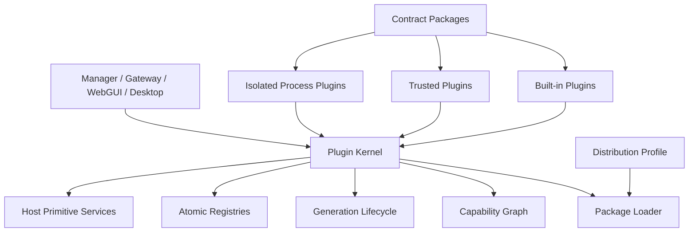
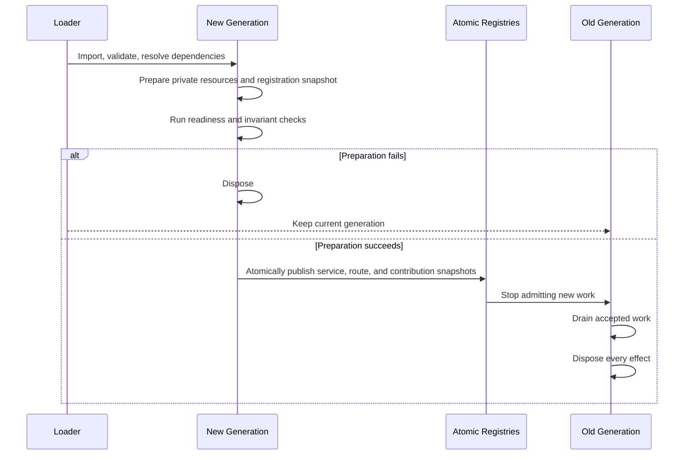

<a href="./manager-plugin-implementation-hot-swap.md">简体中文</a> | English

# RabiRoute Plugin Platform Target Architecture

> Status: design pending review. This document describes only the production architecture after one complete cutover. A transitional state is not a deliverable.
>
> Primary readers: RabiRoute maintainers, plugin authors, and integration developers.

## Decisions to approve

1. Delete the monolithic `rabi.manager.base` Bundle and the host-side `managerBasePluginActivation` table. Every product capability becomes an independent plugin package.
2. Manager, Gateway, WebGUI, and Desktop use one plugin manifest, capability contract, permission model, and lifecycle.
3. The production runtime reads no old Profile, configuration key, or schema and retains no old route, Bundle, service version, fallback implementation, or permanent compatibility layer.
4. Adding a message source, Agent, route policy, context source, outbound transport, page, or desktop capability requires only plugin installation and a Profile change. It does not modify host source or a central union type.

## Goals

- Routine plugin code changes do not restart Manager or Gateway.
- Built-in and out-of-tree plugins use the same SDK, contracts, and loader.
- Plugin removal or replacement leaves no route, listener, timer, connection, process, or registration behind.
- Every business fact has one owner.
- Every production capability has one implementation and one entrypoint.
- Breaking contracts use a new major version instead of permanent runtime compatibility.
- A plugin failure affects only that plugin and real Consumers of its capabilities.

## Rejected approaches

- Do not add more plugin-specific branches to `controlPlaneRoutes.ts`.
- Do not put all built-in capabilities into one base Bundle.
- Do not let a Bundle declare a definition and call the real implementation in the host.
- Do not expose a global Manager object to plugins.
- Do not maintain central enums and switches for every endpoint, Agent, page, or command.
- Do not let a plugin import another plugin implementation.
- Do not release a mixed old-and-new runtime.
- Do not create `Legacy`, `V2`, `Old`, `Backup`, or `archive/` source copies.

## System structure



The system has five layers:

1. **Application hosts** start processes, select Profiles, and handle process-level shutdown.
2. **Plugin Kernel** owns discovery, validation, dependencies, permissions, generations, switching, rollback, and diagnostics.
3. **Host primitive services** expose HTTP, events, storage, credentials, jobs, network, process, and audit primitives.
4. **Contract packages** define capabilities, events, schemas, error codes, and contract tests.
5. **Plugin packages** own product behavior, orchestration, presentation contributions, and resource lifecycle.

## Minimal Plugin Kernel

Target directory:

```text
src/plugin-kernel/
  packageLoader.ts
  manifest.ts
  capabilityGraph.ts
  generationRuntime.ts
  lifecycleTransaction.ts
  serviceRegistry.ts
  contributionRegistry.ts
  permissionGate.ts
  diagnostics.ts
```

The Kernel knows only:

- plugin ID, version, revision, source, and host entries;
- `provides`, `requires`, and `optional`;
- permissions and configuration schema;
- generations and lifecycle states;
- service, event, and contribution registration;
- installation, activation, deactivation, switching, rollback, and uninstall.

The Kernel imports no Route, Persona, Codex, NapCat, RabiLink, Speech, or other concrete plugin. CI rejects imports from `src/plugin-kernel/` into `plugins/` or product business modules.

## Independent plugin packages

Built-in capabilities become independent packages. `rabi.manager.base` no longer centralizes their declarations.

```text
plugins/
  contracts/
    route/
    persona/
    agent-tasks/
    agent-delivery/
    route-policy/
    context-provider/
    outbox-transport/
    ui/
  builtin/
    manager-core/
    route-core/
    persona/
    agent-task-store/
    agent-delivery/
    codex-agent-adapter/
    message-agent-pool/
    diagnostics/
    ...
  profiles/
    desktop.json
    gateway.json
    minimal.json
```

Each package owns:

```text
plugin-package/
  package.json
  rabi.plugin.json
  src/
    manager.ts
    gateway.ts
    web.ts
    desktop.ts
    config.ts
    invariant.ts
  tests/
  README.md
  README_en.md
```

A package omits unsupported host entries. Builds emit only to `dist/plugins/`; source directories do not retain a second production implementation.

## Plugin manifest

```json
{
  "schemaVersion": 1,
  "id": "io.rabiroute.agent.codex",
  "version": "1.0.0",
  "entries": {
    "manager": "./manager.mjs",
    "web": "./web.mjs"
  },
  "provides": ["agent.adapter.codex@1"],
  "requires": ["agent.tasks.query@1", "agent.delivery@1"],
  "optional": ["ui.notifications@1"],
  "permissions": ["desktop.ipc.codex", "storage.namespace:agent-codex"],
  "configSchema": "./config.schema.json",
  "stateSchemaVersion": 1
}
```

Rules:

- plugin IDs remain stable;
- entries, capabilities, permissions, and schema come from the manifest;
- runtime behavior is never inferred from filenames, class names, or central enums;
- Profiles select versions, while package content hashes define revisions;
- a plugin cannot change its manifest after activation;
- undeclared dependencies and permissions are unavailable.

## Contract packages

Contract packages contain only TypeScript types, JSON Schema, capability keys, events, error codes, fixtures, and contract tests. They contain no business implementation, durable state, process singleton, or default Provider.

```text
@rabiroute/contracts-agent-tasks
@rabiroute/contracts-agent-delivery
@rabiroute/contracts-route-policy
@rabiroute/contracts-context-provider
@rabiroute/contracts-outbox-transport
@rabiroute/contracts-ui-contributions
```

Providers register capabilities. Consumers depend only on a contract package and capability key. Replacing a Provider does not modify a host or rebuild unrelated Consumers.

## Unified Plugin SDK

`@rabiroute/plugin-sdk` is the only plugin programming entrypoint for every host:

```ts
export interface PluginContext {
  readonly identity: PluginIdentity;
  readonly config: unknown;
  readonly generation: string;
  services: ServiceResolver;
  effects: EffectScope;
  events: ScopedEventBus;
  contributions: ContributionRegistrar;
  storage: ScopedStorage;
  permissions: GrantedPermissions;
}
```

The SDK provides manifest/configuration validation, capability registration and resolution, effects and disposers, instance-scoped events, isolated storage, contributions, logging, diagnostics, a test Harness, and a development hot-swap simulator.

A plugin depends only on the SDK and required contract packages, never on Manager, Gateway, WebGUI, or Desktop source.

## Capability graph

- One scope permits one Provider for a non-collection capability.
- Collection capabilities permit multiple Providers under contract-defined ordering and conflict rules.
- A plugin with missing `requires` remains `waiting_dependency`.
- A Provider revision change prepares only actual Consumers.
- Cycles are rejected before import.
- Optional dependency changes use a dependency-change transaction.
- Profiles select plugins and configuration but contain no business rules or startup order.

Adding an out-of-tree Agent adapter requires installation and Profile activation only. Manager, Gateway, WebGUI, Desktop, and shared union types do not change.

## Host primitives

The host exposes only generic primitives that require process ownership:

| Capability | Responsibility |
|---|---|
| `host.http.routes@1` | Register instance routes, reject conflicts, atomically switch generations |
| `host.http.requests@1` | Admit, drain, time out, and cancel requests |
| `host.events@1` | Publish and subscribe to declared events |
| `host.storage@1` | Namespaced storage and transactions |
| `host.secrets@1` | Read named credentials by permission |
| `host.jobs@1` | Cancellable jobs, timers, and shutdown settlement |
| `host.process@1` | Supervise instance-owned child processes |
| `host.network@1` | Open permission-constrained connections |
| `host.audit@1` | Record plugin, operation, object, and result |

Route, Persona, Agent tasks, delivery, and Outbox are product capabilities owned by independent Provider plugins, not host primitives.

## Business-fact ownership

| Fact | Sole owner | Access |
|---|---|---|
| Route definitions and runtime state | Route Provider | `route.query@1`, `route.commands@1` |
| Persona configuration and content | Persona Provider | query and constrained commands |
| Agent task identity and binding | Agent Task Provider | stable-ID queries and binding commands |
| delivery and receipts | Agent Delivery Provider | idempotent delivery commands |
| outbound requests and approval | Outbox Provider | append-only commands and queries |
| message records | Message Record Provider | append/query without file paths |
| plugin configuration | Plugin Kernel | Profile plus schema-validated configuration |
| plugin-private state | owning plugin | isolated `host.storage@1` namespace |

UI, Desktop, and message endpoints do not duplicate these rules or write their files directly.

## Production extension points

- `message.source@1`: QQ, Feishu, Webhook, speech, device, and schedule inputs;
- `route.policy@1`: target selection, context budgets, and outbound rules;
- `context.provider@1`: recent messages, persona, plans, memory, and project context;
- `agent.adapter@1`: Codex, DSH, and other handlers;
- `delivery.target@1`: delivery, receipts, and recovery;
- `outbox.transport@1`: platform sends;
- `observation.sink@1`: logs, metrics, and audit;
- `ui.page@1`, `ui.widget@1`, and `ui.command@1`: WebGUI;
- `desktop.command@1` and `desktop.settings@1`: desktop capabilities;
- `storage.provider@1`: replaceable persistence.

Every extension point has an independent contract package, at least one independent Provider, Consumer contract tests, and unload tests.

## Multi-host model

A package may contain multiple independently loaded entries:

- Manager entry: control-plane orchestration;
- Gateway entry: message input and resident connections;
- Web entry: pages, components, and commands;
- Desktop entry: desktop lifecycle and local interaction;
- isolated entry: versioned RPC in a separate process.

Entries collaborate through public APIs, events, or durable facts, not shared mutable memory. Web and Desktop never import Manager implementation.

## Trust and permissions

| Type | Source | Execution |
|---|---|---|
| `builtin` | official distribution | in-process with complete contract tests |
| `trusted` | explicitly installed and authorized | in-process with constrained permissions |
| `isolated` | unknown code or high-risk dependencies | separate process with RPC and resource limits |
| `declarative` | manifests and presentation data | no code execution |

Installation records source, version, hash, permissions, and enabled Profile. Added permissions require renewed authorization. Installed does not mean unrestricted host access.

## Atomic generation switching



Constraints:

- a candidate generation receives no external request before publication;
- service, route, and contribution registries switch immutable snapshots once;
- the old generation admits no new work and completes accepted work only;
- preparation failure leaves the old generation unchanged;
- invariant failure restores the old snapshot before business traffic reaches the candidate;
- failure after real traffic uses normal recovery and does not pretend to undo external side effects;
- delivery and outbound operations use durable idempotent records for retry and recovery.

## State schema

Hot-swap requires an unchanged `stateSchemaVersion`. Durable state-schema changes are release upgrades:

1. stop affected plugins;
2. back up the target namespace;
3. run an offline, one-way, verifiable conversion;
4. start plugins that understand only the new schema;
5. delete conversion tooling and old-schema fixtures after validation.

The new runtime reads no old schema and keeps no dual-read, dual-write, or permanent compatibility layer.

## One complete cutover

Development may split work on an isolated branch. The main branch accepts only the complete cutover. A mixed runtime is not merged as a production stage.

The cutover completes all of the following together:

1. new Plugin Kernel, SDK, contract packages, and build pipeline;
2. every built-in capability moved to an independent plugin;
3. new Profiles and installation layout;
4. WebGUI, Desktop, Manager, and Gateway use one Catalog;
5. delete `rabi.manager.base`;
6. delete `managerBasePluginActivation` and the `activate` capability;
7. delete old Manager/Gateway loaders, old Profile/Patch parsing, and old Bundle directories;
8. delete central adapter, endpoint, page, and command enums and dispatch;
9. delete old routes, configuration keys, service names, contributions, and dedicated tests;
10. update all Chinese and English documents, samples, installers, and release scripts;
11. convert official samples and test data;
12. prove by search that one production entry remains.

Existing local data uses an offline pre-release converter when required. The new Manager never imports it, it does not run at startup, and it is not retained as a permanent tool.

## Required deletions

- `plugins/packages/rabi.manager.base/`;
- `managerBasePluginActivation`;
- Bundle `context.services.activate`;
- old `managerPlugins` keys and readers;
- `rabi.manager.builtin` migration logic;
- Profile initialization branches used only by the old Bundle;
- closed central enums for Message Adapters, Agent Adapters, pages, and commands;
- old Web Bundle fallback;
- duplicate host and plugin implementations of one capability;
- permanently disabled feature flags;
- old-format fixtures, compatibility tests, and documentation entrypoints.

Git preserves history. The repository contains no source archive copy.

## Out-of-tree plugin acceptance

Extensibility is proven with three plugins that are not compiled in the main repository:

1. a message-source plugin with input and a settings page;
2. an Agent adapter with task catalog, delivery, and status card;
3. a route-policy plugin that consumes message and context contracts and provides replaceable decisions.

Each plugin must:

- require no source edit to Plugin Kernel, Manager, Gateway, WebGUI, or Desktop;
- activate through installation and Profile configuration only;
- enter an explicit wait state when dependencies are missing;
- fail closed when permissions are absent;
- remove every resource on unload;
- update implementation without changing process PID;
- keep the old generation serving after candidate failure;
- remove catalog entries, routes, pages, and state after uninstall.

## Architecture gates

CI enforces:

- Kernel imports no concrete plugin;
- a plugin imports no other plugin implementation;
- hosts contain no concrete plugin-ID branch;
- every service and event comes from a contract package;
- every registration belongs to an effect scope;
- every plugin proves registration removal after disposal;
- every public capability has Provider/Consumer contract tests;
- adding a plugin changes no central union or switch;
- build output and source do not become two production entrypoints;
- production code contains no `Legacy`, `Old`, `Backup`, or `V2` directory;
- required-deletion symbol and path searches return zero.

## Runtime acceptance

- `npm run build` and the complete test suite pass;
- current builds start Manager, Gateway, WebGUI, and Desktop;
- root HTML references the current Web asset hash;
- `/meta`, Plugin Catalog, capability graph, and target APIs read back correctly;
- Manager and Gateway PIDs stay unchanged across hot-swap;
- request draining causes no double processing;
- dependency changes reload affected generations only;
- a failed candidate leaves current service unchanged;
- real Codex Desktop delivery, receipts, and task reuse pass;
- Outbox, Route, Persona, and message records remain consistent across switching;
- install, enable, update, disable, and uninstall pass for all three out-of-tree plugins.

## Remaining process-replacement boundary

Only these changes replace a process:

- Plugin Kernel and host primitive implementation;
- Node.js, native modules, and startup arguments;
- durable state-schema conversion;
- process-level security updates;
- global or native resources that cannot be released safely.

UI and logs distinguish “plugin generation switched” from “application process updated.”

## Definition of done

1. Independent plugin packages own every product capability.
2. Built-in and out-of-tree plugins use the same SDK, contracts, and lifecycle.
3. Hosts know no concrete plugin ID or implementation.
4. Adding a plugin changes no host, client, or central union type.
5. `rabi.manager.base`, the host activation table, and old loaders are deleted.
6. The production runtime reads no old configuration or old schema.
7. Production paths contain no duplicate implementation, fallback entry, or compatibility layer.
8. Generation switching, draining, and rollback pass live acceptance.
9. All three out-of-tree plugins pass installation-to-uninstall acceptance.
10. Every deletion requirement and architecture gate passes.
