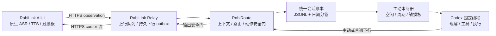

# RabiLink 主动智能可用版需求与实施方案

更新时间：2026-07-14

本文把“眼镜直接连接 Rabi / Codex、双向异步消息、持续会话记录、空闲主动审阅、触摸板催看和主动 TTS”整理成可直接实施和验收的产品需求。

本文不是重新描述一个从零开始的概念。RabiRoute 当前工作树已经实现了其中大部分 PC、Relay 和 AIUI 主链路；本文先确认现状，再只列真正缺少的工程闭环。

## 1. 最终结论

推荐采用“眼镜 AIUI 应用层直连 Relay、RabiRoute 统一收口”的单主链方案：

```text
RabiLink AIUI 前台
  -> 使用眼镜原生 ASR 产生 observation
  -> 通过 HTTPS 直接请求公网 RabiLink Relay
  -> 写入 PC 统一会话账本
  -> Codex 固定线程空闲时主动审阅

Codex / 定时器 / 规划器
  -> RabiRoute 输出安全门
  -> Relay 持久下行队列
  -> AIUI 按 cursor 直接拉取
  -> 眼镜原生 TTS
```

这里的“直连”是应用协议边界：AIUI 自己调用 Relay 的公开 HTTPS 接口，不尝试与 CXR-L 交换消息、ASR/TTS 状态、配置或 cursor。设备系统底层如何提供网络属于 AIUI 宿主前提，不进入 RabiLink 产品链路。

已确认的真实限制是：**AIUI 运行时无法与 CXR-L 直接通讯**。这不等于 CXR-L 完全不能连接眼镜；CXR-L 仍可作为独立原生探针或设备管理能力存在，但不能承接 AIUI 的消息队列、音频流、配置、播报回执或离线缓存。因此 CXR-L 桥接退出当前主链路和验收范围。

语音能力采用明确的两阶段策略：首版只启用眼镜 AIUI 原生 ASR/TTS，以最低新增成本完成可用闭环；后续再接 ASR API 和 TTS API。两阶段从首版开始共用同一组语音适配接口和消息契约，因此改用 API 时只替换 Provider 与播放适配器，不改 observation、统一会话账本、Codex 审阅和 RabiLink 下行队列。

本方案不再以“通过 CXR-L 搬走眼镜算力”作为架构理由。首版只优化眼镜侧请求频率、长轮询、批量持久化和 TTS 队列；Codex 推理仍在 PC Agent 侧。

## 2. 用户目标翻译

### 2.1 必须达成

1. 眼镜可以通过 RabiLink 连接指定的 Rabi Route、Codex 工作区和固定会话线程。
2. 眼镜 AIUI 可以查看并修改 Rabi 配置；PC RabiRoute 配置始终是唯一真源。
3. 用户语音只写入会话记录，不逐句直接创建 Codex 任务。
4. Codex 在线程空闲时主动检查尚未审阅的记录，理解用户真正想做什么。
5. Codex 可以不依赖用户刚刚说话，随时通过 RabiRoute 给眼镜发送消息。
6. 眼镜收到下行消息后使用原生 TTS 顺序播报。
7. 上行 observation 与下行 Agent 消息是两条独立推进的队列，不是一问一答的同步 RPC。
8. 用户消息、Agent 已排队消息和触摸板审阅请求进入同一条 JSONL 时间线。
9. 连接对话中单击触摸板表示“现在审阅最近会话”；Codex 忙时使用 `turn/steer` 引导当前轮次。
10. 会话超过时间边界时只机械分卷，不生成摘要、不改写原文。
11. 提供一个以“持续收集、推测意图、主动准备、低打扰介入”为核心的主动智能人格。
12. ASR 和 TTS 同时定义 AIUI 原生方案与 API 方案的统一接口；首版只启用 AIUI，API Provider 后续实现和启用。
13. 眼镜的输入、配置、下行和播报均不依赖 AIUI 与 CXR-L 之间的通讯。

### 2.2 不等同于必须达成

- “24 小时录音”不等同于“AIUI 页面前台连续识别”。
- “所有消息在同一个 JSON”不等同于把整个历史保存成一个需要反复整体重写的 JSON 数组。
- “主动智能”不等同于高频说话、逐句回应或无限循环调用 Codex。
- “应用层直连”不等同于绕过 Relay 直接把眼镜暴露给 PC；Relay 仍负责公网鉴权、排队和重连。

## 3. 当前实际基线

| 能力 | 当前状态 | 真实入口或证据 |
| --- | --- | --- |
| AIUI 连接对话与配置助手 | 已有实现 | `examples/rabilink-aiui/pages/home/index.ink` |
| 眼镜原生 ASR 前台自动续轮 | 已有实现，待当前版本真机复测 | `examples/rabilink-aiui/README.md` |
| 眼镜原生 TTS 队列与无回调 watchdog | 已有实现，待当前版本真机复测 | `examples/rabilink-aiui/pages/home/index.ink` |
| 统一 ASR/TTS Adapter 契约 | 需要在首版收口 | AIUI 先实现 Adapter；API Provider 后续接入同一契约 |
| ASR API / TTS API | 后续阶段，首版不调用 | 需要 Provider、私有凭证、成本开关和音频播放适配 |
| record-first observation | 已有实现和自动化覆盖 | `src/rabilinkObservationRecorder.ts`、`src/adapters/rabilinkRelayWorker.ts` |
| 用户与 Agent 统一 JSONL | 已有实现和单元测试 | `src/rabilinkConversationLedger.ts` |
| 日期/空档机械分卷 | 已有实现和单元测试 | `src/rabilinkConversationLedger.ts` |
| Codex 空闲审阅与周期反思 | 已有实现和单元测试 | `src/rabilinkConversationReviewer.ts` |
| 触摸板即时审阅与 `turn/steer` | 已有实现和公网链路证明，待真机交互复测 | `src/codexRuntime.ts`、AIUI 页面 |
| 无前置输入的主动下行 | 已有实现 | `/api/agent/replies` -> RabiLink Relay outbox |
| AIUI 自然语言配置助手 | 已有实现 | AIUI `LanguageModel` + 白名单配置动作 |
| RabiActive 主动人格模板 | 已有实现 | `examples/data/roles/RabiActive/` |
| 系统级 24 小时眼镜后台录音 | 未实现；AIUI 不能承诺 | 需要眼镜侧原生常驻服务或平台能力；CXR-L 桥接不作为候选 |
| AIUI 与 CXR-L 直接通讯 | 当前不可用，退出 AIUI 主链路 | CXR-L 可保留独立原生能力，但不传 AIUI 消息、音频、配置或 cursor |

当前最重要的判断是：下一步只验证“AIUI -> Relay -> RabiRoute/Codex -> Relay -> AIUI”这一条直连闭环。闭环稳定后再补可靠性和 API Provider；24 小时采集必须等待眼镜侧常驻能力，不再等待或建设 CXR-L 桥。

## 4. 三种方案

| 方案 | 数据路径 | 优点 | 主要问题 | 建议 |
| --- | --- | --- | --- | --- |
| A. AIUI HTTPS 直连 | 眼镜 -> Relay -> PC；PC -> Relay -> 眼镜 | 复用当前实现，路径最短，不依赖 AIUI↔CXR-L 通道 | 依赖 AIUI 宿主具备可用公网网络；后台录音仍受平台限制 | **强烈建议，当前唯一实施方案** |
| B. AIUI 直连流式协议 | 眼镜直接使用 WebSocket/SSE 等连接 Relay | 理论上可降低重复建连 | 必须先证明 AIUI 支持且比现有长轮询稳定 | 先放一放，不阻塞首版 |
| C. CXR-L 桥接 AIUI | AIUI -> CXR-L -> Relay -> PC | 原设想可集中设备通讯 | AIUI 无法与 CXR-L 直接通讯，工程前提不成立 | **明确拒绝，不实施** |

## 5. 推荐架构



### 5.1 主路径

当前版本默认使用：

```text
眼镜 AIUI -> Relay -> PC RabiRoute -> 会话账本 -> Codex
Codex -> RabiRoute 输出安全门 -> Relay outbox -> 眼镜 AIUI -> 原生 TTS
```

### 5.2 直连边界

```text
允许：AIUI -> HTTPS Relay -> RabiRoute/Codex
允许：Codex/RabiRoute -> HTTPS Relay -> AIUI
禁止：AIUI -> CXR-L -> Relay
禁止：Relay -> CXR-L -> AIUI
禁止：让 CXR-L 代管 AIUI 的消息、音频、配置或 cursor
```

AIUI 可以保存 token 指纹隔离的本地待发、待播和 cursor 缓存；完整会话、Rabi 配置、人格和 Codex 状态仍只由 PC 端拥有。

## 6. 唯一真源和数据从属

| 业务事实 | 唯一真源 | 其它位置只能保存什么 |
| --- | --- | --- |
| Rabi Route、Agent、人格、变量、端口配置 | PC RabiRoute Manager / 配置文件 | AIUI 只保存草稿、摘要和最后读取版本 |
| 用户与 Agent 会话内容 | 人格目录的 `rabilink-conversation.jsonl` 与日期分卷 | Relay 和 AIUI 只保存传输队列或展示缓存 |
| 下行是否已进入公网队列 | Relay outbox | 统一账本记录 `agent_to_user` 代表“已排队”，不代表用户已听到 |
| Codex 是否空闲和当前 turn | `codex app-server` 运行态 | Reviewer 只保存审阅作业状态 |
| 眼镜本地待播消息 | AIUI 按 token 指纹隔离的持久队列 | 成功播报后可删除 |
| AIUI 应用 token | AIUI 私有存储 | 页面和日志只显示 token 指纹或脱敏预览 |
| 眼镜直连健康状态 | Relay 最近请求与 AIUI 本地状态 | PC 只保存可过期的连接快照，不冒充系统设备状态 |
| 计划与长期记忆 | Rabi 角色 `plans/` 和 `memory/` | 会话分卷不生成记忆摘要 |

关键边界：统一会话账本是上下文事实源，不是投递状态数据库。播放失败、设备离线、重试次数和游标属于传输层状态，不能通过修改历史消息正文来表达。

## 7. 双向队列需求

### 7.1 上行队列

```text
眼镜 ASR 最终文本
  -> POST /rokid/rabilink/input
  -> Relay 上行项
  -> PC worker 领取
  -> 按 clientMessageId 去重
  -> 写入统一账本
  -> 完成上行项
```

要求：

- 使用 `type=rabilink.observation` 和 `deliveryMode=observe`。
- observation 只记录，不直接调用普通消息转发。
- Relay 上行项在本地可靠落盘后即可完成，不等待 Codex。
- 眼镜断网重试必须沿用稳定 `clientMessageId`。
- 旧 `/tasks` 同步问答只保留兼容和调试，不进入连接对话主流程。

### 7.2 审阅队列

审阅队列不是第二份消息文件，而是统一账本上的逻辑游标：

```text
requiresReview=true 的 user_to_agent 记录
  -> Reviewer 找到尚未完成审阅的范围
  -> 等待固定 Codex 线程空闲
  -> 启动或引导审阅 turn
```

当前实现保存的是“已调度游标”。可用版应补成“已调度”和“已完成”两级状态，避免 Codex turn 启动后失败却永久跳过记录。

建议状态：

```json
{
  "schemaVersion": 2,
  "lastScheduledUserEntryId": "...",
  "lastCompletedUserEntryId": "...",
  "activeReview": {
    "reviewId": "...",
    "fromEntryId": "...",
    "toEntryId": "...",
    "turnId": "...",
    "status": "scheduled",
    "attempt": 1,
    "scheduledAt": "..."
  }
}
```

`turn/completed` 成功后才推进 `lastCompletedUserEntryId`；失败或中断时保留待审阅范围，并采用有界退避重试。

### 7.3 下行队列

```text
Codex / 定时器 / 规划器
  -> POST /api/agent/replies
  -> RabiRoute 输出策略和动作安全门
  -> Relay /worker/messages
  -> Relay 按 deliveryId 去重并持久排队
  -> 写入统一账本 agent_to_user
  -> 眼镜 AIUI 按 cursor 直接消费
```

要求：

- 主动消息使用 `targetType=rabilink`、`proactive=true`。
- 主动消息不要求上行 `taskId`。
- 普通回复和主动消息进入同一有序 outbox。
- Relay outbox 保留期默认至少 48 小时。
- 消费端先持久化整批消息，再保存 `nextCursor`。
- 单条消息失败不能永久堵塞后续消息。
- 当前 `agent_to_user` 只证明“已经排队”。可用版应增加 `received / played / failed` 回执，供 Agent 判断用户是否可能已经听到。

## 8. 统一会话 JSONL

### 8.1 为什么使用 JSONL

用户要求“所有消息在同一个 JSON”时，工程上应实现为同一条 JSONL 时间线，而不是单个巨大 JSON 数组：

- 每行一条独立 JSON，可以原子追加。
- 并发写入和崩溃恢复更简单。
- Agent 可结构化逐行解析。
- 分卷时只移动旧文件，不需要整体重写历史。

### 8.2 当前目录

```text
data/roles/<RoleId>/
  rabilink-conversation.jsonl
  rabilink-conversation-review-state.json
  rabilink-conversations/
    index.json
    YYYY-MM-DD.jsonl
    YYYY-MM-DD-02.jsonl
```

### 8.3 当前记录类型

```json
{
  "schemaVersion": 1,
  "entryId": "rabilink-user:<stable-message-id>",
  "recordedAt": "2026-07-14T10:00:00.000Z",
  "time": 1784004000,
  "direction": "user_to_agent",
  "kind": "voice_transcript",
  "channel": "rabilink",
  "text": "用户转写文本",
  "source": "rabilink-aiui",
  "messageId": "asr-...",
  "sessionId": "conversation-...",
  "sourceDeviceId": "glass-...",
  "sourceDeviceName": "Rokid Glasses",
  "sequence": 12,
  "capturedAt": 1784003999000,
  "requiresReview": true
}
```

当前方向：

- `user_to_agent`：用户 observation。
- `agent_to_user`：已经成功进入 Relay 下行队列的 Agent 消息。
- `control`：触摸板审阅请求等控制事件。

设备电量、心率和高频传感器数据不进入会话账本；只有会影响会话理解的消息或控制事件进入。高频设备状态应进入独立、可过期的 device context store，避免把消息时间线淹没。

### 8.4 分卷规则

默认规则：

- 跨本地日期时，在下一次写入前分卷。
- 与上一条记录的连续空档达到 `rabilinkConversationSplitAfterHours` 时分卷，默认 6 小时。
- 同一天多卷使用 `YYYY-MM-DD-02.jsonl`、`-03` 等后缀。
- `index.json` 只记录文件、起止时间和条数。
- 不生成总结，不删除原文，不重写正文。
- 审阅器读取“全部日期分卷 + 当前文件”，不能只读当前文件。
- 索引损坏时扫描分卷文件恢复，宁可重复审阅，不可静默丢失。

## 9. 主动审阅和持续思考

### 9.1 触发方式

| 触发 | 行为 |
| --- | --- |
| 新 observation | 等待稳定窗口后，在线程空闲时审阅 |
| 触摸板单击 | 空闲时立即开 turn；忙时 `turn/steer` |
| 周期反思 | 即使没有新语音，也检查计划、承诺、时间变化和工具结果 |
| 定时器或计划事件 | 可以直接触发低风险准备或主动下行 |

### 9.2 默认配置

```json
{
  "rabilinkAutoReview": "true",
  "rabilinkContinuousReflection": "true",
  "rabilinkReviewIntervalMs": "5000",
  "rabilinkReviewSettleMs": "4000",
  "rabilinkReflectionIntervalMinutes": "30",
  "rabilinkConversationSplitAfterHours": "6"
}
```

### 9.3 可用版需要增加的机械护栏

人格提示不能代替系统护栏。建议增加：

```json
{
  "rabilinkProactiveCooldownMinutes": "10",
  "rabilinkMaxProactiveMessagesPerHour": "4",
  "rabilinkQuietHours": "23:30-08:30",
  "rabilinkReflectionSkipWhenUnchanged": "true"
}
```

规则：

- 反思输入指纹未变化、没有新的时间窗口或计划状态时，可以跳过本次 Codex turn。
- 普通主动提示受冷却时间和每小时上限约束。
- 用户直接问题、手动触摸板审阅和可信紧急风险可以绕过普通冷却，但仍要审计。
- 静默检索和草稿准备不计入主动播报次数。
- 一次主动提示只说最有价值的一件事。

## 10. 主动智能人格模板

人格唯一真源已经放在：

```text
examples/data/roles/RabiActive/persona.md
examples/data/roles/RabiActive/prompts/rabilink-proactive-review.md
examples/data/roles/RabiActive/personaConfig.json
```

部署时复制整个 `RabiActive` 目录，不在本文再维护第二份可分叉人格正文。

该人格必须满足以下行为约束：

### 10.1 最高使命

```text
想尽一切合理办法理解用户正在做什么、真正想完成什么、可能需要什么，
并在合适的时机把帮助落到用户的工作和生活里。
```

### 10.2 固定工作循环

```text
感知事件
-> 融合用户与 Agent 同一时间线
-> 更新意图工作假设
-> 检查计划、文件、工具和可用能力
-> 先完成低风险准备
-> 判断是否值得打扰
-> 通过 RabiRoute 行动
-> 根据用户反馈修正假设
```

### 10.3 意图工作模型

每次审阅必须重新判断：

- 用户当前活动和场景。
- 用户真正想得到的结果。
- 当前阻碍。
- 下一步最可能发生什么。
- 可以提前准备什么。
- 是否存在自动化、查证、整理或恢复上下文的机会。
- 用户当前认知和情绪负荷。
- 用户此刻希望 Agent 多参与还是少打扰。

这些都是带置信度、可修正的假设，不能冒充已确认事实。

### 10.4 行动等级

- L0 静默观察：噪声、背景对白、低置信内容。
- L1 静默处理：检索、分析、草稿、预加载、整理。
- L2 轻提示：一句可忽略的建议或简短回答。
- L3 明确提醒：时间敏感、明显遗漏或当前阻塞。
- L4 请求确认：配置、外发、设备控制或其它高风险动作。
- L5 紧急介入：只用于可信且迫近的安全风险。

### 10.5 表达要求

- 先给结论或提醒，再给一个最小下一步。
- 不说“我一直监听你”，可以说“我看过刚才的记录”。
- 不逐句复述转写，不为了证明在线而寒暄。
- 不泛泛问“需要我帮忙吗”；有方向时先给具体准备结果。
- 没有可靠上下文时，只问一个最小问题。

## 11. 触摸板交互

连接对话模式单击触摸板的唯一产品语义是：

```text
现在查看我最近说过的内容，并在当前安全点告诉我最有用的一件事。
```

要求：

- 单击不暂停 ASR。
- 单击不切换连接对话和配置助手。
- Codex 空闲时立即开始审阅。
- Codex 忙时向当前 turn 发送 steer，不取消当前任务。
- 手动审阅即使没有执行动作，也给一句很短的自然确认。
- TTS 队首处于失败状态时，可由单击执行“重试失败播报”；该状态必须在 UI 上明确区分，不能与审阅语义冲突。
- 模式切换继续使用滑动或方向键。

## 12. Rabi 配置助手

### 12.1 目标

用户可以在眼镜 AIUI 上完成：

- 选择 Relay 应用和目标 PC Rabi。
- 选择 Route。
- 选择 Codex 工作区和固定会话。
- 启停 Route 和消息端策略。
- 修改人格、模型、Pipeline preset 和 Route Variables。
- 打开远程 RibiWebGUI 完成复杂配置。

### 12.2 约束

- PC RabiRoute 配置是唯一真源。
- AIUI `LanguageModel` 只选择白名单动作，不直接写任意字段。
- 页面未收到 PC 成功响应前不得声称保存成功。
- 删除、清空、外发、设备控制和高影响配置必须二次确认。
- 配置保存前应归档旧文件。
- 可用版应给配置读取结果增加 revision；保存时携带 `baseRevision`。版本不一致返回冲突，不静默覆盖另一端的新修改。
- 眼镜只显示 token 预览，不在日志、截图、AIX 或会话账本中写明文 token。

## 13. 眼镜直连通信方案

### 13.1 直连接口

AIUI 的会话消息主链只需要维护两条公网 HTTPS 接口；配置助手使用独立的受控管理接口：

```text
POST /rokid/rabilink/input
GET  /rokid/rabilink/messages?stream=1&after=<cursor>&waitMs=25000
```

- 上行接口接收 observation 和 control，不直接创建一次一答任务。
- 下行接口读取应用级持久 outbox，不依赖上行 `taskId`。
- Relay URL、应用 token、目标 Rabi、Route 和 Codex 会话由 AIUI 配置助手直接读取或更新。
- AIUI 不调用 CXR-L 本地端口、CustomCmd 或其它私有桥接入口。

### 13.2 上行直连

```text
AIUI 原生 ASR final / 触摸板 control
  -> 生成稳定 clientMessageId
  -> 写入 AIUI 本地待发队列
  -> POST /rokid/rabilink/input
  -> Relay 鉴权和去重
  -> PC worker 拉取
  -> RabiRoute record-first
```

发送成功以 Relay 返回接受并持久化为准。网络失败时保留本地待发项并采用有界退避；重试必须复用原 `clientMessageId`，不能重新生成消息身份。

### 13.3 下行直连

```text
Codex / 计划器
  -> RabiRoute 输出安全门
  -> Relay outbox
  -> AIUI 长轮询 messages
  -> 先持久化消息批次
  -> 保存 nextCursor
  -> UI 显示和眼镜 TTS
  -> 上报 received / played / failed
```

AIUI 使用保存的 cursor 续接。首次连接从空 cursor 开始读取 Relay 保留期内的消息；断线重连不得回到最新位置跳过 backlog，也不得因重复拉取而重复播报。

### 13.4 连接状态机

```text
unconfigured
  -> connecting
  -> connected
  -> degraded
  -> reconnecting
  -> connected

任何状态都可 -> paused
鉴权失败 -> auth_error
```

- `connected`：最近一次上行或下行长轮询成功。
- `degraded`：短暂网络错误，本地队列继续保留。
- `reconnecting`：指数退避重连，退避带随机抖动并设置上限。
- `auth_error`：停止自动重试，提示用户修正 Relay URL/token。
- `paused`：停止 ASR 和网络消费，但不清空待发、待播和 cursor。

### 13.5 配置与凭证

- PC RabiRoute 仍是配置唯一真源。
- AIUI 只保存 Relay URL、token、目标选择、配置 revision 和必要缓存。
- 配置更新必须携带 `baseRevision`；冲突时重新读取，不静默覆盖。
- token 按指纹隔离本地 cursor 和队列，切换 token 不能串读旧应用消息。
- 复杂配置直接打开 Relay 暴露的远程 RibiWebGUI，不通过 CXR-L 转发。

### 13.6 明确排除

以下能力不属于当前方案，也不能作为验收前置条件：

- AIUI 与 CXR-L 之间的消息、音频、配置或 cursor 通道。
- CXR-L 代理 AIUI 的 ASR、TTS、音频播放或离线队列。
- AIUI 消息经 CXR-L 再进入 Relay。
- 以 CXR-L 探针成功替代 AIUI 直连验收。

CXR-L 可以继续维护独立的原生探针、设备状态或实验功能，但这些状态不得被描述为 AIUI 已接通。未来若新增手机或手表客户端，它们必须拥有自己的 Relay 凭证、设备身份和 cursor，独立直连 Relay；不得接管眼镜 AIUI 队列。

## 14. ASR/TTS 双方案与 24 小时录音需求

### 14.1 已确认的阶段选择

| 阶段 | ASR | TTS | 成本策略 | 状态 |
| --- | --- | --- | --- | --- |
| 首版 | 眼镜 AIUI `SpeechRecognition` | 眼镜 AIUI `speechSynthesis` | 不调用额外语音 API | 1.0.16 已实现并通过 21/21 本地验收 |
| 后续 | 可配置 ASR API Provider | 可配置 TTS API Provider + 音频播放端 | 用户显式配置后才调用 | 预留接口，后续实现 |

首版不是把 API 方案删掉，而是先实现统一接口的 AIUI Adapter。API 方案以后实现同一接口，不允许旁路写另一套消息、会话或播放状态。

### 14.2 统一语音边界

业务层只接收两个稳定事实：

```text
ASR 输出 = 一条带稳定身份的最终转写
TTS 输入 = 一条待播文本；首版输出 = 可审计的接收尝试
TTS 播放回执 = 只有 capability 明确支持时才产生
```

业务层不应知道转写来自 AIUI、FenneNote 还是云 API，也不应知道播报使用 AIUI、OumuQ 还是云 TTS。Provider 差异全部收敛到 Adapter；CXR-L 不属于 AIUI 的语音 Adapter。

建议接口：

```ts
type VoiceCapabilityDescriptor = {
  adapterId: string;
  mode: "aiui_native" | "api";
  available: boolean;
  supportsPartial: boolean;
  supportsContinuous: boolean;
  supportsCancel: boolean;
  supportsPlaybackReceipt: boolean;
  locales: string[];
};

type VoiceAdapterError = {
  code: string;
  message: string;
  retryable: boolean;
};

type AsrFinalResult = {
  resultId: string;
  text: string;
  capturedAt: number;
  locale?: string;
  sourceDeviceId: string;
  adapterId: string;
};

interface AsrInputAdapter {
  capabilities(): VoiceCapabilityDescriptor;
  start(listener: {
    onPartial?(text: string): void;
    onFinal(result: AsrFinalResult): void;
    onError(error: VoiceAdapterError): void;
    onEnd(): void;
  }): Promise<void>;
  stop(): Promise<void>;
}

type TtsSpeakRequest = {
  messageId: string;
  text: string;
  locale?: string;
  voiceId?: string;
  priority: "normal" | "urgent";
};

type TtsPlaybackReceipt = {
  messageId: string;
  adapterId: string;
  status: "received" | "playing" | "played" | "failed";
  occurredAt: number;
  errorCode?: string;
};

type TtsPlaybackAttempt = {
  attemptId: string;
  messageId: string;
  adapterId: string;
  accepted: boolean;
  status: "accepted" | "rejected";
  acceptedAt: number;
  playbackReceipt: "not_supported" | "pending" | "played" | "failed";
};

interface TtsOutputAdapter {
  capabilities(): VoiceCapabilityDescriptor;
  speak(request: TtsSpeakRequest): Promise<TtsPlaybackAttempt>;
  stop?(): Promise<void>;
}
```

这些是跨运行时契约，不要求 AIUI 和 Node 共享同一个语言实现。各端用自己的类或对象实现相同字段和状态语义。

### 14.3 ASR 最终结果契约

所有 ASR Adapter 的最终结果统一转换为现有 observation：

```json
{
  "type": "rabilink.observation",
  "deliveryMode": "observe",
  "clientMessageId": "<AsrFinalResult.resultId>",
  "source": "rabilink-aiui",
  "sourceDeviceId": "<stable-device-id>",
  "capturedAt": 1784003999000,
  "text": "最终转写文本",
  "meta": {
    "voiceAdapterId": "aiui-native-asr",
    "voiceMode": "aiui_native",
    "locale": "zh-CN"
  }
}
```

API ASR 后续只需要把 `source`、`voiceAdapterId` 和 `voiceMode` 改为实际 Provider；record-first、去重和审阅逻辑保持不变。

### 14.4 TTS 请求、接收尝试与回执契约

RabiLink 下行仍以文本为唯一内容真源。消费端根据当前 `TtsOutputAdapter` 播报：

```text
Relay 文本消息
  -> TtsSpeakRequest
  -> 当前 TtsOutputAdapter
  -> TtsPlaybackAttempt
  -> accepted / rejected
  -> 可选 TtsPlaybackReceipt
  -> received / playing / played / failed
```

`accepted` 只证明宿主接受了播报调用，不证明声音已经播放。当前 AIUI 文档没有保证完整 utterance 生命周期，因此原生 Adapter 报告 `supportsPlaybackReceipt=false` 和 `playbackReceipt=not_supported`。watchdog 只负责释放页面状态并恢复 ASR，不能伪造 `played`。真实播放回执属于 M1 的 R2。

API TTS 若返回音频字节或音频 URL，还必须经过独立 `AudioPlaybackTransport` 播放。合成 Provider 不直接修改消息队列，播放端不直接调用 ASR。

```ts
interface AudioPlaybackTransport {
  capabilities(): VoiceCapabilityDescriptor;
  play(input: {
    messageId: string;
    audioBytes?: Uint8Array;
    audioUrl?: string;
    mimeType: string;
  }): Promise<TtsPlaybackReceipt>;
}
```

直连目标下，优先选择“API 合成 + 经验证的眼镜 AIUI 音频播放”。如果 AIUI 不能播放 Provider 返回的音频，`api` TTS capability 必须报告不可用，不能绕到 CXR-L 播放并假装直连已经完成。PC 本机使用 OumuQ 播放属于另一输出端，不改变眼镜下行协议。

### 14.5 方案 A：AIUI 原生 ASR/TTS

首版必须实现：

- `AiuiAsrInputAdapter` 包装现有 `SpeechRecognition` 单轮识别和前台续轮。
- `AiuiTtsOutputAdapter` 包装现有 `speechSynthesis.speak(..., "enqueue")`。
- 原生 ASR final 转换为 `AsrFinalResult`，再走 `/rokid/rabilink/input`。
- 原生 TTS 播报前停止 ASR；收到结束事件或 watchdog 到期后恢复 ASR。
- 每次调用生成统一 `TtsPlaybackAttempt`；当前原生能力不支持可靠播放回执时明确返回 `not_supported`，不得把 watchdog 到期写成 `played`。
- 原有文本去重、纯标点过滤和 TTS 回声保护继续位于 AIUI Adapter 周围的文本策略层。

首版明确不做：

- 不上传音频给第三方 ASR API。
- 不调用付费 TTS API。
- 不在 AIUI 失败时静默切换到 API。
- 不要求用户配置 API key。

### 14.6 方案 B：ASR/TTS API

后续 API 方案必须实现：

- `ApiAsrInputAdapter`：只接收 AIUI 或未来眼镜侧原生采集层能合法提供的音频，调用配置的 ASR Provider，输出同一 `AsrFinalResult`。
- `ApiTtsOutputAdapter`：AIUI 通过 Relay 获得 Provider 合成的音频，再交给眼镜侧 `AudioPlaybackTransport`。
- Provider 注册表：集中维护 Provider ID、能力、语言、请求限制和错误映射。
- 私有凭证引用：AIUI 不保存 Provider 明文 key；配置只保存 `secretRef`，真实 key 位于 PC `.env` 或受控 secret store，由 Relay/RabiRoute 代理 API 请求。
- 成本与配额日志：记录请求数、音频秒数、失败和 Provider，但不记录真实音频或完整私密正文。
- API 失败默认返回明确错误，不自动回退或循环重试计费。

API 方案不能直接把 ASR 文本投递 Codex，也不能绕过 RabiRoute 把 TTS 音频直接作为未审计消息外发。

API ASR 还有一个硬前置：AIUI 或眼镜侧原生层必须能提供可上传的音频字节。如果当前 AIUI 只暴露最终识别文本，则 API ASR 只能保留接口和 `available=false` 能力结果，不能使用 CXR-L PCM 规避这个限制。API TTS 同理，必须先验证 AIUI 能直接播放返回音频。

### 14.7 配置唯一真源

语音模式不散落在 AIUI 和脚本的多个布尔开关里。建议在 Route `adapterConfig.json` 增加受控配置块，并由 RabiRoute 配置管理器校验：

```json
{
  "voiceRuntime": {
    "asr": {
      "mode": "aiui_native",
      "adapterId": "aiui-native-asr",
      "providerId": "",
      "secretRef": "",
      "apiFallback": "disabled"
    },
    "tts": {
      "mode": "aiui_native",
      "adapterId": "aiui-native-tts",
      "providerId": "",
      "secretRef": "",
      "apiFallback": "disabled"
    }
  }
}
```

后续切 API 时只改为：

```json
{
  "voiceRuntime": {
    "asr": {
      "mode": "api",
      "adapterId": "api-asr",
      "providerId": "<configured-provider-id>",
      "secretRef": "<private-secret-reference>",
      "apiFallback": "disabled"
    },
    "tts": {
      "mode": "api",
      "adapterId": "api-tts",
      "providerId": "<configured-provider-id>",
      "secretRef": "<private-secret-reference>",
      "apiFallback": "disabled"
    }
  }
}
```

AIUI 只读取 RabiRoute 解析后的有效策略。它可以缓存最近策略，但不能拥有另一份最终配置。

### 14.8 选择、能力探测与回退

- 首版固定 `aiui_native`，页面启动时探测 `SpeechRecognition` 和 `speechSynthesis` 是否可用。
- 不可用时显示明确错误并保持记录/播报队列，不自动产生 API 费用。
- API Adapter 实现后，只有用户显式把模式改成 `api` 才调用 Provider。
- 未来若增加 `aiui_preferred + api_fallback`，必须单独开关、显示预计费用，并配置请求上限；默认仍是 `disabled`。
- ASR 和 TTS 独立选择。例如可以使用 AIUI ASR + API TTS，或 API ASR + AIUI TTS。
- 切换 Adapter 不清空 observation、下行 cursor 或未播消息；正在识别或播报时必须先安全结束当前动作，再切换。
- capability 为 `available=false` 时禁止保存该模式为生效配置；界面必须显示缺少的是“AIUI 音频采集”还是“AIUI 音频播放”。

### 14.9 当前可以承诺

AIUI 页面在前台、宿主未回收、用户未暂停时，可以一轮一轮续接原生 `SpeechRecognition`，并使用眼镜原生 TTS。首版不依赖外部 ASR/TTS API。

### 14.10 当前不能承诺

- 页面隐藏、退出或锁屏后继续采集。
- 宿主回收页面后自动恢复麦克风。
- AIUI 获得 PCM、电平、动态底噪、前置缓存或自定义 VAD。
- 第三方页面直接复用官方 App 的长期录音结果。
- API Provider 尚未实现时可以通过修改配置直接使用 API 模式。

### 14.11 真正常驻的实施顺序

1. 先把当前 AIUI Adapter 前台闭环在真眼镜上稳定运行。
2. 对 AIUI 做 2 小时和 8 小时前台 soak，记录页面回收、网络断连、耗电、温度和转写缺口；这不冒充 24 小时后台能力。
3. 调研眼镜侧是否存在 AIUI 可调用的持续采集 API，或可与同一 Relay 契约集成的眼镜原生常驻服务。
4. 若获得眼镜侧原生服务权限，由该服务直接向 Relay 提交 observation；它不经过 CXR-L，也不建立第二套会话记录。
5. 只有眼镜侧采集生命周期通过 2 小时、8 小时和 24 小时 soak 后，才能宣称“眼镜 24 小时录音”。

常驻采集端必须复用：

```text
AsrInputAdapter
-> AsrFinalResult
-> POST /rokid/rabilink/input
-> type=rabilink.observation
-> deliveryMode=observe
-> 稳定 clientMessageId
```

不建立第二套“CXR-L 会话记录”。

### 14.12 FenneNote 可复用规则

可以复刻：

- 录音触发线和转写判定线分离。
- 动态底噪。
- 前置缓存。
- 安静切句和最长片段。
- 文本空白、纯标点、短时重复和 TTS 回声过滤。
- 默认不保存原始音频。

AIUI 只暴露最终文本时，只能复刻文本层规则。只有 AIUI 或眼镜侧原生服务能够直接提供音频时，才能复刻音频层规则并启用 ASR API；CXR-L PCM 不作为 AIUI 的替代输入。

## 15. 眼镜直连消息契约

眼镜 AIUI 的语音、文本和触摸板输入统一归一化为：

```json
{
  "type": "rabilink.observation",
  "deliveryMode": "observe",
  "clientMessageId": "<device-generated-stable-id>",
  "source": "rabilink-aiui",
  "sourceDeviceId": "<stable-device-id>",
  "sourceDeviceName": "<display-name>",
  "sessionId": "<conversation-session>",
  "capturedAt": 1784003999000,
  "modality": "voice|text|gesture",
  "text": "归一化文本"
}
```

`clientMessageId` 由 AIUI 在事件产生时生成并持久化，重试时保持不变。`sourceDeviceId` 标识这副眼镜的 AIUI 安装实例，不使用显示名、数组位置或 CXR-L 设备对象作为身份。

## 16. 可靠性补强清单

当前链路要从“已经跑通”变成“真正可长期使用”，优先补这四项：

### R1. 审阅完成确认

- 区分 scheduled cursor 和 completed cursor。
- 监听 Codex `turn/completed`。
- 失败或中断时重试，不永久跳过 observation。
- review state 继续使用原子替换。

### R2. 下行播放回执

- AIUI 直接上报 `received / played / failed`。
- 账本正文不修改；回执写传输日志或追加控制事件。
- Agent 在主动追问前可以判断上一条只是排队还是已播报。

### R3. 主动消息机械限流

- 输出门执行冷却、每小时上限和安静时段。
- L5 紧急介入和用户直接请求单独审计。
- 人格提示继续负责价值判断，系统护栏负责最坏情况。

### R4. 配置并发和回滚

- 保存前归档旧配置。
- 读取返回 revision。
- 保存要求 `baseRevision`。
- 冲突时重新读取并显示差异，不覆盖新版本。
- 保存后运行配置校验；失败时恢复归档。

## 17. 实施里程碑

### M0：收口当前可发布基线

目标：不新增架构，确认当前实现真的能在当前眼镜版本工作。

任务：

1. 固定 `RabiLink` Route、`RabiActive` 人格、Codex 工作区和会话。
2. 定义统一 `AsrInputAdapter`、`TtsOutputAdapter`、结果 DTO 和 capability descriptor。
3. 用 AIUI 原生能力实现首版两个 Adapter；API Adapter 暂不调用。
4. 运行后端构建、RabiLink 单元测试和 AIUI 本地验收。
5. 打包当前 AIX，完成 Craft 云端绑定、提审和眼镜同步。
6. 真机验证连续 ASR、主动 TTS、触摸板、模式切换、配置助手和断线 backlog。
7. 检查 AIUI 网络请求，只允许访问配置的 Relay/受控资源，不出现 CXR-L 本地端口或 CustomCmd 依赖。
8. 保存脱敏验收报告，不保存 token 和真实转写正文。

完成标准：本文第 18.1 节全部通过。

当前状态（2026-07-14）：任务 1 至 4 已完成；`1.0.16` 修复了 1.0.15 真机暴露的卡片放大后左上角叠画问题：448 x 150 与 480 x 352 不再切换两棵树，而是复用唯一 87px HUD；Ink 0.13 resize 验收也从总亮点检查升级为品牌、模式轨、状态、消息、底栏五行完整性检查。新 AIX 已使用已部署 Relay 入口生成，通过源码/交付包等价审计、Ink 0.13/0.14 各模式 20 轮 resize 和 21/21 本地验收。任务 5 至 8 中的 1.0.16 Craft 上传、提审、眼镜同步、真机连续 ASR/TTS 与网络抓取仍需设备和账号所有者执行，不能由本地模拟结果替代。

### M1：可靠性补强

目标：消除“看似已投递但实际没处理/没播报”的盲区。

任务：

1. 实现 R1 审阅完成确认。
2. 实现 R2 播放回执。
3. 实现 R3 主动限流。
4. 实现 R4 配置 revision、归档和冲突处理。
5. 增加上行待发队列、下行 cursor、断网恢复测试和 24 小时 PC/Relay 侧 soak。

### M2：ASR/TTS API Provider

目标：在不改变现有消息、账本和审阅主链路的前提下，补上可选 API 语音方案。

任务：

1. 先验证 AIUI 是否能直接提供可上传音频、是否能直接播放返回音频，分别形成 capability 证据。
2. 能力成立后实现 Provider 注册表、`ApiAsrInputAdapter`、`ApiTtsOutputAdapter` 和眼镜侧 `AudioPlaybackTransport`。
3. API 请求默认由 Relay/RabiRoute 代理，眼镜不保存 Provider 明文 key。
4. 增加 `voiceRuntime` 配置校验、secret reference 和能力探测。
5. 增加请求量、音频秒数、错误和费用观察日志。
6. 默认保持 API fallback 关闭；显式切换后完成单 Provider 验收。
7. 某项 AIUI 能力不成立时，该 API Adapter 保持 `available=false`，不使用 CXR-L 旁路补齐。

### M3：眼镜侧常驻采集

目标：获得真实的后台持续感知，而不是把 AIUI 前台能力叫作 24 小时。

任务：

1. 先确认眼镜平台是否提供 AIUI 持续采集或眼镜侧原生常驻服务权限。
2. 实现眼镜侧采集、VAD 和 ASR Adapter，并直接提交 Relay。
3. 使用 FenneNote 式切句、动态噪声和回声防护。
4. 默认只保存转写，原始音频保存单独授权和保留期。
5. 完成 2h、8h、24h soak。
6. 不把 CXR-L 音频探针或手机麦克风结果计入“眼镜 24 小时录音”验收。

## 18. 验收标准

### 18.1 当前可用版

1. 眼镜进入连接对话后，可连续完成至少 20 轮原生 ASR，期间不重复唤醒。
2. 20 条 observation 全部进入统一 JSONL，重复数为 0，且没有逐条创建 Codex turn。
3. Codex 空闲后只启动一次合并审阅，读取 JSONL 后给出有价值的判断或保持安静。
4. Codex 忙时单击触摸板不会取消当前工作，并能在当前 turn 收到 steer。
5. Codex 在眼镜关闭时主动发送消息；眼镜 30 分钟后打开仍能读取并播报。
6. 普通回复和主动消息保持相同顺序。
7. TTS 后 ASR 恢复，且不会把刚播报内容重新写成 observation。
8. 配置助手连续完成两轮自然语言配置，不停在第一句。
9. 配置写入后从同一路径读回一致，并能精确回滚。
10. 跨日期和 6 小时空档均产生机械分卷；历史没有摘要，审阅器仍能读到未审阅记录。
11. 当前 ASR/TTS capability 显示 `aiui_native`，没有 API key 也能完成完整链路。
12. AIUI 能力不可用时明确报错，并证明没有调用 ASR/TTS API。

### 18.2 可靠性版

1. Codex turn 启动后故意中断，待审阅 observation 不丢失。
2. AIUI 收到下行后崩溃，重开后只播报一次。
3. TTS 连续失败三次让出队首，后续消息仍可播放。
4. Agent 能区分 queued、received、played 和 failed。
5. 触发主动消息上限后，普通主动消息被抑制并留下审计；用户直接请求不受错误抑制。
6. 两台配置端同时修改时，旧 revision 保存被拒绝，不覆盖新值。

### 18.3 AIUI 直连版

1. AIUI 上行只请求配置的 Relay `POST /rokid/rabilink/input`，不调用 CXR-L 本地端口或 CustomCmd。
2. AIUI 下行只请求 Relay `GET /rokid/rabilink/messages` 并用本地持久 cursor 续接。
3. 自研 CXR-L 模块未运行时，只要 AIUI 宿主网络可用，连接对话、配置、ASR 上行和 TTS 下行仍正常。
4. 断网 30 分钟后恢复，上行 observation 不丢失、不重复，下行 backlog 不跳过、不重复播报。
5. CXR-L 独立探针成功或失败都不改变 AIUI 连接状态，界面不得把 CXR-L 状态显示为 AIUI 已接通。

### 18.4 API 语音版

1. ASR 模式显式切为 `api` 后，API final 产生与 AIUI 相同结构的 observation。
2. TTS 模式显式切为 `api` 后，同一 Relay 文本产生统一 `played/failed` 回执。
3. 可以独立组合 AIUI ASR + API TTS、API ASR + AIUI TTS。
4. API Provider 失败不会绕过队列、重复计费或直接投递 Codex。
5. 未显式启用 API fallback 时，AIUI 失败不会调用 API。
6. 日志能统计请求量和音频秒数，但不包含 API key、原始音频或完整私密正文。
7. API ASR 验收必须使用 AIUI/眼镜侧直接采集的音频；API TTS 验收必须由 AIUI/眼镜侧直接播放，二者都不能使用 CXR-L 旁路。

### 18.5 24 小时采集版

1. 持续运行 24 小时，记录断连次数、最长音频缺口、耗电和温度。
2. 任意时刻可从眼镜 UI 暂停采集。
3. 暂停后不再产生新 observation。
4. 默认没有原始音频落盘。
5. TTS 和媒体回声不会被重复转写。

## 19. 隐私与安全红线

- 持续感知必须显式开启，并持续显示状态。
- 录音、转写、保存原始音频、上传、投递和主动播报分别授权。
- 默认不长期保存原始音频和图片。
- token、Cookie、内网地址、私聊和真实转写不写入公开仓库、证据包或人格提示。
- 环境里听到的一句话不构成发送消息、删除、购买、配置修改或设备控制授权。
- 所有外发、配置和设备动作继续经过 RabiRoute 安全门。
- 眼镜 UI 必须有明显暂停入口；服务无法确认状态时按暂停处理。

## 20. 实施文件地图

当前主链路：

```text
src/rabilinkConversationLedger.ts
src/rabilinkConversationReviewer.ts
src/rabilinkObservationRecorder.ts
src/adapters/rabilinkRelayWorker.ts
src/outbox.ts
src/codexRuntime.ts
src/shared/voiceRuntime.ts                 已实现：语音 capability 与共享 DTO
scripts/rabilink-relay-server.mjs
examples/rabilink-aiui/pages/home/index.ink
examples/rabilink-aiui/utils/rabilink-api.js
examples/rabilink-aiui/utils/rabilink-store.js
examples/rabilink-aiui/utils/voice-runtime.js  已实现：AIUI 原生 ASR/TTS Adapter
examples/data/route/RabiLink/adapterConfig.json
examples/data/roles/RabiActive/
```

CXR-L 相关 Android 探针不属于本实施文件地图。它们可以独立维护，但不得被 AIUI 直连代码引用，也不得作为本需求的完成证据。

## 21. 推荐验证命令

本地只读或构建验证：

```powershell
cd C:\Path\To\RabiRoute
npm run build:backend
node --import tsx --test src/rabilinkConversationLedger.test.ts src/rabilinkConversationReviewer.test.ts src/rabilinkObservationRecorder.test.ts src/adapters/rabilinkRelayWorker.test.ts

cd C:\Path\To\RabiRoute\examples\rabilink-aiui
npm run acceptance:local
npm run active-intelligence:e2e
npm run readiness
```

真机、Craft 上传、配置写回、眼镜侧原生常驻服务和任何外部动作继续要求明确执行授权。

## 22. 参考资料

本地资料：

- [主动智能总纲](../主动智能设计思路.md)
- [AIUI 常驻与主动智能边界](rabilink-aiui-residency-plan.md)
- [RabiLink Relay](rabilink-relay-server.md)
- [原生手机与眼镜应用设计](rabilink-glasses-app-design.md)（仅作独立原生/CXR-L 历史参考，不作为 AIUI 主链路）
- [计划和记忆机制](plan-and-memory-model.md)
- 工作区 FenneNote 项目的 `docs/RECORDING_TRANSCRIPTION_ARCHITECTURE.md`

Rokid 官方资料：

- [Hi Rokid / Rokid Glasses Academy](https://global.rokid.com/pages/academy)
- [Rokid Glasses 产品页](https://global.rokid.com/products/rokid-glasses)
- [AIUI 介绍](https://js.rokid.com/AIUI/guide/quickstart-intro?lang=zh-CN)
- [AIUI 沉浸式应用](https://js.rokid.com/AIUI/guide/quickstart-first-immersive?lang=zh-CN)
- [SpeechRecognition](https://js.rokid.com/AIUI/api/ai/speech-recognition?lang=zh-CN)
- [SpeechSynthesis](https://js.rokid.com/AIUI/api/ai/speech-synthesis?lang=zh-CN)
- [LanguageModel](https://js.rokid.com/AIUI/api/ai/language-model?lang=zh-CN)

## 23. 需求完成判定

只有同时满足以下条件，才能把目标称为“真正能用的 RabiLink 主动智能”：

```text
眼镜与 Codex 双向异步链路真机稳定
+ 首版 AIUI ASR/TTS 通过统一 Adapter 工作且不产生额外 API 调用
+ 后续 API ASR/TTS 能通过同一契约替换或独立组合
+ 用户和 Agent 同一会话账本可靠分卷
+ Codex 空闲审阅不丢消息
+ 主动下行可恢复且知道是否播报
+ 配置修改有唯一真源、冲突保护和回滚
+ 人格主动但低打扰
+ AIUI 不依赖 CXR-L，直接经 Relay 与 RabiRoute/Codex 双向通讯
+ 24 小时能力按真实服务生命周期验收，不用前台 AIUI 冒充
```
