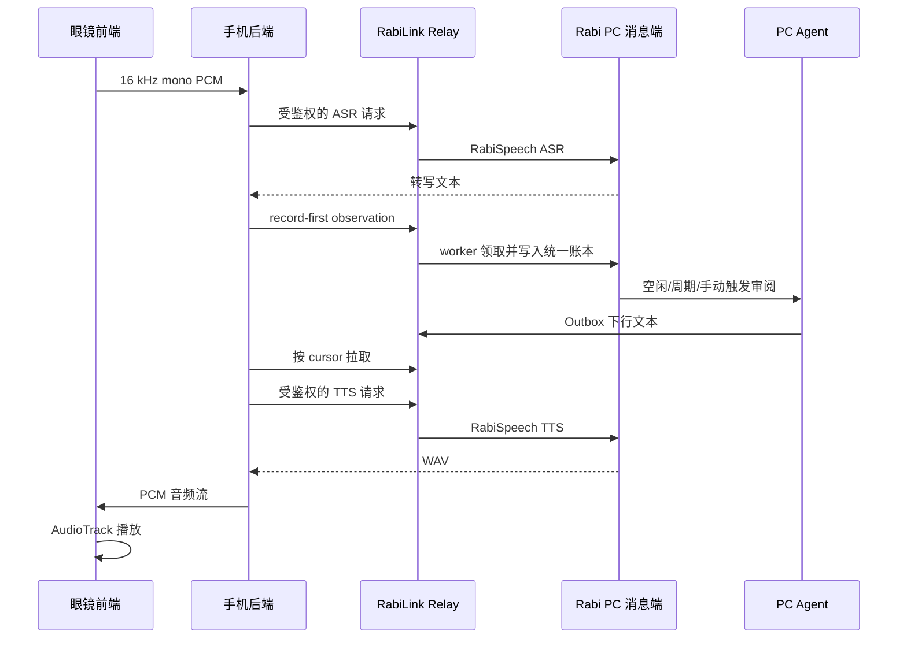

<!-- docs-language-switch -->
<div align="center">
<a href="./rabilink-glasses-app-design_en.md">English</a> | 简体中文
</div>
<!-- /docs-language-switch -->

# RabiLink 眼镜 App 主线设计

> 状态：当前主开发路线。自 2026-07-18 起暂停 AIUI 新功能，眼镜 APK 是纯前端，手机 App 是眼镜后端。

## 产品边界

```text
眼镜：采集/发送 PCM，接收/播放 PCM，显示低干扰状态，发送照片等设备媒体
手机：连接眼镜，保存眼镜专属设置，连接 Relay，排队音频/媒体，维护下行 cursor
Relay：应用/设备鉴权、持久消息邮箱、受限语音代理、媒体暂存
Rabi PC：ASR、TTS、Route、Agent、人格、记忆、统一账本和动作安全门
```

手机不再复制 Rabi PC 的 Route、Agent、工作区或线程配置。需要调整 PC 时，手机直接打开 RabiLink 远程 WebGUI `/manage`。Relay 地址、应用 token、目标 Rabi PC、眼镜连接状态和眼镜传输设置仍由手机管理；眼镜不保存 Relay token，也不直接访问公网。

## 主链路



眼镜和手机之间可以同时走 Classic Bluetooth 与 P2P。控制消息必须幂等，避免同一开始/停止命令在双通道到达时重复提交；音频正文使用带 tag 的流数据。

## 当前实现

- 眼镜默认入口为 `com.rabi.link.glass.GlassAudioClientActivity`，工程模块为 `apps/rabilink-android/glass-app/`；眼镜主链已不在本地运行 ASR/TTS。
- 确认键开始录音，再次确认停止并发送；界面使用纯黑背景、单条横向操作带和显式居中焦点。
- HUD 使用固定的连接、聆听、上传、播报、暂停和异常状态角标；下行 PCM 播报时暂停采集，并按音频长度延迟恢复，避免回声重新进入上行。
- 手机 `RabiGlassPcBackend` 将 PCM 封装为 WAV，调用 Rabi PC ASR，发布 observation，拉取下行消息，再调用 PC TTS 并把 PCM 发回眼镜。
- 手机首页只保留 Relay/目标 PC、眼镜后端、安装/启动、媒体状态、远程配置和诊断，不再展示 Route/Agent/Codex 绑定编辑器。
- 照片按消息附件上传；Relay 和 PC worker 同样接受视频附件。当前真机入口已接照片回调，视频采集回调仍需设备 SDK 真机接线，不承诺实时视频。
- AIUI、Android 系统 ASR/TTS、Glass SDK ASR/TTS 和 Rokid AI 语音路径仅保留为历史调试证据，不进入默认流程。

## 媒体与可靠性

照片、短视频和音频附件按“消息附件”处理，不走直播：

1. 手机先上传二进制，取得附件凭据。
2. 再发布带 `attachments` 的 observation。
3. PC worker 使用同一鉴权下载到该 Route 的私有数据目录，然后写入账本并交给 Agent。
4. 上传失败时不得发布悬空 observation；手机应显示失败并允许重试。

Relay 默认限制单个附件 64 MiB，可通过环境变量调整。当前实现是单请求慢传和串行队列；断点续传、手机磁盘级离线重试、附件回执及保留期清理仍是上线前可靠性工作。

## 生命周期与安全

- 当前手机后端跟随 `RokidProbeActivity` 前台生命周期；首版验收时必须保持页面运行。稳定后再迁移到有常驻通知、可暂停的 Foreground Service。
- 眼镜不拥有应用 token、Route 配置、Agent 配置或模型配置。
- 手机应用 token 只能保存在应用私有存储，日志不得输出 token、转写正文或音频正文。
- Relay 的语音代理只开放转写和合成白名单，不能借此访问 WebGUI、worker API、PC 麦克风控制或任意本机 URL。
- 原始音频默认不长期保存；媒体下载落在 PC 私有 Route 数据目录，不进入源码或公开提交。

## 验收门

1. 两个 APK 均可构建，手机可安装并启动眼镜前端。
2. 真实眼镜的前进、后退、确认不会连跳，焦点始终可见。
3. 一段录音只产生一条 observation，双通道重复控制消息不会二次提交。
4. Rabi PC 完成 ASR/TTS，眼镜只传输和播放音频。
5. 下行 cursor 在重连后不跳过尚未持久化的消息；后续补“已送达/已播放”回执。
6. 照片可作为附件到达 PC；视频先验收文件消息，不承诺直播。
7. 手机可打开远程 WebGUI 调整 PC 配置，但手机首页不存在第二套 Route/Agent 配置。

## 后续顺序

1. 真眼镜完成 PTT、照片附件和下行播报闭环。
2. 把手机后端迁移为前台服务，并增加显式连接/暂停状态。
3. 增加手机磁盘队列、指数退避、附件保留期和投递/播放回执。
4. 接入真机视频文件回调并验证慢传；最后才评估实时视频。
5. 稳定后再研究 VAD，仍不把 24 小时录音作为首版承诺。

## 相关资料

- [眼镜端三条路线对比](rabilink-glasses-route-comparison.md)
- [手机边缘枢纽](rabilink-phone-edge-hub.md)
- [RabiLink Relay](rabilink-relay-server.md)
- [RabiSpeech](rabispeech-plugin.md)
- [Android 工程](../apps/rabilink-android/README.md)
- [AIUI 暂停路线](rabilink-aiui-residency-plan.md)
