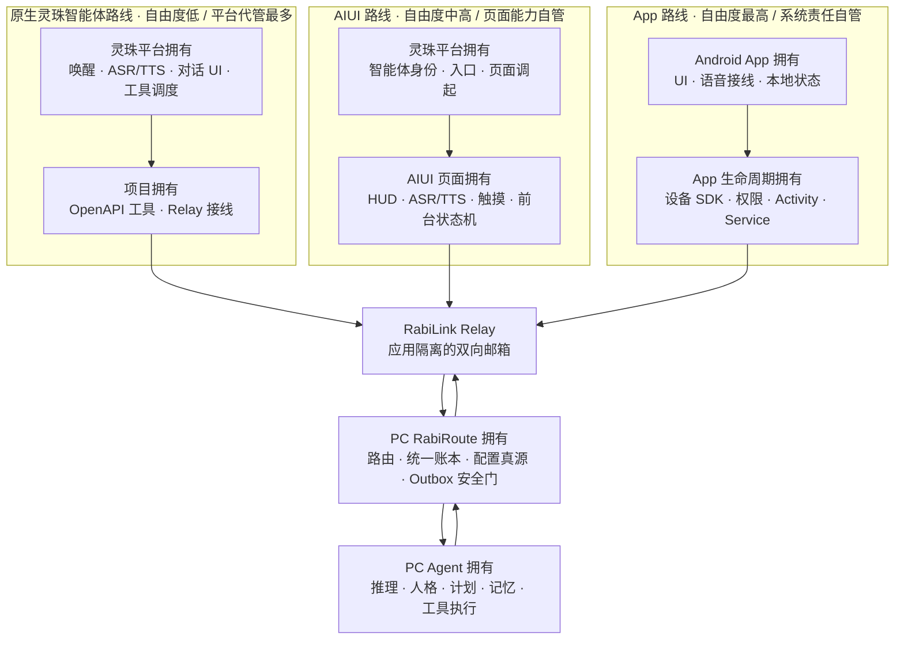

<!-- docs-language-switch -->

<a href="./rabilink-glasses-route-comparison_en.md">English</a> | 简体中文

<!-- /docs-language-switch -->

# RabiLink 眼镜端三条路线对比

> 状态：当前路线选择指南。本文对比眼镜客户端的三种宿主形态；每条路线的成熟度仍以对应实现文档和真机验收为准。

RabiLink 眼镜端应明确分为三条路线：

1. **原生灵珠智能体路线**：使用灵珠/Rizon 的原生智能体会话和 OpenAPI 工具。
2. **AIUI 路线**：在灵珠智能体下挂载 AIX 页面，由 AIUI 提供自定义 HUD、前台 ASR/TTS 和页面逻辑。
3. **App 路线**：在眼镜上安装独立 Android APK，按需配合手机伴侣和设备 SDK。

这三条路线不是三套互不兼容的后端。它们可以共用同一个 RabiLink Relay、RabiRoute Route、统一会话账本、PC Agent 和 Outbox / Action Gate。

## 能力归属架构图

自由度越高，客户端能自行决定的 UI、语音接线、设备能力和生命周期越多；同时平台替项目承担的能力越少，权限、安全、兼容、发布和真机维护责任越多。Agent 推理、人格、长期记忆、配置真源和动作安全门不随眼镜路线下沉，仍统一留在 PC 端。

## 核心差异

| 对比项 | 原生灵珠智能体路线 | AIUI 路线 | App 路线 |
| --- | --- | --- | --- |
| 眼镜端宿主 | 灵珠/Rizon 原生智能体会话，平台负责对话壳和工具编排 | 挂在同一灵珠智能体下的 AIUI/AIX 页面，由 QuickJS/Ink 页面承载 HUD 和状态机 | 独立 Android 应用，直接使用眼镜 SDK、Android 组件和自有页面 |
| 典型入口 | 从官方助手、智能体列表或语音入口唤起智能体后对话 | 由智能体调起页面，进入沉浸式连接对话或配置助手 | 从设备应用入口启动 APK，也可由手机伴侣或设备命令协同 |
| 语音与推理归属 | 平台智能体负责一轮对话理解和工具调用；RabiRoute 通过 OpenAPI/Relay 接收请求 | 页面使用 AIUI 原生 ASR/TTS；配置助手的 `LanguageModel` 只选择白名单动作，主要推理仍由 PC Agent 完成 | App 自行选择 RokidAiSdk、系统能力、本地或云 ASR/TTS；业务推理仍可统一交给 PC Agent |
| 能力归属边界 | 灵珠平台拥有唤醒、ASR/TTS、对话 UI 和工具调度；项目主要拥有 OpenAPI 工具与后端处理 | 灵珠平台拥有智能体身份、入口和页面调起；AIUI 页面拥有 HUD、ASR/TTS 与前台状态机；PC 拥有主要 Agent 能力 | App 拥有 UI、语音接线、设备 SDK 和 Android 生命周期；PC 继续拥有 Agent、人格、记忆、配置与动作门 |
| UI 自由度 | 最低，主要使用平台原生对话展示 | 中高，可做定制 HUD、模式切换、触摸板交互和状态可视化 | 最高，可自定义完整页面、导航、通知和设备交互 |
| 连续交互与生命周期 | 更适合按需唤起的一轮或多轮会话，不作为持续前台 HUD 或后台采集保证 | 页面前台可自动续接 ASR、持续消费下行；隐藏、退出或被宿主回收后不能继续承诺录音 | 可使用 Activity、Service 和 Android 生命周期深化常驻能力；仍受权限、系统和厂商限制，必须显式显示采集状态 |
| 设备能力 | 只使用灵珠平台向智能体和工具开放的能力 | 使用 AIUI 的 ASR、TTS、LanguageModel、触摸和页面网络能力，不能任意取得 Android 系统权限 | 最广，可接设备状态、相机、传感器、CustomCmd 和厂商 SDK，但兼容与授权成本最高 |
| 总体自由度 | 低：平台代管最多，接入最快，但宿主行为和设备能力最难自定义 | 中高：页面体验和前台语音可控，仍受 AIUI API、页面生命周期和发布平台约束 | 最高：系统集成空间最大，同时自行承担权限、安全、兼容、发布和生命周期责任 |
| 发布与安装 | 配置并发布灵珠智能体，导入或绑定 OpenAPI 工具和应用凭据 | 构建 AIX，在 Craft 上传并绑定灵珠智能体，提审后经手机添加并同步到眼镜 | 构建、签名和安装 APK，处理权限、升级、设备兼容和可能的手机伴侣分发 |
| 工程成本 | 最低 | 中等偏高 | 最高 |
| 最适合 | 快速问答、工具调用、兼容入口和低成本试验 | 当前 RabiLink 的定制眼镜主体验：HUD、前台连续对话、主动消息和配置助手 | 深度设备控制、系统级集成、复杂传感器能力和需要独立生命周期的场景 |
| 当前成熟度 | 已有 OpenAPI/插件兼容链，属于实验兼容路线 | 已有实现和本地验收依据，仍需按当前发布版本完成外部审核和真眼镜证据 | 已有 Android probe、SDK 和实验契约，尚未收敛为正式产品路线 |

## 路线一：原生灵珠智能体

这条路线复用灵珠平台已经提供的智能体入口、语音对话、模型理解和工具调用。RabiLink 以 OpenAPI/插件形式把请求送到 Relay，再由 PC RabiRoute 和 Agent 处理。

适合：

- 最快验证“眼镜说话 -> Relay -> PC Agent -> 回复”的端到端链路。
- 标准问答、显式工具调用和低成本兼容入口。
- 不需要自定义沉浸 HUD、持续页面状态机或深度设备权限的场景。

限制：

- UI、工具调用节奏、会话生命周期和平台能力由灵珠宿主决定。
- 不应把它描述成持续前台 HUD、后台录音服务或完整设备控制层。
- 旧的按 `taskId` 轮询仍只作为兼容协议；新的持续消息体验应优先复用应用级下行队列。

## 路线二：AIUI

这条路线仍以灵珠智能体为外层实体，但在智能体下挂载 `rabilink-aiui.aix` 页面。页面可以提供自定义 HUD、连接对话、配置助手、触摸板切换、前台原生 ASR/TTS 和持续下行队列。

适合：

- 当前 RabiLink 的主要产品化眼镜体验。
- 需要定制视觉和交互，但暂时不需要 Android 系统级权限。
- 需要 record-first observation、主动消息、统一账本和配置白名单的场景。

限制：

- AIUI 只承诺页面前台能力。页面隐藏、退出、锁屏或被宿主回收后不能承诺继续采集麦克风。
- 页面内 `LanguageModel` 是受控配置动作选择器，不是第二套完整 Agent。
- 发布链包含 AIX 构建、Craft 上传、智能体绑定、提审、手机添加和眼镜同步，需要分别验收。

## 路线三：原生 App

这条路线在眼镜上安装独立 Android APK，并可按需配合手机伴侣、前台服务、CXR/CustomCmd、RokidAiSdk 或其他设备 SDK。它获得最完整的 UI、生命周期和设备能力，也承担最高的工程和维护成本。

适合：

- AIUI 无法提供的系统级或厂商 SDK 能力。
- 相机、传感器、设备状态、复杂本地交互和独立生命周期。
- 真正需要后台或常驻采集研究的场景，但必须遵守 Android 前台服务、权限和可见隐私提示。

限制：

- 原生 App 不等于自动拥有 24 小时录音能力；是否可行仍取决于系统版本、设备权限、厂商限制和用户可见的前台服务。
- 需要维护 APK 构建、签名、安装、升级、设备兼容和真机回归。
- App 仍应复用同一 Relay observation、统一账本和 Outbox 契约，不应另造一套 Agent、记忆或外发权限。

## 当前选择建议

| 目标 | 建议路线 |
| --- | --- |
| 先验证灵珠是否能把用户请求送到 RabiRoute | 原生灵珠智能体路线 |
| 做当前可交付的定制 HUD、前台连续对话和主动消息 | AIUI 路线 |
| 需要相机、传感器、原生 Service 或更强设备控制 | App 路线 |
| 同时保留低成本入口和产品主界面 | 原生灵珠智能体 + AIUI 并存 |
| 研究真正长期常驻采集 | App/手机前台服务，复用 AIUI 的 record-first 后端契约 |

当前推荐把 **AIUI 作为定制眼镜主体验**，保留 **原生灵珠智能体作为轻量入口和兼容路线**，把 **App 作为深度设备能力和独立生命周期的长期分支**。只有在 AIUI 的页面权限或生命周期明确不足时，才把具体能力下沉到 App，而不是复制整套后端。

## 共同边界

无论选择哪条路线，都保持这些不变量：

- RabiRoute 是消息网关、Policy Router 和 Action Gate，不是眼镜端 Agent OS。
- PC RabiRoute 拥有配置真源、统一会话账本、路由策略和外发安全门。
- Relay 提供按应用隔离、可重试的双向邮箱，不承担 Agent 推理。
- 眼镜客户端只保存必要的设备状态、cursor 和待处理队列，不复制人格、长期记忆或完整 PC 配置。
- 主动外发继续经过 `/api/agent/replies` 和 Outbox 策略。
- 任何常驻采集都必须显式开启、持续可见，并分别控制转写、原始数据保存、外发和删除权限。

## 相关文档

- [RabiLink Relay](rabilink-relay-server.md)
- [RabiLink AIUI 常驻边界](rabilink-aiui-residency-plan.md)
- [RabiLink 手机边缘枢纽](rabilink-phone-edge-hub.md)
- [RabiLink 原生应用历史设计](rabilink-glasses-app-design.md)
- [AIUI 示例](../examples/rabilink-aiui/README.md)
- [Android RabiLink probe](../examples/android-rabi-link-probe/README.md)
