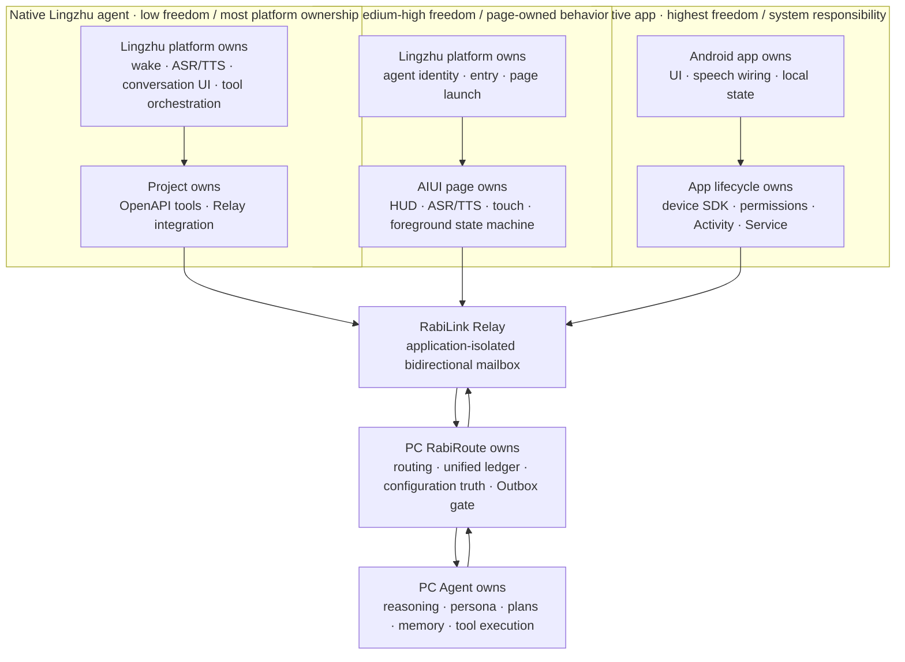

<!-- docs-language-switch -->

English | <a href="./rabilink-glasses-route-comparison.md">简体中文</a>

<!-- /docs-language-switch -->

# RabiLink Glasses: Three Client Routes

> Status: current route-selection guide. This document compares three glasses-side host models. Each route's maturity still depends on its implementation guide and physical-device acceptance.

RabiLink should distinguish three glasses routes:

1. **Native Lingzhu agent route**: use the Lingzhu/Rizon hosted agent conversation and OpenAPI tools.
2. **AIUI route**: mount an AIX page under the Lingzhu agent for a custom HUD, foreground ASR/TTS, and controlled page logic.
3. **App route**: install a standalone Android APK on the glasses, optionally paired with a phone companion and device SDKs.

These are not three incompatible backends. All three can share one RabiLink Relay, RabiRoute Route, unified conversation ledger, PC Agent, and Outbox / Action Gate.

## Capability-ownership architecture

More freedom means the client controls more UI, speech wiring, device capability, and lifecycle behavior. It also means the platform carries less responsibility for the project, while permission, security, compatibility, release, and physical-device maintenance move into the project. Agent reasoning, persona, long-term memory, configuration truth, and the action gate remain on the PC regardless of the glasses route.

## Core differences

| Dimension | Native Lingzhu agent | AIUI | Native app |
| --- | --- | --- | --- |
| Glasses-side host | Lingzhu/Rizon hosted agent conversation; the platform owns the conversation shell and tool orchestration | AIUI/AIX page mounted under the same Lingzhu agent; QuickJS/Ink owns the HUD and page state machine | Standalone Android application using glasses SDKs, Android components, and its own UI |
| Typical entry | Invoke the agent from the official assistant, agent list, or voice entry | The agent opens the page into immersive connected-conversation or configuration mode | Launch the installed APK, optionally coordinated by a phone companion or device command |
| Speech and reasoning owner | The hosted agent interprets a turn and invokes tools; RabiRoute receives work through OpenAPI/Relay | AIUI native ASR/TTS runs in the page; the configuration `LanguageModel` only selects whitelisted actions, while the PC Agent owns primary reasoning | The app chooses RokidAiSdk, system, local, or cloud ASR/TTS; business reasoning can still remain with the PC Agent |
| Capability ownership boundary | Lingzhu owns wake, ASR/TTS, conversation UI, and tool orchestration; the project mainly owns OpenAPI tools and backend processing | Lingzhu owns agent identity, entry, and page launch; the AIUI page owns HUD, ASR/TTS, and its foreground state machine; the PC owns primary Agent capability | The app owns UI, speech wiring, device SDKs, and Android lifecycle; the PC still owns Agent, persona, memory, configuration, and the action gate |
| UI freedom | Lowest; mainly the platform's native conversation presentation | Medium-high; custom HUD, mode switching, touchpad behavior, and state visualization within AIUI limits | Highest; complete control over pages, navigation, notifications, and device interaction |
| Continuous interaction and lifecycle | Best for on-demand single- or multi-turn sessions; not a guarantee of a resident HUD or background capture | Can restart ASR and consume downlink while the page is foreground; cannot promise capture after hide, exit, or host reclaim | Can deepen lifecycle support with Activities and Services, but remains subject to permission, OS, and vendor limits and must visibly disclose capture |
| Device capabilities | Only capabilities exposed by the Lingzhu agent/tool platform | AIUI ASR, TTS, LanguageModel, touch, and page networking; no arbitrary Android system privileges | Broadest access to device state, camera, sensors, CustomCmd, and vendor SDKs, with the highest compatibility and authorization cost |
| Overall freedom | Low: fastest integration and the most platform-owned behavior, but the least control over the host and device | Medium-high: page experience and foreground speech are controllable, within AIUI API, lifecycle, and publishing constraints | Highest: maximum system integration, together with full responsibility for permissions, security, compatibility, release, and lifecycle |
| Release and installation | Configure and publish an agent, then import or bind OpenAPI tools and application credentials | Build AIX, upload and bind it in Craft, submit it for review, add it on the phone, and sync it to the glasses | Build, sign, install, update, and test an APK, including permissions, device compatibility, and optional phone-companion distribution |
| Engineering cost | Lowest | Medium-high | Highest |
| Best fit | Fast Q&A, tool calls, compatibility entry, and low-cost experiments | Current custom RabiLink glasses experience: HUD, foreground continuous conversation, proactive messages, and configuration assistant | Deep device control, system integration, complex sensors, and scenarios that need an independent lifecycle |
| Current maturity | Existing OpenAPI/plugin compatibility path; experimental compatibility route | Implemented with local acceptance evidence; current release still needs external review and physical-glasses evidence | Android probes, SDK, and experimental contracts exist; not yet consolidated into a product route |

## Route 1: native Lingzhu agent

This route reuses the Lingzhu platform's agent entry, voice conversation, hosted interpretation, and tool invocation. RabiLink is exposed as OpenAPI/plugin tools that send work to Relay and then to the PC RabiRoute and Agent.

Use it for:

- The fastest end-to-end proof from glasses speech to Relay, PC Agent, and reply.
- Standard Q&A, explicit tool calls, and a low-cost compatibility entry.
- Scenarios that do not need a custom immersive HUD, a resident page state machine, or deep device privileges.

Limits:

- UI, tool-call cadence, conversation lifecycle, and available device capabilities are controlled by the Lingzhu host.
- It should not be presented as a resident HUD, background recorder, or complete device-control layer.
- Legacy `taskId` polling remains compatibility-only; new continuous-message behavior should use the application-level downlink queue.

## Route 2: AIUI

This route keeps the Lingzhu agent as the outer entity and mounts `rabilink-aiui.aix` beneath it. The page can provide a custom HUD, connected conversation, configuration assistant, touchpad switching, foreground native ASR/TTS, and a continuous downlink queue.

Use it for:

- The current primary productized glasses experience for RabiLink.
- Custom visuals and interaction without requiring Android system privileges.
- Record-first observations, proactive messages, the unified ledger, and whitelisted configuration actions.

Limits:

- AIUI only promises foreground page behavior. It cannot promise microphone capture after hide, exit, lock, or host reclaim.
- The page `LanguageModel` is a bounded configuration-action selector, not a second full Agent.
- AIX build, Craft upload, agent binding, review, phone addition, and glasses sync are separate release stages and must be accepted separately.

## Route 3: native app

This route installs a standalone Android APK on the glasses and can optionally use a phone companion, foreground services, CXR/CustomCmd, RokidAiSdk, or other device SDKs. It provides the most UI, lifecycle, and device freedom, with the highest engineering and maintenance cost.

Use it for:

- System-level or vendor-SDK capabilities unavailable to AIUI.
- Camera, sensors, device state, complex local interaction, and an independent lifecycle.
- Research into true resident/background capture, while respecting Android foreground-service, permission, and visible privacy requirements.

Limits:

- A native app does not automatically gain 24-hour recording. Feasibility still depends on device permissions, OS version, vendor restrictions, and a user-visible foreground service.
- The project must maintain APK build, signing, installation, upgrades, compatibility, and physical-device regression.
- The app should reuse the same Relay observation, unified-ledger, and Outbox contracts instead of creating another Agent, memory system, or outbound permission model.

## Current selection guidance

| Goal | Recommended route |
| --- | --- |
| First prove that Lingzhu can send a user request to RabiRoute | Native Lingzhu agent |
| Deliver a custom HUD, foreground continuous conversation, and proactive messages now | AIUI |
| Use camera, sensors, native Services, or stronger device control | Native app |
| Keep a low-cost entry beside the main product interface | Native Lingzhu agent plus AIUI |
| Research genuinely resident capture | Native app or phone foreground service, reusing the AIUI record-first backend contract |

The current recommendation is to use **AIUI as the primary custom glasses experience**, retain the **native Lingzhu agent as a lightweight entry and compatibility path**, and treat the **native app as the long-term branch for deep device capability and an independent lifecycle**. Move a capability down into the app only when AIUI's page permissions or lifecycle are demonstrably insufficient; do not duplicate the backend.

## Shared boundaries

All routes keep the same invariants:

- RabiRoute is a message gateway, Policy Router, and Action Gate, not a glasses-side Agent OS.
- PC RabiRoute owns configuration truth, the unified conversation ledger, route policy, and outbound safety gates.
- Relay provides an application-isolated, retryable bidirectional mailbox and does not own Agent reasoning.
- Glasses clients retain only necessary device state, cursors, and pending queues; they do not copy persona, long-term memory, or complete PC configuration.
- Proactive external output still passes through `/api/agent/replies` and Outbox policy.
- Any resident capture must be explicitly enabled and visibly indicated, with separate controls for transcription, raw-data retention, outbound use, and deletion.

## Related documents

- [RabiLink Relay](rabilink-relay-server_en.md)
- [RabiLink AIUI residency boundary](rabilink-aiui-residency-plan_en.md)
- [RabiLink phone edge hub](rabilink-phone-edge-hub_en.md)
- [Historical RabiLink native-app design](rabilink-glasses-app-design_en.md)
- [AIUI example](../examples/rabilink-aiui/README_en.md)
- [Android RabiLink probe](../examples/android-rabi-link-probe/README_en.md)
