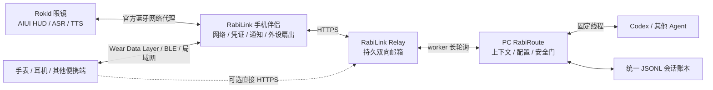
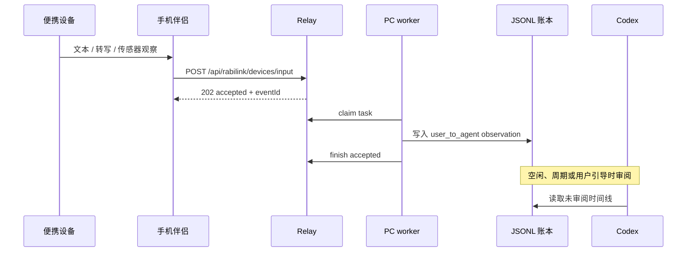
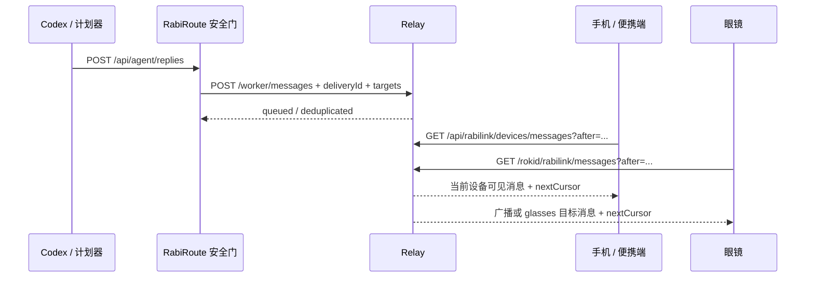

<!-- docs-language-switch -->
<div align="center">
<a href="./rabilink-phone-edge-hub_en.md">English</a> | 简体中文
</div>
<!-- /docs-language-switch -->

# RabiLink 手机边缘通讯枢纽

> 状态：实验集成契约。手机边缘枢纽、Android SDK 和设备消息模型已有首版实现，仍需按真实手机、眼镜和后台生命周期验收。

## 结论

RabiLink 的手机定位是 **边缘通讯枢纽（edge communication hub）**，不是第二个 Agent，也不是 RabiRoute 的配置真源。

- PC RabiRoute / Codex：拥有推理、人格、统一会话账本、配置真源和动作安全门。
- Relay：拥有按应用隔离、可重试、至少保留 48 小时的双向邮箱。
- 手机：保存应用 token，承担公网通讯、通知、眼镜状态和本地便携设备扇出。
- 眼镜 AIUI：保持轻量 HUD、触摸板、前台原生 ASR/TTS 和消息播放。
- 手表等设备：通过手机本地链路或自己的网络读写同一套设备消息契约。

Rokid 官方 AIUI 已经会把眼镜端网络包通过蓝牙代理到手机 App；AIUI 代码仍然使用普通 `fetch`。因此当前 AIUI 直接请求 Relay，在传输层已经借用了手机网络。它能减少眼镜独立联网负担，但不等于把 QuickJS、Canvas、页面状态机或所有 ASR/TTS 计算都搬到手机。

## 目标架构



边界保持不变：

```text
RabiLink 手机伴侣不拥有 Agent；RabiRoute 不拥有 Agent，但拥有上下文和门。
```

## 模块职责

| 模块 | 负责 | 不负责 |
| --- | --- | --- |
| Relay | token 鉴权、应用隔离、入站 observation、下行持久队列、幂等、设备过滤 | Agent 推理、全局消费确认、设备 UI |
| PC RabiRoute | 统一账本、空闲审阅、主动投递、配置、审计、安全门 | 蓝牙配对、手表本地 API、眼镜 UI |
| 手机伴侣 | token、本地设备身份、联网、状态、通知、便携端转发 | 长期记忆、人格真源、替代 Codex |
| 眼镜 AIUI | 前台 ASR/TTS、HUD、触摸板、独立 cursor | 24 小时后台录音、可靠保存全部上下文 |
| 手表客户端 | 快速输入、通知、震动、简短回复、自己的 cursor | 读取其他设备私有队列、直接持有 PC 配置 |

## 双向数据流

### 便携端上行



便携端输入默认是 record-first：只记录，不为每个短片段创建一个 Codex turn。

### Agent 主动下行



每个终端保存自己的 cursor。Relay 不设置一个全局“已消费”位，因为广播消息可能要被眼镜、手机和手表分别读取。

## 设备消息契约

### 上行 observation

```http
POST /api/rabilink/devices/input
X-RabiLink-Token: <应用 token>
Content-Type: application/json

{
  "text": "提醒我回家后拿快递",
  "sourceDeviceId": "watch-user-1",
  "sourceDeviceName": "My Watch",
  "sourceDeviceKind": "watch",
  "transport": "wear-data-layer",
  "clientMessageId": "watch-msg-001",
  "capturedAt": 1784000000000,
  "sessionId": "walk-home"
}
```

服务端补齐：

- `type=rabilink.observation`
- `deliveryMode=observe`
- `source=rabilink-portable-device`

### 下行目标信封

Agent 或经过安全门的调用方可以在 `/worker/messages` 或 `/api/agent/replies` 中附带：

```json
{
  "text": "快递柜就在前方，记得取件。",
  "deliveryId": "stable-delivery-id",
  "targetDeviceIds": ["watch-user-1"],
  "targetDeviceKinds": ["watch"],
  "presentation": ["notification", "haptic"],
  "priority": "urgent"
}
```

字段语义：

| 字段 | 语义 |
| --- | --- |
| `targetDeviceIds` | 精确终端 ID 集合 |
| `targetDeviceKinds` | 类别集合，例如 `glasses`、`phone`、`watch`、`earbuds` |
| `presentation` | 终端提示，例如 `text`、`tts`、`notification`、`haptic` |
| `priority` | `quiet`、`normal` 或 `urgent` |

目标 ID 和目标类别采用“或”匹配。两组都为空时是同一应用内广播。`presentation` 是展示提示，不是服务端已执行证明；终端仍要按自身权限、静音和前后台状态决定如何呈现。

### 设备读取

```http
GET /api/rabilink/devices/messages?deviceId=watch-user-1&deviceKind=watch&after=<cursor>&stream=1
X-RabiLink-Token: <应用 token>
```

通用设备接口必须带 `deviceId` 或 `deviceKind`。旧眼镜接口保持兼容，并隐式使用 `deviceKind=glasses`：

```http
GET /rokid/rabilink/messages?after=<cursor>&stream=1
```

即使某条新消息只发给其他设备，当前终端的 `nextCursor` 也会越过它，避免不断重复扫描同一条不可见消息。

## 直连与手机桥模式

一个物理终端同一时间只能有一个消费者：

| 模式 | 消费者 | 适用场景 |
| --- | --- | --- |
| AIUI 直连 | AIUI 页面调用旧眼镜消息接口；网络由官方手机链路透明代理 | 当前默认，链路最短 |
| 手机代收 | 手机读取 `deviceKind=glasses`，再通过本地设备通道推给眼镜 | 未来需要统一通知、离线缓存或跨设备编排时 |

不要让 AIUI 和手机同时为同一个眼镜身份轮询并各自播报，否则一条广播可能在眼镜上重复出现。模式切换必须先停旧消费者，再启新消费者；每个消费者使用自己的持久 cursor。

## Android 生命周期

### 当前实现

- 手机状态同步由用户在前台显式开启。
- CXR 设备状态服务声明为 `connectedDevice` 前台服务，而不是无限期 `dataSync` 服务。
- 它只读取眼镜电量/充电并上报 Relay，不创建 Custom View，不拥有 Agent。
- Android SDK 已提供一次性 `publishPortableObservation` 和 `getPortableMessages`；调用方决定何时运行，不偷偷常驻麦克风。

### 后续产品化

- 设备关联与在场唤醒使用 `CompanionDeviceManager` / `CompanionDeviceService`，配对必须由用户确认。
- Wear OS 手机与手表本地同步：持久状态用 `DataClient`，立即但尽力而为的命令用 `MessageClient`，流式数据用 `ChannelClient`。
- 独立联网手表使用普通 HTTPS/FCM/WorkManager；不要把 Wear Data Layer 当成通用互联网传输。
- 麦克风常驻必须是用户在可见页面启动的 `microphone` 前台服务，并显示持续通知。不能宣称开机后无感自动开始 24 小时录音。
- Android 15 会限制后台 `dataSync` 前台服务总时长；因此手机枢纽不能靠一个永不结束的 `dataSync` 服务维持全部功能。

## 凭证和安全边界

- 手机只保存当前 RabiLink 应用 token，不保存 PC 的 Agent 凭证。
- token 只访问所属应用；不同应用的 task、outbox、设备状态和 PC worker 隔离。
- 设备目标过滤不是新的授权边界。知道同一应用 token 的客户端仍属于同一信任域。
- Codex/计划器的主动消息应先调用 `/api/agent/replies`，经过 Route 输出策略和审计，再由 RabiRoute 写 `/worker/messages`。
- 公开示例只使用占位 URL、占位 token 和虚构设备 ID。

## 当前完成度

| 能力 | 状态 |
| --- | --- |
| AIUI 网络经官方手机代理 | 官方运行机制，当前已使用 |
| Relay 设备无关输入接口 | 已实现并本地烟测 |
| 广播、设备 ID/类别过滤 | 已实现并本地烟测 |
| 每设备独立 cursor 越过不可见消息 | 已实现并本地烟测 |
| 目标变化时 `deliveryId` 冲突保护 | 已实现并本地烟测 |
| Android 一次性上行/下行 SDK | 已实现，APK 构建通过 |
| 手机 CXR 状态前台服务类型 | 已改为 `connectedDevice`，APK 构建通过 |
| Wear OS Data Layer 客户端 | 未实现 |
| `CompanionDeviceService` 在场生命周期 | 未实现 |
| 手机代收并推送眼镜 | 未实现；当前仍用 AIUI 直连模式 |
| 真手机、真手表、真眼镜跨设备验收 | 待设备回到现场后验证 |

## 资料依据

- [Rokid AIUI Beta 机制说明](https://js.rokid.com/blog/002-aiui-beta-overview)：眼镜网络包通过蓝牙代理到手机，应用侧仍使用普通网络 API。
- [Rokid AIUI 快速开始](https://js.rokid.com/AIUI/guide/quickstart-intro)：同一智能体面向眼镜、手机、桌面和其他硬件部署。
- [Wear OS Data Layer 概览](https://developer.android.com/training/wearables/data/overview)：手机与 Wear OS 本地数据、消息和通道 API 的边界。
- [Wear OS Data Layer 客户端类型](https://developer.android.com/training/wearables/data/client-types)：`DataClient`、`MessageClient`、`ChannelClient` 的持久性差异。
- [Wear OS 网络通讯](https://developer.android.com/training/wearables/data/network-communication)：独立联网设备应使用普通网络。
- [Android 前台服务超时](https://developer.android.com/develop/background-work/services/fgs/timeout)：Android 15 的 `dataSync` / `mediaProcessing` 后台时长限制。
- [Android 前台服务类型](https://developer.android.com/develop/background-work/services/fgs/service-types)：麦克风与连接设备前台服务的权限和启动条件。
- [Android Companion Device 配对](https://developer.android.com/develop/connectivity/bluetooth/companion-device-pairing)：用户确认的设备关联和长期在场能力。
- [CompanionDeviceService](https://developer.android.com/reference/android/companion/CompanionDeviceService)：关联设备在场时的进程生命周期入口。
