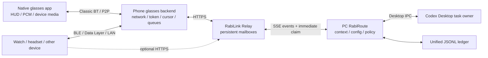

<!-- docs-language-switch -->
<div align="center">
English | <a href="./rabilink-phone-edge-hub.md">简体中文</a>
</div>
<!-- /docs-language-switch -->

# RabiLink Phone Edge Communication Hub

> Status: experimental integration contract. The first phone-hub, Android SDK, and device-message model exist, but real phone/glasses/background-lifecycle acceptance remains required.

## Positioning

The phone is an edge communication hub—not a second Agent and not the RabiRoute configuration source of truth.

| Component | Responsibility |
| --- | --- |
| PC RabiRoute / Codex Desktop owner | Reasoning, role context, unified ledger, configuration truth, and action gates |
| Relay | Application-isolated, retryable bidirectional mailbox; broadcasts/kind targets use bounded TTL, explicit targets remain until `delivered`, and per-device receipts are persisted |
| Phone | Glasses backend, application token, selected PC, cursor, audio/media queues, notifications, device status, and local peripheral fan-out |
| Native glasses app | Lightweight HUD, touchpad, PCM capture/playback, and device-media input; no Relay credential |
| Watch/headset/other portable device | Uses the phone's local link or its own network with the same device envelope |

The primary route no longer lets AIUI or glasses call Relay directly. Glasses hand PCM, controls, and device media to the phone over Classic Bluetooth/P2P; the phone calls Relay, and the Rabi PC glasses endpoint runs ASR/TTS. Historical AIUI proxy behavior remains compatibility evidence only.

## Target topology



## Data flows

### Portable-device input

```text
device event
  -> POST /api/rabilink/devices/input
  -> application/device identity validation
  -> Relay input mailbox
  -> PC worker
  -> RabiRoute record-first or normal route path
```

### Device messages

```text
RabiRoute Outbox
  -> Relay downlink envelope
  -> GET /api/rabilink/devices/messages
  -> filter by deviceId/deviceKind
  -> device persists and advances its own cursor
```

The glasses compatibility endpoint implicitly selects `deviceKind=glasses`; generic clients must provide a device ID or kind.

## Device envelope

A portable message should carry enough information for independent filtering and cursor recovery:

```json
{
  "id": "message-id",
  "deliveryId": "idempotency-key",
  "appId": "application-id",
  "direction": "agent_to_user",
  "target": {
    "deviceId": "watch-user-1",
    "deviceKind": "watch"
  },
  "payload": {
    "type": "text",
    "text": "Time to take a break."
  },
  "createdAt": "2026-07-16T12:00:00.000Z"
}
```

Each device owns its cursor. A phone must not advance a glasses/watch cursor before that target has persisted or processed the message.

## Direct mode and phone-hub mode

- AIUI may call Relay directly at the application layer while using the phone's underlying network transport.
- The phone app may also consume/produce the same device APIs for notifications, watch fan-out, and offline state.
- Neither mode changes the PC Agent, ledger, route, or Outbox contract.
- A phone bridge must not become mandatory for every glasses message unless the platform lifecycle explicitly requires it.

## Android lifecycle

For long-lived work, use platform-supported mechanisms:

- foreground service types for microphone or connected-device work;
- a visible notification while capturing audio;
- Companion Device pairing/service where appropriate;
- bounded retries, WorkManager for deferred work, and persistent local cursors;
- explicit user controls for pause, disconnect, forget device, and clear queued data.
- system connectivity and restored RabiLink SSE events wake continuous-PCM recovery. While Android knows the device is offline, the SSE connection and reliable sender wait on the connectivity-event gate rather than retrying every few seconds. Only to cover rare vendors that miss an already registered default-network callback, the foreground service checks current OS connectivity every five minutes while known offline and stops immediately after recovery; this safety path never requests Relay, reads messages, or advances the cursor. Only an available network with a temporary service failure uses one-shot 1–30 second backoff;
- a pending PCM chunk keeps a stable `chunkId` across transient stream rebuilds, while the PC retains only the last accepted chunk ID/hash for each stable device. Offline PCM buffering is bounded and discards obsolete sound so recovery catches the live stream. Complete preservation of every offline utterance would require a separately enabled, privacy-visible offline recording mode.
- text, media, and `delivered/played/playback_failed` first enter phone-private reliable queues. Reconnection performs one cursor catch-up query and replays pending facts. `delivered` is not `played`; phone and glasses report physical completion only after their own AudioTrack marker. After BEGIN, glasses synchronously confirm capture is paused before accepting PCM, and Activity destruction reports unfinished playback as failed.

Background execution rules vary by Android version and vendor. Real-device acceptance is mandatory.

## Credentials and security

- Store the application token in platform-protected storage.
- Use separate device IDs and revocable enrollment/binding.
- Do not put tokens in URLs, logs, screenshots, public examples, or exported diagnostics.
- Filter every downlink by account, application, device ID/kind, and cursor.
- Treat phone notifications as a view of queued messages, not proof that the target device played them.
- Keep PC configuration changes behind the Relay/PC WebGUI proxy and RabiRoute authorization.

## Current completion level

The repository contains a first Android SDK/probe and Relay device contracts. This proves implementation shape, not production readiness. Remaining acceptance includes enrollment, token storage, process death/restart, network changes, notification behavior, multi-device cursor isolation, glasses/watch fan-out, and vendor-specific background limits.
