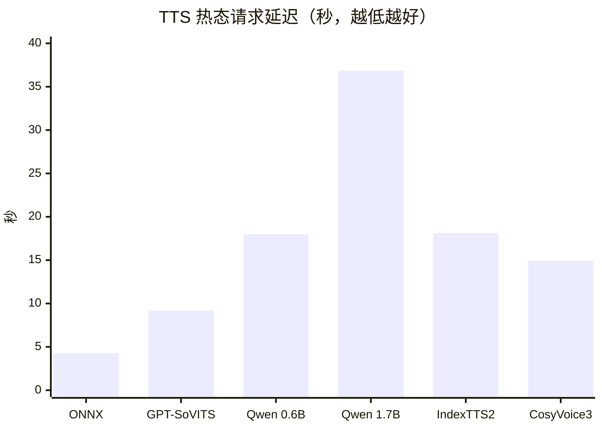
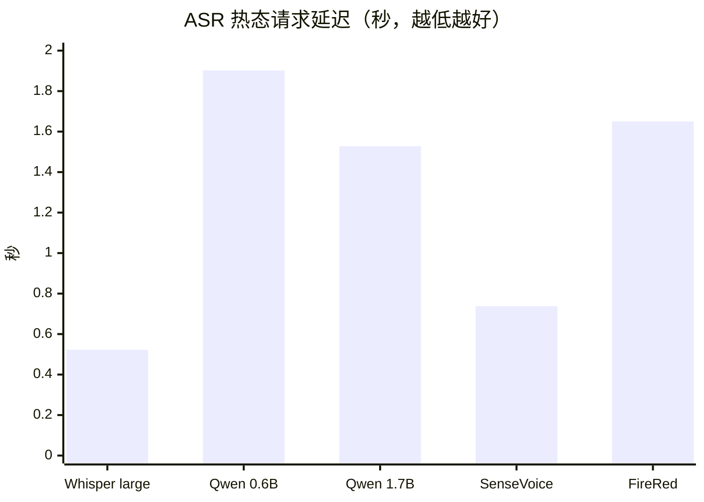
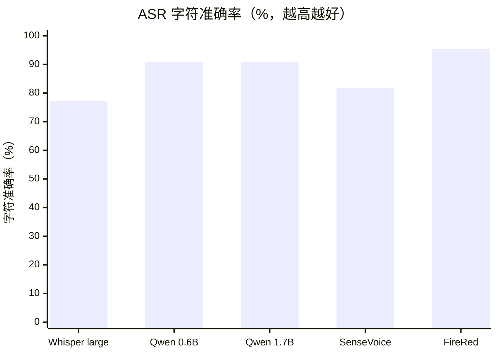

# RabiSpeech 本地 TTS / ASR 性能与功能报告

测试日期：2026-07-17。范围：只测试本地模型；阿里云、OpenAI 等付费语音 API 均未调用，相关实现只保留在归档中。

## 结论

- `GPT-SoVITS` 已包含在首轮主流 TTS 对比中。它是本地开源声线克隆方案，不是 OpenAI 的云端 GPT TTS。
- 固定声线、低成本提示音优先 `ONNX-VITS`；本机 CPU 热态约 4.27 秒，模型图仅约 0.12 GiB。
- 角色克隆的综合默认候选是 `GPT-SoVITS`：本次冷请求 50.35 秒、热请求 9.20 秒，明显轻于 Qwen 1.7B、IndexTTS2 和 CosyVoice3 的启动成本。
- 多语言和指令控制优先 `Qwen3-TTS 0.6B`；更大的 1.7B 需要更多等待时间，是否换来足够音质收益应由试听决定。
- 中文情绪/时长细控优先 `IndexTTS2`，流式和跨语种扩展可考虑 `CosyVoice3`；两者都更适合按需加载。
- 本次单条干净中文样本中，`FireRedASR2-AED` 字符错误率最低（4.55%）；`Qwen3-ASR 0.6B/1.7B` 均为 9.09%，0.6B 冷启动更快，因此当前更具性价比。
- ASR 一旦完成预热都很快：五个模型的热请求均为 0.52–1.90 秒。服务必须把冷启动/预热时间与热态推理时间分开报告。

## 测试硬件

| 项目 | 测试环境 |
|---|---|
| 操作系统 | Windows 11 Pro 64 位 |
| CPU | Intel Core i9-14900KF，24 核 / 32 线程 |
| 内存 | 47.8 GiB |
| GPU | NVIDIA GeForce RTX 4080 SUPER，16 GiB |
| 驱动 | 596.21 |
| 驱动报告的 CUDA 上限 | 13.2 |
| 推理环境 | 各模型隔离 Python 环境；PyTorch/CTranslate2 按模型使用匹配 CUDA runtime |

`nvidia-smi` 中的 CUDA 版本是驱动兼容上限，不代表模型所需的 cuBLAS、cuDNN DLL 已经安装。RabiSpeech 将所需 Windows CUDA 运行库安装在插件私有环境并在启动时加入进程 DLL 搜索路径，不修改系统 PATH。

## 测试方法

本轮是“已安装模型可用性 + 人格声线冒烟 + 冷/热态性能”测试：

1. TTS 使用获授权的本地测试人格参考音；停止对应 worker 后发出第一条请求，记录冷请求，再对同一 worker 发第二条请求记录热态。
2. ASR 全部识别同一条 5.04 秒中文 WAV。期望文本为“热启动测试完成。声音已经由 Rabi 人格目录管理。”。
3. CER 经过 NFKC、大小写折叠并移除空白和标点后计算。样本仅一条，结果只能说明本机短句冒烟效果，不能代表噪声、方言、远场或长音频能力。
4. TTS 本轮部分模型的文本长度不同，因此不可直接用耗时断言模型间生成吞吐高低；冷/热差值和部署成本仍具有参考意义。
5. “冷请求”包含 worker 启动、模型加载/预热和首次推理；“热请求”是同一 worker 已加载后的后续推理。当前适配器没有把加载和首次生成拆成两个独立计时段。

## 对话文字样本

仓库已固定以下可复现语料，后续同文本盲听和完整基准均使用这些逐字文本：

| 样本 ID | 类型 | 逐字文本 | 观察目标 |
|---|---|---|---|
| `short-dialogue` | 短句 | 你好，这是本地语音服务的速度测试。 | 首请求、固定中文发音和基础延迟 |
| `technical-mixed` | 中英混合 | 请提醒我检查 RabiLink 服务器，并确认 ASR 与 TTS 接口正常。 | 产品名、英文缩写和中文混读 |
| `long-instruction` | 长指令 | 如果网络暂时断开，请保留本地任务，等待连接恢复以后再重试，并把失败原因写进诊断报告。 | 长句停顿、完整性和持续生成 |
| `asr-smoke-reference` | ASR 同源短句 | 热启动测试完成。声音已经由 Rabi 人格目录管理。 | 五个主要 ASR 的同音频 CER/字符准确率 |

本报告当前六模型的冷/热数值来自接入阶段的可用性冒烟，TTS 文本长度没有完全统一；因此下方 TTS 柱状图表示实际部署等待，不应解读成严格的每秒生成吞吐排名。

## TTS 功能与实测

| 模型 | 主要能力 | 模型体积 | 冷请求 | 热请求 | 输出音频时长 | 建议定位 |
|---|---|---:|---:|---:|---:|---|
| ONNX-VITS | 固定声线、中/日/英、CPU | 0.12 GiB | 27.15 s | 4.27 s | 7.37 / 6.64 s | 快速提示音、翻译朗读 |
| GPT-SoVITS | 零样本/少样本克隆，中/粤/英/日/韩 | 5.13 GiB | 50.35 s | 9.20 s | 9.78 / 5.04 s | 默认角色克隆候选 |
| Qwen3-TTS 0.6B Base | 10 语种、参考音克隆、指令控制 | 2.34 GiB | 131.41 s | 17.98 s | 7.12 / 3.12 s | 多语言、较省显存 |
| Qwen3-TTS 1.7B Base | 10 语种、较大模型、指令控制 | 4.23 GiB | 154.89 s | 36.85 s | 6.96 / 7.52 s | 质量优先，试听后启用 |
| IndexTTS2 | 中文克隆、情绪/时长/拼音控制 | 8.29 GiB | 114.51 s | 18.13 s | 6.14 / 2.79 s | 中文角色精细控制 |
| CosyVoice3 0.5B | 多语言、零样本、指令、底层流式 | 9.08 GiB | 129.85 s | 14.95 s | 6.16 / 2.96 s | 流式与跨语种扩展 |

所有模型均通过 RabiSpeech 的同一 `POST /v1/audio/speech` API 调用。当前 HTTP 适配层返回完整 WAV；底层模型支持流式不等于当前统一 API 已支持流式首包。

### TTS 热态请求延迟（秒，越低越好）



### TTS 效果怎么判断

本轮已经证明六个模型都能使用人格参考音生成可播放 WAV，但不以 ASR 回译代替主观音质评审。正式选型还应对同一组文本做盲听，至少评价：

- 自然度、稳定性、咬字和停顿；
- 与参考音的音色相似度；
- 中文、英文、日文及混读；
- 情绪、长句一致性、数字/缩写/专名；
- 是否出现吞字、重复、爆音、静音或角色漂移。

## ASR 功能与实测

| 模型 | 主要能力 | 模型体积 | 冷请求/预热 | 热请求 | CER | 本轮文本差异摘要 |
|---|---|---:|---:|---:|---:|---|
| faster-whisper large-v3-turbo | 多语言、时间戳、成熟生态 | 1.51 GiB | 269.91 s | 0.52 s | 22.73% | “由 Rabi”附近识别错误 |
| Qwen3-ASR 0.6B | 多语言、中文方言、语言检测 | 1.75 GiB | 52.63 s | 1.90 s | 9.09% | `Rabi` 识别为 `R B` |
| Qwen3-ASR 1.7B | 同上，较大参数量 | 4.38 GiB | 85.82 s | 1.53 s | 9.09% | 本样本与 0.6B 相同 |
| SenseVoiceSmall | 中/粤/英/日/韩、情绪、音频事件 | 0.88 GiB | 112.38 s | 0.74 s | 18.18% | `Rabi` 识别为“拉贝” |
| FireRedASR2-AED | 中英、中文方言、置信度/时间戳、歌声 | 4.41 GiB | 82.40 s | 1.65 s | 4.55% | 仅 `Rabi` 专名有差异 |

faster-whisper 的 `tiny` 与 `small` 也已保留在模型列表，合计缓存约 0.53 GiB。早期闭环基准中，small 对 9 条合成语音的总体 CER 为 22.2%，tiny 为 38.9%；该旧语料和本轮单条样本不同，数字不能横向合并。

### ASR 热态请求延迟（秒，越低越好）



### ASR 字符准确率（100% − CER，越高越好）



字符准确率按 `100% − CER` 计算，只代表上面标明的单条干净合成短句；它不是多人、噪声、远场或方言场景的生产准确率。

## 硬件需求建议

| 场景 | 最低可用 | 推荐 |
|---|---|---|
| ONNX-VITS 固定声线 | 4 核 CPU、8 GiB RAM | 8 核 CPU、16 GiB RAM |
| GPT-SoVITS / Qwen3-TTS 0.6B | NVIDIA 8 GiB、16 GiB RAM | NVIDIA 12 GiB、32 GiB RAM |
| Qwen3-TTS 1.7B / FireRedASR2 | NVIDIA 12 GiB、32 GiB RAM | NVIDIA 16 GiB、48 GiB RAM |
| IndexTTS2 / CosyVoice3 | NVIDIA 12 GiB、32 GiB RAM | NVIDIA 16–24 GiB、48–64 GiB RAM |
| 多个大模型同时常驻 | 不建议在 16 GiB 显存强行并驻 | NVIDIA 24 GiB+、64 GiB RAM |
| 仅 ASR、低资源 | CPU 可回退但冷/实时性能较差 | NVIDIA 8–12 GiB、16–32 GiB RAM |

这些是基于本次安装、模型体积和 16 GiB 显卡调度结果的工程建议，不是模型作者的官方最低规格。RTX 4080 SUPER 16 GiB 上采用“单个 GPU worker 按需加载 + 全局 FIFO”更稳妥，避免多个框架抢占显存。

## 语音消息端实机功能测试

| 项目 | 本机条件 | 结果 |
|---|---|---|
| 设备发现 | Windows PortAudio / `sounddevice` | 发现 47 个输入端点；系统默认物理输入为 Maono Wireless Mic RX，设备默认 44.1 kHz |
| 真实采集流 | Maono 索引 1，请求 16 kHz 单声道 | 启动成功；状态为 `listening`，能返回实时 RMS 电平 |
| 常驻恢复 | 监听启用后重启 RabiSpeech 计划任务 | 自动恢复同一设备、模型和会话；关闭浏览器不影响服务流 |
| 持久停止 | 本机 stop 接口 | `running=false` 且 `microphone.json` 写回 `enabled=false` |
| Manager / RabiPC 代理 | `127.0.0.1:8790/api/speech/microphone/*` | 设备、启动、状态、停止全部通过 |
| 切句与投递 | 合成 PCM 单元测试 | 前置缓存、双阈值、静音切句、WAV、ASR、可选 Route 提交通过 |
| 公网边界 | RabiLink 通用应用 token | 普通模型/TTS/ASR 可用；麦克风控制路径返回 404，不允许远程开关主机麦克风 |

这项测试证明了真实声卡流、服务生命周期和控制边界，不把安静环境下的电平采样冒充 ASR 准确率。连续自然说话、多人、底噪和扬声器回声仍要由用户用实际麦克风调阈值。

## RabiLink 公网闭环与启动预热

测试路径为“同一测试 PC → 公网域名 → RabiLink Relay → 目标 Rabi PC 上的 RabiSpeech → 公网响应”。它完整经过公网中转，但不等同于另一台电脑、另一条网络的最终验收。

| 项目 | 耗时 / 结果 | 解释 |
|---|---:|---|
| 公网 TTS 热态 | 3.97 s；150,060 字节 RIFF/WAV | ONNX-VITS，`play=false`，没有触发本机播放 |
| 未启用启动预热时的首个公网 ASR | 114.28 s | 同一 5 秒级 WAV；包含首次模型加载与真实推理等待，不是 Relay 纯开销 |
| 本机 ASR 热态 | 0.53 s | 同一 WAV、faster-whisper small |
| 启动预热完成时间 | 在进程启动后 123.1 s 内观察到就绪 | 这是轮询得到的上界，不是毫秒级启动事件时间戳 |
| 启动预热后的首个公网 ASR | 2.87 s | 返回非空文本；首次真实音频仍有少量内核/路径热身 |
| 启动预热后的第二个公网 ASR | 0.58 s | 返回非空文本；与本机热态相差约 0.05 s |
| Relay 重启重连后的公网 ASR | 2.46 s | 13 个模型恢复在线后的首个验证请求，返回非空文本 |

当前本机配置把 faster-whisper small 的 `preload` 设为 `true`。这样会让 RabiSpeech 在重启后约 1–2 分钟才进入 ready，但换来外部调用不再承受 114 秒的首请求冷载。模型列表、TTS/ASR 公网调用全部使用同一个 RabiLink 应用 token；麦克风控制仍不进入公网白名单。

## API 与模型发现

调用方先请求：

```http
GET /v1/models
```

返回值不仅包含模型列表，还包含每个端点的请求 schema、必填/可选参数和示例。主要接口：

```http
POST /v1/audio/speech
POST /v1/audio/transcriptions
GET  /v1/models
GET  /v1/capabilities
GET  /v1/personas
GET  /health
```

TTS 最小请求：

```json
{"model":"local-tts/gpt-sovits","input":"你好。","voice":"Rabi","response_format":"wav"}
```

ASR 使用 `multipart/form-data`，必填 `file`，可选 `model`、`language`、`response_format`。普通 API 直接使用，不进入 Agent；只有 RabiPC 中用户明确勾选“提交 Route”的录音才进入消息路由。

## Windows 安装问题记录

- NVIDIA 驱动存在并不等于 `cublas64_12.dll`、`cudnn64_9.dll` 已可被 Python 进程加载。
- RabiSpeech 从 NVIDIA 官方 Python wheel 安装 CUDA/cuDNN 运行库到插件私有 `.deps`，启动脚本只为本进程追加 DLL 路径。
- FireRedASR2 官方旧依赖在 Windows 上不能原样安装：本机使用 Python 3.10、PyTorch 2.1.0+cu118、Transformers 4.51.3、NumPy 1.26.1、`kaldi_native_fbank` 1.22.3 和 `setuptools<81`。1.17 在本机出现 DLL 加载失败。
- 每个模型都应在实际推理后再确认 GPU；仅 `import torch` 或模型构造成功不能证明所有推理 DLL 已正确加载。

## 仍需用户验收

- 在同一组文本上盲听六个 TTS，选出人格默认模型和备用模型；
- 用真实说话语料继续验收静音切句、多人/连续说话、噪声、回声和阈值准确性；基础声卡流与服务重启恢复已经通过；
- 从另一台电脑经 RabiLink 通用 token 调用模型列表、TTS 和 ASR，记录公网往返延迟；
- 用至少 30–100 条真实授权语音重新计算 CER/WER，才适合做生产默认模型结论。

模型下载与逐项安装见 [本地语音模型下载说明](local-speech-model-downloads.md)。

<!-- docs-language-switch -->
<div align="center">
<a href="./rabispeech-performance-report_en.md">English</a> | 简体中文
</div>
<!-- /docs-language-switch -->
