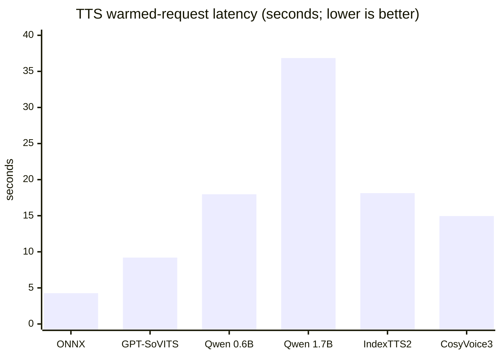
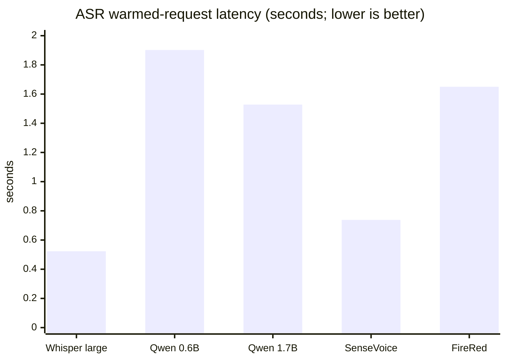
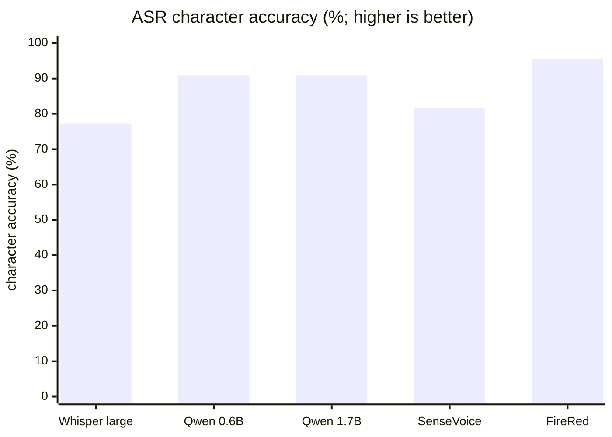

# RabiSpeech local TTS / ASR performance and capability report

Tested on 2026-07-17. Scope: local models only. No paid Alibaba Cloud, OpenAI, or other cloud speech API was called.

## Summary

- `GPT-SoVITS` is included. It is the local open-source voice-cloning stack, not OpenAI's cloud GPT TTS.
- Use `ONNX-VITS` for fixed voices and lightweight prompts. `GPT-SoVITS` is the current general character-cloning candidate.
- `Qwen3-TTS 0.6B` is the multilingual/instruction candidate. Use 1.7B only after listening tests justify its higher latency.
- `IndexTTS2` targets detailed Chinese emotion/duration control; `CosyVoice3` is the streaming and cross-lingual extension candidate.
- On one clean 5.04-second Chinese sample, FireRedASR2-AED had the lowest CER (4.55%). Qwen3-ASR 0.6B and 1.7B both scored 9.09%; the smaller model started faster.
- Cold start and warmed inference are reported separately. All five ASR models completed warmed requests in 0.52–1.90 seconds.

## Test machine

Windows 11 Pro, Intel Core i9-14900KF (24C/32T), 47.8 GiB RAM, NVIDIA RTX 4080 SUPER 16 GiB, driver 596.21. The driver reports CUDA 13.2 capability; each isolated model environment uses its matching PyTorch/CTranslate2 CUDA runtime.

## Dialogue text samples

The repository fixes these exact texts for reproducible same-text listening and future full benchmark runs:

| Sample ID | Type | Exact text | Purpose |
|---|---|---|---|
| `short-dialogue` | short sentence | 你好，这是本地语音服务的速度测试。 | first request, fixed Chinese pronunciation, baseline latency |
| `technical-mixed` | mixed Chinese/English | 请提醒我检查 RabiLink 服务器，并确认 ASR 与 TTS 接口正常。 | product names, abbreviations, and mixed pronunciation |
| `long-instruction` | long instruction | 如果网络暂时断开，请保留本地任务，等待连接恢复以后再重试，并把失败原因写进诊断报告。 | pauses, completeness, and sustained generation |
| `asr-smoke-reference` | shared ASR sentence | 热启动测试完成。声音已经由 Rabi 人格目录管理。 | same-audio CER and character accuracy across the five main ASR models |

The current six-model cold/warm figures came from integration smoke tests whose TTS text lengths were not fully identical. The TTS latency chart therefore describes observed deployment wait, not a strict generated-throughput ranking.

## TTS results

| Model | Main capability | Size | Cold request | Warm request | Output duration |
|---|---|---:|---:|---:|---:|
| ONNX-VITS | fixed voices, zh/ja/en, CPU | 0.12 GiB | 27.15 s | 4.27 s | 7.37 / 6.64 s |
| GPT-SoVITS | zero/few-shot cloning, zh/yue/en/ja/ko | 5.13 GiB | 50.35 s | 9.20 s | 9.78 / 5.04 s |
| Qwen3-TTS 0.6B Base | 10 languages, cloning, instructions | 2.34 GiB | 131.41 s | 17.98 s | 7.12 / 3.12 s |
| Qwen3-TTS 1.7B Base | larger multilingual model | 4.23 GiB | 154.89 s | 36.85 s | 6.96 / 7.52 s |
| IndexTTS2 | Chinese cloning, emotion/duration controls | 8.29 GiB | 114.51 s | 18.13 s | 6.14 / 2.79 s |
| CosyVoice3 0.5B | multilingual, zero-shot, underlying streaming | 9.08 GiB | 129.85 s | 14.95 s | 6.16 / 2.96 s |

The smoke texts were not identical for every TTS model, so these numbers must not be treated as a strict throughput ranking. All models produced valid persona-referenced WAV files through the unified API. Naturalness, speaker similarity, emotion, mixed-language pronunciation, and long-form stability still require a same-text blind listening test.

### TTS warmed-request latency (seconds; lower is better)



## ASR results

All models transcribed the same 5.04-second WAV. CER uses NFKC/case folding with whitespace and punctuation removed. A single clean sample is a smoke indicator, not a production accuracy claim.

| Model | Size | Cold/warm-up request | Warm request | CER |
|---|---:|---:|---:|---:|
| faster-whisper large-v3-turbo | 1.51 GiB | 269.91 s | 0.52 s | 22.73% |
| Qwen3-ASR 0.6B | 1.75 GiB | 52.63 s | 1.90 s | 9.09% |
| Qwen3-ASR 1.7B | 4.38 GiB | 85.82 s | 1.53 s | 9.09% |
| SenseVoiceSmall | 0.88 GiB | 112.38 s | 0.74 s | 18.18% |
| FireRedASR2-AED | 4.41 GiB | 82.40 s | 1.65 s | 4.55% |

The earlier nine-sample synthetic closed-loop run measured faster-whisper small at 22.2% CER and tiny at 38.9%. That corpus differs from this smoke sample, so the figures are historical context rather than a cross-table comparison.

### ASR warmed-request latency (seconds; lower is better)



### ASR character accuracy (100% - CER; higher is better)



Character accuracy is calculated as `100% - CER` and applies only to the exact clean synthetic sentence listed above. It is not a production claim for multi-speaker, noisy, far-field, or dialect conditions.

## Hardware guidance

| Workload | Minimum practical | Recommended |
|---|---|---|
| ONNX-VITS | 4-core CPU, 8 GiB RAM | 8-core CPU, 16 GiB RAM |
| GPT-SoVITS / Qwen3-TTS 0.6B | NVIDIA 8 GiB, 16 GiB RAM | NVIDIA 12 GiB, 32 GiB RAM |
| Qwen3-TTS 1.7B / FireRedASR2 | NVIDIA 12 GiB, 32 GiB RAM | NVIDIA 16 GiB, 48 GiB RAM |
| IndexTTS2 / CosyVoice3 | NVIDIA 12 GiB, 32 GiB RAM | NVIDIA 16–24 GiB, 48–64 GiB RAM |
| Several large resident models | not recommended on 16 GiB VRAM | NVIDIA 24 GiB+, 64 GiB RAM |

These are engineering recommendations derived from this installation, not official vendor minimums. On the tested 16 GiB GPU, an on-demand exclusive GPU worker plus the global FIFO is the safer deployment strategy.

## Resident endpoint hardware smoke test

| Check | Test condition | Result |
|---|---|---|
| Device discovery | Windows PortAudio / `sounddevice` | 47 input endpoints; default physical input was Maono Wireless Mic RX at 44.1 kHz |
| Real stream | Maono index 1, requested 16 kHz mono | Started in `listening` and returned live RMS levels |
| Service restore | Restart RabiSpeech while capture was enabled | Restored the same device, model, and session without a browser lifecycle |
| Persistent stop | Local stop endpoint | `running=false` and persisted `enabled=false` |
| Manager/RabiPC proxy | `127.0.0.1:8790/api/speech/microphone/*` | Devices, start, status, and stop passed |
| Segmentation/delivery | Synthetic PCM unit test | Pre-roll, dual thresholds, silence boundary, WAV, ASR, and optional Route delivery passed |
| Public boundary | Generic RabiLink application token | Normal model/TTS/ASR calls passed; microphone control returned 404 |

This proves real device streaming, service lifecycle, and privacy boundaries. It does not turn an ambient-level sample into an ASR quality claim; natural continuous speech, noise, and echo still require user acceptance on the actual microphone.

## RabiLink public round trip and startup warm-up

The measured path was test PC → public domain → RabiLink Relay → RabiSpeech on the target Rabi PC → public response. It traverses the public relay, but it is not a substitute for acceptance from another computer and network.

| Check | Time / result | Interpretation |
|---|---:|---|
| Public warmed TTS | 3.97 s; 150,060-byte RIFF/WAV | ONNX-VITS with `play=false` |
| First public ASR before startup preload | 114.28 s | Includes first model load and real inference; not pure relay overhead |
| Local warmed ASR | 0.53 s | Same WAV with faster-whisper small |
| Startup warm-up ready observation | within 123.1 s of process creation | Polling upper bound, not an exact readiness event timestamp |
| First public ASR after startup preload | 2.87 s | Non-empty transcript; first real audio still primes a small amount of runtime work |
| Second public ASR after startup preload | 0.58 s | Non-empty transcript; about 0.05 s above the local warmed request |
| Public ASR after a Relay restart/reconnect | 2.46 s | First validation request after all 13 models returned online; non-empty transcript |

The deployed machine now sets faster-whisper small `preload=true`. RabiSpeech therefore takes roughly one to two minutes to become ready after restart, while external requests no longer pay the 114-second first-request load. Model discovery, TTS, and ASR use the same generic RabiLink application token; microphone control remains outside the public allowlist.

## API discovery

`GET /v1/models` returns the model catalog together with request schemas, required/optional parameters, and examples. Main endpoints are `POST /v1/audio/speech`, `POST /v1/audio/transcriptions`, `GET /v1/models`, `GET /v1/capabilities`, `GET /v1/personas`, and `GET /health`.

Minimal TTS body:

```json
{"model":"local-tts/gpt-sovits","input":"Hello.","voice":"Rabi","response_format":"wav"}
```

ASR uses multipart form data with required `file` and optional `model`, `language`, and `response_format`. Direct speech APIs never enter an Agent. Only the explicitly selected RabiPC “submit Route” action does.

## Windows runtime note

An NVIDIA driver does not install every `cublas64_12.dll` or `cudnn64_9.dll` required by Python inference. RabiSpeech installs official NVIDIA wheels into private plugin dependencies and adds those DLL directories only to the service process. FireRedASR2 required a Windows-compatible Python 3.10 environment with PyTorch 2.1.0+cu118, Transformers 4.51.3, NumPy 1.26.1, `kaldi_native_fbank` 1.22.3, and `setuptools<81`.

See [local model downloads](local-speech-model-downloads_en.md) for per-model installation instructions.

<!-- docs-language-switch -->
<div align="center">
English | <a href="./rabispeech-performance-report.md">简体中文</a>
</div>
<!-- /docs-language-switch -->
