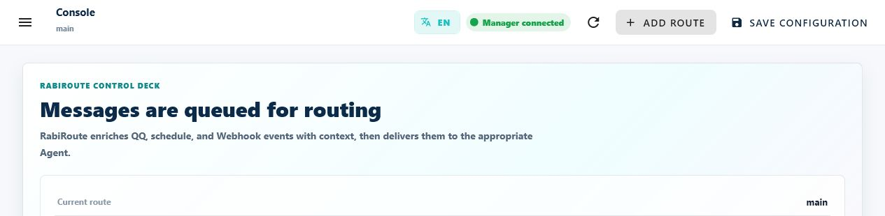

<!-- docs-language-switch -->
<div align="center">
English | <a href="./interface-and-status.md">简体中文</a>
</div>
<!-- /docs-language-switch -->

# Interface and status

RibiWebGUI is RabiRoute's local control console. It edits configuration, invokes Manager actions, and shows diagnostics. Local files and runtime state remain the underlying sources of truth.

## Access WebGUI from the LAN

Manager on the Rabi PC is RibiWebGUI's complete HTTP backend. The default `http://127.0.0.1:8790/` is local-only. On another device, `127.0.0.1` points back to that device, not to the Rabi PC.

On the Rabi PC, open **Console → Directory configuration → LAN WebGUI access**, enable access, and generate a key. After restarting Manager, a WebGUI still opened locally through `localhost/127.0.0.1` automatically redirects to the preferred LAN IP while preserving the current Route, page, and authentication. You can also copy the generated link, for example:

An HTTP LAN page may not receive secure browser clipboard permission. Copy-link, copy-key, and other WebGUI copy actions try the Clipboard API first and automatically fall back to an in-page copy operation when that API is unavailable or rejected. A manual-copy message appears only when the browser rejects both mechanisms.

```text
http://192.168.0.57:8790/#/routes/<Route-config-name>/overview?webgui_token=<access-key>
```

The sidebar **Current Route** selector is the only selection source. Console, Message Adapters, Rabi Persona, Plans & Memory, Speech Service, and Runtime Diagnostics all use `#/routes/<Route-config-name>/<page>`, with `overview`, `adapters`, `persona`, `knowledge`, `speech`, and `runtime` respectively. Changing Current Route preserves the page type and immediately redirects the URL. To open that Route's **Plans & Memory** directly, use the same Route configuration name with the `knowledge` page, or click **Copy Route knowledge link**:

```text
http://192.168.0.57:8790/#/routes/<Route-config-name>/knowledge?webgui_token=<access-key>
```

The Route configuration name is URL-encoded. Any Route-scoped link selects that Route before rendering the page. Switching the sidebar Route updates the current browser session to the same page type under the new Route. To bookmark, reopen, or share the shortcut with an authorized device on the same LAN, use a complete keyed link rather than the address bar after WebGUI has removed the key.

WebGUI keeps the URL key in the current browser session, automatically applies it to HTTP, SSE, and persona-avatar requests, and removes it from the address bar so later screenshots do not keep exposing it. Rotating the key immediately invalidates old links. The switch and key can be managed only from the Rabi PC running Manager; that PC's redirected LAN address remains manageable, while other devices cannot manage them. If the link times out, first confirm that Manager restarted, then check whether Windows Firewall allows RabiRoute or Node.js TCP `8790` on the private/domain network. Never publish the link in a public chat, log, or repository.

## Access WebGUI remotely through RabiLink

When the Rabi PC has the global RabiLink Relay connection enabled and belongs to the current Relay account, sign in at `https://rabiroute.cottongame.com/manage`, then open:

```text
https://rabiroute.cottongame.com/manage/<account>/<RabiGUID>/#/routes/<Route-config-name>/knowledge
```

The remote entry uses the same page names. Replace `knowledge` with `overview`, `adapters`, `persona`, `speech`, or `runtime` as needed.

Replace the final page with `overview` or another WebGUI route when needed. This remote entry does not use the LAN `webgui_token`; it uses the browser's Relay management login cookie, while the PC worker separately authenticates with its application token. Ordinary APIs, images, attachments, audio, downloads, and byte-range video playback return to the selected PC's loopback Manager, and Manager events refresh through remote SSE. If the shell opens but data, attachments, or live status do not, verify that the target PC is online in Relay, the RabiGUID is correct, and the Relay script plus `ribiwebgui/dist` were published together. Restarting only the local Manager does not update the public Relay.

## The six main areas

| Area | Primary purpose | Common actions |
| --- | --- | --- |
| Console | Routes, current path, Rabi identity, and directories | Add, quick-configure, start, or stop a Route |
| Message Adapters | Message sources and Agent handlers | Scan, add, connect, and bind tasks |
| Rabi Persona | Persona, Route variables, and message rules | Add rules, regexes, and schedules |
| Plans & Memory | Plans, recent memory, consolidated memory, plan guidance, and approval records for the current persona | Search, guide running plans, expand steps, review execution contracts, submit approval feedback, and refresh Manager data |
| Log Diagnostics | Find path breaks and run real tests | Start, restart, trigger, and inspect logs |
| User Guide | Task-based product instructions | Search, change page, and open deeper material |

When Plans & Memory opens, it first requests eight lightweight plan summaries and fetches the complete details for the first two visible cards in parallel before mounting those cards, so the first screen does not pause on `Loading plan details`. Without requiring scroll, it then completes the selected plan category in background pages of up to 50 summaries and completes the visible memory category in pages of up to 100 items. The page keeps the loaded and total counts visible. These background requests pause while the tab is hidden; when the tab becomes visible again, the page refreshes and resumes completion. The left directory retains every returned title, while the content area initially mounts only eight plan cards and 24 memory cards, then appends bounded batches while scrolling. Clicking a directory item that is not mounted creates a bounded forward window starting at that target and gives that plan's detail request highest priority; the current Manager and LAN environment uses a one-second interactive detail budget. The page does not create every preceding body card, and later batches no longer insert older cards above the current reading position. Other body text, steps, approvals, and attachment metadata hydrate only when cards are genuinely near the viewport; each observer turn promotes only the nearest two cards and runs at most two concurrent detail requests. Each later summary page yields one rendering frame without waiting for body hydration, so heavy cards or attachments cannot delay directory completion. Only cards with a real in-flight detail request show the loading animation; cards that have not approached the viewport use a compact hint instead of instantiating a large skeleton for every plan, and the browser skips layout and paint for off-screen cards. Image and video cards show a light `Loading attachment` placeholder instead of a black block until media is ready.

After all plan summaries have loaded, the page yields another render and asynchronously batches the Codex Desktop state reads for each plan's bound Task Agent. This does not block the first screen, one plan is not requested twice in the same pass, and each read has a three-second limit. A working Task Agent replaces the directory's relative-time label with a spinner. Idle, failed, timed-out, or missing tasks keep the relative time visible. Expanded details show the Task Agent, the Plan Secretary when enabled, each Agent's work state, and the matching Codex task state. A missing task has its own `Task Agent session is missing` label. A valid non-working binding can be located or awakened in Codex from the card or Agent row; this opens only the exact task ID and sends no message or replacement task.

For a running plan outside approval, expanding the card exposes whole-plan guidance. It is associated only with `planId`, not one step; the Agent uses it to continue the plan and adjust not-started steps when needed, then writes a `guidance_response` without `stepId`. Approval plans continue to use the owning step's approval contract and `approval_response`.



Choose the current Route in the sidebar, then check the Manager connection in the top bar. Use the Console or Log diagnostics runtime state to decide whether that Route is running.

The **Plans & Memory** page never reads `data/` directly or reinterprets categories, status colors, or contract completeness in the browser. RibiWebGUI exposes three top-level tabs in order: `Current Plans / Recent Memory / Archived`. Current Plans shows the non-archived plan category, Recent Memory shows only recent memory, and Archived combines archived plans with consolidated memory. Manager supplies plan membership plus `status / tone / sortBucket / palette`, `counts.stages`, approval details, and the default order used by both RibiWebGUI and the Qt tray. Except for paused plans, complete approval contracts sort first and incomplete contracts next, followed by `Awaiting approval → Awaiting QA acceptance → Executing → Awaiting environment/assets/information/external response → Awaiting shared package → Not started → Completed → Archived` and update time. The directory header shows the current result count. Its top-right button opens an independent modal dialog titled **List sorting and filters**. Its default **Status order** preserves Manager ordering; After the user selects **Update time** or status filters and clicks **Done**, those parameters are sent to Manager and applied before pagination, so the directory and plan cards always use the same filtered order. External waits use the amber presentation, while blue `Awaiting shared package` remains current work but sorts below execution and other external waits. Paused plans appear in Current Plans with the shared slate palette and always sort last. RibiWebGUI shows a plan's non-duplicate `focus`, and search matches step details, current actions, waiting notes, approval contracts, attachment metadata, memory bodies, and source summaries. Multiple plans remain independently framed, with a sticky external directory that follows the current tab and search result. Each directory row keeps the status and relative update-time labels fixed while only an overflowing title scrolls on hover or keyboard focus. Running plans outside approval expose whole-plan guidance at the top of expanded details; approval plans instead keep the approval contract inside the Manager-identified step card. User feedback, Agent replies, and system records remain ordered from oldest to newest. Incomplete details are labeled `Approval information incomplete / approval disabled`; approval input, attachments, and submission stay disabled until `ready/enabled=true`.

The directory never introduces horizontal scrolling for the whole panel. Status and time/work labels remain fixed; only an overflowing middle title moves at a constant speed on pointer hover or keyboard focus. Reduced-motion preferences disable both title movement and spinner rotation. Choices in the list dialog remain drafts until **Done**. Closing the dialog leaves the current list unchanged; **Done** closes it and immediately calls the complete plan list once with the selected Manager-side sort and status filters, updating directory and content cards together.

When Plans & Memory is opened directly, the page loads memory counts in parallel, so the Recent Memory and Archived tab numbers do not wait for the user to open those tabs. Each Recent Memory card shows both its recorded time and its last true recall-hit time; a memory that has never matched a message says `Not recalled yet`. Memory bodies render as Markdown with headings, lists, code, links, and HTTP(S) images; local absolute paths and dangerous protocols are not loaded. A memory card is capped at 512px. Extra body content is clipped without an internal card scrollbar, and **View details** opens the complete memory in a separate dialog. When the least-active memory is less than 24 hours away from the 72-hour trigger, a separate consolidation panel appears above the list with the remaining time, the memory that will trigger the run, and the expected candidate count. Candidate cards are marked. At zero, Manager automatically creates and delivers the batch; the page does not need to remain open. The cohort is frozen to memories already beyond 24 hours at the original 72-hour trigger, so late execution does not append later boundary crossings. Manager derives and caches the booleans; the browser neither treats a direct view as a recall nor recalculates the candidate set.

A step waiting for approval, plan confirmation, or authorization carries a complete `approvalRequest`. Only a complete actionable contract with `responseStatus=pending` makes Manager show `Awaiting approval` and enable the approval entry. An incomplete contract disables formal approval but leaves the presentation at `Executing` for Agent investigation and repair. `Awaiting QA acceptance` requires the current structured `qa-* / verify-*` step. Authoritative `waitingFor` fields may derive `Awaiting environment`, `Awaiting assets`, `Awaiting information`, or `Awaiting external response`; a qualifying current package/build step whose prior work is complete becomes blue `Awaiting shared package`. These are presentation stages and do not add top-level plan lifecycle states.

More specifically, Manager shows `Waiting for test environment` only when a real runner, MCP service, device, or listener is unavailable and no executable alternative remains. Available CLI, static-check, fallback-validation, or retry work stays `Executing`. An explicit prohibition on Unity GUI, MCP, menus, or PlayMode becomes `Waiting for renewed authorization`, not an environment failure. `Awaiting QA acceptance` also requires a real receipt for the current send; a missing receipt with a send or repair action stays `Executing`. A completed development gate that only lacks target-package identity or inclusion proof remains blue `Awaiting shared package`. Assets, documents, and owner replies remain separate external waits.

The `implementation/development validation → Awaiting shared package → Awaiting QA acceptance → complete on QA pass; return to implementation on failure` lifecycle applies only to plans that change project content such as code, prefabs, assets, or configuration. Investigation, design review, operations, information gathering, external dependencies, and control-plane maintenance continue to show their real steps and wait reasons instead of being forced into package or QA stages.

The Agent may also add images, videos, or ordinary files to the plan itself when creating or updating it, including effect previews, demo videos, design drafts, reports, or patches already produced for a plan awaiting approval. Images, videos, and Markdown appear below the plan description in compact, fixed-width 16:9 preview cards that shrink only when the container is narrower. A Markdown card safely reads the beginning of the document and displays a clamped plain-text excerpt; it does not execute HTML, open links, or load images. Clicking it opens the in-page document preview with headings, lists, tables, blockquotes, and code blocks plus a source-download action. Video thumbnails keep a play icon visible before hover or selection, then show an `m:ss` or `h:mm:ss` duration in the lower-right corner after the browser reads media metadata. Images open in an in-page large-image preview, while videos open in an in-page player with controls. Markdown files larger than 2 MiB remain download-only to avoid freezing the browser. The complete-document renderer escapes raw HTML, disables dangerous or relative links, and replaces remote images with text placeholders instead of loading third-party resources from attachment content. Recognized media includes PNG, JPEG, WebP, GIF, MP4/M4V, WebM, Ogg Video, and MOV/QuickTime, with actual video codec support depending on the browser. Other files show name, type, and size and open or download through Manager. The browser never reads a local path from the plan record directly; every attachment crosses the constrained Manager endpoint, and LAN WebGUI automatically applies the current session key to thumbnails, media previews, and file links.

RabiLink remote WebGUI automatically preserves the `/manage/<account>/<RabiGUID>` prefix for thumbnails, media previews, and file links, and forwards byte-range video requests. Do not add the LAN `webgui_token` to a remote URL.

Long plan lists keep the normal page scroll, while only the external plan directory scrolls independently within the viewport. As the plan cards scroll, browser visibility observation updates the directory's current reading item; the directory adjusts its own scroll only when that highlighted item leaves the directory viewport, without continuously scanning the full list on every page-scroll event. A directory click temporarily locks the selected highlight and resumes reading-position observation after smooth scrolling settles, so intermediate cards do not make the cursor jump through the directory. On desktop widths, the plan-view tabs, search field, and refresh action stick immediately below the fixed app bar. Directory jumps reserve the sticky toolbar height so the destination card heading remains visible. Narrow layouts return the toolbar to normal page flow instead of letting a two-row control block occupy the viewport. Detail expansion remains animation-free, and the approval input does not repeatedly auto-grow.

After plan guidance or approval feedback is durably recorded, Agent notification continues in the background. The next draft remains editable while another submission is temporarily disabled, and a nearby status row explains the reason and recovery condition.

## Sidebar: select the current Route first

**Current Route** determines which configuration most pages display and edit. If changes are unsaved, the interface asks before switching.

The count beside the selector is the number of configurations. The selected value and menu items prefer the persona title, while the Route configuration name, disabled state, and adapter combination remain secondary details so multiple Routes for one persona stay distinguishable. When no persona title is available, WebGUI falls back to the Route display name, persona ID, and then configuration name. The status below does not prove that every external platform is authenticated.

The footer contains four supporting actions:

- **Quick setup**: configure common paths in three steps.
- **GitHub**: open the repository.
- **User Guide**: open this task-based documentation center.
- **Open config directory**: open the local Manager configuration location.

## Top bar: connection, save, and refresh differ

`Manager connected` only means the browser can reach the Manager. It does not mean the Route, NapCat, or Codex task is ready.

| Control | Actual effect |
| --- | --- |
| 中 / EN | Changes this browser's interface language only |
| Refresh status | Reloads Manager, configuration, and runtime state; does not save edits |
| Add Route | Creates a Route and opens Quick setup |
| Save configuration | Writes the current edits and may synchronize or reload the Route |

When the unsaved-changes notice appears, save before switching Routes or leaving. Refresh is not Save, and Restart does not save form edits.


## Common runtime states

| State | Meaning | Next check |
| --- | --- | --- |
| Running | A Route that needs a child process has started | Check source and handler connectivity |
| Enabled | The Route is enabled but its current entry is Manager-owned | Check the corresponding Manager entry |
| Stopped | Configuration exists but the child process is not running | Start it or inspect errors in Log Diagnostics |
| Disabled | The Route or its message input is off | Enable intentionally, then save |
| Manager disconnected | WebGUI cannot reach the local Manager | Check the process, port, and startup directory |

An **Experimental** badge is not itself an error. It means a code path exists, while the external system or real-device loop still needs acceptance in your environment.

## Start, stop, restart, and delete

- **Start** begins the current Route's runtime entry.
- **Stop** ends the Route process without deleting configuration or history.
- **Restart** stops and starts it again after build or connection changes.
- **Delete** removes Route configuration and has a wider impact than Stop.

The Manager supervises Route processes that it starts. External programs such as NapCat, QQNT, and Codex/ChatGPT Desktop keep their own lifecycles.

## Locale boundaries

Locale is stored in this browser. Route/persona IDs, rule names, templates, regexes, task names, paths, tokens, logs, and runtime values stay unchanged.

The User Guide selects the matching language file. Developer documents, code paths, and external pages open through links; RabiRoute does not maintain a third machine-translated source.

## Continue

- No successful delivery yet: [Run your first Route](first-route_en.md).
- Unsure which source to choose: [Routes and message adapters](routes-and-adapters_en.md).
- Status looks healthy but delivery fails: [Operations, logs, and troubleshooting](operations-and-troubleshooting_en.md).
