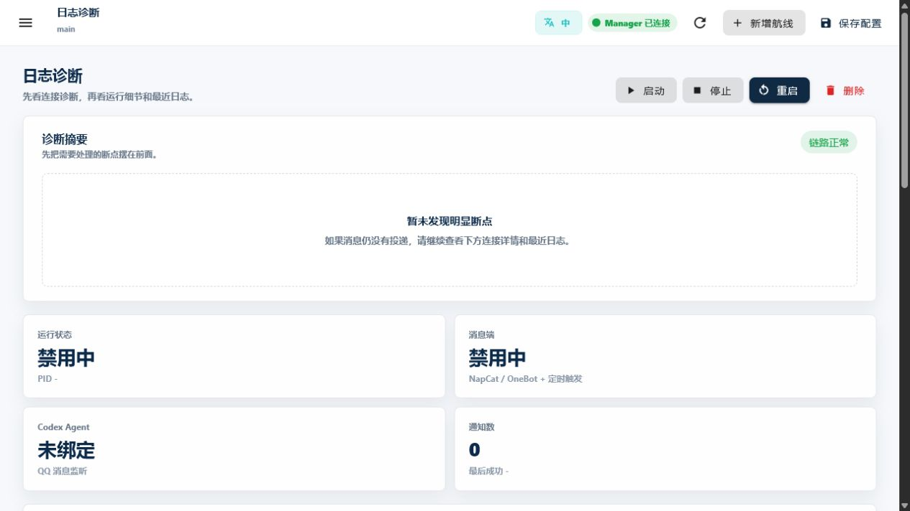

<!-- docs-language-switch -->
<div align="center">
<a href="./operations-and-troubleshooting_en.md">English</a> | 简体中文
</div>
<!-- /docs-language-switch -->

# 运行、日志与排障

排障时不要把“消息没回复”当成一个整体问题。沿着消息链逐段确认，就能判断故障在平台、规则、投递还是回传。

```text
消息端 -> 事件记录 -> 规则命中 -> AgentPacket -> 处理端 -> Outbox / 外部平台
```

## 先看诊断摘要

打开“日志诊断”。“诊断摘要”会把当前能识别的连接和配置断点放在最前面。

摘要显示“链路正常”只表示没有发现已知断点。如果消息仍未到达，继续检查下方连接详情和最近日志。



图中的文档示例没有启动，也没有绑定真实 Desktop 任务，因此状态卡明确显示“禁用中”和“未绑定”。排障时应先处理这类可见断点，再查看更下方的连接详情和最近日志。

## 用证据判断停在哪一段

| 已有证据 | 说明 | 下一步 |
| --- | --- | --- |
| 没有消息记录 | 事件没有进入 RabiRoute | 查平台登录、连接、端口和输入 policy |
| 有消息记录，没有 `agent-packets.jsonl` | 消息进入但规则没命中 | 查人格绑定、`configName`、route kind 和 regex |
| 有 AgentPacket，Desktop 没消息 | 处理端投递失败 | 查任务 ID、工作目录、Desktop IPC 和最后错误 |
| Desktop 有结果，平台没回复 | 回传没有完成 | 查 replyContext、pipeline、输出 policy 和 Outbox 日志 |
| Outbox 为 `blocked` | policy 或目标不允许外发 | 修正明确目标或授权，不要绕过安全门 |
| Outbox 为 `failed` | 已尝试发送但平台调用失败 | 修复平台状态后明确重试 |

常见运行文件位于 `data/route/<配置名>/`。不要把运行期 JSONL、真实消息和账号信息提交到仓库。

## 手动触发的用途与副作用

“手动触发”可以执行 `manual_trigger` 或 `heartbeat` 规则，用来验证规则到处理端的链路。

它会：

- 写手动触发和路由日志。
- 构造真实 AgentPacket。
- 向处理端开始真实投递。
- 在处理端执行时使用该任务自己的权限。

它不会模拟外部 QQ 消息，也不是无副作用预览。验证群消息 regex 时，仍要使用受控的真实测试消息或检查 RouteDecision 证据。

## 最近日志怎么看

“最近日志”显示当前 Route 的最近 gateway 输出。先找最新时间，再看第一条错误，不要被旧启动周期的历史错误误导。


升级代码后如果仍看到旧行为，重新构建并重启 Manager 与 Route，再核对启动目录和 `dist/` 时间。历史日志可以保留，但不能代表本次运行状态。

## NapCat 打开后显示 Unauthorized 或 Token 登录页

从 Route 页点击“打开 NapCat”时，RabiRoute 会直接打开带当前 WebUI token 的 `/web_login` 地址。这个入口会重新建立 WebUI 会话，避免 NapCat 重启后旧标签页残留的凭据继续触发 `Unauthorized`。

如果仍停在空 Token 登录页，先关闭旧 NapCat 标签页，再从当前 QQ 实例卡片重新点击“打开 NapCat”。确认实例卡片已保存 WebUI 登录密钥；升级过源码但仍打开旧地址时，需要重新构建并重启 Manager。快速启动只检查 OneBot / WebUI 是否可用，不再同步等待 Windows 全量进程枚举；完整进程列表仍可在显式健康检查和详情中读取。

## NapCat 已连接但没有 AgentPacket

先确认 `group-messages.jsonl` 或 `private-messages.jsonl` 是否出现新记录。

- 没有记录：查 QQ 登录、WebSocket Client、端口和接收 policy。
- 有记录：查人格规则的 `configName`、route kind、目标群和 regex。
- 合并转发只有 ID：查 OneBot HTTP 和 `get_forward_msg`。

## NapCat 能收不能发

OneBot HTTP 可访问不代表 QQ 核心一定能发送。检查登录状态、quick login、设备验证、Windows 时间和 NapCat 日志。

## 消息端扫描超时或显示“部分可用”

`GET /api/scan/message-adapters` 是纯只读诊断：不会启动 Route/NapCat、不会补写配置、不会触发扫码或自动修复。所有独立探针并行起跑并受共享截止时间约束；响应中的 `scan.partial=true` 表示至少一个探针超时或失败，其他已完成结果仍然可信。

状态按入口和实例分别解释。`QQ 可用` 以 OneBot 健康为准，不能用 WebUI 可打开替代；个人微信未登录只影响个人微信。Watchdog 中单一消息端的错误汇总为 `degraded`，只有 Manager、Route 或 Agent 投递等系统级错误才把整轮巡检标为 `error`。

Outbox 发送失败会保留 `failed` 和 draft 数据。当前没有通用自动重试队列；修复登录后需要明确重试，避免重复发送。

## Codex 没收到消息

按顺序检查：

1. Desktop 已打开并能进入目标任务。
2. Agent 扫描能看到该任务和工作目录。
3. 保存的任务 ID 仍存在，目录没有移动。
4. 日志诊断显示投递协议为 `desktop-ipc`。
5. `no-client-found` 自动唤醒后是否仍失败。

不要用固定 4510、`CODEX_APP_SERVER_WS_URL` 或独立 stdio Runtime 修复真实投递；这些不是当前主链。

## RabiRoute Desktop 界面未显示

从 `Start-RabiRoute-Desktop.bat` 或打包版 RabiRoute Desktop 启动的完整桌面运行态，会在 `data/runtime/desktop-lifecycle-intent.json` 记录 `running`，并启动工作区唯一的 `watch-rabiroute-desktop-lifecycle.ps1`。监督器只检查本项目本机后端 `/meta` 和桌面界面进程；连续两次确认任一部分缺失后，才通过原启动器的端口 owner、PID 和单实例门禁恢复完整运行态。界面遇到本机后端暂时离线时会保留入口并继续重连。

先重新运行一次 `Start-RabiRoute-Desktop.bat -NoOpen`。然后检查 `data/route/default-main/logs/desktop-lifecycle-supervisor.jsonl`：正常记录应同时满足 `desiredState=running`、`managerConnected=true`、`desktopShellCount>0`。如果 `desiredState=stopped`，说明上次是明确退出，应由用户重新启动；文件缺失或损坏时监督器也会失败关闭，不会自行猜测。不要用半小时业务健康巡检替代这个轻量监督器，也不要单独循环拉起桌面界面。

RabiRoute Desktop 菜单的 `退出 RabiRoute` 会先把意图写成 `stopped` 再关闭本机后端和桌面界面，因此监督器不会反向复活。普通 Manager 构建重载、安装升级和 `SIGTERM` 不修改桌面意图；如果桌面仍标记 `running`，监督器会在重载后恢复完整运行态。

## 8790 被旧 Manager 占用

如果启动器提示 `8790` 已监听，但 `/meta` 没有稳定响应，常见原因是同一项目的旧 Manager 仍占着端口。远程页面反复断线重连、Relay 或 SSE 异常不应该成为本地启动依赖；当前实现会让 Manager 先提供本机/局域网 WebGUI，再异步热连 Relay。

重新运行 `Start-RabiRoute-Desktop.bat`。启动器会核对端口 owner 的命令行，只对精确指向本项目 `dist/manager.js` 的旧实例执行有界接管：先请求优雅关闭，超时后才终止已核实的进程树。未知进程不会被停止。如果当前 `dist` 比健康运行实例更新，启动器也会重载当前构建。

Manager 自身还会在加载控制面前取得工作区级实例锁。若第二条启动链返回退出码 `17`，说明已有同工作区 Manager 持有有效锁；不要反复拉起。先用 `/meta` 和端口 owner 确认现有实例，只有锁中 PID 已不存在时，下一次启动才会安全回收陈旧锁。

恢复后分别验证：本机或局域网 `/meta` 可用；Relay 状态可在稍后恢复为在线；远程 `/api/events` 与 `/api/speech/events` 可重连；媒体 `Range` 请求仍返回 `206`。Relay 暂时离线时，本机和局域网仍应可用，不需要反复重启 Manager。

远程 WebGUI 无法联系对应 PC Manager 时，API 会返回结构化 `RABI_PC_WEBGUI_UNAVAILABLE`，等待超时则返回 `RABI_PC_WEBGUI_TIMEOUT`；响应同时包含 `retryable`、`Retry-After` 和诊断请求 ID。浏览器页面会显示相同诊断 ID，而不是空白或静默 502。用该 ID 对照 Relay 日志，再检查 PC 的 `/meta` 与 Manager 日志；不要把 502 当成成功或立即重复写请求。

如果计划页提交审批意见时正好遇到 Manager 重启或短暂断网，页面会明确提示无法连接，并保留本次文字、附件和同一条幂等 `feedbackId`。先确认页面右上角恢复为“Manager 已连接”或 `/meta` 已响应，再直接重试；不要因为看到旧版浏览器错误 `Failed to fetch` 而重新输入或重复创建另一条审批意见。

## 何时重启

适合重启的情况：

- 刚完成新构建。
- 外部端口或连接配置变化。
- Route 子进程退出。
- 日志证明运行的是旧产物。

规则、人格或普通表单改动应先保存。不要把重启当成保存，也不要在没有证据时反复重启外部平台。

## 反馈问题前准备

收集这些信息即可，不要上传整个运行目录：

- RabiRoute 版本和启动方式。
- 操作系统、Node.js 版本。
- Route 使用的消息端与处理端。
- 复现步骤和预期结果。
- 本次启动后的最小相关日志。
- 已脱敏的状态截图。

更多模板见[常见问题与获得帮助](faq-and-support.md)。
