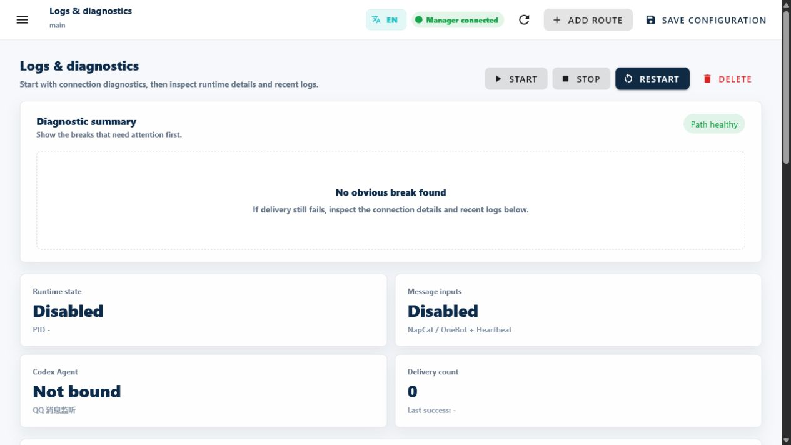

<!-- docs-language-switch -->
<div align="center">
English | <a href="./operations-and-troubleshooting.md">简体中文</a>
</div>
<!-- /docs-language-switch -->

# Operations, logs, and troubleshooting

Do not treat “no reply” as one indivisible problem. Follow the message path and identify whether the break is at the platform, rule, handler delivery, or output stage.

```text
Message adapter -> event record -> rule match -> AgentPacket -> handler -> Outbox / platform
```

## Start with Diagnosis Summary

Open **Log Diagnostics**. **Diagnosis Summary** places known connection and configuration breaks first.

`Path healthy` only means no known break was detected. If delivery still fails, continue through connection details and recent logs.



The documentation sample is not running and is not bound to a real Desktop task, so its cards clearly show **Disabled** and **Not bound**. Fix visible breaks like these before moving to the connection details and recent logs below.

## Locate the break with evidence

| Evidence | Meaning | Next check |
| --- | --- | --- |
| No message record | The event did not enter RabiRoute | Platform login, connection, port, input policy |
| Message record, no `agent-packets.jsonl` | Input worked but no rule matched | Persona, `configName`, Route kind, regex |
| AgentPacket exists, no Desktop message | Handler delivery failed | Task ID, workspace, Desktop IPC, last error |
| Desktop result, no platform reply | Output did not complete | Reply context, pipeline, output policy, Outbox log |
| Outbox is `blocked` | Policy or target denied output | Correct the target or permission; do not bypass the gate |
| Outbox is `failed` | A platform send was attempted and failed | Repair platform state, then retry explicitly |

Common runtime files live under `data/route/<configName>/`. Do not commit runtime JSONL, real messages, or account data.

## Manual-trigger effects

**Manual trigger** can execute `manual_trigger` or `heartbeat` rules to validate the rule-to-handler path.

It will:

- write manual-trigger and routing logs;
- construct a real AgentPacket;
- perform a real handler delivery;
- use the target task's own permissions during execution.

It does not simulate an external QQ event and is not a side-effect-free preview. Validate a group regex with a controlled real message or RouteDecision evidence.

## Read recent logs

**Recent logs** shows the current Route's latest gateway output. Find the newest time boundary and the first error in that run; do not let a historical startup error mislead you.


After an upgrade, rebuild and restart the Manager and Route, then verify the startup directory and `dist/` timestamp. Historical logs can remain for audit but do not define current state.

## NapCat opens with Unauthorized or an empty token login

When **Open NapCat** is clicked from a Route, RabiRoute now opens the token-bearing `/web_login` URL directly. This creates a fresh WebUI session instead of letting credentials left in an old tab continue to produce `Unauthorized` after a NapCat restart.

If the token field is still empty, close the old NapCat tab and click **Open NapCat** again from the current QQ instance card. Confirm that the instance has a saved WebUI access token. If source code was upgraded but the old URL still opens, rebuild and restart Manager. The fast startup path checks OneBot and WebUI readiness without synchronously enumerating every Windows process; the full process list remains available through explicit health checks and details.

## NapCat connected but no AgentPacket

First check for a new `group-messages.jsonl` or `private-messages.jsonl` record.

- No record: check QQ login, WebSocket Client, port, and input policy.
- Record exists: check persona `configName`, Route kind, target group, and regex.
- Forwarded message contains only an ID: check OneBot HTTP and `get_forward_msg`.

## NapCat receives but cannot send

Reachable OneBot HTTP does not prove that the QQ core can send. Check login, quick login, device verification, Windows time, and NapCat logs.

## Message-endpoint scan times out or reports partial availability

`GET /api/scan/message-adapters` is a strictly read-only diagnostic. It does not start a Route or NapCat, write configuration, trigger QR login, or run automatic repair. Independent probes start concurrently under one shared deadline. `scan.partial=true` means at least one probe timed out or failed; completed results from the other endpoints remain available.

Interpret state per endpoint and per instance. `QQ available` requires OneBot health and cannot be inferred from a reachable WebUI. A logged-out personal-Weixin adapter affects only personal Weixin. The watchdog summarizes a single endpoint error as `degraded`; only system-level Manager, Route, or Agent-delivery errors make the whole patrol `error`.

A failed Outbox attempt retains `failed` and draft data. There is no generic automatic retry queue; repair login, then retry intentionally to avoid duplicates.

## Codex receives nothing

Check in order:

1. Desktop is open and can enter the target task.
2. Agent scan sees that task and workspace.
3. The saved task ID exists and the workspace has not moved.
4. Log Diagnostics reports `desktop-ipc`.
5. A `no-client-found` wake-and-retry still fails.

Do not use fixed port 4510, `CODEX_APP_SERVER_WS_URL`, or a separate stdio Runtime for real delivery. They are not the current transport.

## RabiRoute Desktop UI is missing

A full desktop runtime launched by `Start-RabiRoute-Desktop.bat` or packaged RabiRoute Desktop records `running` in `data/runtime/desktop-lifecycle-intent.json` and starts one `watch-rabiroute-desktop-lifecycle.ps1` owner per workspace. The supervisor checks only this project's local backend `/meta` and desktop UI process. After two consecutive misses, it restores the complete desktop runtime through the original launcher's port-owner, PID, and single-instance gates. The UI stays available and reconnects during a temporary local-backend outage.

Run `Start-RabiRoute-Desktop.bat -NoOpen` once, then inspect `data/route/default-main/logs/desktop-lifecycle-supervisor.jsonl`. A healthy record has `desiredState=running`, `managerConnected=true`, and `desktopShellCount>0`. `desiredState=stopped` means the previous exit was intentional and requires an explicit user start. Missing or malformed intent fails closed. Do not substitute the half-hour business-health patrol for this lightweight owner or create a separate desktop-UI relaunch loop.

`Exit RabiRoute` from the RabiRoute Desktop menu persists `stopped` before shutting down the local backend and desktop UI, so supervision cannot undo a deliberate exit. Ordinary Manager build reloads, installer upgrades, and `SIGTERM` preserve desktop intent; when it remains `running`, supervision restores the complete desktop runtime after the reload.

## Port 8790 held by a stale Manager

If the launcher reports a listener on port `8790` but `/meta` is not stably responsive, a stale Manager from the same project may still own the port. Remote-page reconnects, Relay outages, and SSE failures must not become local startup dependencies: Manager serves local/LAN WebGUI first and hot-connects to Relay asynchronously.

Run `Start-RabiRoute-Desktop.bat` again. The launcher inspects the port owner's command line and performs bounded takeover only for an old process that precisely references this project's `dist/manager.js`: graceful shutdown first, then the verified process tree only after timeout. Unknown processes remain untouched. The launcher also reloads a healthy Manager when the current `dist` is newer than the running process.

Manager also acquires a workspace-level instance lock before loading its control plane. Exit code `17` from a second startup path means a live Manager for that workspace still owns the lock; do not keep relaunching it. Check `/meta` and the port owner first. A later start reclaims the lock only after its recorded PID no longer exists.

After recovery, verify separately that local or LAN `/meta` responds, Relay can become online later, remote `/api/events` and `/api/speech/events` reconnect, and media Range requests still return `206`. Local and LAN access should remain available while Relay is offline, without repeated Manager restarts.

When remote WebGUI cannot reach the selected PC Manager, API callers receive structured `RABI_PC_WEBGUI_UNAVAILABLE`; a response deadline returns `RABI_PC_WEBGUI_TIMEOUT`. Both include `retryable`, `Retry-After`, and a diagnostic request ID. Browser navigation shows the same ID instead of a blank or silent 502. Correlate that ID with Relay logs, then check the PC `/meta` endpoint and Manager logs; do not treat the 502 as success or blindly repeat a write request.

If plan approval submission coincides with a Manager restart or a temporary network interruption, the page now reports the connection problem explicitly and preserves the feedback text, attachments, and the same idempotent `feedbackId`. Wait until the header shows `Manager connected` or `/meta` responds, then retry directly. Do not retype the feedback or create another approval entry because an older build displayed the raw browser error `Failed to fetch`.

## When to restart

Restart when:

- a new build completed;
- an external port or connection changed;
- the Route child process exited;
- logs prove an old build is still running.

Save rule, persona, and form changes first. Restart is not Save, and repeated external-platform restarts without evidence hide the real break.

## Prepare a useful report

Collect only:

- RabiRoute version and startup method;
- operating system and Node.js version;
- Route message adapter and handler;
- reproduction steps and expected result;
- minimal logs after the current startup;
- sanitized status screenshots.

See [FAQ and support](faq-and-support_en.md) for a report template.
