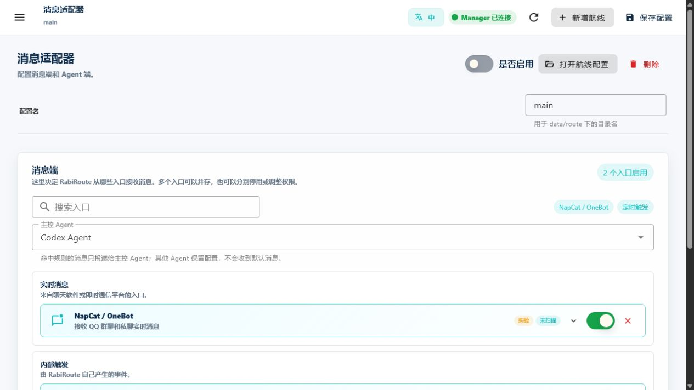

<!-- docs-language-switch -->
<div align="center">
<a href="./routes-and-adapters_en.md">English</a> | 简体中文
</div>
<!-- /docs-language-switch -->

# Route 与消息端

一条 Route 是一套可独立启停的消息流配置。它把消息入口、处理端、工作目录、人格绑定和回传意图组合在一起。

```text
消息端 -> Route 规则 -> 人格与上下文 -> Agent 处理端 -> Outbox / 回复
```

## 什么时候新建 Route

下面情况适合拆成不同 Route：

- 消息来自不同平台或账号。
- 需要投递到不同项目或 Desktop 任务。
- 使用不同人格或规则集合。
- 回传策略、允许的消息类型或文件目录不同。
- 需要单独启停、观察和排障。

多个 Route 可以复用同一个人格。不要只因为消息入口不同就复制一份人格目录。

跨人格投递也不需要新增 Route 类型或消息端。它从 Manager 的人格目录选择目标，再复用目标现有 Route 的内置人格消息链；两端 Route 都必须已启用。

## 消息端成熟度

| 消息端 | 状态 | 适合用途 | 额外依赖 |
| --- | --- | --- | --- |
| 定时触发 | 已验证 | 周期巡检和首次闭环 | 无外部账号 |
| 角色面板 | 已验证 | 托盘、本地人格消息和经过身份校验的跨人格投递 | Manager / 托盘入口；不是网络 listener |
| NapCat / OneBot | 已验证 | QQ 群聊和私聊 | NapCat、QQNT、OneBot 配置 |
| 企业微信 / WeCom | 实验 | 企业微信群聊 | Bot ID、Secret、真实环境验收 |
| 飞书 / Feishu | 实验 | 飞书应用群聊文本收发 | App ID/Secret、Verification Token、Encrypt Key、公网 HTTPS 事件订阅 |
| 远端 Agent | 实验 | 连接独立 bridge 设备 | 远端 bridge 和密码挑战 |
| FenneNote / 小爱 | 实验 | 语音转写 | 对应桥接程序或设备 |
| RabiLink | 实验 | Relay、眼镜和主动下行 | Relay 配置和真机验收 |
| 通用 Webhook | 实验 | 没有专用适配器的 POST | 外部系统和回调网络 |

“已验证”表示项目内实现、配置和契约测试完整；外部账号、网络、设备和平台风控仍可能影响运行。

## 添加消息端

打开“消息适配器”，在“消息端”区域点击添加入口。目录按本地桌面、实时消息、远端设备、内部触发、语音转写和外部接口分组。

每个消息端会显示成熟度、连接状态、依赖检查和自己的配置面板。先让一个入口稳定，再增加第二个。

需要查看当前 Route 的完整投递链路时，点击页面顶部的“通道检查”。弹窗按“消息端 → Manager → Agent 端”三列显示：左侧列出已添加消息端，中间显示当前 Route 的 Manager 运行状态，右侧列出已配置 Agent 并标明主控和备用关系。点击消息端或“查看配置”可回到对应参数区；“重新检查”会同时刷新消息端和 Agent 状态。

Agent 节点提供“投递测试”。保存配置后点击按钮，Manager 会向所选 Agent 的正式会话发送一条带 UUID 测试编号的真实消息；界面只在对应适配器确认接收后显示成功。Codex 还会核对该编号已经写入目标 Desktop 任务。测试不等待 Agent 回答，也不向 QQ、微信等外部平台发送消息。Marvis 当前只有人工复制和打开应用，不能执行真实投递测试。



截图时暂时停用了文档示例 Route，但 NapCat 和定时触发仍清楚列在消息入口中。启用 Route 前，先确认入口和主 Agent 与预期一致。

## 接收与回传是两个开关

消息端 policy 会区分：

- **接收消息**：RabiRoute 是否允许这个入口产生事件。
- **允许回传/代发**：Agent 是否可以通过 RabiRoute 的 Outbox 向该平台发送。
- **支持的输出类型**：例如文本、图片、语音和文件。
- **本地文件白名单**：允许上传文件时，限定可读目录。

关闭接收不会删除历史数据。关闭回传也不会阻止处理端在自己的任务里产出结果，只会阻止对应外部发送。

## QQ / NapCat 最小配置

NapCat 通过两条连接与 RabiRoute 协作：

- WebSocket Client：把 QQ 事件送到 RabiRoute，常用地址为 `ws://127.0.0.1:8789`。
- OneBot HTTP Server：供状态查询和回复，常用地址为 `http://127.0.0.1:3000`。

在 Route 的 NapCat 面板中确认实例、RabiRoute WS 端口、HTTP 地址和 WebUI 地址。扫描只读取状态；启动、登录和修复只会在明确点击相关按钮后执行。各消息端探针并行执行并共享本轮截止时间；单个探针超时会保留其他入口的部分结果，不会被解释成离线。

QQ / NapCat 与个人微信拥有完全独立的登录态。QQ 的“可用”只由 OneBot 实际连接和健康结果支持；NapCat WebUI 可打开只说明诊断/配置页面可访问，不能证明 QQ 已登录或可收发。个人微信未登录时只标记个人微信，不会把已在线的 QQ 或全部消息端显示成离线。

RabiRoute 不保存或绕过 QQ 密码、验证码、设备确认和风控。首次登录与异常验证必须在 NapCat / QQNT 中完成。

完整恢复流程见 [NapCat 无值守与登录稳定性](../napcat-unattended.md)。

## 定时触发

启用“定时触发”后，还需要在人格规则中配置 `heartbeat` 的触发计划。计划支持间隔、每天指定时间和一次性指定时间。

未开启 Codex“消息处理 Agent 模式”时，“会话工作中时跳过心跳”只影响固定 Codex 任务仍忙碌时的 heartbeat。开启消息处理 Agent 后，heartbeat 会立即交给独立消息处理任务，这个忙碌跳过选项不再显示；QQ、私聊和其他实时消息不会因此被丢弃。

## Webhook 和命名适配器

已存在专用适配器的平台应优先使用专用入口。它们通常能保留更准确的状态、日志、模板变量和回传语义。

通用 Webhook 适合尚未命名的外部 POST。飞书必须使用独立 `feishu` adapter 和应用事件订阅，群机器人 Webhook 不能作为替代。公开配置只应使用 localhost、占位域名和脱敏 token。

需要在原生灵珠智能体、AIUI 和原生 App 之间选择时，查看 [RabiLink 眼镜端三条路线对比](../rabilink-glasses-route-comparison.md)。

## 保存和生效

添加、删除、启停或修改消息端后，点击顶栏“保存配置”。Manager 可能同步配置或重载当前 Route。

保存后到“日志诊断”确认运行状态。外部入口还要在平台侧检查连接，例如 NapCat WebSocket、WeCom 鉴权或 Relay 在线状态。

## 接下来阅读

- 选择处理端和任务：[Agent、项目与任务](agents-and-sessions.md)。
- 决定什么消息会命中：[人格与消息规则](personas-and-rules.md)。
- 消息进入但没投递：[运行、日志与排障](operations-and-troubleshooting.md)。
