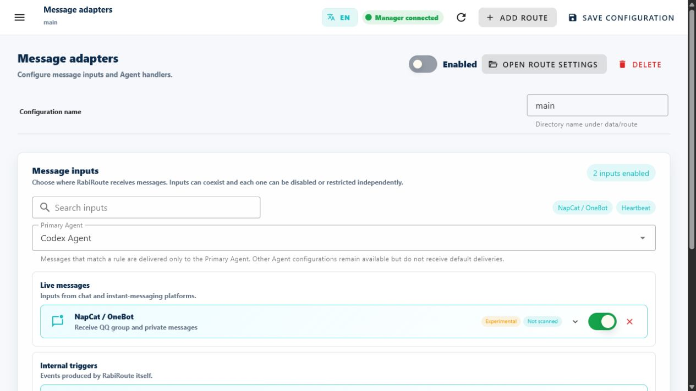

<!-- docs-language-switch -->
<div align="center">
English | <a href="./routes-and-adapters.md">简体中文</a>
</div>
<!-- /docs-language-switch -->

# Routes and message adapters

A Route is an independently controlled message-flow configuration. It combines message sources, a handler, workspace, persona binding, and output intent.

```text
Message adapter -> Route rules -> persona and context -> Agent handler -> Outbox / reply
```

## When to create another Route

Separate Routes are useful when:

- messages come from different platforms or accounts;
- work must enter different projects or Desktop tasks;
- a different persona or rule set applies;
- output policy, payload types, or file roots differ;
- you need independent lifecycle and diagnostics.

Several Routes can reuse one persona. Do not duplicate a persona only because the message source changes.

Cross-persona delivery does not require another Route kind or message adapter. It selects a target from Manager's persona directory and reuses the target's existing built-in persona-message path. Both source and target Routes must be enabled.

## Adapter maturity

| Message adapter | Status | Good for | Additional dependency |
| --- | --- | --- | --- |
| Scheduled trigger | Verified | Periodic checks and first-run validation | No external account |
| Role panel | Verified | Tray, local persona messages, and authenticated cross-persona delivery | Manager/tray entry; not a network listener |
| NapCat / OneBot | Verified | QQ groups and private messages | NapCat, QQNT, OneBot setup |
| WeCom | Experimental | WeCom groups | Bot ID, Secret, environment acceptance |
| Remote Agent | Experimental | Independent bridge devices | Remote bridge and password challenge |
| FenneNote / XiaoAI | Experimental | Speech transcripts | Matching bridge or device |
| RabiLink | Experimental | Relay, glasses, and proactive output | Relay setup and real-device acceptance |
| Generic Webhook | Experimental | POST from an unnamed system | External callback system |

Verified means the repository path, configuration, and contracts are complete. Accounts, networks, devices, and platform risk controls can still affect operation.

## Add a message adapter

Open **Message Adapters** and add an entry under **Message sources**. The catalog groups local desktop, real-time chat, remote devices, internal triggers, speech, and external interfaces.

Each adapter shows maturity, connection state, dependency checks, and its own settings. Stabilize one source before adding another.



The documentation sample Route was paused for the screenshot, while NapCat and Scheduled trigger remain visible in its input list. Confirm the inputs and primary Agent before enabling a Route.

## Input and output are separate gates

Adapter policy distinguishes:

- **Receive messages**: whether this source may create RabiRoute events.
- **Allow reply/send**: whether an Agent may send through RabiRoute's Outbox.
- **Supported outputs**: text, image, voice, file, or a smaller set.
- **Allowed file roots**: local directories permitted for file upload.

Disabling input does not delete history. Disabling output does not prevent the handler from producing a result in its task; it blocks the platform send.

## Minimal QQ / NapCat setup

NapCat uses two connections:

- WebSocket Client sends QQ events to RabiRoute, commonly `ws://127.0.0.1:8789`.
- OneBot HTTP Server supports health and replies, commonly `http://127.0.0.1:3000`.

In the Route's NapCat panel, verify the instance, RabiRoute WS port, HTTP address, and WebUI address. Scans are read-only; start, login, and repair actions require an explicit click. Endpoint probes start concurrently under one scan deadline. A timed-out probe preserves partial results from other endpoints and is not interpreted as offline.

QQ/NapCat and personal Weixin have completely independent login states. QQ is marked usable only from a live OneBot connection and health result. A reachable NapCat WebUI proves only that the diagnostic/configuration surface is reachable; it does not prove that QQ is logged in or can send and receive. A logged-out personal-Weixin adapter affects only that adapter and never turns an online QQ or every message endpoint into an offline state.

RabiRoute does not store or bypass QQ passwords, CAPTCHA, device confirmation, or risk controls. Complete first login and exceptional verification in NapCat/QQNT.

See [Unattended NapCat and login stability](../napcat-unattended_en.md) for the recovery flow.

## Scheduled trigger

After enabling Scheduled trigger, add a `heartbeat` schedule in persona rules. Schedules can use intervals, daily times, or a one-off date and time.

While Codex Message Agent mode is off, **Skip heartbeat while task is busy** affects only heartbeat when the fixed Codex task is active. With Message Agent mode on, heartbeat goes immediately to an independent Message Agent and the busy-skip option is hidden. QQ, private, and other real-time messages are not discarded by this setting.

## Webhook and named adapters

Prefer a named adapter when one exists. It normally preserves more accurate status, logs, template values, and reply semantics.

Generic Webhook is for POST sources without a dedicated integration. Public configuration should use localhost, placeholder domains, and sanitized tokens.

For native Lingzhu agent, AIUI, and native app selection, see the [RabiLink glasses three-route comparison](../rabilink-glasses-route-comparison_en.md).

## Save and apply

After adding, removing, enabling, or editing an adapter, select **Save configuration**. The Manager may synchronize or reload the Route.

Then verify runtime state in **Log Diagnostics**. External systems also need platform-side checks such as NapCat WebSocket, WeCom authentication, or Relay presence.

## Continue

- Select a handler and task: [Agents, projects, and tasks](agents-and-sessions_en.md).
- Decide which messages match: [Personas and message rules](personas-and-rules_en.md).
- Input works but delivery fails: [Operations, logs, and troubleshooting](operations-and-troubleshooting_en.md).
