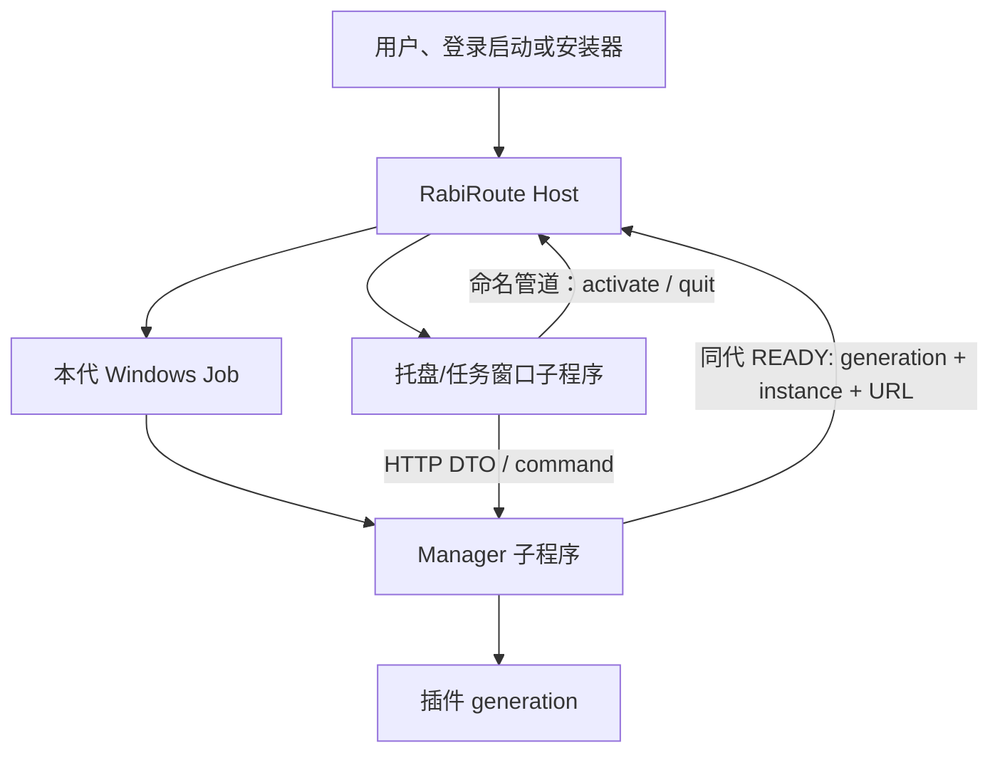

<!-- docs-language-switch -->
<div align="center">
<a href="./windows-launcher-and-packaging_en.md">English</a> | 简体中文
</div>
<!-- /docs-language-switch -->

# Windows 桌面启动与完整打包

Windows 安装版只有一个应用生命周期入口：`RabiRouteHost.exe`。Manager 是业务与状态 owner，托盘/任务窗口是表现层；二者都是 Host 创建的同代子程序。托盘不是 Manager 的监督器，也不是另一套桌面应用。

## 安装、升级与恢复

发布页同时提供便携 ZIP 和 `SHA256SUMS.txt`。便携 ZIP 使用 `RabiRouteHost.exe + current.json + versions/<releaseId>` 布局，只能解压到新的空目录，不能覆盖旧 RabiRoute 目录；升级既有安装必须运行 Setup。Setup 嵌入同一份便携 ZIP，先在安装盘暂存并逐清单校验哈希、大小、私有路径、reparse point 与 Host 自检，再按当前 application generation 执行 fenced quit；只有候选通过后才原子切换 `current.json` 与 bootstrap，失败会恢复上一指针和 bootstrap。经精确识别的旧生命周期入口会以 `.retired` 后缀移入安装器所有的非执行 quarantine；事务失败或断电恢复会把它们原位还原，foreign 和相似后缀文件不移动。`data/`、`logs/` 与 foreign 文件不参与覆盖或卸载。当前 Windows 包尚未签名，遇到 SmartScreen“未知发布者”提示时先核对校验和。

旧安装事务恢复会先执行只读所有权检查，再允许任何指针/bootstrap 还原、登录启动或计划任务恢复、quarantine 移动、版本删除及事务清理。当前 `current.json` 必须与该旧事务保存的 backup 或 candidate 字节一致，且指针结构有效；bootstrap 也必须匹配该事务的 backup 或 candidate。原本不存在的文件只允许仍不存在或匹配 candidate，支持切换/回滚中途两文件分别处于旧、新状态。必要的备份、身份或匹配证据缺失时失败关闭；第三版本、损坏的指针或 bootstrap 漂移均拒绝恢复，保留日志、backup 和相关资源，不自动覆盖后续成功发布。`rolled-back` 仍可能表示回滚不完整，不能仅凭该状态删除或跳过日志。遇到所有权拒绝时，应保留证据并人工核对，不能删除日志后盲目重试。此检查不是完整终态重构，也不判断后续登录启动设置是否仍属于旧事务。

发布清单生成时会核对桌面 profile 中启用插件声明的进程内 Web 入口：入口必须在包内且实际存在，否则拒绝打包并指出插件与缺失路径。单独重建插件包会移除后续 Web 构建生成的入口，因此必须完成 Web Bundle 同步后再冻结发布产物；不能仅凭 Manager 健康或 HTML 可下载判断页面可用。安装验收还需读取与 HTML `webRelease` 一致的模块目录及模块入口。

### 安装子进程失败证据

事务 `Invoke-Checked` 按 Windows 参数规则保留空参数、空格、引号与末尾反斜杠的边界；每次调用把唯一命名的 `*.stdout.txt`、`*.stderr.txt` 写入本次 `transactionRoot`。该目录在首次候选自检之前随 candidate/backup 创建，不借用旧事务或共享临时目录。非零退出仍立即失败，不自动重放或跳过 generation fence；失败 journal 只增加操作标签、退出码和证据路径，不复制原始输出。进程启动异常另存 `*.launch-error.txt`，无法取得退出码时按 `unknown` 失败关闭。

`Stop-RabiRouteHostFenced.ps1` 的内部 Host 调用在非零退出、JSON 无效或未返回 `ok:true` 时保留自己的 stdout/stderr，异常仅引用路径；成功调用仍清理内部证据。业务 JSON 错误可能位于 stdout，排障时应同时核对双流。失败事务保留目录供人工检查，成功事务仍按原规则删除整个 staging。原始文件可能包含敏感信息，不应直接上传。此前仅有 `Fenced Host stop ... ExitCode=1` 的日志不足以确定真实根因；参数修复本身不证明真实安装故障已解决。以下归档入口仍只接受原有精确旧错误文本，不扩展到带证据路径的新错误。

### 继承环境中的大小写重复名称

Setup 的 Windows PowerShell 子进程可能继承同时包含 `NO_PROXY` 与 `no_proxy` 的原生环境块；输出重定向使 .NET Framework 在 `ProcessStartInfo.get_EnvironmentVariables` 建立不区分大小写的字典，从而在候选 bootstrap 自检真正启动前抛出重复键 `ArgumentException`。这不是 bootstrap 自检失败，也不能据此修改 generation fence。

安装和停止脚本在每次重定向启动前检查全部环境变量：名称按 `OrdinalIgnoreCase` 分组，值按 `Ordinal` 精确比较。同值重复只删除多余条目，留下一个原始条目（包括空值）；不同值则在启动目标程序前失败，`*.launch-error.txt` 记录冲突名称和处理提示，不输出环境值。必须在启动 Setup 的上游环境中统一冲突值后再重试，不自动选择大写或小写版本。不清空代理、不禁用 proxy，也不修改用户或系统环境；规范化只作用于当前安装/停止脚本进程及其后续子进程。

两个脚本独立携带相同小函数，回归测试保证内容一致，现有 Setup 嵌入路径不变，不增加需要单独部署的 helper。`node --test scripts/windows-environment-case.test.mjs scripts/windows-invoke-checked.test.mjs` 使用临时原生 `CreateProcessW` 环境块启动 Windows PowerShell，覆盖真实重复继承、同值/异值/空值、无关值保留和原有参数/日志行为；不执行真实安装或 Host quit。

### 人工核验旧 rolled-back 日志后归档（窄场景）

独立维护入口 `scripts/Archive-RabiRouteRolledBackTransaction.ps1` **没有默认安装路径，不被 Setup 或 Developer Channel 自动调用**。必须先人工确认后续第三版本已经发布成功，并保存当前指针和旧日志的 SHA256。省略 `-Archive` 只读核验；实际归档必须另行显式授权并传入该开关：

```powershell
# 所有值来自人工核验；不要将占位值原样执行。
.\scripts\Archive-RabiRouteRolledBackTransaction.ps1 `
  -InstallRoot '<canonical-local-install-root>' `
  -ExpectedCurrentReleaseId '<verified-current-release-id>' `
  -ExpectedJournalSha256 '<64-hex-journal-sha256>' `
  -ExpectedCurrentPointerSha256 '<64-hex-current-json-sha256>'
# 核验通过不代表已归档；获准后用完全相同的参数追加 -Archive。
```

大包核验可显式追加 `-Verbose`，查看 `transaction-tree`、`release-tree`、`manifest-hash`、`extra-files` 和 `cas` 阶段的开始/完成；manifest 每校验完 1000 项报告一次计数；`scope=staged-candidate` 与 `scope=current` 标明正在验证哪份发布。默认不输出进度，不改变任何校验或准入条件。进度写入 PowerShell Verbose 流（流 4），成功流仍只返回最终 JSON；外部 `powershell.exe` 的控制台可能将进度呈现在标准输出，机器解析时须在 PowerShell 调用层用 `4> '<progress-log-path>'` 单独重定向，不能把合并后的控制台文本直接当 JSON。阶段完成仅表示该阶段检查通过，不代表归档完成或运行健康。

当前仅接受 `rolled-back`、空 `quarantineMoves`、`versionMoveState=not-started`、布尔 `versionCommitted=false`、`legacyTaskMigrationState=restored`、`autostartState=captured`，且错误精确为 `Fenced Host stop failed with ExitCode=1.`。还必须同时满足：

- 旧事务原本已有指针和 bootstrap；backup 完整；安装 `versions/<old-release>` 目标目录和 quarantine 目录必须不存在；当前不是旧 backup 或 candidate release。
- `not-started` 正常会把完整候选留在 `.install-staging/<transaction-id>/candidate`，不能把它等同于已提交的安装版本。现在要求该候选完整存在：根层仅有非空 bootstrap、有效 `current.json` 和 `versions`，后者仅有与旧 journal 一致的唯一版本。候选与当前发布复用同一个只读验证函数，逐项核验完整 manifest、大小/哈希、必需项、额外文件、canonical payload/releaseId 和 reparse 边界；损坏或缺失的候选拒绝。候选全部原位保留，不执行其中程序。候选 bootstrap 仅校验普通非空文件及路径，发布 manifest 不覆盖根 bootstrap，不能据此宣称其签名或独立来源已认证。
- 旧任务备份明确 `wasPresent=false, wasRunning=false` 且无 XML；登录启动和旧登录启动快照明确原本不存在，settings 快照若存在则校验原备份哈希。不会读取或恢复当前用户设置、快捷方式或计划任务。
- 当前完整 manifest 的必需文件、全部文件大小/哈希、额外文件、canonical payload/releaseId 与指针均通过校验；根 bootstrap 与旧 backup 字节一致。这里使用只读文件验证，不执行 Host、自检或运行期健康请求；运行健康仍需操作者独立核验。
- 安装根及证据路径必须是规范本机绝对路径；拒绝路径逃逸、别名形式和任意祖先/证据树 reparse point。缺失、冲突或其他状态只读拒绝，不提供强制绕过。

入口沿用安装/Developer 的同名 mutex，获取前后及提交前检查 journal/指针 SHA256。先用 `CreateNew`、`WriteThrough` 和 `Flush(true)` 持久化原始日志字节到原事务所有权目录 `.install-staging/<transaction-id>/journal-<sha256>.original.json`，再无覆盖移动活跃日志为同目录 `journal-<sha256>.removed.json`。版本、backup、candidate、快照和中断的 `.pending` 证据全部保留，不删除、不恢复、不改写旧日志状态。已持久化未移动及已移动重试均可识别；已有异值归档拒绝覆盖。此 `Local\` mutex/CAS 只约束同一 Windows 登录会话、相同 canonical-root 的协作安装写入者；执行前必须排除其他登录会话或不同文件系统别名的写入，不是跨会话互斥、恶意本机管理员并发替换或存储硬件断电语义的保证。原安装恢复门禁不变，不能推广为所有 `rolled-back` 均已完成。

## 生命周期所有权

后台任务故障与核心接口就绪分开判断：`health.state` 不因记忆整理等后台 incident 单独降级；`health.backgroundState` 和 `health.backgroundIncidentCount` 保留故障状态，详细原因仍在 `backgroundLifecycle` 和日志中。必需能力、计划存储启动和路线就绪检查不变。后台任务独立退避，不能阻断无关 API。记忆整理的投递结果不确定时持久化待核对状态，后续只读原投递回执；没有确认不能自动重发。移除的调度目标不再计入当前故障汇总。

健康探测单次期限为五秒，仍要求连续三次失败才重建，给短时 CPU 拥塞留出恢复机会；generation、实例和必需能力校验不变。这是容错门槛，不替代长停顿诊断。

Manager 为线程桥发现允许工作目录时，只从 Desktop 索引查询任务 ID、目录及归档标记，保留最近一万条记录的范围；不读取任务正文或侧栏名称索引。任务名称解析与模型设置仍由原 Desktop owner 合同负责，不能用目录发现替代投递身份检查。

Host 在十五分钟内累计五次 generation 失败后进入 `faulted`，停止自动重建并等待明确的 Host 重启命令，避免约一分钟一轮的失败绕过熔断。Manager 启动前三分钟使用 10 毫秒 CPU 采样，每十秒向 `logs/manager/manager-runtime-YYYY-MM-DD.jsonl` 写入 `startup_cpu_sample`：只含耗时、定时器延迟及前十二个函数位置，不含消息、参数或完整绝对路径。采样不开放调试端口，到期自动停止；采样失败不阻断业务启动。

| 组件 | 负责 | 不负责 |
| --- | --- | --- |
| RabiRoute Host | 当前用户单实例、应用代、子进程 Job、启动顺序、有界重启、本机控制命令 | Route、插件业务、WebGUI 状态、桌面表现 |
| Manager | HTTP API、业务事实、插件 generation、持久化、Route 与 Gateway | Windows 应用单实例、启动托盘、修复托盘 |
| 托盘/任务窗口 | 展示 Manager DTO、收集用户操作、打开当前 WebGUI、请求 Host 退出 | 启动或关闭 Manager、扫描端口、写业务文件、自行常驻 |
| Manager 插件 | 在 Manager generation 内提供声明过的能力 | 拥有 Host/Manager/托盘的应用生命周期 |



Host 使用当前用户命名 Mutex 保证唯一实例，并通过当前用户命名管道接收 `activate`、`status`、`restart` 和 `quit`。第二次启动只激活现有 Host，不创建第二组 Manager 或托盘。

Manager 另持有按当前用户与产品安装身份派生的操作系统命名管道租约，防止旧版手工入口成为第二个状态写入者。租约随进程结束由 Windows 自动释放；`manager-instance.lock` 只保存诊断身份，不再根据“某个 PID 仍存在”判断所有权，因此断电、Job 强杀或 PID 复用不会把 Manager 永久锁死。

每次启动 generation 时，Host 创建新的 Windows Job。Manager 与托盘都以 `CREATE_SUSPENDED` 创建，先加入 Job，再恢复执行；因此 Host 退出或 Job 被关闭时，本代子程序不能变成孤儿。Manager 先启动，Host 只接受带匹配 `applicationGenerationId`、Manager PID、`managerInstanceId` 与回环 `baseUrl` 的结构化 READY；验证通过后才启动托盘。

发布包继续在 `versions/<releaseId>/node.exe` 保存经过清单校验的 Node.js。Host 启动 Manager 前会把该文件校验并同步到安装根目录固定的 `runtime/node.exe`，所有 Manager、Route 和工作进程都从这个固定路径启动。升级只切换版本内容，不再改变 Windows 看到的网络程序路径，因此启用局域网 WebGUI 或 RabiLink 局域网远端访问后，防火墙不会随每个 `releaseId` 重复询问。`runtime/node.exe` 与当前发布副本不一致时由 Host 修复；卸载只在哈希匹配时删除它，其他文件保持不动。

Host 同时向 Manager 与 Desktop 提供只读的发布目录（`RABIROUTE_PACKAGE_ROOT`）和稳定的运行数据目录（`RABIROUTE_STATE_ROOT`）。Desktop 从发布目录读取程序和图标，但截图图片、框选历史、贴图状态、滑词设置和 COM 生成缓存等可写内容只进入安装根目录。`versions/<releaseId>` 不再接收运行数据，因此 Host 后续执行 `status`、重启或升级时仍能按清单验证当前发布。

## 可追溯的设计依据

这套边界参考的是生命周期不变量，不照搬参考项目的进程布局或端口：

- Sunshine 当前 `master` 的 [`src/system_tray.cpp`](https://github.com/LizardByte/Sunshine/blob/master/src/system_tray.cpp) 把托盘作为 Sunshine 进程内受管线程，托盘退出回调调用 [`lifetime::exit_sunshine`](https://github.com/LizardByte/Sunshine/blob/master/src/entry_handler.h)，因此托盘操作落回同一个应用退出边界，而不是成为独立常驻程序。
- Sunshine 的 Windows [`tools/sunshinesvc.cpp`](https://github.com/LizardByte/Sunshine/blob/master/tools/sunshinesvc.cpp) 给子程序使用带 `JOB_OBJECT_LIMIT_KILL_ON_JOB_CLOSE` 的 Job，监视子程序退出；正常停止先请求优雅终止并等待最多 20 秒，再用强制终止兜底。RabiRoute 保留单 owner、Job、统一 quit/restart 和“先优雅、后强制”的不变量。
- RabiRoute 的 Manager 是 Node.js，托盘是 Python/Qt，插件还需要独立故障域，因此采用 Host 加两个同代 child，而不是把托盘做成 Manager 线程。这是语言运行时和插件隔离造成的有意差异，不改变 Host 的唯一生命周期所有权。
- DSH 只提供插件 scope 与依赖感知卸载的设计参考：RabiRoute 据此用 generation、`readyRequires`、process lease 和依赖逆序释放管理插件。DSH 式进程内 isolate 不被当作安全沙箱；RabiRoute 的 `in_process` 是受信任扩展，`isolated` 是独立故障域，名称不能替代操作系统权限边界。

Sunshine 的固定 base-port 约定不属于这里采用的不变量。RabiRoute 不把端口写死为安装配置；Host 只缓存最近一次成功启动的端口，并由本代 Manager 重新绑定、发布和验证。

## 环境变量重复键导致启动失败

若 Host 日志出现 `An item with the same key has already been added. Key: NO_PROXY`，且堆栈指向 `BuildEnvironmentBlock`，表示旧版 Host 构造子进程环境时无法处理大小写不同的同名变量；并不表示知识库损坏或必须删除系统代理设置。修复后的 Host 按 Windows 的大小写不敏感规则合并继承变量（枚举中后出现的值覆盖先出现的值），然后应用 Host 显式覆盖；值为 `null` 的覆盖会删除该键。输出仍为按键排序、双 NUL 结尾的 UTF-16 环境块，不修改父进程或系统环境，也不记录变量值。

通过 Setup 或本机 Developer Channel 安装包含修复的 Host Core，保留既有数据与版本回滚点；只重试同一个旧 Host 不会修复此问题。恢复后从 Host `status` 动态取得 URL，核对 `/meta` 的 generation、实例和 PID，再检查 WebGUI 文档及其模块入口。不要扫描端口、单独启动 Manager 或原地替换活动版本 DLL。

## 动态 Manager 端点

第一次启动时，Manager 把端口 `0` 交给操作系统，取得当前可用的回环端口。之后 Host 会把最近一次完成整代健康校验的端口保存到 Host 自己的状态目录；下一代会优先尝试该端口。该端口已被占用、已被浏览器禁止访问或缓存无效时，Manager 自动重新向操作系统申请安全端口，Host 在新一代完成健康校验后覆盖缓存。因此正常重启会保持 WebGUI 地址，端口冲突时仍能自行恢复。

缓存只保存端口，不保存 URL、`applicationGenerationId` 或 `managerInstanceId`。端点身份仍包含：

- `applicationGenerationId`：Host 创建的一代应用身份；
- `managerInstanceId`：本代 Manager 实例身份；
- `managerBaseUrl`：本代真实回环地址；
- Manager PID：READY 必须来自 Host 刚启动的子程序。

这些字段由 Host 状态与托盘持有，不通过端口扫描猜测，也不把旧实例的 URL 当成下一代地址。托盘调用 `/meta` 时必须同时验证应用代和 Manager 实例，失败时只显示离线；Host 的独立健康探针连续发现不可达或身份不匹配后，才按唯一 owner 的职责重建整代。

查询当前状态：

```powershell
& "$env:LOCALAPPDATA\Programs\RabiRoute\RabiRouteHost.exe" --command status --json
```

返回的 `managerBaseUrl` 才是当前 WebGUI 与本机 API 地址。用户从托盘选择“打开 RabiRoute WebGUI”时，也由托盘打开这条经过 Host 绑定的地址。

## 启动、重启与退出

安装版 RabiSpeech 通过固定的 `runtime/speech/RabiSpeech.exe` 启动，当前版本提供 `windows_host.py`、业务代码和依赖位置。首次启动从已验证版本准备入口，内容相同不重写，内容变化时原子替换；运行中无法替换就报错，不退回带版本号的可执行路径。这样普通更新不会因路径变化再次触发 Windows 防火墙提示。迁移到固定路径时仍可能需要一次授权；不自动创建或扩大公用网络放行规则，保留现有监听地址与手机连接配置。

安装版从开始菜单、桌面快捷方式或登录启动项直接运行 `RabiRouteHost.exe`。源码仓库不再提供生产启动兼容入口；开发时使用 `npm run dev`，需要 WebGUI 热更新时使用 `npm run dev:hot`。验证构建后的 Windows 运行态时，只启动本机构建或安装目录里的 `RabiRouteHost.exe`。

普通代码改动不需要重新压缩 Setup/ZIP。先把 NAS 源码物化到本机开发目录并安装好锁定依赖，再运行：

```powershell
.\scripts\Publish-RabiRouteDeveloperCandidate.ps1 -SourceRoot C:\path\to\local\RabiRoute
```

Developer Channel 只在本机执行增量 build，以当前不可变版本为基底生成带完整 manifest 的新候选版本，然后通过唯一 Host 做 fenced quit、原子切换 `current.json`、启动完整新 application generation，并核对 Host→Manager/Tray、动态 URL 与 `/meta` 身份。失败时指针自动回滚并恢复上一版本。它不从 NAS 运行代码、不直接启动 Manager/Tray，也不生成发行压缩包；`package-lock.json`、根 Bootstrap 或依赖运行时变化仍必须走完整发行流程。默认会重新构建托盘 Desktop runtime 与 Host Core，避免候选版本夹带基底中的陈旧二进制；只有明确复用已安装构建时才传 `-RebuildDesktopRuntime:$false` 或 `-RebuildHostCore:$false`。

候选版本同时完整替换本次源码中的 `docs/`、`plugins/`、`skills/` 和 `source-patches/`，删除候选内已退役的同层文件，避免新消息包指向旧接口合同、遗漏新模块开发指南或加载旧插件入口及清单；缺少任一目录时构造失败，旧版本保持不变。业务数据、补丁操作回执和动态注册记录不属于这些发行目录，不随构建清理。

根目录中英文 README 与版本更新日志也必须来自本次构建源码；缺少任一文件时构造失败，不沿用基底中的旧说明。

```powershell
& "$env:LOCALAPPDATA\Programs\RabiRoute\RabiRouteHost.exe"
```

显式重启整代：

```powershell
& "$env:LOCALAPPDATA\Programs\RabiRoute\RabiRouteHost.exe" --command restart --json
```

托盘的“退出 RabiRoute”通过 Host 控制管道提交带当前 `applicationGenerationId` 的退出请求。Host 先停止本代，再退出自己；旧托盘不能用过期 generation 关闭新应用。Manager 的普通 HTTP API 不提供应用启动/关闭入口。

Manager 或托盘意外退出时，Host 关闭整个 Job，并按有界退避创建完整新 generation。连续失败达到熔断阈值后 Host 留下日志并停止重试，避免无限复活和重启风暴。托盘不会在 Manager 离线时独自重连到任意端口。

## 从源码运行

跨平台或后端开发仍可单独运行 Manager：

```powershell
npm install
npm run build
npm run start:manager
```

这是开发入口，不代表 Windows 安装版生命周期。Manager 会把操作系统分配的真实 URL写到标准输出；源码模式的调用者显式使用该 URL，不存在产品级固定端口发现协议。

## 局域网动态发现

只有用户启用 WebGUI 局域网访问且 Manager 确实监听 LAN 时，Manager 才发布标准 DNS-SD 服务 `_rabiroute._tcp.local.`。SRV 记录携带本代操作系统实际分配的端口；TXT 只包含协议版本、`/.well-known/rabiroute-manager` 路径、`applicationGenerationId` 和 `managerInstanceId`，不发布 WebGUI 密钥、Host 控制令牌或私有路径。

Android SDK 的无参 `scanLan()` 消费该 DNS-SD 服务，从解析到的主机与端口读取 well-known 身份文档，并返回完整动态 Manager URL。协议缺失、身份不匹配、解析失败或超时时显式失败/返回空结果，不回退到 `8790..8799` 猜端口。局域网发现只负责定位与身份栅栏；其他 Manager API 仍按 WebGUI LAN 安全策略鉴权。

## 构建

Windows 构建必须在本机磁盘完成；NAS 只保存源码，不能作为应用、构建中间产物或运行日志位置。

```powershell
powershell -ExecutionPolicy Bypass -File .\scripts\build-windows-release.ps1 `
  -OutputRoot C:\RabiRouteBuild
```

发布包包含：

- 单文件、自包含的 .NET 9 `RabiRouteHost.exe`；
- `dist/` Manager、RibiWebGUI 与 29 个内置插件包；
- 本机 Node.js runtime 与生产依赖；
- `desktop-runtime/` 中作为纯表现子程序的 PySide6/Qt Desktop；
- 默认配置和公开资源。

`RabiRouteHost.exe` 是开始菜单、桌面快捷方式、登录启动和卸载停止流程的唯一目标。安装器升级前通过 Host 控制命令停止现有 generation，并移除退役的并行生命周期入口和旧启动快捷方式；不保留能够复活旧架构的旁路。

便携 ZIP 只支持解压到新的空目录，不是原地覆盖升级介质。ZIP 无法删除旧目录里多余的 EXE、watcher、计划任务或登录启动入口；既有安装必须由 Setup 执行 fail-closed 停止与迁移。作为最后一道组合根门禁，Host 在创建 Manager 或托盘前同时检查当前版本包根与状态/安装根中的退役 Desktop、Tray 与 watcher 文件；发现任意精确旧入口就以 `legacy_overlay_blocked` 拒绝启动，不自动删除文件，并明确要求换空目录或运行 Setup。相似后缀备份文件不命中，干净的 Setup 安装也不会被误拦。

## 日志与验收

Host 日志位于：

```text
%LOCALAPPDATA%\RabiRoute\diagnostics\host\host-YYYYMMDD.log
```

Desktop 的每次启动仍保存自己的崩溃证据包；Manager、插件与 Route 日志保持各自事实源。验收至少覆盖：

1. 连续双击只保留一个 Host 和一代 Manager/托盘；
2. 先占用任意常见本机端口，RabiRoute 仍取得新的动态端口；
3. Manager READY 身份匹配后才出现托盘；
4. 分别终止 Manager 与托盘，旧 generation 全部结束，只重建一代；
5. 退出后 Host、Manager、托盘与受租约管理的插件进程都消失，且不会复活；
6. `--command status --json` 与 Manager `/meta` 的 generation、instance 和 URL 一致；
7. 退役生命周期入口、固定端口默认值和 Manager HTTP 应用启停路由不在正式调用链与发布包中。
8. Manager 与其 Node.js 子进程的可执行文件路径固定为 `<install-root>/runtime/node.exe`，升级后不会回到 `versions/<releaseId>/node.exe`。
