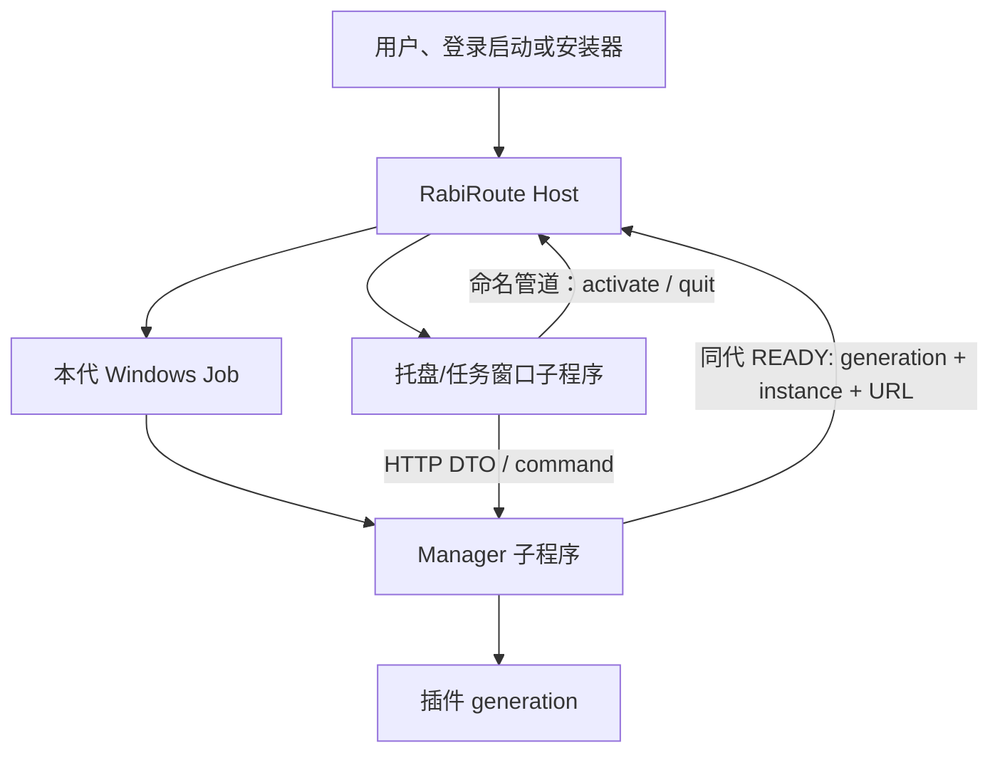

<!-- docs-language-switch -->
<div align="center">
<a href="./windows-launcher-and-packaging_en.md">English</a> | 简体中文
</div>
<!-- /docs-language-switch -->

# Windows 桌面启动与完整打包

Windows 安装版只有一个应用生命周期入口：`RabiRouteHost.exe`。Manager 是业务与状态 owner，托盘/任务窗口是表现层；二者都是 Host 创建的同代子程序。托盘不是 Manager 的监督器，也不是另一套桌面应用。

## 生命周期所有权

| 组件 | 负责 | 不负责 |
| --- | --- | --- |
| RabiRoute Host | 当前用户单实例、应用代、子进程 Job、启动顺序、有界重启、本机控制命令 | Route、插件业务、WebGUI 状态、桌面表现 |
| Manager | HTTP API、业务事实、插件 generation、持久化、Route 与 Gateway | Windows 应用单实例、启动托盘、修复托盘 |
| 托盘/任务窗口 | 展示 Manager DTO、收集用户操作、打开当前 WebGUI、请求 Host 退出 | 启动或关闭 Manager、扫描端口、写业务文件、自行常驻 |
| Manager 插件 | 在 Manager generation 内提供声明过的能力 | 拥有 Host/Manager/托盘的应用生命周期 |



Host 使用当前用户命名 Mutex 保证唯一实例，并通过当前用户命名管道接收 `activate`、`status`、`restart` 和 `quit`。第二次启动只激活现有 Host，不创建第二组 Manager 或托盘。

Manager 另持有按当前用户与产品安装身份派生的操作系统命名管道租约，防止旧版手工入口成为第二个状态写入者。租约随进程结束由 Windows 自动释放；`manager-instance.lock` 只保存诊断身份，不再根据“某个 PID 仍存在”判断所有权，因此断电、Job 强杀或 PID 复用不会把 Manager 永久锁死。

每次启动 generation 时，Host 创建新的 Windows Job。Manager 与托盘都以 `CREATE_SUSPENDED` 创建，先加入 Job，再恢复执行；因此 Host 退出或 Job 被关闭时，本代子程序不能变成孤儿。Manager 先启动，Host 只接受带匹配 `applicationGenerationId`、Manager PID、`managerInstanceId` 与回环 `baseUrl` 的结构化 READY；验证通过后才启动托盘。

## 可追溯的设计依据

这套边界参考的是生命周期不变量，不照搬参考项目的进程布局或端口：

- Sunshine 当前 `master` 的 [`src/system_tray.cpp`](https://github.com/LizardByte/Sunshine/blob/master/src/system_tray.cpp) 把托盘作为 Sunshine 进程内受管线程，托盘退出回调调用 [`lifetime::exit_sunshine`](https://github.com/LizardByte/Sunshine/blob/master/src/entry_handler.h)，因此托盘操作落回同一个应用退出边界，而不是成为独立常驻程序。
- Sunshine 的 Windows [`tools/sunshinesvc.cpp`](https://github.com/LizardByte/Sunshine/blob/master/tools/sunshinesvc.cpp) 给子程序使用带 `JOB_OBJECT_LIMIT_KILL_ON_JOB_CLOSE` 的 Job，监视子程序退出；正常停止先请求优雅终止并等待最多 20 秒，再用强制终止兜底。RabiRoute 保留单 owner、Job、统一 quit/restart 和“先优雅、后强制”的不变量。
- RabiRoute 的 Manager 是 Node.js，托盘是 Python/Qt，插件还需要独立故障域，因此采用 Host 加两个同代 child，而不是把托盘做成 Manager 线程。这是语言运行时和插件隔离造成的有意差异，不改变 Host 的唯一生命周期所有权。
- DSH 只提供插件 scope 与依赖感知卸载的设计参考：RabiRoute 据此用 generation、`readyRequires`、process lease 和依赖逆序释放管理插件。DSH 式进程内 isolate 不被当作安全沙箱；RabiRoute 的 `in_process` 是受信任扩展，`isolated` 是独立故障域，名称不能替代操作系统权限边界。

Sunshine 的固定 base-port 约定不属于这里采用的不变量。RabiRoute Manager 继续使用操作系统动态分配的端口，并由 Host 绑定、发布和验证本代地址。

## 动态 Manager 端点

Manager 默认把端口 `0` 交给操作系统，取得当前可用的回环端口。端点身份包含：

- `applicationGenerationId`：Host 创建的一代应用身份；
- `managerInstanceId`：本代 Manager 实例身份；
- `managerBaseUrl`：本代真实回环地址；
- Manager PID：READY 必须来自 Host 刚启动的子程序。

这些字段由 Host 状态与托盘持有，不写成固定端口、不通过端口扫描猜测，也不把旧实例的 URL 当成下一代地址。托盘调用 `/meta` 时必须同时验证应用代和 Manager 实例，失败时只显示离线；Host 的独立健康探针连续发现不可达或身份不匹配后，才按唯一 owner 的职责重建整代。

查询当前状态：

```powershell
& "$env:LOCALAPPDATA\Programs\RabiRoute\RabiRouteHost.exe" --command status --json
```

返回的 `managerBaseUrl` 才是当前 WebGUI 与本机 API 地址。用户从托盘选择“打开 RabiRoute WebGUI”时，也由托盘打开这条经过 Host 绑定的地址。

## 启动、重启与退出

安装版从开始菜单、桌面快捷方式或登录启动项直接运行 `RabiRouteHost.exe`。源码仓库不再提供生产启动兼容入口；开发时使用 `npm run dev`，需要 WebGUI 热更新时使用 `npm run dev:hot`。验证构建后的 Windows 运行态时，只启动本机构建或安装目录里的 `RabiRouteHost.exe`。

普通代码改动不需要重新压缩 Setup/ZIP。先把 NAS 源码物化到本机开发目录并安装好锁定依赖，再运行：

```powershell
.\scripts\Publish-RabiRouteDeveloperCandidate.ps1 -SourceRoot C:\path\to\local\RabiRoute
```

Developer Channel 只在本机执行增量 build，以当前不可变版本为基底生成带完整 manifest 的新候选版本，然后通过唯一 Host 做 fenced quit、原子切换 `current.json`、启动完整新 application generation，并核对 Host→Manager/Tray、动态 URL 与 `/meta` 身份。失败时指针自动回滚并恢复上一版本。它不从 NAS 运行代码、不直接启动 Manager/Tray，也不生成发行压缩包；`package-lock.json`、根 Bootstrap 或依赖运行时变化仍必须走完整发行流程。默认会重新构建托盘 Desktop runtime 与 Host Core，避免候选版本夹带基底中的陈旧二进制；只有明确复用已安装构建时才传 `-RebuildDesktopRuntime:$false` 或 `-RebuildHostCore:$false`。

```powershell
& "$env:LOCALAPPDATA\Programs\RabiRoute\RabiRouteHost.exe"
```

显式重启整代：

```powershell
& "$env:LOCALAPPDATA\Programs\RabiRoute\RabiRouteHost.exe" --command restart --json
```

托盘的“退出 RabiRoute”通过 Host 控制管道提交带当前 `applicationGenerationId` 的退出请求。Host 先停止本代，再退出自己；旧托盘不能用过期 generation 关闭新应用。Manager 的普通 HTTP API 不提供应用启动/关闭入口。

Manager 或托盘意外退出时，Host 关闭整个 Job，并按有界退避创建完整新 generation。连续失败达到熔断阈值后 Host 留下日志并停止重试，避免无限复活和重启风暴。托盘不会在 Manager 离线时独自重连到任意端口。

## 从源码运行

跨平台或后端开发仍可单独运行 Manager：

```powershell
npm install
npm run build
npm run start:manager
```

这是开发入口，不代表 Windows 安装版生命周期。Manager 会把操作系统分配的真实 URL写到标准输出；源码模式的调用者显式使用该 URL，不存在产品级固定端口发现协议。

## 局域网动态发现

只有用户启用 WebGUI 局域网访问且 Manager 确实监听 LAN 时，Manager 才发布标准 DNS-SD 服务 `_rabiroute._tcp.local.`。SRV 记录携带本代操作系统实际分配的端口；TXT 只包含协议版本、`/.well-known/rabiroute-manager` 路径、`applicationGenerationId` 和 `managerInstanceId`，不发布 WebGUI 密钥、Host 控制令牌或私有路径。

Android SDK 的无参 `scanLan()` 消费该 DNS-SD 服务，从解析到的主机与端口读取 well-known 身份文档，并返回完整动态 Manager URL。协议缺失、身份不匹配、解析失败或超时时显式失败/返回空结果，不回退到 `8790..8799` 猜端口。局域网发现只负责定位与身份栅栏；其他 Manager API 仍按 WebGUI LAN 安全策略鉴权。

## 构建

Windows 构建必须在本机磁盘完成；NAS 只保存源码，不能作为应用、构建中间产物或运行日志位置。

```powershell
powershell -ExecutionPolicy Bypass -File .\scripts\build-windows-release.ps1 `
  -OutputRoot C:\RabiRouteBuild
```

发布包包含：

- 单文件、自包含的 .NET 9 `RabiRouteHost.exe`；
- `dist/` Manager、RibiWebGUI 与 29 个内置插件包；
- 本机 Node.js runtime 与生产依赖；
- `desktop-runtime/` 中作为纯表现子程序的 PySide6/Qt Desktop；
- 默认配置和公开资源。

`RabiRouteHost.exe` 是开始菜单、桌面快捷方式、登录启动和卸载停止流程的唯一目标。安装器升级前通过 Host 控制命令停止现有 generation，并移除退役的并行生命周期入口和旧启动快捷方式；不保留能够复活旧架构的旁路。

便携 ZIP 只支持解压到新的空目录，不是原地覆盖升级介质。ZIP 无法删除旧目录里多余的 EXE、watcher、计划任务或登录启动入口；既有安装必须由 Setup 执行 fail-closed 停止与迁移。作为最后一道组合根门禁，Host 在创建 Manager 或托盘前同时检查当前版本包根与状态/安装根中的退役 Desktop、Tray 与 watcher 文件；发现任意精确旧入口就以 `legacy_overlay_blocked` 拒绝启动，不自动删除文件，并明确要求换空目录或运行 Setup。相似后缀备份文件不命中，干净的 Setup 安装也不会被误拦。

## 日志与验收

Host 日志位于：

```text
%LOCALAPPDATA%\RabiRoute\diagnostics\host\host-YYYYMMDD.log
```

Desktop 的每次启动仍保存自己的崩溃证据包；Manager、插件与 Route 日志保持各自事实源。验收至少覆盖：

1. 连续双击只保留一个 Host 和一代 Manager/托盘；
2. 先占用任意常见本机端口，RabiRoute 仍取得新的动态端口；
3. Manager READY 身份匹配后才出现托盘；
4. 分别终止 Manager 与托盘，旧 generation 全部结束，只重建一代；
5. 退出后 Host、Manager、托盘与受租约管理的插件进程都消失，且不会复活；
6. `--command status --json` 与 Manager `/meta` 的 generation、instance 和 URL 一致；
7. 退役生命周期入口、固定端口默认值和 Manager HTTP 应用启停路由不在正式调用链与发布包中。
