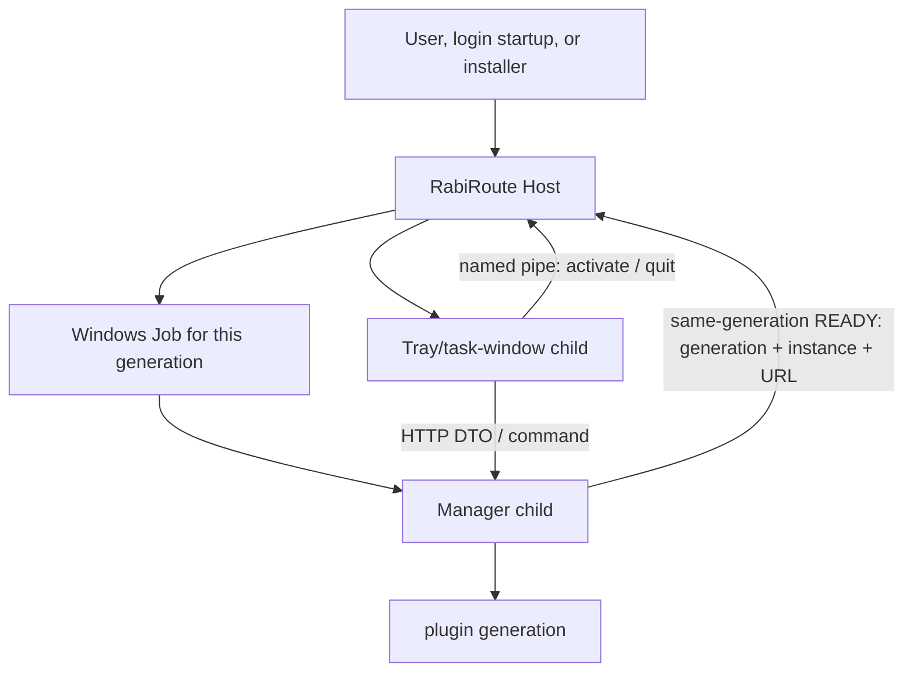

<!-- docs-language-switch -->
<div align="center">
English | <a href="./windows-launcher-and-packaging.md">简体中文</a>
</div>
<!-- /docs-language-switch -->

# Windows Desktop Launch and Packaging

The Windows package has one application-lifecycle entry: `RabiRouteHost.exe`. Manager owns business state and the tray/task window is presentation; both are same-generation children created by Host. The tray is neither a lifecycle owner nor a second desktop application.

## Lifecycle ownership

| Component | Owns | Does not own |
| --- | --- | --- |
| RabiRoute Host | Per-user singleton, application generation, child Job, startup order, bounded restart, local control commands | Routes, plugin business logic, WebGUI state, desktop presentation |
| Manager | HTTP API, business facts, plugin generation, persistence, Routes and Gateways | Windows application singleton, starting the tray, repairing the tray |
| Tray/task window | Render Manager DTOs, collect user actions, open the current WebGUI, request Host exit | Start or stop Manager, scan ports, write business files, remain resident alone |
| Manager plugin | Provide declared capabilities within a Manager generation | Own the Host/Manager/tray application lifecycle |



Host uses a per-user named Mutex for single instance and a per-user named pipe for `activate`, `status`, `restart`, and `quit`. A second launch activates the existing Host instead of creating another Manager or tray.

Manager also holds an operating-system named-pipe lease derived from the current user and product-install identity, preventing a legacy/manual entry from becoming a second state writer. Windows releases the lease with the process. `manager-instance.lock` is diagnostic metadata only; ownership no longer depends on whether a reusable PID happens to be alive, so power loss, Job termination, or PID reuse cannot permanently lock Manager out.

For every application generation, Host creates a new Windows Job. Manager and tray are created with `CREATE_SUSPENDED`, assigned to the Job, and then resumed, so closing Host or the Job cannot leave orphan children. Manager starts first. Host accepts only a structured READY carrying the expected `applicationGenerationId`, Manager PID, `managerInstanceId`, and loopback `baseUrl`; the tray starts only after that validation succeeds.

Each release still stores its manifest-validated Node.js copy at `versions/<releaseId>/node.exe`. Before Manager starts, Host verifies and synchronizes that file to the fixed install-root path `runtime/node.exe`; Manager, Routes, and workers all start through that path. An upgrade changes release content without changing the network-program path seen by Windows, so enabling LAN WebGUI or persona synchronization no longer causes a new firewall prompt for every `releaseId`. Host repairs `runtime/node.exe` when it differs from the active release copy. Uninstall removes it only when the hashes match and preserves every other file.

Host also provides Manager and Desktop with a read-only package root (`RABIROUTE_PACKAGE_ROOT`) and a stable writable state root (`RABIROUTE_STATE_ROOT`). Desktop loads code and icons from the package root, while screenshot images, region history, pin state, selected-text settings, and generated COM caches are written only under the installation root. Runtime data no longer enters `versions/<releaseId>`, so later Host status, restart, and upgrade operations can continue validating the active release against its manifest.

## Traceable design basis

This design borrows lifecycle invariants, not another project's process layout or ports:

- On Sunshine's current `master`, [`src/system_tray.cpp`](https://github.com/LizardByte/Sunshine/blob/master/src/system_tray.cpp) runs the tray as a managed thread inside the Sunshine process, and its quit callback calls [`lifetime::exit_sunshine`](https://github.com/LizardByte/Sunshine/blob/master/src/entry_handler.h). Tray actions therefore return to one application-exit boundary instead of creating an independently resident program.
- Sunshine's Windows [`tools/sunshinesvc.cpp`](https://github.com/LizardByte/Sunshine/blob/master/tools/sunshinesvc.cpp) places the child in a Job with `JOB_OBJECT_LIMIT_KILL_ON_JOB_CLOSE`, watches child exit, and on normal stop requests graceful termination for up to 20 seconds before force termination. RabiRoute retains the single owner, Job, unified quit/restart, and graceful-then-force invariants.
- RabiRoute Manager runs on Node.js, the tray runs on Python/Qt, and plugins need separate fault domains. RabiRoute therefore uses Host plus two same-generation children instead of putting the tray on a Manager thread. This intentional runtime difference does not dilute Host's sole lifecycle ownership.
- DSH informs only plugin scopes and dependency-aware unload: RabiRoute applies generations, `readyRequires`, process leases, and reverse-dependency release. A DSH-style in-process isolate is not treated as a security sandbox; RabiRoute `in_process` is a trusted extension and `isolated` is a separate fault domain, while OS permissions remain the actual security boundary.

Sunshine's fixed base-port convention is not one of the adopted invariants. RabiRoute does not write a fixed installation port; Host caches only the last successfully started port, while the current generation still binds, publishes, and validates it again.

## Dynamic Manager endpoint

On its first launch, Manager passes port `0` to the operating system and receives an available loopback port. Host then records the port only after the complete generation passes health admission. The next generation tries that port first. If it is occupied, blocked by browser Fetch, or the cache is invalid, Manager automatically asks the operating system for another safe port and Host replaces the cache after the new generation passes health admission. Normal restarts therefore retain the WebGUI address while port conflicts still self-recover.

The cache stores only a port, never a URL, `applicationGenerationId`, or `managerInstanceId`. Endpoint identity still consists of:

- `applicationGenerationId`: the generation created by Host;
- `managerInstanceId`: the Manager instance in that generation;
- `managerBaseUrl`: the generation's actual loopback URL;
- Manager PID: READY must come from the child Host just created.

Host status and the tray carry these fields. They are not guessed by scanning ports or reused across generations. The tray validates both generation and Manager instance through `/meta` and only presents Offline on failure. Host's independent health probe is the sole owner that rebuilds the complete generation after consecutive unreachable or identity-mismatch results.

Query the current state with:

```powershell
& "$env:LOCALAPPDATA\Programs\RabiRoute\RabiRouteHost.exe" --command status --json
```

Only the returned `managerBaseUrl` is the current WebGUI and local API address. **Open RabiRoute WebGUI** in the tray opens this Host-bound address.

## Start, restart, and quit

The installed Start-menu, desktop, and login-startup entries launch `RabiRouteHost.exe` directly. The source repository no longer provides a production-launch compatibility entry. Use `npm run dev` for source development or `npm run dev:hot` when WebGUI hot reload is needed. To validate a built Windows runtime, start only `RabiRouteHost.exe` from the local build or installation directory.

Ordinary code changes do not require rebuilding the compressed Setup/ZIP. Materialize the NAS source into a local development directory, install the locked dependencies there, and run:

```powershell
.\scripts\Publish-RabiRouteDeveloperCandidate.ps1 -SourceRoot C:\path\to\local\RabiRoute
```

The Developer Channel runs the incremental build locally, derives a manifest-identified candidate from the current immutable version, then uses the single Host for a fenced quit, an atomic `current.json` switch, and a complete new application generation. It verifies Host→Manager/Tray ownership plus the dynamic URL and `/meta` identity. A failed candidate restores the previous pointer and runtime automatically. It never runs code from NAS, starts Manager or Tray directly, or creates release archives. Changes to `package-lock.json`, the root Bootstrap, or dependency runtimes still require a full release. By default it rebuilds both the tray Desktop runtime and Host Core so a candidate cannot silently reuse stale binaries from its base. Pass `-RebuildDesktopRuntime:$false` or `-RebuildHostCore:$false` only when deliberately reusing the installed build.

```powershell
& "$env:LOCALAPPDATA\Programs\RabiRoute\RabiRouteHost.exe"
```

Restart the complete generation explicitly:

```powershell
& "$env:LOCALAPPDATA\Programs\RabiRoute\RabiRouteHost.exe" --command restart --json
```

**Exit RabiRoute** sends Host a local-control request fenced by the current `applicationGenerationId`. Host stops that generation and then exits; a stale tray cannot quit a newer application. Ordinary Manager HTTP APIs do not expose application start or shutdown commands.

If Manager or tray exits unexpectedly, Host closes the complete Job and creates a fresh generation with bounded backoff. Repeated failures open the restart circuit and leave evidence instead of causing infinite resurrection. The tray never remains alive and reconnects to an arbitrary port after Manager disappears.

## Running from source

Cross-platform and backend development can still run Manager alone:

```powershell
npm install
npm run build
npm run start:manager
```

This is a development entry, not the packaged Windows lifecycle. Manager prints the operating-system-assigned URL to stdout; source-mode callers use that explicit URL. There is no product-level fixed-port discovery contract.

## Dynamic LAN discovery

Manager publishes the standard DNS-SD service `_rabiroute._tcp.local.` only when the user enables WebGUI LAN access and Manager actually listens on the LAN. The SRV record carries the operating-system-assigned port for the current generation. TXT contains only the protocol version, the `/.well-known/rabiroute-manager` path, `applicationGenerationId`, and `managerInstanceId`; it never publishes the WebGUI credential, Host control token, or private paths.

The Android SDK's parameterless `scanLan()` consumes that service, reads the well-known identity document from the resolved host and port, and returns the complete dynamic Manager URL. Missing protocol data, identity mismatch, resolution failure, and timeout are explicit failures or empty discovery results; there is no fallback scan of `8790..8799`. Discovery locates and fences identity only. Other Manager APIs remain protected by the WebGUI LAN authorization policy.

## Build

Build Windows artifacts on a local disk. NAS storage may hold source, but not application execution, intermediate build output, or runtime logs.

```powershell
powershell -ExecutionPolicy Bypass -File .\scripts\build-windows-release.ps1 `
  -OutputRoot C:\RabiRouteBuild
```

The release contains:

- a self-contained, single-file .NET 9 `RabiRouteHost.exe`;
- the `dist/` Manager, RibiWebGUI, and 29 built-in plugin packages;
- a local Node.js runtime and production dependencies;
- the presentation-only PySide6/Qt Desktop under `desktop-runtime/`;
- default configuration and public assets.

`RabiRouteHost.exe` is the only target for Start-menu, desktop, login-startup, and uninstall-stop flows. Before upgrade, the installer stops the active generation through Host control and removes retired parallel lifecycle and startup artifacts. No side path remains able to resurrect the old architecture.

The portable ZIP supports extraction to a new empty folder only; it is not an in-place upgrade medium. A ZIP cannot remove surplus executables, watchers, scheduled tasks, or sign-in entries from an old directory, so an existing installation must be upgraded by Setup's fail-closed stop and migration flow. As a final composition-root gate, Host checks both the active version package root and the state/install root for exact retired Desktop, Tray, and watcher files before creating Manager or the tray. Any match returns `legacy_overlay_blocked`, deletes nothing, and directs the user to a clean folder or Setup. Similarly suffixed backup files do not match, and a clean Setup installation is not blocked.

## Logs and acceptance

Host writes:

```text
%LOCALAPPDATA%\RabiRoute\diagnostics\host\host-YYYYMMDD.log
```

Desktop keeps one crash-evidence bundle per launch; Manager, plugins, and Routes keep their own sources of truth. Acceptance must cover at least:

1. repeated launches leave one Host and one Manager/tray generation;
2. occupying a familiar local port does not prevent a new dynamic endpoint;
3. the tray appears only after exact Manager READY validation;
4. terminating Manager or tray ends the old generation and creates exactly one replacement;
5. quit leaves no Host, Manager, tray, or leased plugin process, and nothing resurrects;
6. `--command status --json` matches Manager `/meta` generation, instance, and URL;
7. retired lifecycle entries, fixed-port defaults, and Manager HTTP application-start/stop routes are absent from the production path and package.
8. Manager and its Node.js children execute through `<install-root>/runtime/node.exe`; an upgrade does not fall back to `versions/<releaseId>/node.exe`.
