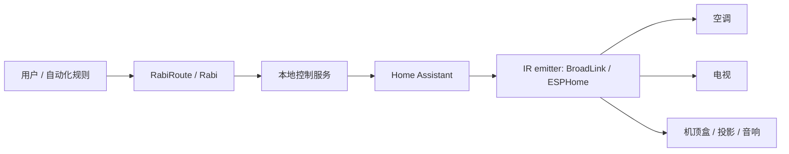
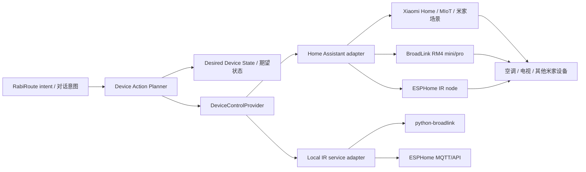

# 电脑/脚本可控红外遥控设备调研

调研日期：2026-06-06
目标：为 RabiRoute/Rabi 后续控制家里的空调、电视等红外设备，选择在中国容易购买、并且能被电脑或本地服务稳定调用的红外网关/万能遥控器。

## 结论摘要

首选买 BroadLink RM4 mini。它不是最“开放”的硬件，但目前综合最稳：淘宝/京东常见，Home Assistant 原生支持，`python-broadlink` 支持 RM4 系列，本地局域网调用资料多，能学习并发送红外码。只要目标是“现在买来接 RabiRoute”，BroadLink 是最低折腾成本方案。

第二选择是 ESPHome/ESP32 + IR LED/接收头。它最适合开发者和长期可控性：完全本地、可维护、可把红外能力做成 Home Assistant 实体或 HTTP/MQTT 服务。但它需要焊接/杜邦线/供电/外壳/红外角度调试，对“今天下单明天接入”不如 BroadLink。

小米/米家万能遥控器只建议在已经有米家生态、且能确认具体型号支持 `xiaomi_miio`/`python-miio` 的情况下购买。涂鸦/Tuya 红外遥控器不建议作为 RabiRoute 的第一选择，因为官方 Home Assistant Tuya 集成不支持 `remote` 平台，常见方案依赖云、App 场景或 Google Assistant 绕路，本地稳定调用风险高。

## 推荐排序

| 排名 | 方案 | 推荐程度 | 适合场景 | 主要风险 |
|---|---:|---|---|---|
| 1 | BroadLink RM4 mini | 强烈推荐 | 只需要红外；空调、电视、机顶盒、音响等 | 首次配网需要 BroadLink App；需要确认关闭设备锁/允许局域网访问；空调状态需要自己建模 |
| 2 | BroadLink RM4 Pro | 推荐 | 除红外外还可能要 315/433 MHz RF，例如部分风扇、窗帘、射频开关 | 比 mini 贵；RF 学习比 IR 更挑设备；如果只控空调电视则 Pro 可能浪费 |
| 3 | ESPHome/ESP32 + IR 发射/接收 | 推荐给开发者 | 想完全本地、可编程、可长期维护；愿意折腾硬件 | 需要硬件搭建、红外发射功率/角度调试、外壳和供电处理 |
| 4 | 小米/米家万能遥控器 | 有条件可选 | 已有米家、能接受 token/账号/区域问题 | 型号差异、接入文档和兼容性不如 BroadLink 明确 |
| 5 | Tuya/涂鸦红外遥控器 | 不建议首选 | 只想用手机 App 或已有涂鸦场景 | 本地控制弱，HA remote 支持差，容易变成云 API/场景绕路 |
| 6 | USB 红外发射器/LIRC | 不建议首选 | 固定一台 Linux 主机旁边控制设备，喜欢底层折腾 | 中国购买型号杂、驱动和学习流程碎片化、部署位置受 USB 线限制 |

## 1. BroadLink RM4 mini / RM4 Pro

### 适合度

适合。BroadLink 是目前“现成红外网关 + 本地控制 + Home Assistant + Python 资料”组合里最均衡的选择。

Home Assistant 官方 BroadLink 集成明确支持 `RM4 mini`、`RM4 pro`、`RM4C mini`、`RM4C pro` 等万能遥控器，并能自动发现设备。官方文档说明：BroadLink 的 `remote` 实体可以用 `remote.learn_command` 学习 IR/RF 码，再用 `remote.send_command` 发送；学到的码也会保存在 `/config/.storage/` 下，后续可作为 base64 码调用。来源：[Home Assistant Broadlink integration](https://www.home-assistant.io/integrations/broadlink/)。

`python-broadlink` 也支持 BroadLink RM 系列，包括 RM4 mini、RM4 pro、RM4C mini、RM4S、RM4 TV mate 等，并提供 `enter_learning()`、`check_data()`、`send_data()` 等能力。来源：[python-broadlink GitHub](https://github.com/mjg59/python-broadlink)，以及 [python-broadlink device compatibility](https://deepwiki.com/mjg59/python-broadlink/1.2-device-compatibility)。

### 本地 API / 是否需要云

推荐接入方式是：

1. 用 BroadLink App 做首次配网。
2. 确保设备在 2.4 GHz Wi-Fi，且 Home Assistant/RabiRoute 所在机器和 RM4 在同一局域网。
3. 在 App 中检查是否有“锁定设备/Lock device”一类设置；如开启会影响局域网控制。
4. 后续控制走 Home Assistant BroadLink 集成或 `python-broadlink` 局域网调用，不把云作为主路径。

不确定项：BroadLink App、固件和地区版本可能改变默认设备锁策略；购买到不同批次/OEM 版本时，需要实测是否可被 HA 自动发现、是否可被 `python-broadlink` discovery 找到。

### 红外学习与空调/电视

电视、机顶盒、投影、音响这类“每个按键一个码”的设备最简单。空调更复杂：很多空调遥控器不是“温度+1”这种简单码，而是每次发出“完整状态帧”，包含开关、模式、温度、风速、扫风等。因此空调接入有两种路线：

1. 最快路线：只学习常用状态，例如开机制冷 26 度、关机、制热 24 度、风速自动。
2. 完整路线：用 Home Assistant 的 SmartIR/红外空调码库，或为每个状态组合建立命令表。

Home Assistant BroadLink 文档支持发送命令序列、重复发送、base64 码，这对电视音量、空调复合操作都足够。来源：[Home Assistant Broadlink integration](https://www.home-assistant.io/integrations/broadlink/)。

### RM4 mini 还是 RM4 Pro

买 RM4 mini：如果目标只是空调、电视、机顶盒、音响等 IR 设备。
买 RM4 Pro：如果还想碰 315/433 MHz RF，例如部分射频风扇、窗帘、开关。Home Assistant 文档说明 RM pro/RM4 pro 会创建 RF 相关实体，支持 433 MHz 和 315 MHz 范围；mini 是 IR-only。来源：[Home Assistant Broadlink integration](https://www.home-assistant.io/integrations/broadlink/)。

## 2. 小米/米家万能遥控器

### 适合度

有条件可选，但不建议作为第一购买方案。主要原因不是不能接，而是型号、token、米家区域、账号/云凭据、集成新旧路径都容易让后续维护变麻烦。

Home Assistant 的 Xiaomi Home / `xiaomi_miio` 文档列出支持 Xiaomi IR Remote，但也说明小米红外遥控器不像多数小米设备那样完全 UI 配置，需要看对应章节；设备需要先用 Mi Home App 设置，部分配置推荐提供 Xiaomi Home 凭据。来源：[Home Assistant Xiaomi Home / xiaomi_miio](https://www.home-assistant.io/integrations/xiaomi_miio/)。

`python-miio` 文档中有 `ChuangmiIr` 类，支持 `learn()`、`play()`、`play_pronto()`、`play_raw()` 等方法，说明在技术上有本地调用路径。来源：[python-miio ChuangmiIr latest docs](https://python-miio.readthedocs.io/en/latest/api/miio.integrations.chuangmi.remote.html) 和 [python-miio ChuangmiIr stable docs](https://python-miio.readthedocs.io/en/stable/api/miio.chuangmi_ir.html)。

### 主要问题

1. 需要拿到设备 token，且 token 获取方式会随米家 App/账号/地区变化。
2. 具体商品名可能混乱：米家万能遥控器、创米小白万能遥控器、带红外的小爱音箱/网关等，不一定都等价。
3. Home Assistant 里小米集成有 legacy/新 Xiaomi Home 命名变化，购买前要确认型号，例如 `chuangmi.ir.v2`、`chuangmi.remote.*` 这一类是否仍被当前集成支持。
4. 如果目标是“RabiRoute 稳定本地调用”，它的资料密度和社区故障样本不如 BroadLink。

### 购买建议

只有在能明确确认以下信息时才买：

1. 商品详情或买家评论能确认具体 model。
2. Home Assistant 或 `python-miio` 对该 model 有成功案例。
3. 能接受获取 token、锁定 IP、米家区域等初始化步骤。
4. 不依赖“只能在米家 App 里点”的自动化。

## 3. Tuya/涂鸦红外遥控器

### 适合度

不建议作为 RabiRoute 的首选红外网关。Tuya/涂鸦红外遥控器在淘宝/京东非常常见、价格低，但“手机 App 能用”和“电脑本地稳定调用”是两件事。

Home Assistant 官方 Tuya 集成说明：支持 Powered by Tuya 设备，但“除 lock 和 remote 平台外”支持所有 HA 平台。这意味着对红外遥控器这类 `remote` 设备并不理想。来源：[Home Assistant Tuya integration](https://www.home-assistant.io/integrations/tuya/)。

Home Assistant 社区多次讨论 Tuya IR：官方 Tuya 集成常只能看到开关/场景，IR 子设备不一定作为遥控器出现；一个社区指南明确把 Tuya IR 空调控制称为 Tuya + Google Assistant 的多云 workaround，并说明不是本地控制。来源：[Integration with IR Tuya](https://community.home-assistant.io/t/integration-with-ir-tuya/185893) 和 [How to control dumb AC via Tuya IR/RF Remote from HA](https://community.home-assistant.io/t/how-to-control-dumb-ac-air-conditioner-and-fans-via-tuya-ir-rf-remote-from-ha/597119)。

### 可行但不推荐的路线

1. Tuya App 内学习遥控器。
2. App 内创建场景。
3. Home Assistant Tuya 集成同步场景。
4. RabiRoute 调 HA 的 `scene.turn_on`。

这个路线的问题是：依赖 Tuya 云、账号登录、App 场景同步，状态不可控，调试路径长。对于“开电视电源”或许能用；对于空调温度/模式/风速完整控制，不适合作为核心方案。

### 何时可以买

只有在以下条件成立时才考虑：

1. 已经有涂鸦生态，并且只需要触发少量场景。
2. 接受云依赖。
3. 设备失败时可手动兜底，不把它作为 RabiRoute 的关键能力。

## 4. ESPHome / ESP32 + IR LED 自制方案

### 适合度

适合开发者，长期上限最高。ESPHome 的 `remote_transmitter` 支持发送红外或 433 MHz RF 等常见遥控信号，文档建议 ESP32 效果最好，因为多数 ESP32 有 RMT 硬件外设，信号时序更准。来源：[ESPHome Remote Transmitter](https://esphome.io/components/remote_transmitter/)。

ESPHome 也有 `remote_receiver`，可以接红外接收头，dump 常见编码或 raw/pronto 数据，用来学习原遥控器。来源：[ESPHome Remote Receiver](https://esphome.io/components/remote_receiver/)。

Home Assistant 在 2026 年新增/推进了 `infrared` entity platform，目标是让 ESPHome、BroadLink 等 emitter 和 LG/Samsung/Daikin 等 consumer 解耦。这对长期架构是利好：未来 RabiRoute 可以更多地面向 HA 的统一 infrared/remote 服务，而不是每种硬件写一套。来源：[Home Assistant developer blog: New infrared entity platform](https://developers.home-assistant.io/blog/2026/03/30/infrared-entity-platform/)。

### 硬件折腾程度

最小 BOM：

1. ESP32 开发板。
2. 940nm 红外 LED，建议多颗或大功率发射头。
3. NPN 三极管/MOSFET 驱动，避免直接用 GPIO 硬推 LED。
4. 限流电阻。
5. 可选：38kHz 红外接收头，用于学习遥控码。
6. 外壳、USB 供电、固定位置。

如果目标是“长期作为 Rabi 的本地红外控制基建”，可以做；如果只是先让空调电视能被脚本控制，BroadLink 更省时间。

### 接入方式

1. ESPHome 直接接 Home Assistant：RabiRoute 调 HA service。
2. ESPHome 暴露 API/MQTT：RabiRoute 直接发 MQTT/HTTP，再由 ESP32 发 IR。
3. 自己写 ESP32 固件：可控性最高，但维护成本也最高。

## 5. USB 红外发射器 / LIRC

### 适合度

技术上可行，但不建议作为首选采购。USB 红外设备把红外发射器绑在某台电脑/树莓派上，部署位置受限；在 Windows/Linux 驱动、LIRC 配置、红外学习、设备型号差异上也更碎。

LIRC 文档说明 `lircd` 可以通过 socket 接收命令，`SEND_ONCE <remote> <button>` 可发送已配置的红外按键。来源：[LIRC lircd docs](https://www.lirc.org/html/lircd.html)。但 Home Assistant 官方的 LIRC 集成页面现在指向“Removed integration”，这说明它不适合作为 HA 主路径；如果坚持 USB/LIRC，通常应把它当成独立 Linux 服务，再由 HA/RabiRoute 通过 `shell_command`、HTTP 包装或 MQTT 调用。来源：[Home Assistant removed integration page for LIRC URL](https://www.home-assistant.io/integrations/lirc/)。

可买到的典型方向包括 Irdroid USB IR Transceiver、USB IR Toy 等，资料显示它们支持 WinLIRC/LIRC 或收发红外。来源：[Irdroid USB IR Transceiver](https://irdroid.com/irdroid-usb-ir-transceiver/) 和 [USB IR Toy v2](https://anibit.com/product/ptt08001)。

### 为什么不首选

1. 中国电商平台上同名“USB 红外”很多只是接收器，不一定能发射。
2. 很多是给电脑遥控/Kodi/HTPC 用，不是给智能家居发射用。
3. 电脑位置不一定正对空调/电视，红外角度和距离麻烦。
4. LIRC 虽强，但配置和调试成本明显高于 BroadLink/ESPHome。

## 购买关键词

### BroadLink

优先搜：

1. `BroadLink RM4 mini`
2. `博联 RM4 mini`
3. `BroadLink RM4 Pro`
4. `博联 RM4 Pro`
5. `BroadLink 万能遥控器 Home Assistant`
6. `RM4 mini 红外 学习`

筛选标准：

1. 明确写 RM4 mini / RM4 Pro，不要只写“万能遥控器”。
2. 支持 2.4 GHz Wi-Fi。
3. 支持红外学习；RM4 Pro 额外确认 RF 315/433 MHz。
4. 买家评价或详情里出现 Home Assistant、HA、Node-RED、Python、局域网、本地控制等关键词更好。
5. 能退换货，避免买到不可被本地库识别的 OEM 批次。

### ESPHome 自制

优先搜：

1. `ESP32 开发板`
2. `ESP32-C3 开发板`（可用，但优先常规 ESP32/ESP32-S3）
3. `940nm 红外发射管`
4. `红外发射模块 ESP32`
5. `VS1838B 红外接收头`
6. `ESPHome 红外 发射`

筛选标准：

1. 优先 ESP32，不要优先 ESP8266。
2. 红外发射模块最好带三极管驱动。
3. 如果要学习码，买红外接收头。
4. 预留 2-3 个 GPIO 和稳定 5V/USB 供电。

### 小米/米家

优先搜：

1. `米家 万能遥控器`
2. `小米 万能遥控器 Home Assistant`
3. `chuangmi IR remote`
4. `米家 红外遥控器 token`

筛选标准：

1. 能确认 model。
2. 有 HA/`python-miio` 成功案例。
3. 不要买“只能语音/只能 App 场景”的红外音箱类设备，除非已确认可本地调用。

### Tuya/涂鸦

如果仍要尝试，搜：

1. `涂鸦 红外遥控器`
2. `Tuya IR blaster`
3. `Smart Life IR remote`
4. `Tuya IR Home Assistant`

筛选标准：

1. 明确知道自己接受云依赖。
2. 能创建 App 场景并被 HA 同步。
3. 不把“支持小爱/天猫精灵/手机 App”当成本地 API 能力。

## 避坑清单

1. 避开只写“支持手机 App 控制”的产品；这不能说明电脑可控。
2. 避开只支持 5 GHz Wi-Fi 或没有明确 2.4 GHz 的红外网关。
3. 避开资料少、没有 Home Assistant/Python/Node-RED/MQTT 成功案例的型号。
4. 空调码要特别小心：空调通常需要完整状态码，不是简单按键码。
5. 不要把“云码库支持 50000+ 设备”理解成“本地 API 可以调用云码库”。本地接入最好依赖自己学习出的码或开源码库。
6. RM4 mini 只能红外；需要 RF 时买 RM4 Pro。
7. 涂鸦红外便宜但不等于适合开发，尤其不要买来作为 RabiRoute 的第一块红外基建。
8. USB 红外要确认“能发射”，很多便宜 USB 红外其实只是接收器。
9. 红外必须考虑摆放：发射器要能照到设备接收窗，柜门/墙角/强阳光都会影响成功率。
10. 给红外网关固定 DHCP IP，避免重启路由后脚本找不到设备。

## 推荐购买组合

### 组合 A：最快可用

购买：1 个 BroadLink RM4 mini。
适合：客厅或卧室一组红外设备，例如空调 + 电视 + 机顶盒。
接入：Home Assistant BroadLink 集成；RabiRoute 调 Home Assistant REST/WebSocket service。

这是最推荐的第一单。

### 组合 B：客厅增强版

购买：1 个 BroadLink RM4 Pro。
适合：除了空调电视，还可能有 RF 风扇、窗帘、射频灯控。
接入：同上，但 RF 码学习需要实测。

### 组合 C：开发者长期方案

购买：ESP32 + IR 发射模块 + IR 接收头。
适合：后续 Rabi 想沉淀自己的硬件控制节点，或需要完全离线。
接入：ESPHome -> Home Assistant，或 ESPHome MQTT/API -> RabiRoute。

## 后续接入架构

推荐先走 Home Assistant，避免 RabiRoute 直接承担每种硬件协议。



### MVP 路线

1. 购买 BroadLink RM4 mini。
2. 用 BroadLink App 首次配网。
3. 在路由器固定 IP。
4. Home Assistant 添加 BroadLink 集成。
5. 学习基础命令：
   - TV: power, volume_up, volume_down, mute, source。
   - AC: off, cool_26_auto, heat_24_auto, dry_26_auto。
6. 在 HA 中封装 scripts，例如：
   - `script.living_room_tv_power`
   - `script.living_room_ac_cool_26`
   - `script.living_room_ac_off`
7. RabiRoute 只调用 HA script，不直接处理 base64 红外码。

### 为什么建议中间层用 Home Assistant

1. HA 已有 BroadLink/ESPHome 集成，减少 RabiRoute 自己适配硬件协议。
2. HA 有 UI 可学习/测试命令，调试比纯脚本快。
3. HA 可以保存红外码、重命名实体、封装脚本和场景。
4. 以后换 BroadLink 为 ESPHome，自上层看仍然是调用 HA service。
5. 未来 HA 的 `infrared` entity platform 可能让不同发射器进一步统一。

### RabiRoute 调用示例

建议在 RabiRoute 中抽象一个 `DeviceControlProvider`：

```text
RabiRoute intent:
  "把客厅空调开到 26 度制冷"

Normalized command:
  {
    "area": "living_room",
    "device": "air_conditioner",
    "action": "set_preset",
    "preset": "cool_26_auto"
  }

Provider call:
  POST /api/services/script/living_room_ac_cool_26
```

红外设备没有可靠状态回读，所以 RabiRoute/HA 里应维护“期望状态”，并允许用户说“再发一次”“关掉空调”。

## 不确定项

1. 中国电商平台上的 BroadLink 是否均为同一地区/固件批次，需要购买后用 HA discovery 和 `python-broadlink` 实测。
2. 小米/米家万能遥控器具体可控性高度依赖 model、token 获取方式、米家区域和 HA 当前集成状态；购买前必须核对型号。
3. Tuya/涂鸦红外遥控器是否能被 HA 以场景形式触发，取决于 App、云端、设备类别和账号绑定状态；不能假设本地可控。
4. 空调完整控制需要码库或大量学习；只学习几个常用 preset 更现实。
5. RF 设备比 IR 更容易有滚动码/频段/协议问题，RM4 Pro 的 RF 支持不等于能控制所有射频遥控设备。

## 最终建议

现在要买来接 RabiRoute：买 `BroadLink RM4 mini`。如果明确有 RF 需求，再买 `BroadLink RM4 Pro`。

不要把 Tuya/涂鸦红外作为第一方案；它适合手机 App 场景，不适合作为本地自动化核心。小米方案排在 BroadLink 之后，除非已经确认具体型号和 token 接入路径。ESPHome 自制方案值得作为第二阶段长期可控硬件节点推进。

## RabiRoute 需要落地的技术路线

这里的核心不是“选一个万能遥控器”，而是给 RabiRoute 做一个稳定的设备控制出口。推荐路线是：RabiRoute 不直接绑定小米、BroadLink、Tuya 或 ESPHome，而是先定义统一的设备控制模型，再通过一个本地 control service 或 Home Assistant adapter 转成具体硬件命令。

### 总体路线



### 第一阶段：RabiRoute 先接 Home Assistant

第一阶段目标：让 RabiRoute 能稳定触发“设备动作”，不急着自己实现所有硬件协议。

RabiRoute 侧需要做：

1. 增加 `DeviceControlProvider` 抽象。
2. 增加 `HomeAssistantProvider` 实现。
3. 支持通过 Home Assistant REST API 调用 `script.turn_on`、`scene.turn_on`、`remote.send_command`。
4. 增加配置文件，维护 RabiRoute 动作到 HA entity/service 的映射。
5. 增加失败重试、超时、错误上报。
6. 对红外设备维护“期望状态”，不要假设红外设备能回读真实状态。

Home Assistant 侧需要做：

1. 接入 Xiaomi Home / Xiaomi MIoT，用于复用现有小米音箱、米家设备、米家场景。
2. 接入 BroadLink 或 ESPHome，用于更稳定的红外发射。
3. 把常用动作封装成 HA scripts/scenes。
4. 统一命名，例如：
   - `script.living_room_ac_cool_26`
   - `script.living_room_ac_off`
   - `script.living_room_tv_power`
   - `scene.living_room_movie_mode`

RabiRoute 配置示例：

```json
{
  "providers": {
    "home_assistant": {
      "base_url": "http://homeassistant.local:8123",
      "token_env": "HOME_ASSISTANT_TOKEN",
      "timeout_ms": 5000
    }
  },
  "device_actions": {
    "living_room.air_conditioner.cool_26": {
      "provider": "home_assistant",
      "service": "script.turn_on",
      "target": {
        "entity_id": "script.living_room_ac_cool_26"
      }
    },
    "living_room.air_conditioner.off": {
      "provider": "home_assistant",
      "service": "script.turn_on",
      "target": {
        "entity_id": "script.living_room_ac_off"
      }
    },
    "living_room.tv.power": {
      "provider": "home_assistant",
      "service": "script.turn_on",
      "target": {
        "entity_id": "script.living_room_tv_power"
      }
    }
  }
}
```

RabiRoute 调用 HA 的 HTTP 形态：

```http
POST /api/services/script/turn_on HTTP/1.1
Host: homeassistant.local:8123
Authorization: Bearer ${HOME_ASSISTANT_TOKEN}
Content-Type: application/json

{
  "entity_id": "script.living_room_ac_cool_26"
}
```

### 第二阶段：小米音箱只作为可选入口或临时出口

如果你已经有小米音箱，可以利用它，但不要让 RabiRoute 的核心控制链路强依赖“小爱音箱内部玩法”。

推荐用法：

```text
RabiRoute -> Home Assistant -> Xiaomi Home / MIoT -> 米家场景 -> 小米音箱/米家红外/米家设备
```

适合先做的动作：

1. 在米家 App 里确认小米音箱或米家红外能控制空调/电视。
2. 把常用控制做成米家场景，例如“客厅空调制冷 26 度”“关闭客厅电视”。
3. 在 Home Assistant 里看这些场景是否能被同步或通过 Xiaomi MIoT 暴露。
4. RabiRoute 调 HA 场景，而不是直接调小爱音箱。

不推荐作为主线的方式：

```text
RabiRoute -> xiaogpt/open-xiaoai/MiGPT 类项目 -> 小爱音箱 -> 红外控制
```

原因：

1. 这类项目主要解决“小爱接大模型/对话入口”，不是稳定设备控制出口。
2. 小爱音箱是否能代发红外命令依赖型号、账号、云端、固件和米家场景。
3. 出错时很难判断是 RabiRoute、开源项目、小米云、音箱固件还是红外码的问题。
4. 不利于以后换成 BroadLink 或 ESPHome。

### 第三阶段：增加 Local IR Service

当 RabiRoute 的设备控制模型稳定后，可以增加一个独立本地红外服务。它用于绕过 HA，直接控制 BroadLink 或 ESPHome。

适合这样做的情况：

1. 想减少对 Home Assistant 的运行依赖。
2. 想把 RabiRoute 部署成更完整的家庭中控。
3. 想对红外命令做更细的日志、重试、节流、状态建模。

服务边界：

```text
RabiRoute -> Local IR Service -> BroadLink / ESPHome -> IR device
```

Local IR Service 建议提供 HTTP API：

```http
POST /v1/device-actions/execute
Content-Type: application/json

{
  "area": "living_room",
  "device": "air_conditioner",
  "action": "set_preset",
  "preset": "cool_26_auto",
  "request_id": "rabiroute-20260606-001"
}
```

返回：

```json
{
  "ok": true,
  "provider": "broadlink",
  "command_id": "living_room.ac.cool_26_auto",
  "sent_at": "2026-06-06T01:50:00+08:00",
  "state_confidence": "desired_only"
}
```

Local IR Service 内部配置：

```json
{
  "emitters": {
    "living_room_broadlink": {
      "type": "broadlink",
      "host": "192.168.1.50",
      "mac": "aa:bb:cc:dd:ee:ff"
    }
  },
  "commands": {
    "living_room.ac.cool_26_auto": {
      "emitter": "living_room_broadlink",
      "encoding": "base64",
      "payload": "JgBQAAABK..."
    },
    "living_room.tv.power": {
      "emitter": "living_room_broadlink",
      "encoding": "base64",
      "payload": "JgBYAAABJ..."
    }
  }
}
```

### RabiRoute 内部建议抽象

RabiRoute 不应该把“空调制冷 26 度”硬编码成某个 HA entity 或某段红外 base64。建议拆成四层：

1. `Intent Parser`：从用户话语得到标准动作。
2. `Device Registry`：知道家里有哪些区域、设备、能力。
3. `Action Planner`：把标准动作映射到一个或多个可执行 action。
4. `Provider Adapter`：调用 HA、Local IR Service、MIoT 或其他后端。

标准动作示例：

```json
{
  "area": "living_room",
  "device_type": "air_conditioner",
  "device_id": "living_room_ac",
  "capability": "climate",
  "action": "set_hvac_preset",
  "params": {
    "mode": "cool",
    "temperature": 26,
    "fan": "auto"
  }
}
```

Provider 解析后的执行动作：

```json
{
  "provider": "home_assistant",
  "service": "script.turn_on",
  "target": {
    "entity_id": "script.living_room_ac_cool_26"
  }
}
```

### 状态模型

红外设备通常没有状态回读，所以 RabiRoute 需要把状态分成三种：

1. `observed`：能从设备或 HA 实体读到的真实状态。
2. `desired`：RabiRoute/HA 最近一次发出的期望状态。
3. `unknown`：设备可能被原遥控器或手动按钮改过，当前状态不可信。

空调这类红外设备建议默认使用 `desired_only`：

```json
{
  "device_id": "living_room_ac",
  "power": "on",
  "mode": "cool",
  "temperature": 26,
  "fan": "auto",
  "confidence": "desired_only",
  "updated_by": "rabiroute",
  "updated_at": "2026-06-06T01:50:00+08:00"
}
```

RabiRoute 对用户表达时也要保守，例如“我已经发送了客厅空调制冷 26 度的指令”，不要说“客厅空调现在是 26 度”，除非有真实状态回读。

### 实施顺序

1. 先在 Home Assistant 中打通一个动作：`script.living_room_ac_cool_26`。
2. 在 RabiRoute 里实现 `HomeAssistantProvider.callService()`。
3. 给 RabiRoute 加一个最小 `device-actions.json` 映射。
4. 从对话里触发固定动作：“打开客厅空调制冷 26 度”。
5. 增加日志：记录 request、provider、entity、响应、耗时、错误。
6. 增加状态表：只保存期望状态。
7. 再扩展电视、关空调、电影模式等动作。
8. 最后再考虑 Local IR Service，把 HA 作为可替换 provider。

### 推荐技术决策

第一版技术路线定为：

```text
RabiRoute -> HomeAssistantProvider -> HA script/scene -> Xiaomi/BroadLink/ESPHome -> 家电
```

第二版再补：

```text
RabiRoute -> LocalIRProvider -> Local IR Service -> BroadLink/ESPHome -> 家电
```

小米音箱路线只作为：

```text
RabiRoute -> HA -> 米家场景 -> 小米音箱/米家红外
```

不要把 `open-xiaoai`、`mi-gpt`、`xiaogpt` 作为设备控制主干。它们可以以后作为“小爱音箱输入入口”研究，但不应该承担红外执行出口。
