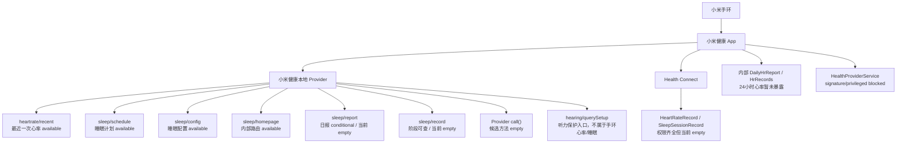

# Rabi 手环探针

这是一个 Android / ADB 测试探针，用来验证手机能从小米手环 10 Pro / 小米运动健康链路读取多少信息。

## 测试内容

- BLE 广播：设备名、信号强度、服务 UUID、厂商广播数据。
- 标准设备信息服务 `0x180A`。
- 标准电量服务 `0x180F`。
- 小米运动健康本地 Provider 的最近一次真实心率。
- Android Health Connect 后台读取心率、睡眠、步数。
- 小米健康云官方 SDK 列表探针：有合作方 `app_id` 和 OAuth `access_token` 时，按 `DataSource -> DataSet` 分页拉取心率样本列表。

普通第三方 APK 读取 `com.mi.health.provider.main` 会被小米健康权限拒绝；开发期可通过 `adb shell content query` 以 `com.android.shell` 权限读取。

## APK 内拉取心率列表的可行路线

已接入小米健康云官方 SDK：`app/libs/android-fit-20150719.jar`。

APK 新增 OAuth Activity：

```text
com.rabiroute.bandprobe/.MiHealthOAuthActivity
```

它负责打开小米账号授权页，接收 `rabiroute-bandprobe://oauth/xiaomi#access_token=...` 回调，把 token 保存到 APK 私有 `SharedPreferences`，然后自动触发心率列表拉取。

APK 主界面也有三个按钮：

- `小米云授权`：打开 OAuth Activity。
- `拉取心率列表`：使用已保存 token 触发云端心率列表拉取；完成后会自动保存 ZIP 到下载目录。
- `全类型深扫`：使用已保存 token 扫描 SDK 暴露的所有官方 data type，默认最近 168 小时、按 24 小时分片、每页 1000 条、最多 50 页；用于排查心率是否挂在非默认类型或其它数据源下，完成后会自动保存 ZIP 到下载目录。
- `查看云结果`：显示最近一次云端列表探针保存到 APK 内部的结果摘要。
- `复制云MD`：把最近一次拉取到的完整 Markdown 心率列表复制到剪贴板。
- `分享云MD` / `分享云JSON`：通过系统分享面板发出完整结果，不依赖 ADB。
- `分享云ZIP`：通过系统分享面板发出最近一次自动保存或手动保存的 ZIP。
- `保存云文件`：Android 10+ 会写入 `Download/RabiRouteBandProbe/`，生成完整 Markdown、JSON，以及 `raw/` 下的原始 HTTP 响应文件。
- `保存云ZIP`：把 Markdown、JSON、raw HTTP 响应打包成一个 `mi-health-cloud-*.zip`，方便一次性分享。

OAuth 页面可以直接设置：

- `access_token`：可以通过授权回调自动保存，也可以手动粘贴后点 `保存当前 token`
- `data_types`，默认同时探测 `com.xiaomi.micloud.fit.heart_rate.bpm` 和 `com.xiaomi.micloud.fit.heart_rate.summary`
- `data_types=__all_sdk__`：探测 SDK 暴露的所有官方数据类型，用来排查数据是否挂在别的类型下面
- 最近多少小时，默认 `24`
- 分片小时，默认 `0` 不分片；填 `24` 表示按天切片拉取，每片内部继续分页
- 每页条数，默认 `500`
- 最大页数，默认 `20`

每次云拉取成功后，APK 会在私有目录保存两份完整结果：

```text
/data/data/com.rabiroute.bandprobe/files/mi-health-heart-rate-last.json
/data/data/com.rabiroute.bandprobe/files/mi-health-heart-rate-last.md
/data/data/com.rabiroute.bandprobe/files/mi-health-cloud-raw/*.json
```

结果摘要会同时显示总样本数、去重后样本数和疑似重复样本数。去重键基于 `dataType/sourceId/startTimeNanos/endTimeNanos/value`，用于排查分片边界或多路径拉取造成的重复。

即使 token 缺失、scope 不对、没有数据源或样本数为 0，APK 也会生成诊断 JSON/Markdown，里面包含：

- `status`
- 每个 `dataType` 的 `getDataSourceByType` 响应码、成功状态和数据源数量
- 等效 SDK endpoint：`/fitness/v1/users/me/dataSources`、`/fitness/v1/users/me/dataSources/{sourceId}/datasets/{startNs-endNs}`
- 每页 `limit/pageToken/nextPageToken` 是否存在、该页样本数、DataSet 顶层 key
- 原始 HTTP 探针：`dataSources` 和每页 `datasets` 都会记录 HTTP 状态码、响应长度、JSON 顶层 key、最多 2000 字符响应预览；URL 中 token/clientId 会脱敏
- `getDataSet` 分页错误
- 已成功返回的完整 `points`

手机独立测试流程：

1. 安装最新 `app-debug.apk`。
2. 打开 `Rabi 手环探针`。
3. 看首页标题下方的 `构建时间`，确认安装的是最新 APK。
4. 点 `小米云授权`，填入小米开放平台 AppID、scope、data_types、小时数。
5. 如果 OAuth 回调不方便，也可以手动粘贴 `access_token`，点 `保存当前 token`。
6. 授权或保存 token 成功后点 `拉取心率列表`；如果仍然只有一条，点 `全类型深扫`。
7. 点 `查看云结果` 确认总样本数和自动保存的 ZIP 地址。
8. 下载目录里会出现 `Download/RabiRouteBandProbe/mi-health-cloud-*.zip`；也可以点 `分享云ZIP` 直接发出证据包，或手动点 `保存云ZIP`、`保存云文件`、`分享云MD` / `分享云JSON`。

如果只想排查心率，`data_types` 保持默认即可：

```text
com.xiaomi.micloud.fit.heart_rate.bpm,com.xiaomi.micloud.fit.heart_rate.summary
```

如果怀疑心率挂在别的 SDK 类型下面，填：

```text
__all_sdk__
```

启动授权页：

```powershell
adb -s <adb-serial> shell am start -n com.rabiroute.bandprobe/.MiHealthOAuthActivity `
  --es app_id "<小米开放平台 AppID>" `
  --es redirect_uri "rabiroute-bandprobe://oauth/xiaomi" `
  --es scope "<小米健康云 scope，可留空>"
```

注意：`redirect_uri` 必须和小米开放平台后台配置一致。没有健康云权限的 AppID 即使能完成小米账号登录，也无法读取心率数据。

APK 主拉取入口是前台服务：

```text
com.rabiroute.bandprobe/.MiHealthCloudProbeService
```

这是测试 APK 的显式调试入口，允许 ADB 用 `am start-foreground-service` 直接触发；正式产品化时应收紧导出面或改为应用内入口。
全类型深扫运行时会启动前台服务通知，并在拉取期间持有最多 30 分钟的 partial WakeLock，防止息屏后长分页任务被系统打断；任务结束会释放，并发送“拉取完成”通知。

它会调用：

```text
FitSDK.setToken(appId, accessToken)
FitSDK.getDataSourceByType("com.xiaomi.micloud.fit.heart_rate.bpm")
FitSDK.getDataSet(dataSourceId, startTimeNs, endTimeNs, limit, pageToken)
```

触发命令：

```powershell
adb -s <adb-serial> logcat -c
adb -s <adb-serial> shell am start-foreground-service -n com.rabiroute.bandprobe/.MiHealthCloudProbeService `
  --es app_id "<小米开放平台 AppID>" `
  --es access_token "<小米 OAuth access_token>" `
  --ei limit 500 `
  --ei max_pages 20 `
  --el request_timeout_seconds 30 `
  --el hours 24
adb -s <adb-serial> logcat -d -s RabiMiHealthCloud:I AndroidRuntime:E
```

授权完成后，也可以不传 `access_token`，服务会读取 APK 已保存的 token：

```powershell
adb -s <adb-serial> shell am start-foreground-service -n com.rabiroute.bandprobe/.MiHealthCloudProbeService
```

安装、触发拉取并把 JSON/Markdown 拉回电脑：

```powershell
cd <repo>\examples\android-band-probe
.\scripts\Collect-MiHealthCloudHeartRate.ps1 `
  -Serial <adb-serial> `
  -InstallApk `
  -DataTypes "com.xiaomi.micloud.fit.heart_rate.bpm,com.xiaomi.micloud.fit.heart_rate.summary" `
  -Hours 24 `
  -SliceHours 0 `
  -Limit 500 `
  -MaxPages 20
```

ADB 全类型深扫：

```powershell
.\scripts\Collect-MiHealthCloudHeartRate.ps1 `
  -Serial <adb-serial> `
  -InstallApk `
  -AllSdkDataTypes
```

输出目录默认是：

```text
examples\android-band-probe\out\mi-health-cloud\
```

脚本会同时导出：

- `mi-health-heart-rate-*.json`
- `mi-health-heart-rate-*.md`
- `mi-health-cloud-log-*.txt`
- `raw-*`：APK 内保存的原始 HTTP 响应
- `mi-health-cloud-*.zip`：包含上述结果的证据包

可选参数：

- `data_type`：默认 `com.xiaomi.micloud.fit.heart_rate.bpm`
- `data_types`：逗号分隔的多数据类型；当前默认 `com.xiaomi.micloud.fit.heart_rate.bpm,com.xiaomi.micloud.fit.heart_rate.summary`
- `data_types=__all_sdk__`：扫描 SDK 内所有官方 data type 的数据源和样本
- `data_url`：默认 `https://data.micloud.xiaomi.net`
- `hours`：默认最近 24 小时
- `slice_hours`：默认 0 不分片；例如 `24` 表示按天分片拉取，适合排查单次大窗口被云端限制的情况
- `limit`：默认每页 500
- `max_pages`：默认最多 20 页
- `request_timeout_seconds`：默认单次 SDK 请求最多等 30 秒

当前自检结果：Receiver 可以后台触发；未传 `app_id/access_token` 时会停止并提示缺授权。该路线不能复用小米健康私有登录态，必须拿到小米健康云 OAuth 授权。

官方文档依据：

- 小米健康云当前只对小米生态链企业及合作伙伴正式开放。
- Android SDK 使用流程是：先用小米账号 OAuth 获取 token，再用 `appId + OAuth token` 初始化 SDK。
- `getDataSet(dataSourceId, startTime, endTime, limit, pageToken)` 会返回指定时间范围内的 DataPoint；超过 `limit` 时返回 `nextPageToken`，下一页继续传入该 token。

## 构建

```powershell
cd <repo>\examples\android-band-probe
& "$env:USERPROFILE\.gradle\wrapper\dists\gradle-7.5.1-bin\7jzzequgds1hbszbhq3npc5ng\gradle-7.5.1\bin\gradle.bat" assembleDebug
```

APK 输出：

```text
app\build\outputs\apk\debug\app-debug.apk
```

导出带版本号、时间戳和 SHA256 的测试 APK：

```powershell
cd <repo>\examples\android-band-probe
.\scripts\Export-BandProbeApk.ps1 -Build
```

导出的 APK 会放在：

```text
out\apk\RabiBandProbe-v<versionName>+<versionCode>-<yyyyMMdd-HHmmss>-debug.apk
```

## ADB 读取真实心率

手机连接电脑并允许 USB 调试后执行：

```powershell
cd <repo>\examples\android-band-probe
.\scripts\Read-MiHealthProvider.ps1 -Serial <adb-serial> -OutputJson .\mi-health-latest-heart-rate.json
```

当前已实测可读：

```text
content://com.mi.health.provider.main/heartrate/recent
projection: hrm:timestamp
```

示例结果：

```json
{
  "source": "com.mi.health.provider.main/heartrate/recent",
  "heartRateBpm": 82,
  "timestampMillis": 1783059840000,
  "localTime": "2026-07-03 14:24:00 +08:00"
}
```

## 归一化 API

`scripts/MiHealthProbe.psm1` 是当前统一入口。上层不要直接散写 `adb shell content query`，而是调用这里的函数，并按 `available` / `empty` / `blocked` 判断。

```powershell
cd <repo>\examples\android-band-probe
Import-Module .\scripts\MiHealthProbe.psm1 -Force

# 构建并推送 app_process Provider 桥；查询 sleep/report、sleep/record 时需要。
Initialize-MiHealthProviderBridge -Serial <adb-serial>

# 查看当前手机上心率/睡眠 Provider 覆盖情况。
Get-MiHealthDataCoverage -Serial <adb-serial> | ConvertTo-Json -Depth 10

# 上层集成优先用摘要；默认跳过慢扫描和 Health Connect 可选后台读。
Get-MiHealthSummary -Serial <adb-serial> -SkipHealthConnect | ConvertTo-Json -Depth 8

# Node / RabiRoute 侧可直接调用这个包装器，输出同样的摘要 JSON。
node .\scripts\read-mi-health-summary.mjs --serial <adb-serial>

# 查看摘要 JSON Schema 路径。
node .\scripts\read-mi-health-summary.mjs --schema

# TypeScript 消费示例。
npx tsx .\scripts\read-mi-health-summary-typed-example.ts <adb-serial>

# 整理小米云导出的 JSON；如果同目录有 raw\，会自动扫描 raw HTTP 响应里的 dataPoint。
.\scripts\Convert-MiHealthCloudJsonToMarkdown.ps1 -InputJson .\out\mi-health-cloud\mi-health-heart-rate.json

# 整理 APK 导出的 ZIP；会自动解压、寻找主 JSON 和 raw\。
.\scripts\Convert-MiHealthCloudJsonToMarkdown.ps1 -InputZip .\out\mi-health-cloud\mi-health-cloud.zip

# raw 目录不在 JSON 同级时，显式指定。
.\scripts\Convert-MiHealthCloudJsonToMarkdown.ps1 `
  -InputJson .\out\mi-health-cloud\mi-health-heart-rate.json `
  -RawDir .\out\mi-health-cloud\raw

# 需要完整摘要时，再显式打开慢扫描。
Get-MiHealthSummary -Serial <adb-serial> -IncludeSleepHistorySearch -IncludeProviderCategoryScan | ConvertTo-Json -Depth 8

# 扫描常见 Provider 分类。当前可枚举 heartrate、sleep、hearing。
Test-MiHealthProviderCategories -Serial <adb-serial> | ConvertTo-Json -Depth 8

# 一键跑 Provider 发现：分类、心率路径、睡眠路径、服务权限。
Get-MiHealthProviderDiscovery -Serial <adb-serial> | ConvertTo-Json -Depth 10

# 慢探测：额外扫描 Provider call 方法。
Get-MiHealthProviderDiscovery -Serial <adb-serial> -IncludeProviderCall | ConvertTo-Json -Depth 10

# 读取一个组合快照。
Get-MiHealthSnapshot -Serial <adb-serial> | ConvertTo-Json -Depth 12

# 读取心率全部已封装入口：最新、24小时、单次、异常事件。
Get-MiHealthHeartRateAll -Serial <adb-serial> | ConvertTo-Json -Depth 10

# 读取睡眠全部已封装入口：能力、计划、配置、首页、最近多天日报/阶段。
Get-MiHealthSleepAll -Serial <adb-serial> -Days 3 | ConvertTo-Json -Depth 12

# 扫描睡眠 Provider 候选路径。
Test-MiHealthSleepProviderPaths -Serial <adb-serial> | ConvertTo-Json -Depth 8

# 读取最近 3 天睡眠入口，包括 report 和 stages 的逐日状态。
Get-MiHealthSleepRecentDays -Serial <adb-serial> -Days 3 | ConvertTo-Json -Depth 10

# 向前扫描睡眠日报/阶段，避免只看当天误判。
Search-MiHealthSleepData -Serial <adb-serial> -DaysBack 14 | ConvertTo-Json -Depth 8

# 单独触发 Health Connect 后台读取，不打开手机前台界面。
Invoke-HealthConnectProbe -Serial <adb-serial> | ConvertTo-Json -Depth 8

# 用更长窗口触发 Health Connect 后台读取。
Invoke-HealthConnectProbe -Serial <adb-serial> -HeartRateHours 168 -SleepHours 168 -StepsHours 168 | ConvertTo-Json -Depth 8

# 批量探测 Provider call() 方法。当前候选方法全部返回 null。
Test-MiHealthProviderCallMethods -Serial <adb-serial> | ConvertTo-Json -Depth 8

# 日常验收：检查核心 API、最近心率、睡眠计划/配置，默认不跑慢项。
.\scripts\Test-MiHealthProbe.ps1 -Serial <adb-serial> | ConvertTo-Json -Depth 8

# 完整验收：额外触发 Health Connect、睡眠历史扫描、分类扫描和 APK 构建。
.\scripts\Test-MiHealthProbe.ps1 `
  -Serial <adb-serial> `
  -IncludeHealthConnect `
  -IncludeSleepHistorySearch `
  -IncludeProviderCategoryScan `
  -BuildApk |
  ConvertTo-Json -Depth 8
```

### 当前实测覆盖

| 数据 | API | 状态 | 说明 |
| --- | --- | --- | --- |
| 快速摘要 | `Get-MiHealthSummary` | `composite` | 上层集成推荐入口；默认不带 raw，慢扫描需显式开启。 |
| Node 摘要包装 | `scripts/read-mi-health-summary.mjs` | `composite` | RabiRoute/Node 侧调用 PowerShell API 的桥接脚本，输出摘要 JSON。 |
| 摘要契约 | `schemas/mi-health-summary.schema.json` | `schema` | `Get-MiHealthSummary` / Node 包装器输出的 JSON Schema。 |
| TypeScript 类型 | `types/mi-health-summary.d.ts` | `type` | `MiHealthSummary` 及状态枚举，供上层集成时引用。 |
| 日常验收 | `scripts/Test-MiHealthProbe.ps1` | `ok` | 检查核心 API、最近心率、睡眠计划/配置和已知权限边界。 |
| 心率全量聚合 | `Get-MiHealthHeartRateAll` | `composite` | 聚合 latest、last24Hours、singleMeasurements、abnormalEvents。 |
| 最近一次心率 | `Get-MiHealthLatestHeartRate` | `available` | Provider 路径是 `heartrate/recent`，字段是 `hrm`、`timestamp`。 |
| 最近 24 小时心率曲线 | `Get-MiHealthHeartRate24Hours` | `blocked` | 小米健康内部有 `DailyHrReport.hrRecords` 线索，但当前 Provider 只枚举出 `heartrate/recent`。 |
| 单次手动心率 | `Get-MiHealthSingleHeartRateMeasurements` | `blocked` | 内部模型疑似 `DailyHrReport.singleHrRecords`，未确认外部路径。 |
| 异常心率 | `Get-MiHealthAbnormalHeartRateEvents` | `blocked` | 内部模型疑似 `abnormalHrRecords` / `abnormalHrHighRecords` / `abnormalHrLowRecords` / `abnormalFibRecords`。 |
| Health Connect 心率 | `Invoke-HealthConnectProbe` | `empty` | 权限齐全，`HeartRateRecord` 最近 24 小时记录和样本数均为 0。 |
| 睡眠全量聚合 | `Get-MiHealthSleepAll` | `composite` | 聚合 capabilities、schedule、config、homepage、recentDays。 |
| 睡眠路径候选 | `Test-MiHealthSleepProviderPaths` | `composite` | 已扫 `sleep/day/history/stage/summary/trace/quality/stat` 等候选路径，除官方枚举路径外都为空。 |
| 睡眠计划 | `Get-MiHealthSleepSchedule` | `available` | Provider 路径是 `sleep/schedule`。 |
| 睡眠配置 | `Get-MiHealthSleepConfig` | `available` | Provider 路径是 `sleep/config`，当前可见 `trace_enable`。 |
| 睡眠首页 Intent | `Get-MiHealthSleepHomepage` | `available` | Provider 路径是 `sleep/homepage`，返回小米健康内部路由 Intent。 |
| 睡眠日报 | `Get-MiHealthSleepReport` | `conditional` | 路径存在，字段包括 `sleep_time`、`wake_time`、`duration`、`stage_list` 等；当前日期实测为空。 |
| 睡眠阶段 | `Get-MiHealthSleepStages` | `empty` | 路径可查询，正确 selection 是 `date_time >= ? and date_time <= ?`；当前日期实测为空。 |
| 一天睡眠聚合 | `Get-MiHealthSleepDay` | `composite` | 聚合 schedule、config、homepage、report、stages，保留每项独立状态。 |
| 最近多天睡眠聚合 | `Get-MiHealthSleepRecentDays` | `composite` | 逐日聚合 `Get-MiHealthSleepDay`；当前最近 3 天 report/stages 都为空。 |
| 睡眠历史扫描 | `Search-MiHealthSleepData` | `empty` | 当前最近 14 天 `sleep/report` 和 `sleep/record` 都为空。 |
| Health Connect 睡眠 | `Invoke-HealthConnectProbe` | `empty` | 权限齐全；7 天窗口内心率、睡眠、步数记录仍为 0。 |
| Provider 分类扫描 | `Test-MiHealthProviderCategories` | `composite` | 当前可枚举 `heartrate`、`sleep`、`hearing`；`step/spo2/stress/energy/...` 等常见分类未注册。 |
| Provider 一键发现 | `Get-MiHealthProviderDiscovery` | `composite` | 默认聚合分类扫描、心率候选、睡眠候选、HealthProviderService；`-IncludeProviderCall` 才跑慢探测。 |
| Provider call 方法 | `Test-MiHealthProviderCallMethods` | `empty` | `content://.../path#method` 形状可调用，但心率/睡眠候选方法当前均返回 `Result: null`。 |
| HealthProviderService | `Get-MiHealthHealthProviderServiceCapabilities` | `blocked` | 服务存在，action 是 `com.mi.health.action.HEALTH_PROVIDER`，权限是 `signature|privileged|preinstalled`。 |

### 反编译证据

- `heartrate/recent` 最终调用小米健康内部 `IHeartRateRepository.getReportList("", "days", ...)` 读取 `DailyHrReport`。
- `heartrate/recent` 的字段映射函数只处理 `hrm` 和 `timestamp`，分别来自 `DailyHrReport.latestHrRecord.hr` 与 `DailyHrReport.latestHrRecord.time * 1000`。
- `DailyHrReport` 内部还能看到 `hrRecords`、`stepHrRecords`、`singleHrRecords`、`abnormalHrRecords`、`abnormalHrHighRecords`、`abnormalHrLowRecords`、`abnormalFibRecords`，但当前 Provider 没有暴露这些列表。
- `sleep/record` 的默认字段是 `begin_time`、`end_time`、`stage`，并强制要求 selection 含 `date_time` 且 `selectionArgs` 正好 2 个。
- `sleep/record` 不接受 `date_time between ? and ?`；实测可执行形状是 `date_time >= ? and date_time <= ?`，当前返回空结果。
- `sleep/report` 字段包括 `sleep_time`、`wake_time`、`duration`、`waking_times`、`stage_list`、`waking_duration`、`evaluation`，当前查询日期返回空。
- 当前 `sleep/config` 返回 `trace_enable=0`，这可能解释为什么睡眠轨迹/report 为空，但还需要更多设备状态或用户设置证据确认。
- `Search-MiHealthSleepData -DaysBack 14` 已验证最近 14 天没有 `sleep/report` 或 `sleep/record` 数据。
- `Invoke-HealthConnectProbe -HeartRateHours 168 -SleepHours 168 -StepsHours 168` 已验证 7 天窗口内 Health Connect 仍没有小米健康写入记录。
- `Test-MiHealthProviderCategories` 已验证当前 Provider 可枚举分类是 `heartrate`、`sleep`、`hearing`；其中 `hearing` 属于听力保护/耳机噪声入口，不作为手环心率/睡眠主数据源。
- `DataContentProvider.call()` 的方法参数不是普通方法名，而是 `content://com.mi.health.provider.main/<path>#<method>`；当前对 `heartrate/recent`、`heartrate`、`sleep/report`、`sleep/record` 的 `get/query/read/recent/report/record/records/history/list/daily/day` 候选方法实测都返回 `Result: null`。
- `com.mi.health_provider.HealthProviderService` 存在，但需要 `com.mi.health.permission.health_provider`，保护级别是 `signature|privileged|preinstalled`，不能作为普通第三方 APK 的稳定通道。



## APK 测试步骤

1. 把 `app-debug.apk` 安装到 Android 手机。
2. 授予蓝牙权限。
3. 点击“扫描”。
4. 在列表中选择小米手环。
5. 查看日志里显示了哪些可读服务和特征。

实时心率广播路线已经放弃：它要求在手环设置里主动开启心率广播，不适合当前需求。

## 如何判断结果

- 如果出现“未发现心率服务”，说明手环当前没有暴露标准 BLE 心率服务。
- 如果 Provider 脚本输出 `heartRateBpm`，说明手机侧能通过小米健康本地数据读取最近一次真实心率。
- 如果设备信息或电量读取失败，说明这些数据可能被手环隐藏，或需要配对/授权。
- 一天的心率历史通常不是通过 BLE 广播读取。当前实测 Health Connect 为空，小米健康私有 Provider 对普通 APK 有权限墙，开发期先使用 ADB 数据桥。
