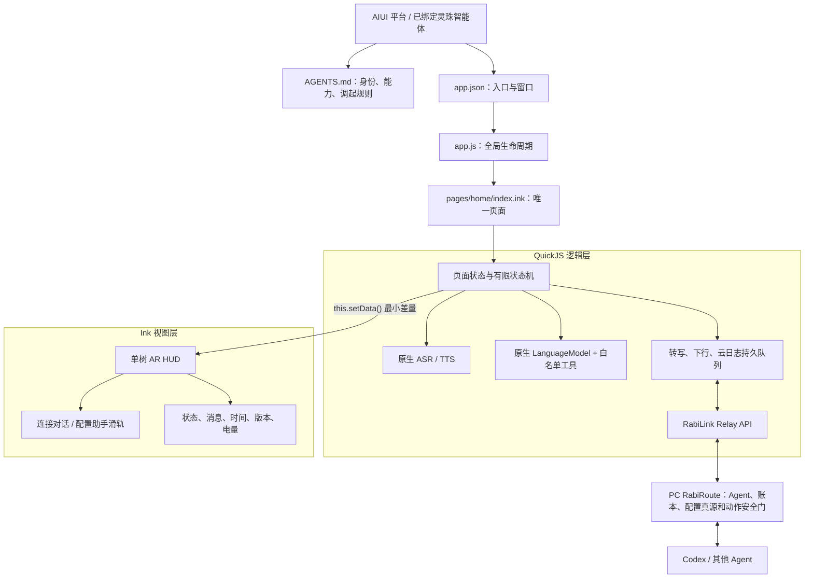
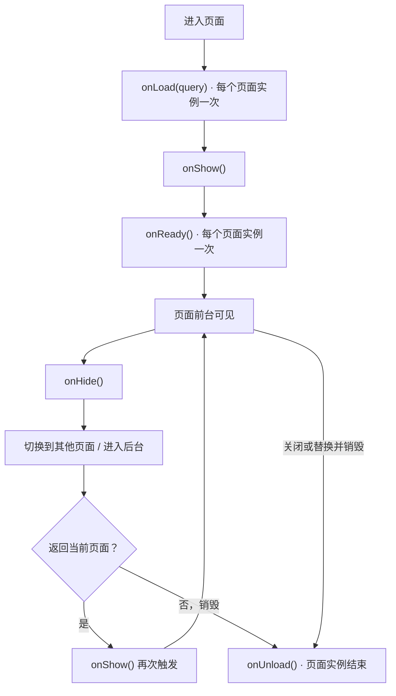
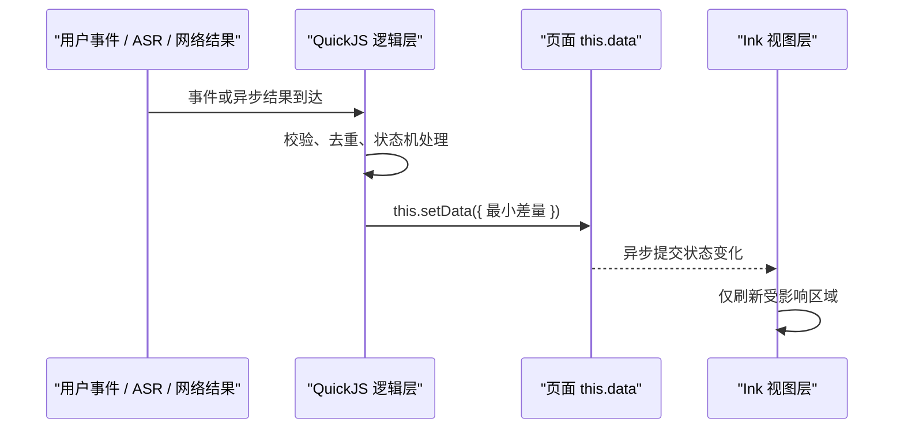
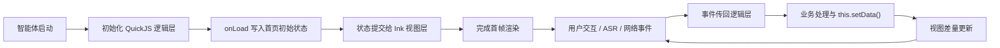

# AIUI 框架与逻辑开发笔记

本文记录 RabiLink AIUI 开发时必须遵守的框架认知、生命周期边界、状态更新方式、调试方法和打包流程。它用于约束后续实现，不把 AIUI 简化成普通网页，也不把页面内原生模型误写成完整的外层灵珠智能体。

## 1. AIUI 到底是什么

AIUI 是面向 AI + AR 设备的完整智能体应用运行框架，而不只是 UI 渲染器。一个可运行的 AIUI 智能体由以下四部分共同组成：

| 部分 | 职责 | RabiLink 对应文件 |
| --- | --- | --- |
| 智能体描述 | 定义身份、能力、系统指令和平台调起方式 | `AGENTS.md` |
| 应用入口 | 定义入口页面和全局窗口配置 | `app.json`、`app.js` |
| 逻辑层 | 在 QuickJS 中处理状态、事件、API、队列和业务规则 | `pages/home/index.ink` 的 `<script setup>`、`utils/` |
| 视图层 | 在 Ink 中把状态渲染成眼镜界面 | `pages/home/index.ink` 的 `<page>` 和 `<style>` |

`AGENTS.md` 决定平台如何理解和调起 RabiLink，但它不会自动给页面注入外层智能体的记忆、变量或插件。页面内的 `LanguageModel` 是一段原生模型会话，也不等于递归进入当前绑定灵珠智能体的完整 Agent Loop。

### 1.1 `AGENTS.md` 规范

`AGENTS.md` 是 AIUI 智能体的行为清单和机器/人类共享说明，作用类似面向 Agent 的 manifest。标准内容包括：

| 部分 | 必须说明的内容 |
| --- | --- |
| Meta Information | 名称、版本、描述和作者/组织 |
| System Prompts | 核心职责、行为约束、交互语言和禁止事项 |
| Capabilities | 实际需要的最小 API、设备、存储和网络能力 |
| Configuration | 参数名、来源、是否必需、可选值和安全边界 |
| Dependencies | 模型、运行时、后端服务和外层 Agent 依赖 |

编写要求：

1. 指令必须具体、可验证，不能只写“智能地帮助用户”。
2. 能力按最小权限声明；没有使用的文件、网络、设备或写入能力不应列入。
3. 配置项必须说明来源，凭证只能引用安全变量，不能进入 Markdown 正文。
4. 版本随用户可见能力或行为合同更新，并与发布版本保持对应。
5. 依赖声明用于调度和开发理解，不会自行授予宿主权限或绕过鉴权。
6. Markdown 同时供平台和开发者读取，标题、列表、参数名和模式名必须稳定。

RabiLink 的实际规范文件是项目根目录 [AGENTS.md](../AGENTS.md)。其详细调用规则、消息合同和安全边界是系统指令的组成部分，不能只保留简短产品介绍。

## 2. RabiLink 的目标架构



产品边界如下：

- `连接对话`负责眼镜原生 ASR、record-first 上行、持续下行队列和原生 TTS。
- `配置助手`负责把原生 ASR 结果交给页面内 `LanguageModel`，再由白名单工具调用 RabiRoute 配置接口。
- RabiRoute 仍然拥有统一会话账本、配置真源、Agent 路由和外部动作安全门。
- 主动智能通过 RabiRoute 的持续下行队列投递，不依赖眼镜先创建一次用户任务。

## 3. 应用注册与全局生命周期

AIUI 对 Open Agent Format 的扩展增加了可运行的应用级定义。`AGENTS.md`、`app.json`、`app.js` 和 `pages/` 分别回答“智能体是谁”“从哪里启动”“整个应用如何运行”和“具体界面如何交互”。

### 3.1 `app.json`：应用入口和全局配置

`app.json` 是声明式应用清单，主要负责：

- `pages`：应用包含的页面路径；第一项是默认启动页面。
- `window`：全局背景、导航栏标题和文字样式。
- 应用扩展配置：只保存跨页面的非敏感基础值。

RabiLink 当前只有一个产品页面：

```json
{
  "pages": ["pages/home/index"],
  "window": {
    "navigationBarTitleText": "RabiLink AIUI",
    "backgroundTextStyle": "dark",
    "navigationBarBackgroundColor": "#000000",
    "navigationBarTextStyle": "white"
  },
  "rabiLink": {
    "relayBaseUrl": "https://your-relay.example.com",
    "token": ""
  }
}
```

`rabiLink` 是本项目的构建扩展：staging 阶段只注入公开 Relay URL，`token` 必须保持空字符串。真实 token 只能在平台调用页面时引用 `rabilinkToken`，不能作为所谓“跨页面共享配置”写入 `app.json`。

### 3.2 `app.js`：应用级逻辑

项目根目录必须有 `app.js`，或在采用应用级 SFC 时使用 `app.ink`。RabiLink 当前使用 `app.js`，通过 `export default` 注册应用。它处理整个应用的生命周期，不承载某个页面的 ASR、轮询或 HUD 业务。

官方最小注册形式：

```javascript
export default {
  onLaunch(options) {
    // 智能体初始化
  },
  onShow(options) {
    // 智能体显示或返回前台
  },
  onHide() {
    // 智能体进入后台
  },
  onError(error) {
    // 脚本错误或 API 调用失败
  },
  globalData: {
    // 跨页面共享的非敏感数据
  }
};
```

| 回调 | 触发方式 | RabiLink 使用原则 |
| --- | --- | --- |
| `onLaunch(options)` | 应用初始化完成，全局一次 | 只做轻量初始化和安全日志，不启动高成本页面业务 |
| `onShow(options)` | 应用启动或返回前台 | 只恢复全局级资源；页面级 ASR、轮询由页面自己恢复 |
| `onHide()` | 应用进入后台 | 释放不应在后台占用的全局资源 |
| `onError(error)` | 脚本或 API 异常 | 输出脱敏错误，交给 Inspector/DevTools；不得打印 token、ASR 原文或 Agent 回复 |

`globalData` 只保存真正跨页面且不敏感的数据。RabiLink 当前只有一个页面，绝大多数运行状态应留在页面实例和按 token 指纹隔离的持久队列中，不应堆进全局对象。

`.ink` SFC 本身不使用模块级 `export default` 注册页面。它通过 `<script setup>` 定义页面逻辑，并以 ESM `import` 引入其他模块。

### 3.3 四类文件的关系

| 文件 | 关注点 | 不应承担的职责 |
| --- | --- | --- |
| `AGENTS.md` | 身份、系统指令、能力和安全边界 | 页面布局和运行期状态 |
| `app.json` | 页面集合、默认入口和全局窗口 | 生命周期业务和凭证存储 |
| `app.js` | 全局生命周期和极少量共享数据 | 单页 ASR、TTS、网络队列 |
| `pages/` | 页面状态、事件、接口与视图 | 修改全局智能体身份合同 |

## 4. 页面注册与生命周期

页面是 AIUI 把智能体身份和能力变成实际交互界面的关键层：它同时承载页面级数据、生命周期、事件处理、结构和样式。

### 4.1 两种页面组织方式

| 组织方式 | 文件结构 | 适用场景 |
| --- | --- | --- |
| 多文件页面 | `index.js`、`index.wxml`、`index.wxss`、`index.json` | 配置、逻辑、结构和样式分别维护 |
| `.ink` 单文件页面 | 配置、`<script setup>`、`<page>`、`<style>` 位于同一文件 | 同一页面集中阅读和编辑 |

两种组织方式使用相同的页面 `data`、生命周期和事件模型。RabiLink 的唯一维护真源是 `pages/home/index.ink`；构建阶段再把它与本地 ESM 模块编译为自包含的 `index.js`、`index.json`、`index.wxml` 和 `index.wxss`，避免源码和生成文件形成两套真源。

### 4.2 两种页面承载环境

| 语义 | 使用方式 | 适合内容 |
| --- | --- | --- |
| `_current` | 嵌在当前聊天窗口或消息流中 | 结果摘要、状态回填和可展开卡片 |
| `_blank` | 独立窗口或 modal | 完整流程、多步骤操作和持续沉浸交互 |

`target` 不是开发者在页面 Schema 中手工声明的字段。AIUI 会根据页面配置和调用意图决定承载方式；聊天内页面通常仍可由用户展开到独立窗口。

RabiLink 是持续 ASR、下行队列、TTS 和配置助手组成的完整流程，因此完整体验优先使用 `_blank` 独立窗口。平台仍可能先创建 `448 x 150` 的 `_current` 状态卡片，用户点击进入后将同一个 InkView resize 为 `480 x 352` modal。这不是两个页面，也不能分别挂载两棵 UI 树。

### 4.3 Page 对象与生命周期

传统 `.js` 页面通过 `export default` 导出 Page 配置对象；`.ink` SFC 则在 `<script setup>` 中直接定义等价的数据、回调和方法。

传统多文件页面的最小示例：

```javascript
export default {
  data: {
    text: "This is page data.",
    user: {
      name: "Rokid"
    }
  },
  onLoad(options) {
    // 页面加载
  },
  handleUpdate() {
    this.setData({
      text: "Updated Text",
      "user.name": "New Name"
    }, () => {
      console.log("Data updated");
    });
  },
  handleComplete() {
    this.finish();
  }
};
```

`.ink` SFC 不复制这层 `export default` 包装，但 `data`、生命周期、方法、`this.setData()` 和 `this.finish()` 的页面语义保持一致。

| 属性 | 类型 | 必填 | 说明 |
| --- | --- | --- | --- |
| `data` | Object | 否 | 页面首次渲染使用的初始数据 |
| `options` | Object | 否 | 页面组件选项 |
| `onLoad` | Function | 否 | 页面加载回调 |
| `onShow` | Function | 否 | 页面显示或切入前台回调 |
| `onKeyDown` | Function | 否 | 页面级按键按下事件，通过 `event.code` 读取键值 |
| `onKeyUp` | Function | 否 | 页面级按键抬起事件，通过 `event.code` 读取键值 |
| `onVoiceWakeup` | Function | 否 | 页面级语音唤醒事件，通过 `event.keyword` 读取关键词；默认可能为 `leqi` |
| `onReady` | Function | 否 | 页面第一次渲染完成回调 |
| `onHide` | Function | 否 | 页面隐藏回调 |
| `onUnload` | Function | 否 | 页面卸载回调 |
| 其他字段 | Any | 否 | 自定义方法或页面实例属性，在回调中通过 `this` 访问 |

| 回调 | 框架语义 | RabiLink 当前职责 |
| --- | --- | --- |
| `onLoad(query)` | 页面加载，全局一次 | 解析调用参数，创建适配器和轻量首帧状态，登记延迟启动任务 |
| `onShow()` | 页面显示或返回前台 | 恢复设备状态、ASR、待同步记录、下行轮询和待播队列 |
| `onReady()` | 首次渲染完成，全局一次 | 可作为首帧完成信号，但不能作为唯一启动入口 |
| `onHide()` | 页面切后台 | 停止 ASR、TTS、设备轮询和计时器，持久队列不得删除 |
| `onUnload()` | 页面卸载 | 清理所有定时器、监听器、模型会话和语音对象 |

官方生命周期顺序固定为：



调用次数边界：

- `onLoad()`：每个页面实例只调用一次，可读取页面打开参数。
- `onShow()`：首次显示和每次返回前台都会调用。
- `onReady()`：每个页面实例只调用一次，官方语义为首帧已经准备完成。
- `onHide()`：每次离开前台但页面实例仍保留时调用。
- `onUnload()`：页面真正销毁时调用一次；之后不能继续访问原实例资源。

从 `_current` 卡片扩展到 `_blank` modal 可能只是同一个 InkView resize，不必然创建新 Page，也不应假设一定重新触发 `onLoad()` 或 `onReady()`。RabiLink 以实际生命周期事件和 surface resize 分别处理。

项目曾观察到特定 Craft/Ink 预览链路没有可靠触发 `onReady()`。这属于宿主运行时偏差，不改变上面的官方契约。因此当前启动实现使用“`onLoad()` 登记短延迟任务 + `onReady()` 调用同一幂等入口”的兼容策略，避免把 Relay 或 ASR 唯一地挂在 `onReady()` 上；DevTools 中可通过 `page:onLoad/onShow/onReady/onHide/onUnload` 日志核对实际顺序。

### 4.4 页面事件

RabiLink 使用三类页面级输入事件：

| 事件 | 当前行为 |
| --- | --- |
| `onKeyDown(event)` | 只记录按键即时输入，不拦截宿主默认行为 |
| `onKeyUp(event)` | 执行模式切换、立即审阅或失败消息重试；确认接管后调用 `preventDefault()` |
| `onVoiceWakeup(event)` | 在页面前台恢复当前模式的 ASR 所有权 |

`onVoiceWakeup` 表示宿主提供了唤醒事件，不等于 RabiLink 的每一句话都必须先说“乐奇”。真实眼镜进入连接对话后会在页面前台受控续轮；Craft 浏览器没有真实设备身份时，才需要先用调试麦克风触发交互唤醒。

#### 宿主默认按键行为

| `event.code` | Rokid Glasses 常见语义 | 未拦截时的宿主行为 | RabiLink 映射 |
| --- | --- | --- | --- |
| `Backspace` | 返回 | 返回上一级或请求关闭应用 | 连接对话保留默认；配置助手接管为返回连接对话 |
| `ArrowUp` | 向上 | 滚动根视图 | 配置助手接管为切到连接对话 |
| `ArrowDown` | 向下 | 滚动根视图 | 连接对话接管为切到配置助手 |
| `Enter` | 确认 | 进入导航模式或激活目标 | 连接对话接管为立即请求 Agent 审阅 |
| `GlobalHook` | 眼镜镜腿触摸 | 由设备宿主定义 | 连接对话接管为立即请求 Agent 审阅或重试 TTS |

部分宿主还可能上报 `ArrowLeft` / `ArrowRight`。RabiLink 将右方向归一为进入配置助手、左方向归一为返回连接对话。

`event.preventDefault()` 只在页面确实接管该事件时调用。没有调用时，事件回调结束后宿主继续执行默认行为；是否允许拦截及具体默认行为仍以宿主实现为准。`onKeyDown` 更适合即时反馈，RabiLink 不在按下阶段抢占返回、滚动或确认行为。

### 4.5 页面实例方法和数据约束

#### `this.setData(data, callback?)`

- `data` 支持普通键和路径式更新，例如 `{ "user.name": "New Name" }`。
- `callback` 在本次数据提交完成后执行，适合衔接确实依赖视图提交完成的轻量操作。
- 不能用 callback 串成长时间业务队列；网络、ASR、TTS 和模型状态仍由明确状态机管理。

#### `this.finish()`

`finish()` 通知系统当前页面任务已经完成：

- Cut（快切）智能体会主动交回焦点并退出当前展示状态。
- Scene（场景）智能体通常用它结束当前特定交互流程。

RabiLink 是持续连接的场景页。连接对话和配置助手之间切换时禁止调用 `finish()`，否则用户会被退出页面并失去 ASR、下行队列和当前 HUD。正常模式切换只更新同一 Page 实例。

#### `data` 序列化

页面初始 `data` 会以 JSON 字符串从逻辑层发送到渲染层，因此只能包含字符串、数字、布尔值、对象、数组和 `null` 等可 JSON 序列化内容。函数、定时器、模型对象、SpeechRecognition 实例、Set、Promise 和宿主句柄必须保存在页面实例 `this` 上，不能放进 `data`。

## 5. 页面更新机制

AIUI 的页面更新循环是：



页面实例提供：

- `this.data`：读取当前页面状态。
- `this.setData(data, callback)`：异步更新逻辑层状态并把差量发送给视图层。
- `this.route`：当前官方说明为暂不支持，业务逻辑不得依赖。

RabiLink 必须遵守以下 `setData()` 规则：

1. 一次业务事件尽量合并为一次最小差量更新。
2. 不在高频计时器中重复提交没有变化的字段。
3. 网络、ASR、TTS 和模型回调先检查当前 generation、模式和页面可见性，再更新 UI。
4. 模式切换只重放 HUD 必需字段，不卸载整棵视图树。
5. 状态更新不得通过隐藏整帧制造“刷新”；这会造成眼镜闪烁。
6. `setData()` 是异步视图提交。依赖首帧或模式帧完成的重资源操作必须延迟到下一阶段，而不是紧接着同步启动。

## 6. 用户界面开发

AIUI 视图层使用 WXML 描述结构、WXSS 描述样式，并由 Ink/JSAR 渲染引擎执行。`.ink` SFC 把逻辑、结构和样式放在同一个维护文件中，但结构层的数据绑定和事件模型仍遵循 WXML/WXSS 规则。

### 6.1 WXML 结构能力

| 能力 | 写法 | 使用原则 |
| --- | --- | --- |
| 数据绑定 | `{{title}}` | 只绑定可序列化的页面状态，不在模板里堆复杂业务计算 |
| 列表渲染 | `ink:for="{{items}}"`、`ink:key="id"` | 使用稳定唯一 key，避免队列更新时整表重建 |
| 条件渲染 | `ink:if`、`ink:elif`、`ink:else` | 适合小型条件块；眼镜主 HUD 避免大量顶层条件树反复挂载 |
| 事件绑定 | `bindtap="handleTap"` | 事件只进入逻辑层，处理后再以最小 `setData()` 差量更新视图 |

示例：

```xml
<view class="statusList">
  <view class="statusRow" ink:for="{{items}}" ink:key="id" bindtap="handleItemClick">
    <text>{{index + 1}}. {{item.name}}</text>
    <text ink:if="{{item.status === 'active'}}" class="statusActive">进行中</text>
  </view>
</view>
```

RabiLink 的两种模式不是两棵互斥页面树。当前实现保持一棵共享 HUD，只替换模式标签、状态和消息字段，避免 Ink resize 后残留旧树、文字叠加或切换黑帧。

### 6.2 WXSS 样式能力

WXSS 支持常用类、ID、元素和伪元素选择器，也支持 `@import`、`style` 和 `class`。通用 AIUI 页面可以使用 `rpx` 做响应式布局；框架规定逻辑屏幕宽度为 `480rpx`。

```css
.statusRow {
  display: flex;
  justify-content: space-between;
  padding: 12rpx 16rpx;
  border-radius: 8rpx;
}

.statusActive {
  color: #40ff5e;
  font-size: 24rpx;
}
```

RabiLink 当前需要精确复现 Craft 的 `448 x 150` 卡片到 `480 x 352` Interactive InkView resize，因此主 HUD 使用稳定的 480 逻辑宽度、CSS 变量和经过像素回归验证的尺寸。后续不能机械地把全部 `px` 替换为 `rpx`；新增页面可以优先使用 `rpx`，修改现有 HUD 时必须同时验证卡片和沉浸尺寸。

单色 Rokid 眼镜界面还应遵守：

- 纯黑背景和单一发光绿色主通道，以透明度、边框和字号建立层级。
- 不依赖红蓝颜色表达状态；状态必须同时有文字或形态区别。
- 文本使用稳定宽高，最长状态不得挤压品牌、模式轨、时间、版本和电量。
- 避免无意义动画、高频阴影和大面积重绘。
- AR HUD 信息从下沿向上组织，减少遮挡真实视野。

### 6.3 UI 运行机制



最终原则不是“把页面画出来”，而是让 Agent 状态、网络状态和语音状态稳定、可解释地映射成局部界面反馈。

视觉主题和完整 Token 表见 [AIUI 视觉设计与主题 Tokens](aiui-visual-design-system.md)。

语音、镜腿触摸、按键反馈和 FOV 安全区域见 [AIUI 交互设计与 RabiLink 输入合同](aiui-interaction-design.md)。

### 6.4 `view` 视图容器

`view` 是 AIUI 界面的基础容器，作用类似 HTML 的 `div`。它可以嵌套其他组件，支持 Flexbox、背景色、边框、内外边距、宽高和标准盒模型属性。

```xml
<view class="container">
  <view class="item"><text>项目 1</text></view>
  <view class="item"><text>项目 2</text></view>
</view>
```

```css
.container {
  display: flex;
  flex-direction: column;
}

.item {
  padding: 8rpx 12rpx;
  border: 1rpx solid rgba(64, 255, 94, 0.6);
}
```

RabiLink 中的 `view` 分工如下：

| 容器 | 职责 |
| --- | --- |
| `pageScroll` / `page` | 固定 AIUI surface 和全局黑色背景 |
| `unifiedModeHud` | 卡片与沉浸窗口共用的唯一 HUD 根容器 |
| `compactHeader` | 品牌和 LIVE/TTS/AI 状态 |
| `modeSwitch` | 双段模式轨道和移动 thumb |
| `compactStatusRow` | 当前用户文本与运行状态 |
| `compactConversation` | Agent 回复或配置助手结果 |
| `compactDeviceFooter` | 时间、模式提示、版本和电量 |

使用规则：

1. `view` 负责结构和布局，实际文字使用 `text`，避免依赖裸文本节点的布局差异。
2. 固定 HUD 优先使用浅层 Flexbox；不为装饰制造多层空容器。
3. 宽高、flex 轨道和文本区域必须有稳定约束，状态变化不能撑开根布局。
4. 可点击容器使用 `bindtap` 并提供稳定点击区域；眼镜按键逻辑仍由页面级事件处理。
5. RabiLink 主页面不使用滚动根容器承载模式切换，避免 `ArrowUp/ArrowDown` 默认滚动与模式手势冲突。
6. 卡片和沉浸窗口必须复用同一个根 `view` 树，不能各自维护一套 UI。

### 6.5 `text` 文本

`text` 用于显示文字，作用类似 HTML 的 `span` 或 `p`。它支持字号、颜色、字重、换行和对齐等文本样式。

```xml
<text class="title">Hello World</text>
```

```css
.title {
  color: #40ff5e;
  font-size: 28rpx;
  font-weight: 600;
  text-align: left;
}
```

使用规则：

1. `view` 负责结构、尺寸和 Flexbox 布局，所有可见文字使用 `text` 承载。
2. 动态文字通过 Mustache 绑定，例如 `<text>{{statusText}}</text>`；绑定值必须可序列化。
3. 需要换行时给父容器稳定宽度，并为文本区域预留可预测的高度；不能让长消息挤压模式轨、时间、版本和电量。
4. 实时 ASR 和流式回复只更新实际变化的文本字段，避免高频重建整棵文本容器。
5. 单绿色眼镜上用字号、字重、透明度和位置表达层级，不依赖多色文本区分状态。
6. 对关键状态使用简短完整的文字，例如“PC 离线 · 已保存”，不能只依赖图标或颜色。

RabiLink 主 HUD 中，品牌、模式、状态、回复、时间和版本都使用 `text`。超出固定区域的内容应先压缩为适合 HUD 的摘要；需要阅读长内容时进入独立页面或滚动视图，不能在常驻下沿 HUD 中无限增高。

### 6.6 `scroll-view` 滚动视图

`scroll-view` 用于内容超过可视区域时提供横向或纵向滚动，支持触摸、鼠标拖拽、滚轮和自动滚动。

```xml
<scroll-view class="scrollContainer" scroll-y="true">
  <view class="item"><text>项目 1</text></view>
  <view class="item"><text>项目 2</text></view>
  <view class="item"><text>项目 3</text></view>
</scroll-view>
```

| 属性 | 类型 | 默认值 | 说明 |
| --- | --- | --- | --- |
| `scroll-x` | Boolean | `false` | 允许横向滚动 |
| `scroll-y` | Boolean | `false` | 允许纵向滚动 |
| `scroll-top` | Number | - | 设置竖向滚动位置 |
| `scroll-left` | Number | - | 设置横向滚动位置 |
| `scroll-into-view` | String | - | 滚动到指定 ID 的元素 |
| `auto-scroll` | Boolean | `false` | 启用自动滚动 |
| `scroll-speed` | Number | `25.0` | 自动滚动速度 |
| `scroll-direction` | String | `vertical` | 自动滚动方向：`vertical` 或 `horizontal` |

使用边界：

- 长列表、日志历史、搜索结果和多步骤表单适合使用 `scroll-view`。
- 固定状态卡片、模式轨、实时字幕和设备底栏不应放进自动滚动容器。
- 使用方向键导航时，页面必须明确决定是保留宿主滚动还是在 `onKeyUp` 中接管事件，不能同时执行。
- `auto-scroll` 会持续改变视口，不适合用户需要稳定阅读的 AR HUD；只有明确的跑马内容才考虑使用。
- `scroll-into-view` 依赖稳定且唯一的元素 ID；列表更新不能重复使用 ID。

RabiLink 当前的 `pageScroll` 只是历史 CSS 类名，对应元素实际为普通 `view`，并不具备滚动行为。主页面维持 `480 x 352` 内的单屏下沿 HUD，刻意不使用 `scroll-view`：

1. `ArrowUp` / `ArrowDown` 已承担模式切换，不能同时触发根视图滚动。
2. 当前 Ink 0.13 卡片复用同一个 InkView resize 时，复杂滚动树曾导致事件循环阻塞和旧绘制残留。
3. 连接对话需要让模式、回复、时间、版本和电量始终可见，滚动后不能丢失关键状态。

如果未来增加完整日志浏览或长配置表单，应优先建立职责独立的页面或明确的全屏浏览状态，再在其内容区使用 `scroll-view`；不要把滚动树塞回当前常驻 HUD。

### 6.7 `error-state` 状态提示

`error-state` 用于展示异常、空数据或失败状态，通过标题和描述告诉用户发生了什么、当前能否恢复以及下一步是什么。

```xml
<error-state
  title="加载失败"
  description="请检查网络后重试"
></error-state>
```

适用场景：

- 页面关键数据加载失败，主体内容无法继续展示。
- 查询成功但结果为空，需要明确解释空状态。
- 必需能力不可用，当前流程已经被阻断。
- 操作失败且必须由用户重试、返回或重新配置。

文案规则：

1. `title` 说明结果，例如“连接失败”，不能只写“错误”。
2. `description` 说明原因或下一步，例如“PC Rabi 未在线，语音已经保存在眼镜”。
3. 不显示堆栈、HTTP 响应体、token、设备内部 ID 或开发术语。
4. 可恢复状态必须说明数据是否已保存，避免用户重复操作。
5. 与操作组件组合时，眼镜端优先使用触摸板或确认键语义，不堆叠多个小按钮。

RabiLink 的使用边界：

| 状态 | 是否使用整页 `error-state` | 呈现方式 |
| --- | --- | --- |
| PC 暂时离线，observation 已保存 | 否 | 常驻 HUD 显示“PC 离线 · 已保存”，后台自动重试 |
| Relay 短时网络中断 | 否 | 常驻 HUD 显示“网络中断 · 已保存” |
| ASR 单轮失败并准备重试 | 否 | HUD 状态行显示倒计时或恢复状态 |
| 没有 token，等待智能体绑定 | 否 | 这是未完成配置，不是应用异常 |
| 必需运行能力永久不可用，页面无法执行任一模式 | 是 | 使用明确标题、原因和返回/重试入口 |
| 独立日志页查询成功但没有记录 | 是 | 使用空结果状态，不伪装成加载错误 |

RabiLink 主页面是持续连接 HUD。短暂错误不能卸载整棵 HUD，也不能通过 `ink:if` 在错误组件与主页面之间高频切树；否则会重新引入闪烁、文字残留和模式状态丢失。阻断性错误页面应是稳定、低频、可解释的最终状态。

### 6.8 `lottie-view` Lottie 动画

`lottie-view` 用于渲染由 After Effects 等工具导出的 Lottie JSON 动画。

```xml
<lottie-view
  src="assets/animation.json"
  auto-play="true"
  loop="true"
  speed="1.0"
  width="200"
  height="200"
></lottie-view>
```

| 属性 | 类型 | 默认值 | 说明 |
| --- | --- | --- | --- |
| `src` | String | `""` | Lottie JSON 的本地路径或 URL |
| `auto-play` | Boolean | `true` | 加载完成后自动播放 |
| `loop` | Boolean | `true` | 播放结束后循环 |
| `speed` | Number | `1.0` | 播放速度倍数 |
| `progress` | Number | - | 手动控制 `0.0` 到 `1.0` 的动画进度 |
| `width` | Number | - | 动画区域宽度 |
| `height` | Number | - | 动画区域高度 |

当前 `lottie-view` 不向 WXML/JS 提供公共加载完成、播放完成或错误事件。因此：

- 不得依赖“动画播放完成”启动 ASR、请求 Relay、切换模式或结束页面。
- 需要确定时序时，业务状态仍由 Page 生命周期、Promise、定时器和明确回调控制。
- 优先打包本地 JSON，避免远程资源失败后页面无法判断原因。
- 必须设置稳定宽高，防止资源加载前后改变 HUD 布局。
- 手动 `progress` 不应在高频定时器中持续 `setData()`，否则会把动画成本转移到逻辑层和跨层通信。

RabiLink 当前不在常驻 HUD 使用 Lottie：

1. 常驻循环动画会持续占用渲染、CPU 和电量。
2. AR 视野中的大面积运动会分散注意力，不符合下沿安静 HUD 的定位。
3. 单色绿色设备无法保留依赖多色层级的动画设计。
4. 当前产品状态使用文字、边框、LIVE 标记和有限状态变化已经足够表达。
5. 此前真机存在闪烁和局部重绘问题，不应再增加无必要动画源。

未来只有在独立、短时、非关键的品牌过渡或等待页中才考虑 Lottie，并采用固定尺寸、`loop="false"`、低运动幅度和可独立超时的业务流程。即使动画不可用，用户也必须能看到静态状态并继续操作。

### 6.9 `canvas` 画布

`canvas` 提供类似 HTML5 Canvas 的 2D 绘图表面，适合由脚本动态绘制形状、路径、文本和位图。

```xml
<canvas id="myCanvas" width="300" height="150"></canvas>
```

```javascript
const canvas = this.selectComponent("#myCanvas");
const ctx = canvas.getContext("2d");

ctx.fillStyle = "#40ff5e";
ctx.fillRect(10, 10, 150, 75);
```

| 属性 | 类型 | 默认值 | 说明 |
| --- | --- | --- | --- |
| `width` | Number | `300` | 画布像素宽度 |
| `height` | Number | `150` | 画布像素高度 |

使用要点：

- 通过 `this.selectComponent("#id")` 获取组件实例，再调用 `getContext("2d")`。
- 绘图 API 采用标准 Web Canvas 2D 模型；具体支持范围以 AIUI Canvas API 为准。
- `width` / `height` 是绘图缓冲区尺寸，必须与实际展示尺寸和设备缩放策略一起验证。
- Canvas 内容不参与 Mustache 数据绑定。页面状态改变后，开发者负责清除并重绘受影响区域。
- 绘图对象、Context 和位图句柄保存在页面实例上，不能放入需要 JSON 序列化的 `data`。
- 初始化绘制应在组件已经可用后执行；不能在 `onLoad()` 中假设视图组件已经创建完成。

适合使用 Canvas 的场景：

- 实时曲线、简单图表和自定义仪表。
- 无法用基础组件组合的几何图形。
- 需要像素级控制的位图合成或标注层。
- 低频、局部、尺寸稳定的自定义绘制。

不适合使用 Canvas 的场景：

- 普通文本、状态标签、模式切换、时间和电量等标准 HUD 元素。
- 需要自动排版、数据绑定和稳定点击区域的界面。
- 通过高频整画布重绘模拟组件树。
- 在没有原始音频采样 API 时伪造“实时音频波形”。AIUI ASR 结果本身不等于 PCM 或音量数据。

#### RabiLink 边界

RabiLink 主 HUD 继续使用 `view`、`text` 和 WXSS，而不声明页面级 `canvas`：

1. 基础组件能提供更稳定的文本排版、局部更新和事件区域。
2. 手动整画布重绘会增加常驻页面的 CPU、功耗和闪烁风险。
3. 卡片到 modal 的 resize 要求内容可靠重排，Canvas 需要开发者自行维护缩放和清屏。
4. 当前电量图标、时钟和模式轨都能用轻量视图组件完成。

Craft/Ink 宿主本身会把整个 AIUI 页面渲染到一个外层 Canvas；项目测试使用 `getImageData()` 对那个宿主 Canvas 做像素验收。这与页面内部声明 `<canvas>` 组件是两件事，不能据此外推页面已经使用 Canvas API。

如果未来加入图表或传感器可视化，应把 Canvas 放在尺寸固定的独立区域，只在数据实际变化时重绘，并用普通 `text` 保留数值和错误状态。

完整属性和方法表见 [AIUI Canvas 2D 接口速查](aiui-canvas-2d-reference.md)。

声明式生成 UI 的定位、接口版本差异和接入门槛见 [AIUI A2UI 组件与 RabiLink 使用边界](aiui-a2ui-notes.md)。

`window`、定时器、Base64、Fetch、Response 和其他全局挂载见 [AIUI 全局运行时 API 与 RabiLink 使用边界](aiui-global-runtime-reference.md)。

## 7. 两种模式的运行链路

### 连接对话

```text
AIUI SpeechRecognition 最终文本
  -> 本地持久转写队列
  -> Relay observation
  -> PC RabiRoute 统一会话账本
  -> Codex 空闲审阅或触摸板立即引导
  -> Relay 持续下行队列
  -> 眼镜持久待播队列
  -> AIUI 原生 TTS
```

PC 离线或网络中断时，转写保留在眼镜本地。HUD 必须明确显示“语音已保存”，并自动重试，不允许只在服务器日志中失败而让用户看到无响应。

### 配置助手

```text
AIUI SpeechRecognition 完整原话
  -> 页面内原生 LanguageModel
  -> execute_configuration_action 白名单工具
  -> Relay / WebGUI 配置接口
  -> PC 成功结果
  -> HUD + AIUI 原生 TTS
```

模型只能选择已有白名单动作。未收到 PC 成功结果前，页面不能声称配置已经完成。

## 8. AIUI DevTools 调试约定

开发阶段优先使用 AIUI DevTools。官方说明中，启用 Inspector 后，`console.log/info/warn/error/debug` 会同步到 Chrome DevTools 或兼容调试工具；Performance 面板可观察 FPS、内存和 `setData` 耗时。

RabiLink 当前重点观察以下阶段日志：

| 日志 | 含义 |
| --- | --- |
| `transcript-sync:start` | 开始上传一条本地 observation |
| `transcript-sync:stored` | Relay/PC 已接受并保存该 observation |
| `transcript-sync:failed` | PC 离线或网络失败，本地队列仍保留 |
| `transcript-sync:retry` | 定时重试开始 |

调试时同时检查：

- Console：异常、生命周期顺序和队列状态。
- Network：Relay 请求状态、耗时和失败原因。
- Storage：待同步 observation、cursor、待播消息和云日志队列是否持久化。
- Performance：是否存在高频 `setData()`、长任务、黑帧或内存持续增长。
- 真机：触摸板、ASR、TTS、蓝牙代理、电量和功耗必须以真实眼镜结果为准。

日志只能包含阶段、匿名 ID、序号、数量、模式和脱敏错误。禁止记录 token、密码、完整 ASR 原文、配置原话和 Agent 回复。

## 9. AIX 打包与查看

### 官方 `aix` CLI

当本机已经从包含 `packages/aix-cli` 的 AIUI 源码安装官方命令后：

```powershell
cargo install --path packages/aix-cli
aix pack <源码目录>
aix pack <源码目录> -o my-agent.aix
aix pack <源码目录> --optimize
aix pack <源码目录> -O --opt-level 3
aix list <AIX文件>
aix ls <AIX文件>
```

RabiLink 不能直接把含开发脚本和本地模块的工程根目录当成最终发布内容。推荐流程是先生成唯一 Craft staging，再交给官方 CLI：

```powershell
$env:RABILINK_AIUI_RELAY_URL = "https://your-relay.example.com"
npm run craft:staging
aix pack .\dist\craft-upload -o .\dist\rabilink-aiui.aix --optimize
aix list .\dist\rabilink-aiui.aix
Remove-Item Env:RABILINK_AIUI_RELAY_URL
```

真实 token 永远不写入环境变量、源码、staging 或 AIX。页面运行时只能引用智能体记忆变量 `rabilinkToken`。

项目根目录的 `.aixignore` 至少排除：

```text
node_modules/
dist/
.git/
*.log
*.tmp
*.bak
*.local.*
*.secret.*
package-lock.json
```

### 当前项目兼容流程

截至 2026-07-16，本机有 Cargo，但还没有 `aix` 可执行文件；公开 AIUI 仓库当前检出的源码也未包含 `packages/aix-cli`。在官方 CLI 源码可用前，项目继续使用：

```powershell
npm run package:aix
node .\scripts\Audit-RabiLinkAiuiAix.mjs --aix .\dist\rabilink-aiui.aix
```

这条兼容流程生成确定性 AIX，并使用官方 `@yodaos-pkg/aix` reader 核对文件列表、页面 Schema、`VERSION` 和包内容。官方 CLI 可用后，应替换打包步骤，但保留当前审计与隐私检查。

## 10. 当前结论

- AIUI 是完整智能体应用框架，不是单独的页面组件，也不是外层灵珠智能体本身。
- RabiLink 的两个模式必须留在同一个页面和同一棵稳定 HUD 中切换。
- 页面内原生模型负责配置意图理解；Codex 或其他 Agent 通过 RabiRoute 负责更完整的主动智能。
- 前台 AIUI 可续轮转写，但页面隐藏或卸载后不能冒充系统级常驻录音服务。
- 所有异步结果都必须映射成可见状态；服务器失败不能只留在云日志里。
- DevTools 用于开发诊断，最终 UI、性能、触摸板、ASR 和 TTS 体验以真实眼镜为准。

## 11. 官方资料

- [AIUI 快速开始](https://js.rokid.com/AIUI/guide/quickstart?lang=zh-CN)
- [AIUI Developer Tools 与 Skills](https://github.com/jsar-project/AIUI)
- [AIUI 调试说明](https://github.com/jsar-project/AIUI/blob/main/documentation/5-tools/debug.md)
- [AIUI Console API](https://github.com/jsar-project/AIUI/blob/main/documentation/3-api/console.md)
- [AIUI CLI 说明](https://github.com/jsar-project/AIUI/blob/main/documentation/5-tools/cli.md)
