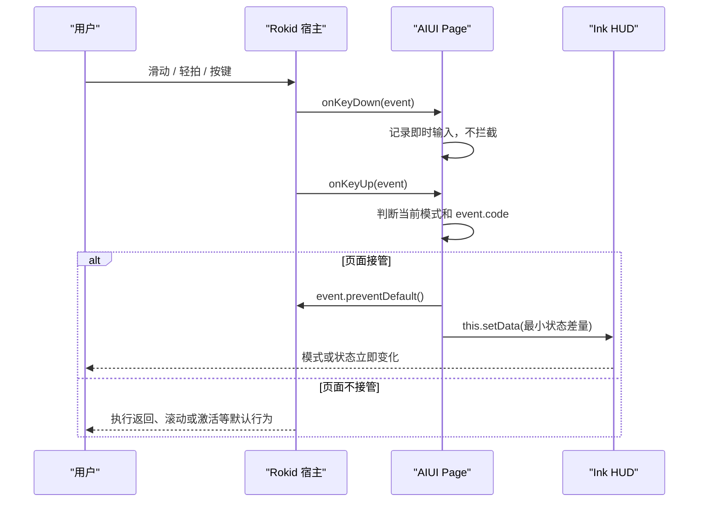
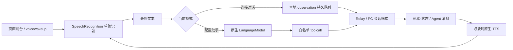

# AIUI 交互设计与 RabiLink 输入合同

本文记录 Rokid Glasses 上的语音、镜腿触摸、按键和空间交互原则，并定义 RabiLink 两种模式的输入与反馈合同。

## 1. 设计原则

| 原则 | 要求 |
| --- | --- |
| 语音优先 | 自然语言是智能体主要输入，触摸只承担切换、确认和恢复 |
| 反馈及时 | 每个被页面接管的动作都必须产生可见状态；重要结果再使用 TTS |
| 安全视野 | 核心状态位于舒适 FOV，下沿向上布局，不遮挡现实世界中心区域 |
| 操作可逆 | 模式切换和浏览动作可立即返回；高风险配置仍由 RabiRoute 安全门确认 |
| 状态连续 | 网络失败、页面隐藏或 TTS 中断不能静默丢失 observation 和下行消息 |
| 宿主协作 | 只拦截页面确实接管的事件，其余返回、滚动和关闭行为交还宿主 |

## 2. Rokid Glasses 交互方式

### 2.1 语音输入

语音是 RabiLink 的核心输入：

- `连接对话`：原生 ASR 最终文本进入持久 observation 队列，再同步到 PC Rabi 会话账本。
- `配置助手`：原生 ASR 完整原话交给页面内 `LanguageModel`，再由白名单工具选择配置动作。
- `onVoiceWakeup`：用于宿主唤醒或恢复当前模式的识别所有权，不代表每一句都必须说唤醒词。
- Agent 回复和主动消息进入同一条持久 TTS 队列；TTS 期间释放 ASR，播报后恢复。

RabiLink 不为每段 ASR 播放确认音，避免持续对话产生噪声和 TTS 回流。识别状态、已保存、正在同步和失败重试由 HUD 即时反馈。

### 2.2 镜腿滑动

滑动适合模式切换、列表滚动和参数调节。RabiLink 主 HUD 没有滚动列表，因此把方向输入专用于两个产品模式：

| 当前模式 | 输入 | 结果 |
| --- | --- | --- |
| 连接对话 | `ArrowDown` / `ArrowRight` | 切到配置助手 |
| 配置助手 | `ArrowUp` / `ArrowLeft` | 切回连接对话 |
| 配置助手 | `Backspace` | 切回连接对话 |

切换发生在同一个 Page 和同一棵 HUD 中，不调用 `finish()`，不要求再次点击“进入”。

### 2.3 点击、轻拍和镜腿触摸

| 输入 | 连接对话 | 配置助手 |
| --- | --- | --- |
| `Enter` | 请求 Agent 立即审阅；有阻塞 TTS 时先重试 | 保留给当前配置交互或宿主 |
| `GlobalHook` | 与轻拍相同，请求立即审阅或重试播报 | 保留给当前配置交互或宿主 |
| 模式轨 `bindtap` | Craft/可点击宿主中直接选择模式 | Craft/可点击宿主中直接选择模式 |

轻拍不是暂停录音按钮。它只向当前 Codex 线程发出“现在审阅”的引导，ASR 与持续下行队列仍保持在线。

### 2.4 返回

- 连接对话中的 `Backspace` 不拦截，宿主可以返回上一级或关闭应用。
- 配置助手中的 `Backspace` 被页面接管，先返回连接对话。
- 页面只有真正关闭或被系统销毁时才进入 `onUnload()`。

### 2.5 头部追踪与空间定位

头部追踪适合三维场景中的随动、空间锚定和视角调整，但随动稳定性与现实观察舒适度必须平衡。

RabiLink 当前是 2D screen-space HUD：

- 固定在下方安全视野，不占据中心观察区。
- 没有调用 6DoF、空间锚点或头部追踪 API。
- 不声称 HUD 已经世界锁定、头锁定或空间跟随。
- 将来接入空间能力前，必须在真机验证漂移、延迟、眩晕和不同姿态下的可读性。

## 3. 输入到反馈链路

### 3.1 触摸和按键

### 3.2 语音

## 4. 反馈设计

### 4.1 视觉反馈

所有页面接管的动作都要更新用户看得见的字段：

| 动作 | 最小反馈 |
| --- | --- |
| 模式切换 | 滑轨 thumb、活动模式文字、状态文案同步变化 |
| 开始识别 | LIVE 状态和“正在聆听” |
| ASR 完成 | 显示最后一段已接受文本 |
| 正在同步 | 显示“正在同步记录” |
| PC 离线 | 显示“PC 离线 · 已保存”和自动重试说明 |
| 请求审阅 | 显示“正在提醒 Agent 审阅记录” |
| Agent 下行 | 立即显示文字，再按队列 TTS |
| 配置执行 | 显示理解中、执行中、成功或失败的真实阶段 |

状态文案必须来自真实状态机，不能先显示成功再等待接口结果。

### 4.2 音频反馈

- Agent 结果和重要配置结果可以 TTS。
- 模式滑动、普通按键和每段 ASR 不逐次播报，避免打断与回流。
- TTS 开始前释放 ASR；完成或 watchdog 超时后恢复。
- TTS 失败时保留消息并给出可见重试状态。

### 4.3 失败反馈

- 短时失败保留在常驻 HUD，不整页切换错误树。
- 必须说明内容是否已经保存在眼镜。
- 自动重试时显示当前等待状态，但不每次重试都闪烁或播音。
- 阻断性失败才使用 `error-state`。

## 5. FOV 安全区域

RabiLink 使用 `480 x 352` modal 与 `448 x 150` 卡片共享的 87px 高 HUD：

- 绝对定位在 surface 下沿，`bottom: 16px`。
- HUD 内容宽 `424px`，兼容较窄卡片安全宽度。
- 信息从底部向上增长，不覆盖中央视野。
- 品牌、模式、状态、回复、时间、版本和电量都保持固定轨道。
- 长文字截断或在受控区域换行，不能推挤相邻状态。

安全区域不是只看像素是否越界。还必须在真机检查：

- 明暗环境中的绿色文字对比度。
- 用户走动和转头时的可读性。
- 左右眼合像、阅读距离和 FOV 舒适度。
- 125% 字体压力下是否重叠。
- 动画、闪烁和频繁状态变化是否干扰现实观察。

## 6. 交互检查清单

- [ ] 语音是主输入，触摸操作数量保持最少。
- [ ] 每个被接管的动作都有即时可见反馈。
- [ ] `preventDefault()` 只在 `onKeyUp` 确认接管后使用。
- [ ] 连接对话 Backspace 能正常交还宿主。
- [ ] 配置助手 Backspace 返回连接对话，不关闭整个应用。
- [ ] 模式切换不调用 `finish()`，也不重建页面。
- [ ] PC/网络离线时消息先保存并明确提示。
- [ ] TTS 与 ASR 不并发争抢麦克风。
- [ ] HUD 位于舒适 FOV，不遮挡主视野。
- [ ] 未实现的头部追踪和空间能力不写成已支持。
- [ ] 真机验证滑动方向、轻拍、GlobalHook 和宿主默认行为。
